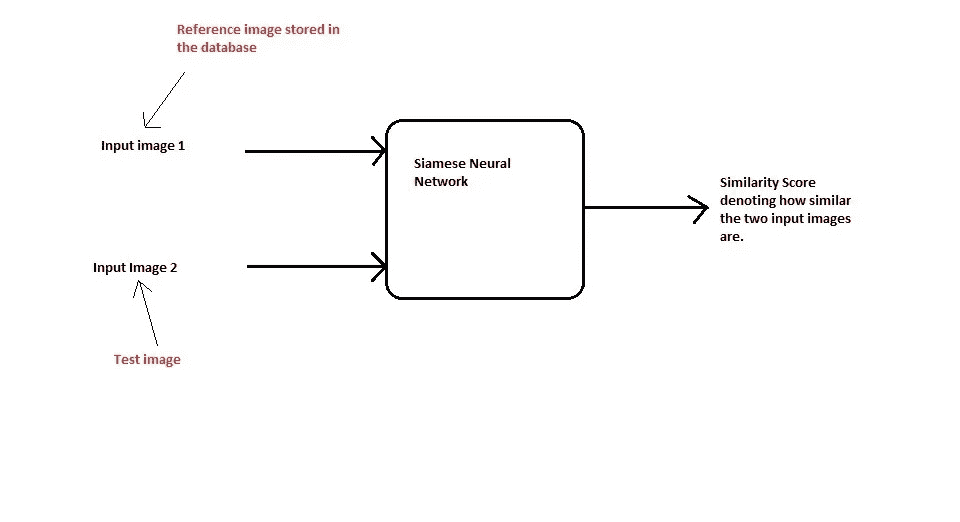
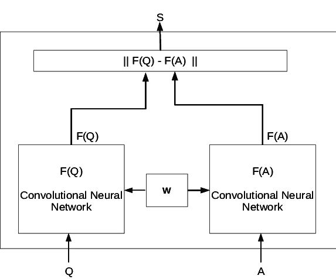

# 使用暹罗网络的自动签名验证

> 原文：<https://medium.datadriveninvestor.com/automated-signature-verification-using-siamese-network-87f3a2f55f2e?source=collection_archive---------2----------------------->


签名验证是身份验证中的一项关键任务。与其他验证(如面部)不同，它需要对真实和伪造的签名进行详细分析。这项任务在银行中有着巨大的应用，银行每天都要验证签名。由于我们人类容易出错，让我们看看人工智能能否帮助我们解决这个问题。

## 暹罗网络:

暹罗网络在人脸验证等任务中非常受欢迎，我们将两张人脸图像作为输入，并通过相似性得分来比较它们的编码。这个分数告诉我们他们有多相似，而不是分在两个不同的班里。下图显示了一个基本的暹罗网络的结构。



(Siamese Network)

这里，对于网络，我们提供两个图像作为输入，这两个图像通过两个不同的卷积神经网络，这两个网络是彼此的精确副本。两个图像都通过网络，产生一定的嵌入。我们试图通过损失函数(例如*欧几里德距离*)找出编码之间的差异。因此，我们添加具有 s 形单元的密集层来输出相似性得分。关键是，两幅图像越相似，它们的编码就越相似。因此，相似性得分是由乙状结肠单位产生的。

[](https://www.datadriveninvestor.com/2019/01/23/deep-learning-explained-in-7-steps/) [## 深度学习用 7 个步骤解释-更新|数据驱动的投资者

### 在深度学习的帮助下，自动驾驶汽车、Alexa、医学成像-小工具正在我们周围变得超级智能…

www.datadriveninvestor.com](https://www.datadriveninvestor.com/2019/01/23/deep-learning-explained-in-7-steps/) 

# 签名验证:

对于任何机器学习问题，我们都需要一个数据集来检查我们模型的有效性。在这种情况下，我们可以使用 ICDAR 签名验证数据库。它已经被标记，为不同的签名对提供 0 标记，为相似的签名提供 1 标记。

## 预处理:

在预处理阶段，我们将把所有的图像调整到一个特定的大小，因为所有可用的图像可以有不同的大小。我们可以借助双线性插值等方法来达到同样的效果。我们还将通过反转使背景像素为零，因为大多数背景像素将是白色的或者将具有值 255。所以从它减去 255 会使它为零，或者我们可以说背景像素为零。

## 建模:

在预处理步骤之后，我们将使用我们的暹罗网络来获得图像的编码。我们将使用 keras 库来完成所需的任务。暹罗网络的工作方式是，我们必须增加属于同一个人的签名的相似性，并减少不同签名的相似性。通过这种方式，我们的网络参数得到更新。该过程确保最高级别的表示(即来自最后一层的*输出)*将具有相似的特征空间。这是可能的，因为由两个卷积神经网络计算的函数显然是相同的。我们可以在 keras 中创建如下模型

```
def signature(input_shape):
     left_img=Input(input_shape)
     right_img=Input(input_shape)

     model=Sequential()
    model.add(Conv2D(96,  (11,11),activation=’relu’,input_shape=input_shape))
    model.add(MaxPooling2D())
    model.add(Conv2D(256(5,5),
             activation=’relu’,input_shape=input_shape))
    model.add(Conv2D(384,      (3,3),activation=’relu’,input_shape=input_shape))
    model.add(MaxPool2D())
   model.add(Conv2D(256(3,3),activation=’relu’,input_shape=input_shape
)
    model.add(Flatten())
    model.add(Dense(128,activation=’sigmoid’))
    enc_1=model(left_img)
    enc_2=model(right_img)
    L1_layer=Lambda(lambda tensors:K.abs(tensors[0]-tensors[1]))
    L1_distance=L1_layer([enc1,enc2])
  prediction=Dense(1,activation=’sigmoid’,bias_initializer=initialize_bias)(L1_distance)
 signature_mod=Model(inputs=[left_img,right_img],ouputs=prediction)
 return signature_mod
```

上面的代码片段显示了一个连体网络的结构，我们将使用它来查找签名之间的相似性或不相似性。正如我们最初看到的，我们使用了 96 (11*11)内核来检测图像中的低级特征。类似地，在接下来的层中，我们使用了大小为(5*5)、(3*3)等的内核。最后，我们将图层展平，并通过密集图层将其转换为 128 维矢量。现在，为了计算编码之间的相似性，我们借助 Keras lambda 层来计算矢量之间的欧几里德距离。作为一种先进的方法，我们也可以使用对比损失。具有 sigmoid 激活函数的最终致密层应计算签名的相似性得分。



(Image Source:Research Gate)

我们将使用已经可用的标签和数据集来训练网络。我们可以使用具有二进制交叉熵的 adam 优化器作为损失函数。此外，我们可以使用更多的隐藏层和不同数量的内核来找到一个更好的模型。此外，可以使用高级距离度量来计算编码之间的距离。