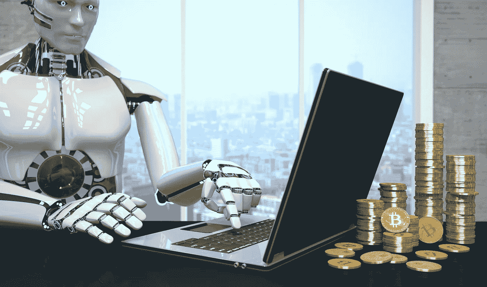

# 自动化交易很酷

> 原文：<https://medium.datadriveninvestor.com/automated-trading-is-cool-4b7bd1a1905d?source=collection_archive---------7----------------------->

## 但买入并持有是一个难以超越的基准

Photo: 3commas.io

我必须承认，我受到了高科技产品的过度诱惑，这往往是以牺牲我的财务业绩为代价的。谁能抵挡住诱惑，让一个自动化系统运行起来，只需要每隔一两天检查一下，把你的利润转到你的银行账户上？

遗憾的是，事情似乎从来没有像那样解决过。

在金融领域，我遇到的第一个面向散户投资者的自动化系统是专家顾问或 EAs，可以在 MT4 外汇交易平台上使用。这些自动化交易脚本仍然如此受欢迎，以至于经纪人无法让他们的客户脱离 MT4 系统，即使非常优秀的 MT5 已经存在多年了。

发生这种情况是因为一个活跃的售后市场为 EAs 的销售而发展，为那些像我一样没有技能或时间学习 MQL 编码语言的人而发展。

 [## 如何使用自动化从您的数据中获得更多价值？数据驱动的投资者

### 去年的新闻故事不停地谈论机器学习变得多么先进。电脑现在…

www.datadriveninvestor.com](https://www.datadriveninvestor.com/2020/02/27/how-to-use-automation-to-get-more-out-of-your-data/) 

花里胡哨的互联网广告上写道，购买 EA，安装它，然后坐等利润滚滚而来。以下是这种方法从未真正奏效的几个原因。

*   EA 有如此多的可变参数，以至于要尝试无数种组合，结果你会将任何损失归咎于次优设置，并花费数小时试图调整控制(我在跟你说话， *FAPTurbo*
*   EA 的可变设置如此之少，以至于它只对精确的货币对和它已经优化过的市场条件有好处(这种情况不太可能重现)
*   EA 使用鞅或网格系统来弥补损失，基本上是将后续交易的股份翻倍。只要你不注意图形底部不断增加的交易量，网格系统会产生一条美妙的股票曲线。最终，一个足够长的逆向运行总是会让最大的初创银行破产(就像传统赌场的鞅系统失灵一样)

编码人员现在更聪明了，有了更好的工具，大多数交易平台都提供了自动化编程接口(api ),外部系统可以与之连接，crypto 的出现为零售金融领域增加了一个高度不稳定的工具。出于所有这些原因，一批新的候选人出现了，以解决自动交易的难题。在过去的几年里，我在这些项目上投入了大量资金，现在我有了一些和上一代人一样的疑虑，还有一些全新的疑虑。

*   一些功能强大的自动化交易平台已经可以用于加密工具(我已经广泛使用了 Haas Bot)。但是，与最复杂的 EA 相比，这些可能呈现出更陡峭的学习曲线。我应该激活哪个交易所，我应该交易哪些工具，我应该遵循什么样的技术指标组合，我应该实施什么样的风险管理技术？你可能会消失在一个永无休止的修补的兔子洞里，而从来没有确定过确保持续盈利的“全有和全无”参数。
*   把你的钱交给别人管理可能是最容易失去的方法。不管他们是否有一个闪亮的网站和交易平台，客户证明和公司的合法注册。他们中的许多人会随着你的资金消失。更重要的是，他们会将你的详细信息传递给同伙，他们会联系你并要求预付费用以收回你的原始资金(在他们自己消失之前)。
*   融资和套利机器人在智力上令人满意。你可以看到不同密码交易所之间的价格(或融资利率)差异如何产生潜在利润(通过出售相对昂贵的东西和购买相对便宜的东西)。但你在这些往返旅程中赚的是美分而不是数千美元，同时在每个平台上占用了大量资金，并且必须定期在平台之间重新平衡资金。更糟糕的是，你几个月的全部利润可能会因为一个操作故障而化为乌有，比如 api 故障导致一半的套利交易没有完成。

我尽可能长时间地抵制这种不可避免的情况，但最终决定在没有杠杆和自动化的情况下直接投资 crypto。我拒绝这样做的部分原因是因为我喜欢刺激。买入并持有是相当无聊的——当你长期持有时，你既不会因为价格突然下跌而感到胃部紧缩，也不会因为价格飙升而感到欢欣鼓舞。只是随着时间的推移，稳步升值带来的安静的满足感(如果你幸运的话)。

过去几年，比特币的持有者经历了一段坎坷，但在自比特币诞生以来的任何四年滑动窗口中，BTC 的表现都超过了所有其他主要资产类别(甚至包括网飞和达美乐等个别明星)。今年 3 月，与全球其他资产类别一样，硬币下跌了 50%，但此后又回升至 3 月前的水平以上(道琼斯或 S&P 的情况就不是这样了)。

事实上，即使有 3 月份的跳水，比特币的价格今年迄今已经上涨了 11%，而 S&P 即使在强劲反弹后，今年仍然下跌了 11%。

更好的结果是可以获得的，这取决于你的市场时机的运气(或技巧)。作为买入并持有阵营的新成员，我从 4 月初才开始拥有实物比特币和以太币，但我看到它们在这段时间的混合回报率超过 50%。

这在很大程度上与即将到来的比特币奖励减半有关，其结果是数字矿工将获得他们用于生成新比特币的一半报酬。由于他们需要支付电费和设备费用，这将使他们出售比特币的最低价格翻一番，并(从理论上讲)对总体价格施加上行压力。

这个理论如果漏洞百出也没太大关系。如果有足够多的人相信它，那么它就会自我实现，至少在短期内是如此。根据比特币基地的说法，将 1200 美元 Covid 支票兑换成 BTC 的美国人的数量表明这个词正在广泛传播。

鉴于我所看到的回报，我没有必要再回到自动交易或杠杆交易。但这不会完全阻止我。

掌握机器人的智力挑战将使我继续涉足自动化。至于杠杆作用，我相信众所周知肾上腺素会让人上瘾。

非常感谢您的阅读！

*关于交易和金融方面的警示故事，请参见下面的文章。*

 [## 对一些非常愚蠢的未来的尝试

### 有些人从不学习

medium.com](https://medium.com/grab-a-slice/a-foray-into-some-very-foolish-futures-11c9f19bac99)  [## 极端的方式又回来了

### 僵尸农场的回归

medium.com](https://medium.com/grab-a-slice/extreme-ways-are-back-again-41501205b976) 

*# 500 比赛*