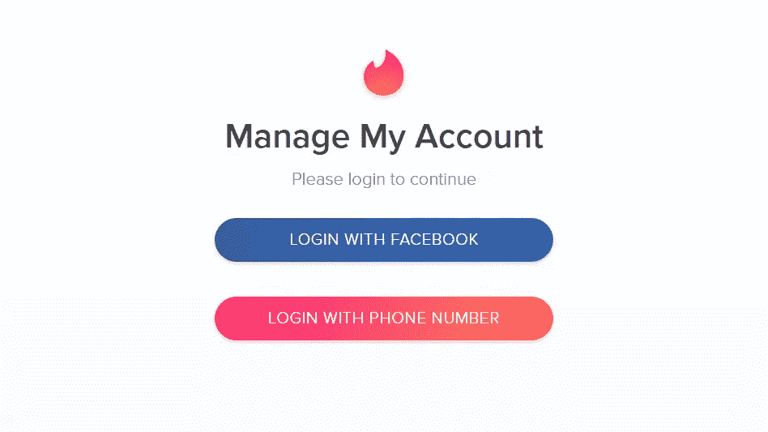
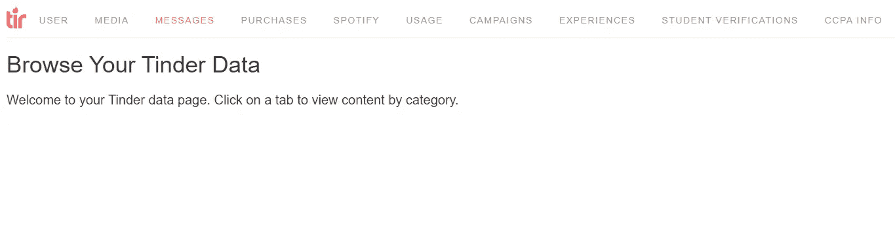
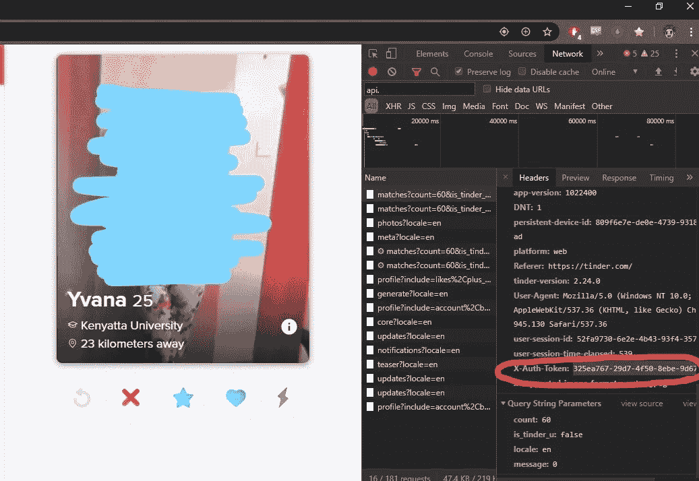
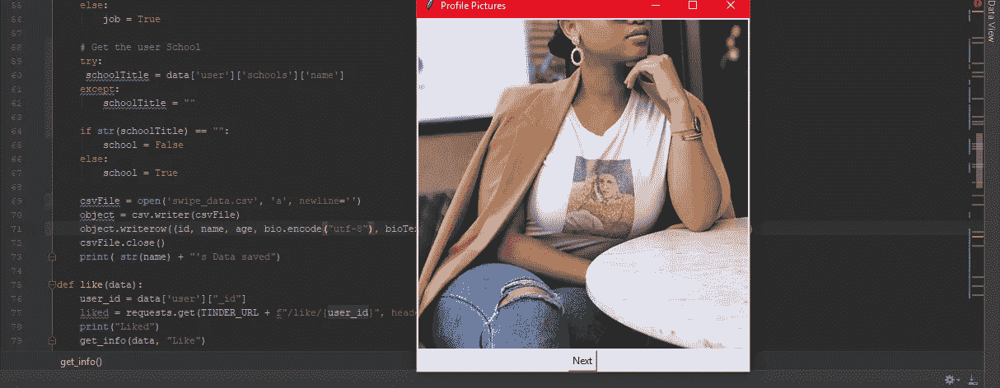
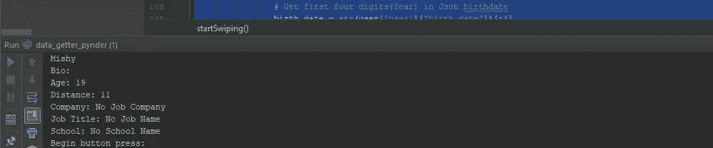
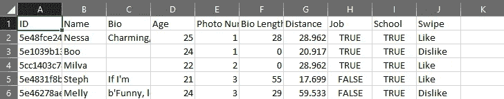
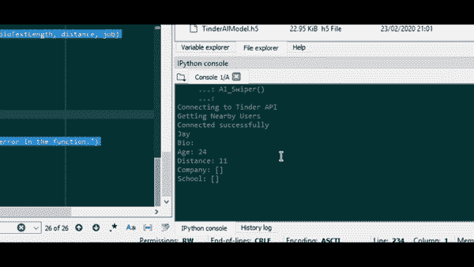
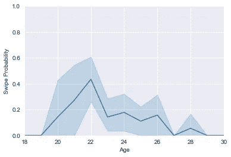
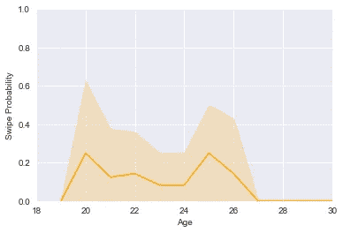
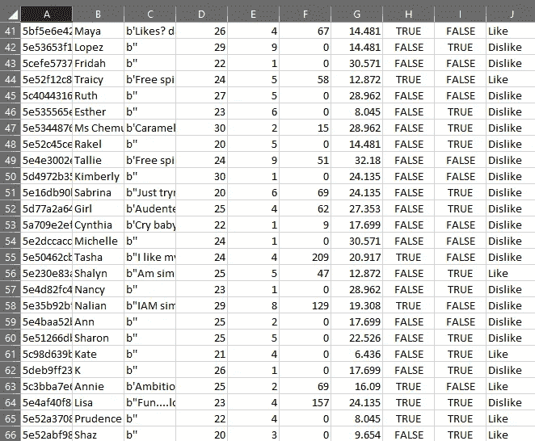

# 用人工智能实现网上约会自动化。

> 原文：<https://medium.datadriveninvestor.com/automating-dating-with-artificial-intelligence-989402bb5f63?source=collection_archive---------1----------------------->

# **起源**

我第一次接触网上约会是在我大学四年级的学期结束时。

我单身了大约两年(插入一个长故事),当时我决定安装在线约会应用程序 Tinder，这是出于无聊，也可能是出于对在线约会世界等待着我的一点好奇。

随之而来的是两年的刷单、配对、聊天和在全神贯注于生活中的其他事情后对网上约会失去兴趣的循环。

> “如果我有一个人工智能助手代表我约会，那就简单多了。”

每当我再次开始这个循环时，这都是我的口头禅。但令埃隆·马斯克(Elon Musk)不以为然的是，我想让一个人工智能控制我的爱情生活的梦想很快就会实现。算是吧。

去年早些时候，我在 Udemy 上开设了一门以[人工神经网络](https://www.udemy.com/share/101WmQBEATc1hQTXQ=/)为中心的在线课程，当我完成了关于创建人工神经网络(ann)的第一章后，我就把迄今为止学到的一切都用在了 Tinder 上。主要目的是让网上约会对我来说尽可能简单，同时也能识别出我的网上约会数据中隐藏的模式。正如计算领域的智者曾经说过的那样，在你尝试过将生活的方方面面自动化之前，你还不是一个真正的程序员。

项目的第一步是通过直接从数据源下载来收集我所有的 Tinder 数据。我导航到 https://account.gotinder.com/data 的，一旦登录我的账户，我就在一天左右的时间里通过电子邮件收到了所有的数据。

现在是有趣的部分。

# **获取数据**

数据来自一个 zip 文件夹，其中包含一个 JSON 和一个 html 文件，使我可以在一个很好的分类视图中查看我的数据。

它包含了我的刷卡记录、用户档案信息、信息记录，甚至是 Spotify 和 Instagram 相关档案的信息。不幸的是，这些数据不包含任何与我交互过的概要文件相关的信息。

这是个问题。

为了正确训练我的人工神经网络模型，我需要与我互动过的人的个人资料信息，这意味着我必须卷起袖子，自己想办法获取这些信息。我决定通过访问 Tinder，收集与我交互的用户资料数据，并将其保存在 Excel 电子表格中，以便稍后用来训练我的模型。

Tinder 没有开源 API，因此我不得不通过与 Tinder 的端点交互来收集我需要的数据。端点基本上是一个指定的 URL，Tinder 等 web 应用程序使用它来通过请求发送和接收数据。

幸运的是，互联网上的其他人已经注意到了这个 API 真空，通过一些快速的谷歌搜索，我能够找到几个端点的列表，这将允许我获得我附近用户的信息，甚至喜欢或不喜欢他们的个人资料。

首先，我需要进入我的 Tinder 账户。更具体地说，我需要获得一个惟一的授权令牌，它可以将我的请求标识为来自 Felix 的配置文件，并允许我发送和接收这些请求。把它想象成 Tinder 是一场婚礼，授权令牌是我的邀请。只要我有邀请函，我就可以自由进出婚宴，吃些蛋糕。

我能够在谷歌浏览器页面检查器的网络标签中，在浏览器发送的 HTTP 请求的标题中快速找到它。将授权令牌导入 Python 文件后，我创建了四个主要函数，用于获取数据和与其他概要文件交互。

第一个函数， *get_info* 用于从 Tinder 个人资料中获取一个人的详细信息，并将其设置为纯文本或布尔值(真或假)。

第二个功能是“ *like* 功能，用于在用户简档上向右滑动，即喜欢用户，第三个功能是“ *dislike* 功能，用于在用户简档上向左滑动，即不喜欢用户。

最后是“开始滑动”功能，这将允许我与用户配置文件进行交互。枕头库允许我在弹出窗口中看到他们的个人资料图片，我可以在终端中查看他们的姓名、年龄、简历和其他详细信息。该功能还接收终端中的键盘输入，使我能够“向左滑动”和“向右滑动”，即喜欢和不喜欢某个用户。

我指定键盘字符“E”来激活“向右滑动”或“喜欢”功能，指定“Q”来激活“向左滑动”或“不喜欢”功能。

The popup window that allowed me to see a user’s profile pictures.

The terminal through which I can see the user’s information and interact with the code.

# 制造人工神经网络

经过几个小时的“扫描”，我终于能够收集到一个相当大的数据集，大约有 200 行，足以训练我的模型。对于项目的这一部分，我将使用 [Numpy](https://numpy.org/) 、 [Pandas](https://pandas.pydata.org/) 和 [Sklearn](https://scikit-learn.org/) 库来创建和训练我的数据模型。

The format of the data I had collected.

根据我的数据，我只会使用年龄、照片数量、生物长度、距离、工作和学校信息来训练我的模型，因为这些是最有可能影响刷卡值的数据值。

我的想法是创建一个人工神经网络，它可以预测一旦看到一个用户的个人资料，我喜欢或不喜欢这个用户的可能性有多大。然后它会代表我喜欢或不喜欢他们的个人资料。

在将带有数据的 Excel 电子表格导入 Python 文件后，我们需要使用标签编码器将模型中的每个唯一文本值替换为数字。将这些文本值转换成数字可以让人工智能更快更容易地处理它们。在我们的例子中，只有学校、工作和刷卡列包含文本值，所以我们使用 Sklearn 对它们进行编码。

接下来，我们将数据集分成两部分；测试集和训练集。训练集用于创建我们的人工智能将使用的模型，测试集用于检查模型做出的预测有多准确。对于这个项目，我们将数据集分为标准的 20%测试数据和 80%训练数据。

此时，我们的模型已经准备好创建了。我们的人工神经网络有两个隐藏层。这些隐藏层接收数据集中的原始数据，通过 activator 函数传递，然后返回一个输出。对于第一个隐藏层，我们将使用一个 Rectifier 函数，因为它是最常用的，并且为这种模型返回最准确的数据。然后，我们将第一个隐藏层的输出传递给另一个使用 Sigmoid 函数的隐藏层。Sigmoid 函数返回反映概率的输出，因为输出范围在 0 和 1 之间。

在通过这些层传递我们的数据集之后，我们现在可以编译结果，将我们的人工神经网络的预测与测试集中的结果进行比较，然后查看它预测我是否喜欢或不喜欢某个简档的准确性。我们将运行 1000 个时期，因为我们的数据集不是很大，这也允许模型变得尽可能准确。

最后，创建了将被导入到' *data_getter' P* ython 文件中的函数。它将主要接收与用户相关的数据，然后返回刷卡值，即喜欢或不喜欢。这个函数将参考我们训练的模型，并决定喜欢或不喜欢某个用户。

在' *data_getter' P* ython 文件中，创建了一个将数据值传递给' *TinderAI* 函数的新函数。根据它从人工神经网络收到的刷卡值，它会向 Tinder 发送一个响应。

The function used by the AI to swipe.

现在是时候让人工智能完全控制我的 Tinder 账户了。感觉就像一个父亲在教他们的孩子如何驾驶家里唯一的汽车，我焦急地运行代码，坐在副驾驶座上看着。我设置了每次刷卡两秒钟的延迟，以防止代码向 Tinder 发送太多请求，从而导致连接被终止。

每一分钟，人工智能接收数据，喜欢或不喜欢三十个配置文件。三十个潜在的妻子或终身伴侣在我训练的模特手中，这真是一次令人兴奋的经历。当我坐在那里的时候，我在想，计算机之父查尔斯·巴贝奇是否曾经想象过，他的发明有一天会导致一个 24 岁的肯尼亚小伙子为他的网上约会资料创建一个人工智能。

The Artificial Neural Network in action.

# 结论

我让人工神经网络运行一段时间，以便收集一个相当大的数据集。然后，我使用这些数据，通过绘制数据点并查看它们之间的差异，来比较我的 ANN 相对于我的表现。

A plot showing my swipe activity in relation to user age.

The same plot showing how the Artificial Neural Network swiped.

最终，我能够收集到非常有趣的数据，这些数据与我如何刷卡以及我在在线约会应用程序上与用户的互动有关。我想需要一个以你的个人数据为中心的算法来真正了解你自己。

The dataset generated by the AI. Kind of picky isn’t it?

目前，我们距离创造出能够理解并帮助决定复杂人类事务(如爱情和约会)的人工智能还有几年或几十年的时间。然而，只要像我这样年轻的理科学生能够自己学习和实现人工智能的基础，我们肯定会很快实现这个目标。

## 链接

 [## 费利克斯·瓦韦鲁

### 跳到客户订单的内容处理。创造新的艺术品和设计商品。服务客户…

felixwaweru.github.io](https://felixwaweru.github.io/who-am-i/)  [## 费利克斯瓦韦鲁/廷德赖

### 一个基于数据科学和人工智能的项目，需要开发一个模型，我曾经…

github.com](https://github.com/FelixWaweru/TinderAI)