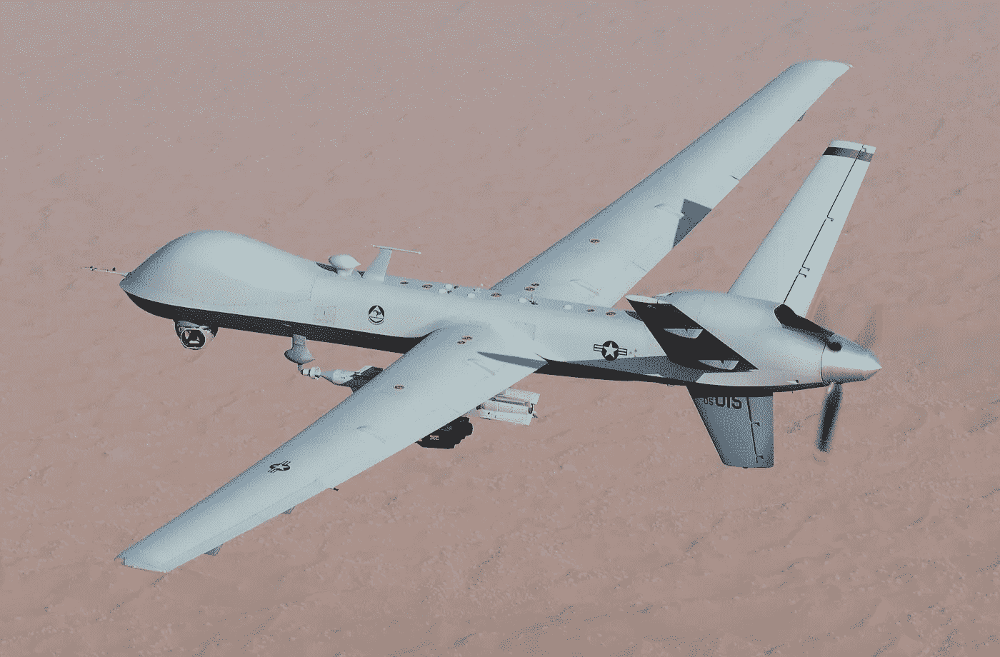
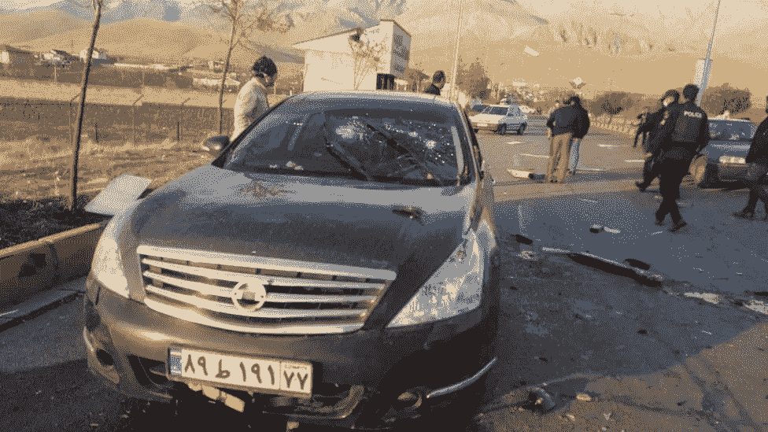
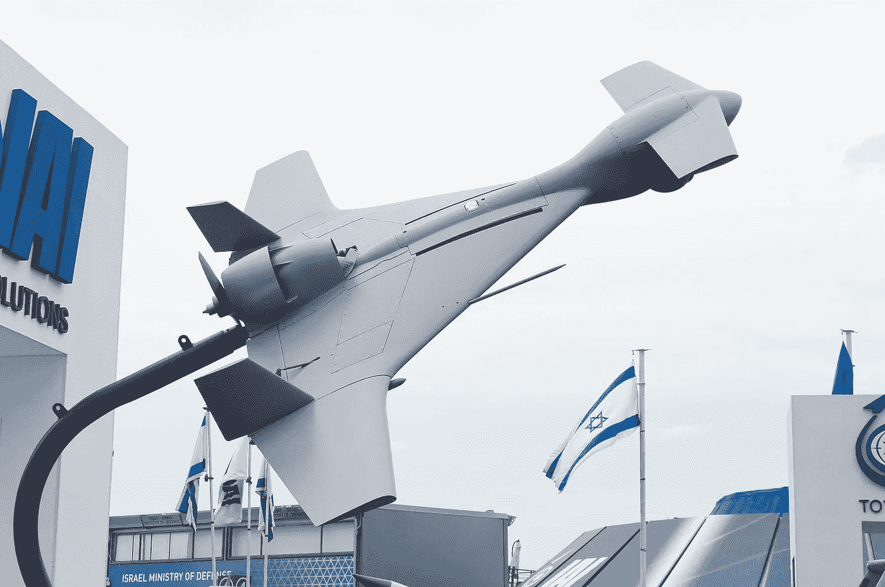
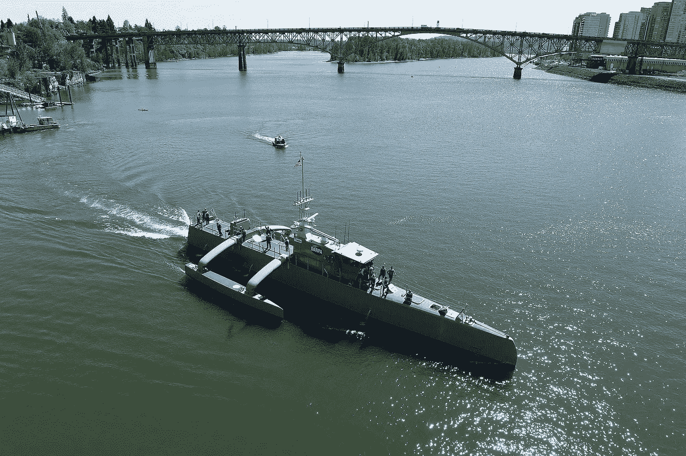

# 自动化死亡和毁灭

> 原文：<https://medium.datadriveninvestor.com/automating-death-and-destruction-816d9f824683?source=collection_archive---------5----------------------->

## 无人机、机器人、人工智能和人类的未来…

An MQ-9 Reaper drone flies a combat mission over southern Afghanistan (photo by Lt. Col. Leslie Pratt, Wikimedia Commons)

2020 年 11 月 27 日，[伊朗国防创新与研究组织的负责人穆赫辛·法赫里扎德](https://en.wikipedia.org/wiki/Mohsen_Fakhrizadeh#Personal_life)，坐进他的黑色日产天籁，妻子坐在他旁边，驶出了他们和孩子居住的安全大院。Fakhrizadeh 是前几次暗杀的目标，因为他是伊朗核项目的负责人，所以他在装甲车和保镖的护送下开车。就在他们拐上 Absard 路离开 Absard 市时，他们看到一辆装有机关枪的尼桑皮卡车。这个地区没什么不寻常的。当他们[接近卡车](https://www.bbc.com/news/world-middle-east-55214359)时，机枪竖起，旋转，在无人操作的情况下，直接指向他们的汽车。只过了几秒钟，一声巨响，13 颗子弹打碎了司机一侧的挡风玻璃，正中 Fakhrizadeh 的脸，他当场死亡，而他的妻子却毫发无损。

# **1。** **无人机大战……**

这些是伊朗伊斯兰革命卫队(IRGC)的可疑账户。一些报道称 Fakhrizadeh 在被枪杀前离开了汽车。有些人让他的保镖跳到 Fakhrizadeh 面前，被打了四枪。其他报道称，Fakhrizadeh 的保镖和袭击者之间爆发了枪战。

IRGC 副总司令阿里·法达维声称一把自动枪杀死了伊朗最高核科学家，并说这把枪有一个使用面部识别人工智能(AI)的摄像头，并由卫星控制。法达维声称，这种机器人枪从 150 米处发射了 13 次，击中了 Fakhrizadeh，但没有伤害他的妻子。方便的是，无人 AI 炮和尼桑卡车在袭击后引爆，没有留下任何证据。

Aftermath of the killing of Mohsen Fakhrizadeh (photo by Fars, Wikimedia Commons)

我们不知道这些报道是否准确或可靠。

关键的一点是，要么这个故事是真的，技术实现了人工智能暗杀，要么这个故事是假的，但似乎是真的，因为现在的技术既便宜又有能力。

另一个要点是，这项技术的经济效益如此之好，以至于远程自动化武器已经渗透到最贫穷的国家，并进入了它们的冲突之中。

被称为纳戈尔诺-卡拉巴赫的有争议的高加索地区已经被争夺了数千年。但是冲突在 2020 年[发生了新的转折](https://en.wikipedia.org/wiki/2020_Nagorno-Karabakh_war)，阿塞拜疆军队与当地亚美尼亚人争夺这片不到 2000 平方英里的山地的控制权。

由土耳其和以色列提供的阿塞拜疆无人驾驶飞机袭击了亚美尼亚和纳戈尔诺-卡拉巴赫的士兵和装备，摧毁了他们的防御设施，并迫使他们签署停战协议。澳大利亚战略政策研究所(Australia n Strategic Policy Institute)的一名高级分析师表示，这些无人机是“陆战的潜在改变者”。

阿塞拜疆从土耳其在叙利亚内战中使用无人机对抗苏联设备的经历中受益，而《经济学家》将这些冲突视为未来战争的一个方向。

随着无人机能力和技术的提高，无人机的成本继续快速下降，使像阿塞拜疆这样的小国能够负担得起。当美国在 1991 年海湾战争中首次部署无人机时，它们是昂贵的尖端技术。第一架装备导弹打击敌方目标的[捕食者无人机](https://en.wikipedia.org/wiki/General_Atomics_MQ-1_Predator)于 2001 年 2 月投入使用。这些无人机在 2010 年每架售价约 400 万美元，2018 年停产。

扎卡里·莫里斯少校在美国陆军大学出版社发表的一篇文章指出，在 2002 年[到 2016 年](https://www.armyupress.army.mil/Journals/Military-Review/English-Edition-Archives/May-June-2018/US-Drones-Smaller-Less-Capable-Drones-for-the-Near-Future/)之间，美国在非常规战场上使用无人机杀死了大约 4000 名敌方战斗人员。

非常规战场强调了无人机的一个关键弱点。美国选择这些战斗区域供无人机使用，因为该空域没有争议。美国军方拥有空中优势——他们统治了天空。莫里斯指出，在无人机参与战斗的少数情况下，它们会失败。这包括 2003 年唯一已知的有人驾驶战斗机击落捕食者无人机的空对空战斗，以及 2015 年捕食者无人机被叙利亚“破旧的防空系统”击落。

莫里斯还强调了无人机的成本/能力权衡。他举例说，一架 MQ-9“收割者”无人机在 2011 年的价格约为每架 3000 万美元，是 F-16 战斗机 5500 万美元价格的一半以上。F-16 战斗机代表了一种更加多才多艺和更有能力的作战飞机，携带的有效载荷是“收割者”的四倍，能够出色地完成“收割者”根本无法完成的任务。

然而，对于像亚美尼亚和纳戈尔诺-卡拉巴赫这样没有大量空中资产或防御系统的小国之间的战争，无人机战争有明显的好处。阿塞拜疆购买的[以色列](https://en.wikipedia.org/wiki/IAI_Harop)和[土耳其](https://en.wikipedia.org/wiki/Bayraktar_TB2)无人机每架大约花费 500 万美元。不到一架 F-16 战斗机的十分之一，甚至低于训练一名飞行员的[成本](https://www.rand.org/content/dam/rand/pubs/research_reports/RR2400/RR2415/RAND_RR2415.pdf)。

# **2。** **自主战……**

我们看到的大部分无人机都是遥控的。一名操作员可能在数千英里之外的一个安全掩体中，看着视频监视器，操作无人机，从一个舒适的距离进行杀戮。

随着技术迅速增加这些无人机的功能，这种情况已经发生了变化。例如，阿塞拜疆购买的以色列 [IAI 哈佩 2](https://en.wikipedia.org/wiki/IAI_Harop) 和土耳其 [Bayraktar TB2](https://en.wikipedia.org/wiki/Bayraktar_TB2) 无人机能够自主操作，也可以通过远程“人在回路”模式操作。自主主要是指飞行和侦察行动。但是以色列的哈佩似乎能够自主追踪防空系统的雷达信号，并摧毁它们。

IAI Harop drone at [Paris Air Show](https://en.wikipedia.org/wiki/Paris_Air_Show) 2013 (photo by [Julian Herzog](https://commons.wikimedia.org/wiki/User:Julian_Herzog), Wikimedia Commons)

自主武器系统的定义似乎有待商榷。例如，在一个极端，我们有《凯斯西储国际法杂志》的希瑟·罗夫写道，自主武器系统“能够对部署环境中不断变化的情况做出反应……并能够自行做出开火决定”。这为自主武器设立了一个高标准。

在另一个极端，我们有北卡罗来纳大学的马克·古布鲁德，他主张对自主进行更广泛的定义，即部分或完全无人操作的武器系统应被视为自主。

这些定义对于制定控制自主武器的设计、制造和使用的国际条约非常重要。

科技含量最低、最古老的自动(防御)武器是有着悠久历史的[地雷](https://en.wikipedia.org/wiki/Land_mine)。地雷是有争议的，因为这些简单而致命的装置往往在部署几十年后和冲突结束很久后造成滥杀。像诺贝尔和平奖得主[乔迪·威廉姆斯](https://en.wikipedia.org/wiki/Jody_Williams)这样的国际人士的一致努力旨在禁止地雷。

但是我们关心的不仅仅是地雷这样的机械触发武器，还有一种更加不祥的自主方式。机器感知、解释感知数据并做出行动决定的能力，长期以来一直是人们着迷和恐惧的对象。

 [## 利用区块链构建可持续循环经济|数据驱动投资者

### 自从工业革命开始以来，全世界都关注产品的生产和消费。很少或…

www.datadriveninvestor.com](https://www.datadriveninvestor.com/2020/11/17/building-sustainable-circular-economy-with-blockchain/) 

地雷感应到压力，会自动引爆造成死亡。没有决策过程。

问题是机器是否可以区分或分类感官数据。经典的机器视觉任务之一是区分照片中的猫和狗。对猫、狗、汽车、行人、交通灯、道路等物体进行分类的能力。，对于完全自动驾驶这样的任务来说是必不可少的。全自动驾驶汽车是像特斯拉这样的公司的技术圣杯之一。

Sea Hunter, an unmanned ocean-going vessel following a christening ceremony in Portland, Ore. (photo by U.S. Navy/John F. Williams, Wikimedia Commons)

如果一台机器能够对物体进行足够的分类，以在公共道路上驾驶一辆汽车，那么[就离指挥武器](https://www.vox.com/2019/6/21/18691459/killer-robots-lethal-autonomous-weapons-ai-war)在战斗情况下交战或撤退不远了。事实上，在许多方面，自主武器比自主汽车更容易设计和开发。自动驾驶汽车的目标是安全，这是一个很高的标准(尽管我们道路上的[屠杀](https://en.wikipedia.org/wiki/Motor_vehicle_fatality_rate_in_U.S._by_year)表明安全标准实际上相当低)。对于自主武器来说，人的安全和保护生命显然是次要目标。

世界各国都在积极发展自主武器系统。美国海军已经拥有一艘名为[海猎号](https://www.maritime-executive.com/article/u-s-navy-moves-forward-with-its-autonomous-vessel-program)的自主水面舰艇，并订购了一艘名为[虎鲸号](https://www.popularmechanics.com/military/navy-ships/a26344025/navy-extra-large-unmanned-submarines-boeing/)的自主潜艇。美国陆军有一种名为 [ATLAS](https://www.defenseone.com/technology/2019/03/us-military-changing-killing-machine-robo-tank-program-after-controversy/155256/) 的自主坦克，这可以理解为[引起了巨大的恐慌](https://qz.com/1571597/the-us-army-changed-how-it-describes-ai-powered-firing-by-tanks/)。美国空军拥有 [Skyborg](https://www.airforcemag.com/meet-the-future-unmanned-force/) ，美国海军拥有[诺斯罗普·格鲁曼 X-47B](https://en.wikipedia.org/wiki/Northrop_Grumman_X-47B) 无人战斗机，以及其他[系列](https://www.naval-technology.com/features/us-navy-drones/)。这些只是我们所知道的几个项目。

俄罗斯、中国和世界其他国家也有类似的项目。没有头版头条新闻并不意味着没有军备竞赛。我们肯定在进行一场非常活跃的自主武器竞赛。

# **3。** **机器人战士……**

没有什么比将指导自主武器系统的机器智能与类似这样的东西配对更可怕的了:

或者像这样:

但是机器人不需要看起来像食肉的大猫，或者走进雪地的终结者。它们可以是微小的昆虫状机器，可以投放小型但致命的武器，无论是投射物、爆炸物、有毒或生物制剂等。

但就目前而言，军用机器人看起来更像传统的飞机、坦克和船只，就像我们的军队现在正在追求的自主武器。

军事/工业联合体希望我们知道，自主武器将实际上减少战争犯罪，因为它们将被编程为行动一致并遵循国际法。

人类历史充满了暴行的故事和证据。万人坑，被烧毁的城市、城镇和家园，对战士、武器和死亡的颂扬。即使在今天，尽管我们认为自己是文明的，即使战争受到国际法的约束，我们的士兵仍然以令人沮丧的频率犯下暴行和战争罪行。

论点是机器不会犯下暴行。它们会按照程序，按照法律惯例行动。这本身就是小小的安慰。

但是人类是狡猾邪恶的生物，他们不会让机器保留他们自主的纯真。

例如，我们知道，即使在“正常”战争中，军阀也会将武器放在妇女和儿童手中，或将炸药绑在他们身上。一种机器无法用任何细微差别来解释的情况。毕竟，威胁必须被消除。

## 获得专家视图— [订阅 DDI 英特尔](https://datadriveninvestor.com/ddi-intel)