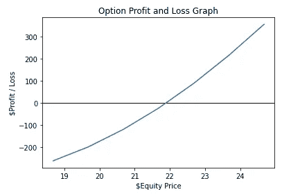
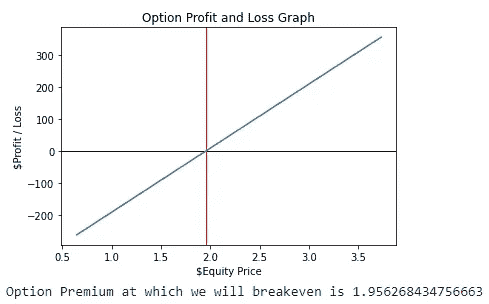

# 自动化期权定价计算

> 原文：<https://medium.datadriveninvestor.com/automating-option-pricing-calculations-sanket-karve-dbbe139474c7?source=collection_archive---------14----------------------->

## 使用 Python 自动计算期权定价，并找到交易的预期利润和损失


Photo by [Nicholas Cappello](https://unsplash.com/@bash__profile?utm_source=medium&utm_medium=referral) on [Unsplash](https://unsplash.com?utm_source=medium&utm_medium=referral)

## 期权与股票

我想大多数人对股票(通常称为股份或股权)的概念已经足够熟悉了，它允许人们投资并成为股东(公司的部分所有者)。虽然购买股票通常是最终的，但股票期权更多的是一种义务(或期权),即在特定日期以预先决定的价格购买或出售特定数量的股票。因此，股票期权通常以合同的形式出现，带有溢价(允许一个人在未来购买或出售股票的期权)。

## 简要说明

首先，我们可能会假设自己正处于衰退的边缘——这将导致周期性股票价格下跌。假设一个人持有一家名为*【水手】* (CLRS)的航运公司的股票，其交易价格为 50 美元。你的分析表明，该公司拥有强大的基本面、商业计划和管理团队，即使在经济衰退期间，该公司仍有可能至少实现收支平衡。不幸的是，你也知道，由于市场情绪和反身性，CLRS 的股价将在未来几周甚至几个月受到冲击，并可能暴跌至 30 美元。

由于股票的潜在价值，人们自然会倾向于持有股票，购买期权将使我们能够通过利用这种情况下的熊市情绪来提高我们的投资组合回报。这样做的一个好方法是购买期权合同，允许你在一个月后以 40 美元的价格出售 CLRS 的股票。

这种情况将允许期权持有者以两种方式获利。首先是在一个月后行使期权，以 40 美元的价格出售股票。假设当日股价为 30 美元，可以实现每股 10 美元的利润。第二种选择是在行权日/到期日之前交易期权合约。这使我们想到了现有的选择类型。

## 期权类型和期权定价

**看涨 vs 看跌**

看涨期权允许持有者在未来某个日期以预先决定的固定价格购买一定数量的股票。类似地，看跌期权允许持有者在预先决定的日期以固定价格出售一定数量的股票。通常，一个长期看跌策略是当一个人预期股价暴跌，因此购买期权合约，而长期看涨是当一个人预期股价在未来上涨，因此购买看涨期权。

这里还需要注意的是，在处理看涨期权时没有利润上限，在处理看跌期权时没有亏损下限。

**美国 vs 欧洲**

我们之前讨论了期权合同在到期前如何执行或交易。美式期权是那些允许期权在任何时间点被执行的期权，而欧式期权只能由持有者在到期日执行。

**期权定价**

期权合约的价格是动态的，不需要太多的细节，它受需求和供给的影响。这些价格或溢价(此后)是根据基础股票的价格和各种其他因素(如到期日、执行价格等)计算的。有各种各样的方法可以做到这一点，其中比较流行的有[布莱克-斯科尔斯模型](https://medium.com/cantors-paradise/the-black-scholes-formula-explained-9e05b7865d8a)和[二项式定价系统](https://xplaind.com/552187/binomial-options-pricing-model)。这些方法很费时，而且通常很麻烦。为了帮助我们做出购买或出售期权的明智决策，我们现在将通过 Python 自动计算溢价。这将允许普通投资者计算盈亏平衡点，并通过对基础价格做出明智的预测来决定卖出/买入合同的限价。

## 构建代码

安装和导入所需的软件包

首先，我们将导入并安装所需的包，这将允许我们一些关键的功能。此外，请注意，本程序将计算到期前交易期权而非行使期权所产生的潜在利润或损失。

```
!pip install Quantlib
!pip install option-price
import numpy as np
import statistics
import pandas as pd
import scipy.stats as si
import matplotlib.pyplot as plt
import pandas_datareader as web
```

**通过股票价格计算隐含波动率**

现在我们已经导入了所需的包，我们将下载我们感兴趣的期权标的股票的价格。这将有助于我们计算考虑中的股票的隐含波动率。为了这个练习的目的，让我们使用加拿大航空公司(AC。至)

```
#Get stock data of Ticker and enter ticker value as per choice of option
optionticker = web.get_data_yahoo("AC.TO",start = "2016-01-01", end = "2020-11-18")
option_vol = (optionticker['Adj Close'].pct_change()).std()
option_vol = option_vol * 252 ** 0.5
print(option_vol)#
#
from QuantLib import *

valuation_date = Date(20,11,2020)
Settings.instance().evaluationDate = valuation_date

calendar = UnitedStates()
market_price=1.85 #Option Premium - Market Price

exercise = EuropeanExercise(Date(15,January,2021))
payoff = PlainVanillaPayoff(Option.Call, 22) #Strike Price, Change to Put if required
option = EuropeanOption(payoff,exercise)
smp = 21.68 #Enter Ticker Market Price
S = QuoteHandle(SimpleQuote(smp)) #Enter current Market Price
r = YieldTermStructureHandle(FlatForward(0, calendar, 0.0035, Actual360()))
q = YieldTermStructureHandle(FlatForward(0, calendar, 0.00, Actual360()))
sigma = BlackVolTermStructureHandle(BlackConstantVol(0, calendar, option_vol, Actual360()))
process = BlackScholesMertonProcess(S,q,r,sigma)

implied_volatility=option.impliedVolatility(market_price, process)

print ("Implied Volatility: ",implied_volatility)
```

我们使用该公司过去五年的股票价格，从每日价格波动(也称为标准差)计算隐含波动。然后，我们使用布莱克-斯科尔斯模型(BSM)得出隐含波动率。**务必记住输入我插入的注释所代表的正确值！**

**期权定价的计算**

现在我们有了隐含波动率，我们将用它来计算期权定价(或溢价)。

```
#Input option details
# European - False = American
# s0 = spot price
# k = strike price
# t = days
#sigma = stock volatility
#r = risk free rate 5/10y, dv = dividend yield%
from optionprice import Option
option_det = Option(european=True,
                    kind='call',
 #change to put for put options
                    s0=21.68,
                    k=22,
                    t=56,
                    sigma=implied_volatility,
                    r=0.0035,
                    dv=0)
option_det
```

可以看出，我们正在研究加拿大航空公司的看涨期权，执行价格为 22 美元，当时股票交易价格为 21.68 美元，还有 56 天到期。这里使用的无风险利率是 0%，股息率是 0%。

[](https://www.datadriveninvestor.com/2020/10/23/fourier-transform-for-image-processing-in-python-from-scratch/) [## Python 中用于图像处理的傅里叶变换从零开始|数据驱动投资者

### 首先，处理数学问题真的很有趣。对吗？我知道答案可以是是也可以不是…

www.datadriveninvestor.com](https://www.datadriveninvestor.com/2020/10/23/fourier-transform-for-image-processing-in-python-from-scratch/) 

我们现在继续找出代码如下的合同价格

```
#Black Scholes Model (More Iterations = More accuracy), others are monte carlo and binomial tree
price0 = option_det.getPrice(method='BSM',iteration=5000)
mcprice = option_det.getPrice(method='MC',iteration=5000)
btprice = option_det.getPrice(method='BT',iteration=5000)
avg = statistics.mean([btprice,price0,mcprice])
print('BSM Price is '+str(price0), ', MC Price is ' +str(avg), ', BT Price is ' +str(btprice))
print('Average Price is ' +str(avg))
```

如我们所见，我使用了三种不同的型号，除了个别价格外，还打印了三种型号的平均价格。请注意，根据迭代运行的次数，可能会有微小的价格变化。这个过程也是资源密集型的，尤其是在大量迭代的情况下。

**检查利润&损失**

现在我们有了价格并愿意购买合约，我们计算股票价格，在这个价格上我们可能会收支平衡，出现赤字或盈利。该代码的要点是，我计算了一系列基础价格的基础合约溢价，然后外推这些价格之间的定价差异，以计算盈亏。在本文中，我考虑了一个包含 100 股股票的合约，每笔交易的佣金为 10 美元+每份合约 1 美元。

```
from optionprice import Option
ploss = {'Equity Market Price': [smp-3,smp-2,smp-1,smp,smp+1,smp+2,smp+3]}
noc = 2 #number of contracts bought/sold
sperc = 100*noc #100 shares per contract
df = pd.DataFrame(ploss, columns = ['Equity Market Price','Profit/Loss'])
cpt = 10 + noc #commissions per trade, here assumed $10 flat + 1$ per contract
pnl=[]
for i in df['Equity Market Price']:
  option_det = Option(european=True,
                    kind='call',
                    s0=i,
                    k=22,
                    t=56,
                    sigma=implied_volatility,
                    r=0.0035,
                    dv=0)
  price = option_det.getPrice(method='BSM',iteration=5000)
  pnl.append(((price-price0)*(sperc))-(cpt*2))

ploss['Profit/Loss']=pnl
final=pd.DataFrame(ploss,columns=['Equity Market Price','Profit/Loss'])
#Note that calculations may not show zero value for options at purchase price view iterations differences
print(final)
```

为了绘制图表，我们得到–

```
import matplotlib.pyplot as plt

plt.axhline(0, color='black', linestyle='solid', linewidth=1)
plt.plot(final['Equity Market Price'],final['Profit/Loss'])
plt.title('Option Profit and Loss Graph')
plt.xlabel('$Equity Price')
plt.ylabel('$Profit / Loss')
plt.show()beven = (price0*sperc+(cpt*2))/sperc
plt.axhline(0, color='black', linestyle='solid', linewidth=1)
plt.axvline(beven, color='red', linestyle='solid', linewidth=1)
plt.plot(final['Option Premium'],final['Profit/Loss'])
plt.title('Option Profit and Loss Graph')
plt.xlabel('$Equity Price')
plt.ylabel('$Profit / Loss')
plt.show()
print('Option Premium at which we will breakeven is ' +str(beven))
```



## 结论

希望这个练习对你有所帮助，并且激发了你对这个领域的好奇心。请随意探索这个模型，与[一起优化您的投资组合](https://towardsdatascience.com/automating-portfolio-optimization-using-python-9f344b9380b9)，然后[计算它的风险值！](https://towardsdatascience.com/var-calculation-using-monte-carlo-simulations-40b2bb417a67)

请不要将本文视为投资或专家建议。所有观点均为个人观点。随时在[*LinkedIn*](https://www.linkedin.com/feed/)*或*[*Twitter*](https://twitter.com/Go0n3r)*上联系我，评论我的文章！*

## 获得专家观点— [订阅 DDI 英特尔](https://datadriveninvestor.com/ddi-intel)