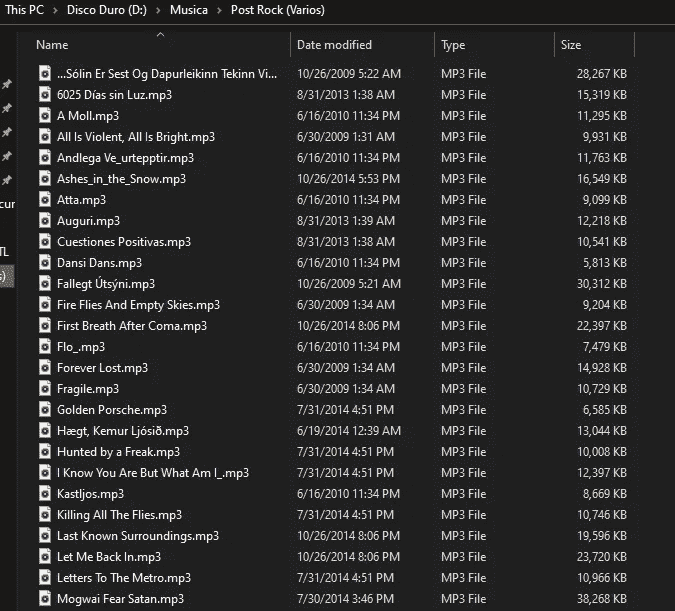
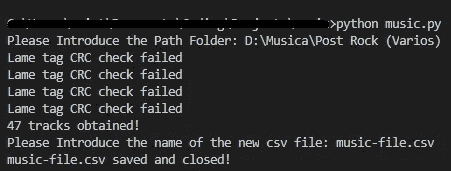

# 从电脑的音乐文件夹中自动播放 Spotify 上的播放列表。

> 原文：<https://medium.datadriveninvestor.com/automating-playlists-on-spotify-from-the-music-folders-of-your-computer-c79060eadab2?source=collection_archive---------7----------------------->

## 将音乐文件导出到 Spotify 播放列表的有趣方式。


Photo by [Wes Hicks](https://unsplash.com/@sickhews?utm_source=unsplash&utm_medium=referral&utm_content=creditCopyText) on [Unsplash](https://unsplash.com/s/photos/music-files?utm_source=unsplash&utm_medium=referral&utm_content=creditCopyText)

与黑胶唱片、CD、mp3、文件等旧机制相比，现代社会的音乐流媒体平台越来越受欢迎。这就是为什么大多数人更喜欢在 Spotify 这样的音乐应用程序上保存他们喜欢的歌曲。尽管有些人仍然把他们的音乐文件保存在电脑音乐文件夹中。

这是我爸爸的情况，他是一个老学校的音乐爱好者，他所有的音乐位于外部磁盘，笔驱动器和光盘。但现在他想开始使用流媒体平台，因为他厌倦了浪费大量时间在电脑的一堆音乐文件夹中寻找自己喜欢的歌曲。

因此，利用我在 Python 方面的一点知识，我决定创造一种方法，将他电脑上音频文件中的音乐自动导出到 Spotify 上的新播放列表中。所以让我们开始吧！。

# 所需工具:

*   [**Spotify 凭证**](https://developer.spotify.com/) 访问他们的 API 和数据采集。
*   库[**熊猫**](https://pandas.pydata.org/docs/) 和 [**Numpy**](https://numpy.org/doc/) 进行数据分析。
*   库**[**Spotify**](https://spotipy.readthedocs.io/en/2.9.0/#)用于在 Spotify 上创建播放列表。**
*   **[**库 eyed3**](https://eyed3.readthedocs.io/en/latest/) 用于获取音乐文件的特征。**
*   **库 [**OS**](https://docs.python.org/3/library/os.html) 用于在计算机上操作路径。**
*   **用于数据清理和数据保存的库 [**RE**](https://docs.python.org/3/library/re.html) 和**[**CSV**](https://docs.python.org/3/library/csv.html)。****

# ****1.获取数据。****

****为了开始我的项目，我决定用我父亲的音乐文件夹来制作我的剧本。这个文件夹包含 47 首不同后摇滚乐队的歌曲。该文件夹如下所示:****

********

****Post-Rock Music Folder with different songs in MP3 (image by author)****

****我必须获得所有这些文件的主要信息，因为我稍后需要它们来搜索 Spotify 上的曲目。为此我使用了库 [**eyed3**](https://eyed3.readthedocs.io/en/latest/) ，它有助于分析 mp3 文件的特征。我决定为每个音轨保存音轨的**标题**、**艺人名称、**和**专辑名称**。其中一些曲目的详细信息上没有这些功能，所以我必须保存文件的名称来标记曲目。我还使用库 [**OS**](https://docs.python.org/3/library/os.html) 来访问每个轨道文件的不同路径。****

****[](https://www.datadriveninvestor.com/2020/06/23/automation-is-poised-to-lead-us-out-of-the-crisis-and-empower-people-here-is-how/) [## 自动化已准备好带领我们走出危机，并赋予人们权力-以下是|数据驱动…

### 随着我们准备进入 2020 年下半年，并试图在全球预防性关闭后重新开启经济…

www.datadriveninvestor.com](https://www.datadriveninvestor.com/2020/06/23/automation-is-poised-to-lead-us-out-of-the-crisis-and-empower-people-here-is-how/) 

最后获得所有轨迹文件的特征和信息，我使用 CSV 库将这些数据保存到一个 CSV 文件中。完整的代码在我的 [**Github**](https://github.com/cristobalvch/Spotify-Automating/blob/master/music.py) 上。

```
#librariesimport eyed3
import os
import re
import csv
import numpy as np
import time#Let the user introduce the path of the music folderpath = str(input("Please Introduce the Path Folder: "))#Save the name of each mp3 file on a list called "filenames"filenames = []
for r,d,f in os.walk(path):
    for file in f:
        if file.endswith(".mp3"):
           filenames.append(file)#Obtain the features of each mp3 file and saved them on 3 listsname_song = []
name_artist  = []
name_album = []for filename in filenames:
     pathfile = path + "\\" + filename
     audioinfo = eyed3.load(pathfile)

     if not audioinfo.tag.title:
         temp_name = re.findall("^(.+?).mp3",filename) [0].replace("_"," ")
         name_song.append(temp_name)
     else:
         name_song.append(audioinfo.tag.title)
         name_artist.append(audioinfo.tag.artist)if not audioinfo.tag.album:
        name_album.append(np.nan)
   else:
        name_album.append(audioinfo.tag.album)time.sleep(0.05)#print the total number of the tracks obtainedprint(f"{str(len(name_song))} tracks obtained!")#Save the information into a  csv file#let the user introduce the name of the new csv filename_file = str(input("Please Introduce the name of the new csv file: "))with open(name_file,"w",encoding="utf-8") as f:
     w = csv.writer(f)       
     w.writerows(zip(name_song,name_artist,name_album))
f.close()print(f"{name_file} saved and closed!")
```

使用这个脚本，我创建了一个 [**CSV 文件**](https://github.com/cristobalvch/Spotify-Automating/blob/master/music-file.csv) ，其中包含了在 Spotify 数据库上搜索这些曲目文件所需的所有信息，然后为我爸爸创建了新的播放列表！。



Command Prompt view of the script working (image by author)

#Lame tag CRC 校验失败:这一行出现在我运行 eyed3 的时候，看看 Google 我意识到这是访问或修改文件太快时的一个常见消息，但是结果的总数并不影响何时出现这条消息。

# 2.在 Spotify 上创建播放列表。

为了在 Spotify 上创建新的播放列表，我使用了库 [**Spotipy**](https://spotipy.readthedocs.io/en/2.9.0/#) ，它有助于自动化过程，获得各种各样的歌曲的许多不同功能，等等。你只需要获得一个客户端 ID、客户端密码和用户名号码，就可以使用 [**Spotify 的 API**](https://developer.spotify.com/documentation/web-api/)并操作你的曲库音乐和账户数据。您还需要指定您想要自动化的不同方法的 [**授权范围**](https://developer.spotify.com/documentation/general/guides/scopes/) 。

为了从我父亲的后摇滚音乐文件夹中搜索我想保存在新的 Spotify 播放列表中的曲目，我必须首先获得所有这些曲目的 ID。为此，我使用一些凭证来访问和操作我在 Spotify 上的账户。我还使用 spotipy 库上记录的搜索功能来搜索该曲目是否在 Spotify 数据库中。完整的代码在我的 [**Github**](https://github.com/cristobalvch/Spotify-Automating/blob/master/playlist.ipynb) 上。

访问 Spotify 用户库的授权码。

```
#librariesimport spotipy
from spotipy import SpotifyClientCredentials, util
import pandas as pdclient_id='YOUR_CLIENT_ID'
client_secret='YOUR_CLIENT_SECRET'
redirect_uri='YOUR_REDIRECT_URL'
username = 'YOUR_SPOTIFY_USER_NUMBER'#The scope required to modify the user libraryscope_user = 'user-library-modify'#The scope required to modify the user playlistsscope_playlist = 'playlist-modify-public'#Credentials to access the user library musictoken_user=util.prompt_for_user_token(username,scope_user,client_id,client_secret,redirect_uri)sp_user = spotipy.Spotify(auth=token_user)#Credentiasl to access the user  Playlists Musictoken_playlist=util.prompt_for_user_token(username,scope_playlist,client_id,client_secret,redirect_uri)sp_playlist = spotipy.Spotify(auth=token_playlist)
```

获取每个曲目文件的 Spotify ID 并将它们保存到数据帧中的代码。

```
#Open the CSV file created with pandas and specify the headersheaders = ['song','artist','album'])
data = pd.read_csv("../music/music-file.csv",names=headers)#Save the ID given by Spotify for each trackids = []for i in range(len(data)):query = data['artist'].loc[i] +" "+ data['song'].loc[i]
     songs = sp_user.search(q=query,type='track',limit=2)try:
        ids.append(songs['tracks']['items'][0]['id'])except IndexError: 
        print(f"ID Not Found: Please review the song's title with index {str(i)}")
        ids.append(np.nan)
```

如果你注意到我不得不处理索引错误，那是因为一些歌曲在 Spotify 数据库中没有 id。

如果数据库中存在该曲目，我会将 Spotify 提供的曲目 ID 保存在一个名为“ids”的新列表中。如果轨迹不存在，脚本会返回数据框中轨迹存储的索引，以解决两个可能的问题:

1.  **曲目标题在 Spotify 音乐数据库**上的写法略有不同:这个问题的解决方法只是修改数据框上的曲目标题，把标题写在 Spotify 上。例如，我父亲的文件中有一首名为“2214”的歌曲，Spotify 数据库中有一首名为“2214”的歌曲，我就遇到了这个问题。所以我只是用 Spotify 上用的名字修改了歌名。
2.  **Spotify 音乐数据库中不存在该曲目:**在这种情况下，ID 被替换为 NaN，因为 Spotify 的音乐数据库中没有该曲目。

最后，我能够用我父亲的曲目文件创建播放列表。使用播放列表范围和 Spotipy 库的两个函数，首先我创建了一个名为“Post-Rock”的播放列表，然后我使用这个新播放列表的 ID 来存储其 Spotify IDs 的所有曲目。

```
#Create the new playlistnew_playlist = sp_playlist.user_playlist_create(username,"Post-Rock",public=True)#Populate the new playlist with the tracks using the Spotify Ids for each track.sp_playlist.user_playlist_add_tracks(username,playlist_id=new_playlist['id'],tracks=data['id'].tolist())
```

如果你想听播放列表，你可以访问下面的链接。

# 结论

自动化一项可能需要很长时间才能完成的任务，考虑到现实世界正在以指数方式加速任何活动的过程，它在现代社会中可能是有用的。时间每天都变得宝贵，所以为什么不使用技术来自动化缓慢而枯燥的手动方法，并与我们的朋友、家人一起度过空闲时间，甚至创建新的脚本来自动化更多的事情！。

# 我的文章:

*   [一个友好的公共汽车和分析人员到达网络上的部门](https://medium.com/@cristobal.veas.ch/una-forma-genial-para-buscar-y-analizar-arriendos-de-departamentos-en-la-web-e20727390a8c)
*   [使用 Python 和 R 对音乐进行聚类，在 Spotify 上创建播放列表](https://towardsdatascience.com/clustering-music-to-create-your-personal-playlists-on-spotify-using-python-and-k-means-a39c4158589a)
*   一个在网络上工作的公共汽车和分析的交互模型。
*   [用深度学习预测一首歌的音乐情绪](https://towardsdatascience.com/predicting-the-music-mood-of-a-song-with-deep-learning-c3ac2b45229e)

参考资料:

*   [https://towards data science . com/a-music-taste-analysis-using-Spotify-API-and-python-e52d 186 db 5 fc](https://towardsdatascience.com/clustering-music-to-create-your-personal-playlists-on-spotify-using-python-and-k-means-a39c4158589a)
*   [http://opentechschool.github.io/python-scripting-mp3/](http://opentechschool.github.io/python-scripting-mp3/)

## 访问专家视图— [订阅 DDI 英特尔](https://datadriveninvestor.com/ddi-intel)****