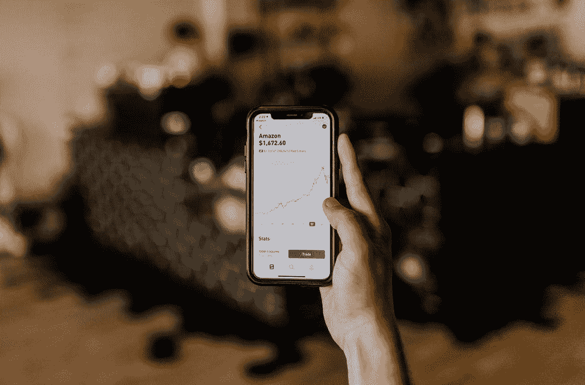
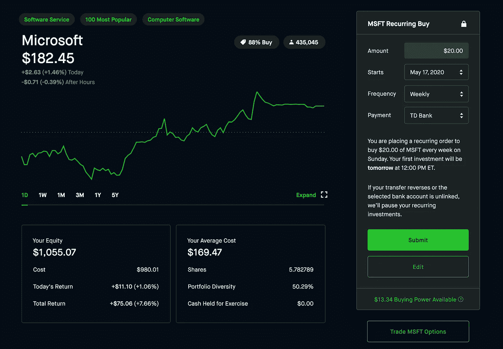
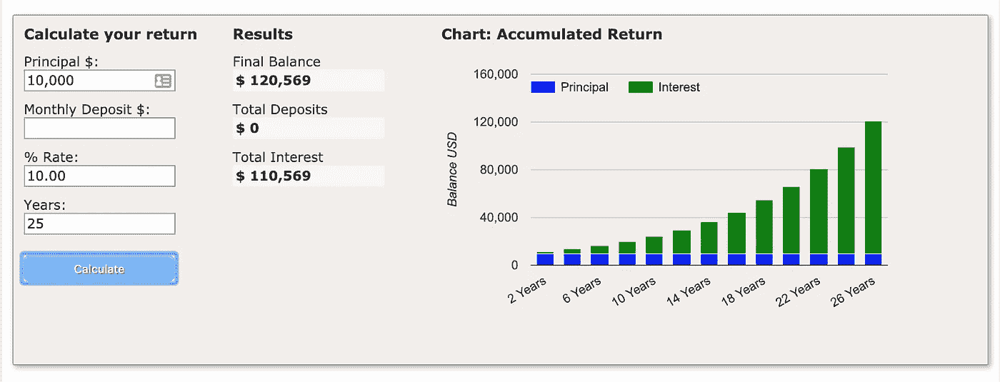
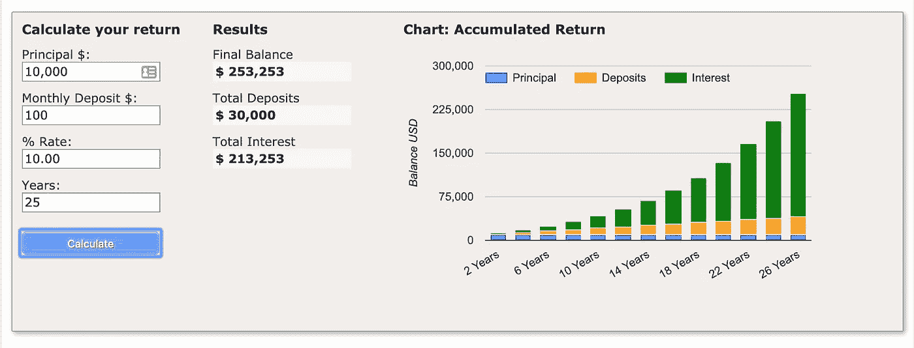
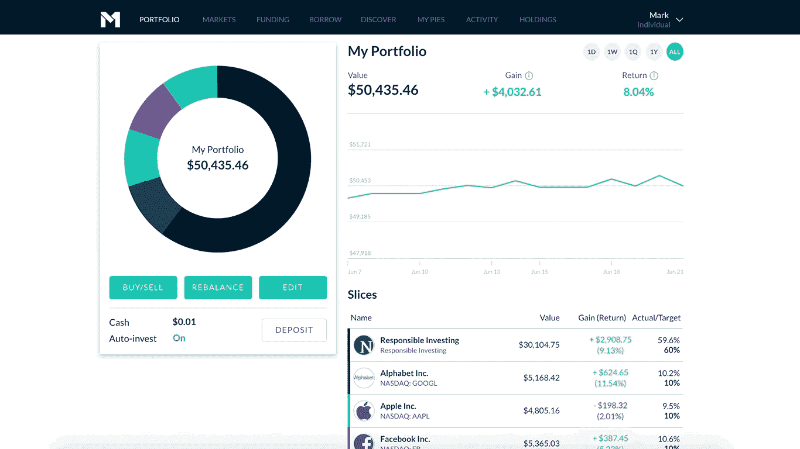

# 借助罗宾汉和 M1 金融公司实现投资自动化

> 原文：<https://medium.datadriveninvestor.com/automating-your-investments-with-robinhood-m1-finance-dde58fd9b32f?source=collection_archive---------1----------------------->

Automate your finances with the help of two popular investing apps

# 罗宾汉和 M1 金融自动化

今年早些时候，我写了大多数千禧一代正在使用的 3 个主要颠覆性交易平台。你可以通过阅读早期的帖子了解更多关于这些平台的信息。我想在这里重点介绍的是 Robinhood 自我上一篇文章以来所实施的主要变化，以及 Robinhood 在我最喜欢的经纪商中与 M1 金融和 WeBull 相比的优势。

不幸的是，对于这个特殊的话题，WeBull 在自动化投资和零股方面都有所欠缺。如果你的目标是自动化投资，那就别费心了。WeBull 是一个交易平台，提供日内交易工具，利用你 4 倍的购买力。

*注:我认为这是不言而喻的，这些都不应该被认为是“专业的财务建议”，对我有用的，不一定对你有用。把我的部分策略运用到你自己的策略中，但是风险自负。*

# 为什么要自动化投资？

Checking stocks daily can lead to irrational decisions such as selling during downturns — pic: [Austin Distel](https://medium.com/u/c3d65f712fc1?source=post_page-----dde58fd9b32f--------------------------------)

要成为伟大的投资者，你需要实施一个基于规则的系统。规则和系统是所有投资者都需要的，不仅仅是新手。没有系统，世界将陷入混乱。你的财务状况也是如此。

我记得当我试图预测市场底部的时候，同时也交易最活跃的股票。我每天早上在铃响前花几个小时寻找合适的戏剧，铃响后又花几个小时试图弄清楚我是如何错过我一直在寻找的戏剧的。这导致了许多沮丧的高买低卖，同时与 FOMO 少校追逐股票。

在投资或真正做出任何涉及金钱的决定时，我们希望在这个过程中消除任何情绪。我明白了在投资时抑制情绪的最好方法是将决策过程从整个等式中剔除。

## 世界第八大奇迹…

人们认为爱因斯坦说过*“复利是世界第八大奇迹。懂的人赚……不懂的人……付出。”*

美元成本平均法一直是我的投资策略，用来随着时间的推移建仓，并减少 90%的决策过程。通过选择具有成功战略和强大财务基本面的好公司，你可以把更多的时间放在实际的财务研究上，而不是放在技术指标和调整股票扫描器上。

Microsoft is one of my favorite holdings and continues to look strong into the future

我每周在微软和苹果投资 20 美元，这比我试图通过找到底部并在任何给定的股票上投资 5000 美元来把握市场时机，然后看着它在几分钟后下跌要好得多。现在，我为自己没有找到底部而自责，我不得不盯着一个红色的平衡数周。

听起来熟悉吗？让我们看一个真实世界的例子，以充分掌握美元成本平均和复利的好处。

# 给你的植物浇水…

把你的投资组合想象成一个花园，把股票想象成你的植物。不会因为你种下了种子就结束。你需要给你的投资浇水，看着它们随着时间的推移而增长。

安排定期存款或投资可以让你避免高价买入，永远不要低价买入。

## 不要像乔一样

认识一下乔。乔是一名 30 岁的专业人士，拥有价值 1 万美元的 XYZ 造纸公司。$XYZ 造纸公司的年回报率为 10%。

在第 1 年末，Joe 的投资组合现在为 11，000 美元。从$XYZ 造纸公司获得的稳定收益。10 年后，乔的投资组合达到了 25，937.42 美元。

25 年后，乔的初始投资 10，000 美元最终突破 6 位数，达到 108，347.06 美元。这是一个不错的改变，但不幸的是，乔忘了给他的植物浇水，错过了很多收获。

## 像巴克斯特一样

现在来见见巴克斯特。巴克斯特是一只狗，因为他整天坐在家里，所以他读了很多书。他在某种程度上是一个金融文学天才，但他是一只狗。

Good boi investor

不管怎样，巴克斯特也喜欢$XYZ 造纸公司，也想在乔购买他的股票的同一天投资 10，000 美元。事情是这样的，巴克斯特很聪明，他每月自动购买$XYZ 造纸公司的 100 美元。

在第 1 年末，百特的投资组合现在为 12，264.05 美元。第 10 年，巴克斯特坐拥 46，083.18 美元。

Baxter 在第 17 年以 101，795.38 美元跨过了六位数的投资组合大关。这比 Joe 快了 7 年，只需每月向相同的位置投资 100 美元。

在第 25 年，Baxter 达到了 **$253，253，**，而 Joe 希望他把每月用来买大麻的$100 拿去投资。

给你的植物浇水，看着它们成长。

# 我该如何开始？

如果你是一个传统的投资者，有 401k 的经验，M1 金融的投资方法可能更适合你。这是完全自动化的，一劳永逸。

如果你喜欢对自己的投资进行更精细的控制，比如日内交易和波动交易，Robinhood 可能更适合你(尽管这违背了自动化的目的。)

## M1 金融

Automated investing in action — Courtesy [M1 Finance](http://www.m1finance.com)

M1 金融是平均成本投资者的明确选择。M1 允许投资者创建一个定制的投资组合，并安排自动付款到我的账户。M1 金融的神奇之处在于它的**自动投资**功能，该功能可以提取你自动安排的任何股息或存款，并通过购买你最不重视的股票来重新平衡你的投资组合。

为了更好地控制，M1 有一个再平衡按钮，可以找到你最重仓的股票，卖出多余的股票，并购买你最重仓的股票。

我可以试着进一步解释，但最好是直接从马嘴里得到。[点击此处了解 M1 金融如何实现交易自动化。](https://support.m1finance.com/hc/en-us/articles/360001379367-How-M1-Finance-Trades)

## 罗宾汉

Robinhood's version of automated investing — Courtesy [Robinhood](http://www.robinhood.com)

Robinhood 今年早些时候推出了一项红利再投资计划。基本上，你拥有的任何向你支付股息的公司都会拿着这些股息购买同一家公司的更多股票。这是一个相当普遍和传统的设置，几乎所有主要的零售经纪人都提供，但罗宾汉不见了。

罗宾汉并没有就此止步。就在本周**他们**[引入了定期重复投资](https://robinhood.com/us/en/support/articles/recurring-investments/)。这些重复投资的运作方式与 M1 金融有些不同，所以弄清楚你的策略和你想如何处理事情是很重要的。

有了 Robinhood，你就可以对一只特定的股票/公司/ETF 设定一个定期的重复购买。这是伟大的，如果你想磨练和美元铸造平均在一个或两个特定的股票，不关心多样化。

有了 M1 金融公司，你可以安排一笔定期存款，M1 金融公司的自动投资和再平衡工具会帮你用存款购买减持股票，或者用增持头寸进行再平衡。

# 结论

开始投资可能会令人望而生畏。这就是为什么消除对何时买入和把握市场时机的猜测是任何新手投资者的最佳途径。

说到底，你不需要生活在一个只依赖一个经纪人的世界里。我使用所有三个经纪人，罗宾汉、M1 金融和 WeBull，都是为了不同的目的和策略。我的分类如下:

## **罗宾汉**

定期(每周)对拥有强劲资产负债表和良好护城河的公司进行经常性投资，并结合云技术和创新玩法，我对此深信不疑。**滴注**启用，以实现最大复合。

[点击此处获取 Robinhood 的免费股票并开始使用。](http://join.robinhood.com/jovanh)

## **M1 金融**

我的红利增长基金和云 SaaS 基金的定期(每周)重复投资。**自动投资**为两个基金打开，以实现最大复利。

[我的红利增长基金，专注于 GT 1%收益率的蓝筹股。](https://m1.finance/c3O5FUnWpc41)

[我的云计算/SaaS 基金专注于科技初创企业、云计算和 SaaS。](https://m1.finance/EL21_kVeKkVB)

## 保真 401k

这是一个额外的警告，但也很重要。利用你公司提供的任何匹配的 401K 计划。确保最大化到至少为比赛增加。这是直接进入你投资的自由资金。

希望这有助于阐明自动化投资的好处。永远对其他角度和策略持开放态度。别忘了给你的植物浇水。