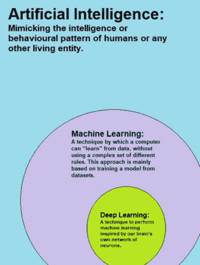
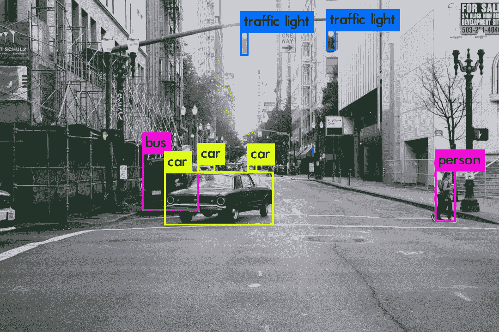

# 自动化对银行业的影响

> 原文：<https://medium.datadriveninvestor.com/automations-impact-on-banking-ceeb238d08f9?source=collection_archive---------2----------------------->

## 金融中的人工智能

## 行业内乔布斯的死亡或未来？

Photo by [Franck V.](https://unsplash.com/@franckinjapan?utm_source=unsplash&utm_medium=referral&utm_content=creditCopyText) on [Unsplash](https://unsplash.com/s/photos/automation?utm_source=unsplash&utm_medium=referral&utm_content=creditCopyText)

根据富国银行的一份报告，自动化将在未来 10 年内导致 20 万个银行业工作岗位的流失。

听到这样令人震惊的数据，任何在这个行业工作或打算在这个行业工作的人都应该感到担忧。人们经常将自动化的影响与蓝领工作联系在一起，但可能会忽视它对白领工作的影响。相比之下，20 万人占同期预计将失去的 150 万美国工作岗位的 13.3%([1])。

自动化好处的一个类比是职业阶梯上的阶梯。支持者认为，自动化消除了阶梯底部的横档，并将它们添加到顶部，这消除了重复的任务，并开辟了新的工作机会。批评者认为自动化弊大于利，让他们失业。随着银行每年在技术上花费 1500 亿美元，自动化军备竞赛似乎不会很快放缓([2])。在我们了解银行业的工作将如何变化之前，让我们先来看看银行是如何整合技术的。

# 人工智能/自动化的优势

人工智能(AI)和自动化是两个经常同时出现但意思不同的术语。人工智能是指模仿人类行为的算法，如从数据中做出决定或识别模式；自动化是指机器在没有人类干预的情况下自动完成重复性任务。人工智能子领域的进步，如机器学习、自然语言处理和计算机视觉，大大增加了可以变得更有效或自动化的过程的范围。随着人工智能预计到 2030 年将为银行节省高达 1 万亿美元的资金，不难看出为什么银行如此渴望实现人工智能([3])。

## 机器学习

Image Credit: [Wikipedia](https://en.wikipedia.org/wiki/Deep_learning#/media/File:AI-ML-DL.png)

机器学习专注于开发能够从训练数据中自主学习和改进的计算机程序。深度学习使用模拟人脑神经元的人工神经网络来执行各种任务。机器学习的这个子领域为下文描述的银行业的许多应用提供了动力。

*   通过数据分析发现之前隐藏的见解并指导业务决策。
*   通过客户数据(如账户余额、年龄和工资)预测客户留在银行的可能性。
*   根据各种因素，如收入、信用额度和受抚养人的数量，确定个人的信用度。
*   通过根据人口统计和交易历史等客户数据构建推荐系统，提供定制的银行服务体验。
*   通过实施自动编码器(一种检测异常的神经网络)和其他机器学习技术，更有效地实时识别潜在的信用卡欺诈案件。

## 自然语言处理+计算机视觉

Left Image: [Freepik](https://www.freepik.com/free-vector/chatbot-concept-background-with-mobile-device_2411540.htm) | Right Image: Photo by [Tuce](https://unsplash.com/@jucetuce?utm_source=unsplash&utm_medium=referral&utm_content=creditCopyText) on [Unsplash](https://unsplash.com/?utm_source=unsplash&utm_medium=referral&utm_content=creditCopyText)

机器学习与人工智能保护伞下的其他领域重叠，如自然语言处理(NLP)和计算机视觉。NLP 是人工智能的一个分支，处理破译，分析，甚至对人类语言做出反应。计算机视觉是人工智能的一个分支，处理理解视觉数据以分类和检测图像中的对象。通过 NLP 和计算机视觉，自动化的几种可能性向银行敞开了大门。

*   开发聊天机器人，以提供个性化的金融建议，回答一般问题，并帮助客户执行简单的任务，如转账。
*   通过机器人顾问满足每个客户独特的金融需求。
*   通过在应用程序中嵌入聊天机器人，提供更好的移动银行体验。
*   将机器学习、NLP 和计算机视觉结合起来，自动执行一些重复性的会计任务，包括记录应付账款、结算财务报表和账户对账。
*   通过 NLP 缩短客户在呼叫中心的等待时间。
*   利用机器学习和计算机视觉来提高效率并减少身份验证过程中的错误。
*   语音识别作为用户身份验证的替代方法

这个列表并不意味着对所有应用程序的全面概述，但它应该让你对银行如何寻求接受人工智能和自动化有一个好的想法。

# 杯子是半满还是半空？

Photo by [manu schwendener](https://unsplash.com/@manuschwendener?utm_source=unsplash&utm_medium=referral&utm_content=creditCopyText) on [Unsplash](https://unsplash.com/s/photos/glass-half-full?utm_source=unsplash&utm_medium=referral&utm_content=creditCopyText)

随着银行越来越多地将人工智能和自动化集成到业务中，我们不禁要问这对员工有什么影响。新技术的适应会导致新的、令人兴奋的职业，还是会导致新一波前所未有的裁员？这个问题的答案因角色而异。

诸如客户服务、会计和其他管理角色等支持部门似乎已经为自动化做好了准备。花旗集团首席执行官 Mike Corbat 在去年的一次采访中表示，该银行成千上万的呼叫中心工作容易受到自动化的影响。通过在呼叫中心实施 NLP，银行可以通过全天候客户服务降低成本并提高效率。然而，呼叫中心不会变得完全自动化，因为客户不能只依赖人工智能来帮助他们解决所有问题。如前所述，会计工作的一部分，包括记录应付账款管理、结算财务报表和对账，可以实现自动化。然而，会计师不会完全自动化，因为他们的角色将转移到更专注于分析和解释数据。虽然这些支持领域的一些工作将被削减，但剩余的员工可以放弃平凡的任务，专注于完成他们工作中需要人情味的部分。

 [## 如何使用自动化从您的数据中获得更多价值？数据驱动的投资者

### 去年的新闻故事不停地谈论机器学习变得多么先进。电脑现在…

www.datadriveninvestor.com](https://www.datadriveninvestor.com/2020/02/27/how-to-use-automation-to-get-more-out-of-your-data/) 

为了实现他们越来越多地采用技术的目标，银行正专注于招聘和培养技术人才。例如，高盛雇佣的程序员/工程师比脸书多，并且是财富 500 强公司(不包括科技公司)中科技初创公司的最大投资者。这一趋势反映在去年涉及人工智能和数据科学的金融工作清单增加了 60%([4])。

由于银行面临与初创公司和科技巨头争夺顶级人才的艰难时期，它们已经开始采取措施发展员工的技能。例如，2018 年，摩根大通强制要求加入其资产管理部门的所有 300 名分析师参加编程课程。在试点之后，该银行正专注于扩大培训，以包括数据科学和机器学习概念。为了加大赌注，2019 年融资 340 亿美元的金融科技初创公司威胁要打破现状，给银行带来创新压力([5])。总体而言，员工应该准备学习与编程相关的技能，特别是数据科学和人工智能，以促进他们的职业发展。正如摩根大通资产与财富管理公司首席执行官玛丽·卡拉汉·埃尔多斯所说

> “编码不仅仅适用于技术人员，它适用于任何想要在 21 世纪经营一家有竞争力的公司的人……通过更好地理解编码，我们的业务团队可以和我们的技术团队说同样的语言，这最终会为我们的客户带来更好的工具和解决方案。”

# 最后的想法

自动化和人工智能肯定会在未来十年及以后重塑银行。然而，值得注意的是，进展的速度取决于一些因素，如银行获得顶级技术人才的能力，以及监管机构对隐私问题的立场，如人工智能模型所需的大量数据。随着行业的变化，金融行业的人应该准备更新自己的技能，以适应这些新趋势。虽然技术的崛起会夺走工作，但它也会催生新的角色，让员工专注于更令人兴奋的任务。

# 参考

[1]牛津经济学，[机器人如何改变世界](https://cdn2.hubspot.net/hubfs/2240363/Report%20-%20How%20Robots%20Change%20the%20World.pdf?utm_medium=email&_hsenc=p2ANqtz--S_yv5LZTWzdC5IER_NtSl3PcknlmRKCRLWkiY7DXoc24tLeHNQmxbfIluLCA4PrkWMen4_J_hWSH49WG3OQvHF61Jlg&_hsmi=74013545&utm_content=74013545&utm_source=hs_automation&hsCtaTracking=07b1855a-24f4-4b99-bcb8-b0d2a13b715e%7C53b7a48e-9591-4179-8eab-694443190b4f)

[2]雅虎财经，[银行和科技将最终在 2020 年结婚](https://finance.yahoo.com/news/banks-tech-will-get-married-in-2020s-wells-fargo-mike-mayo-200645753.html)

[3]快公司，[人工智能可以消灭 250 万个金融岗位——并为银行节省 1 万亿美元](https://www.fastcompany.com/40568069/ai-could-kill-2-5-million-financial-jobs-and-save-banks-1-trillion)

[4]美国消费者新闻与商业频道，[需要人工智能技能的金融工作去年增加了 60%](https://www.cnbc.com/2019/09/25/finance-jobs-requiring-ai-skills-are-growing-and-here-are-examples.html)

[5]CB Insights，[风险投资基金报告 2019 年第四季度](https://www.cbinsights.com/research/report/venture-capital-q4-2019/)

**先别走**！

我是 Roshan，16 岁，对人工智能和金融的交叉领域充满热情。如果你对人工智能的具体用例感兴趣，请查看这篇关于欺诈检测的文章:[https://towardsdatascience . com/fighting-financial-fraud-with-artificial-intelligence-F2 a6 bcaf 131 e](https://towardsdatascience.com/fighting-financial-fraud-with-artificial-intelligence-f2a6bcaf131e)。

在 Linkedin 上联系我:[https://www.linkedin.com/in/roshan-adusumilli-96b104194/](https://www.linkedin.com/in/roshan-adusumilli-96b104194/)