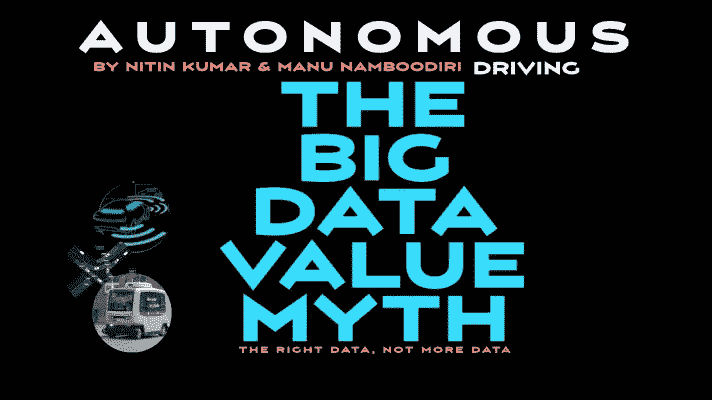
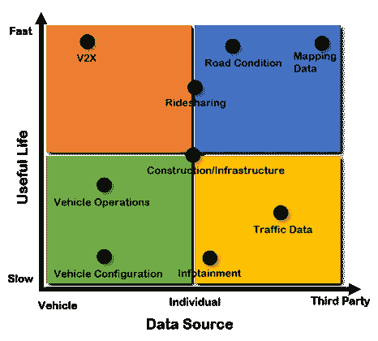
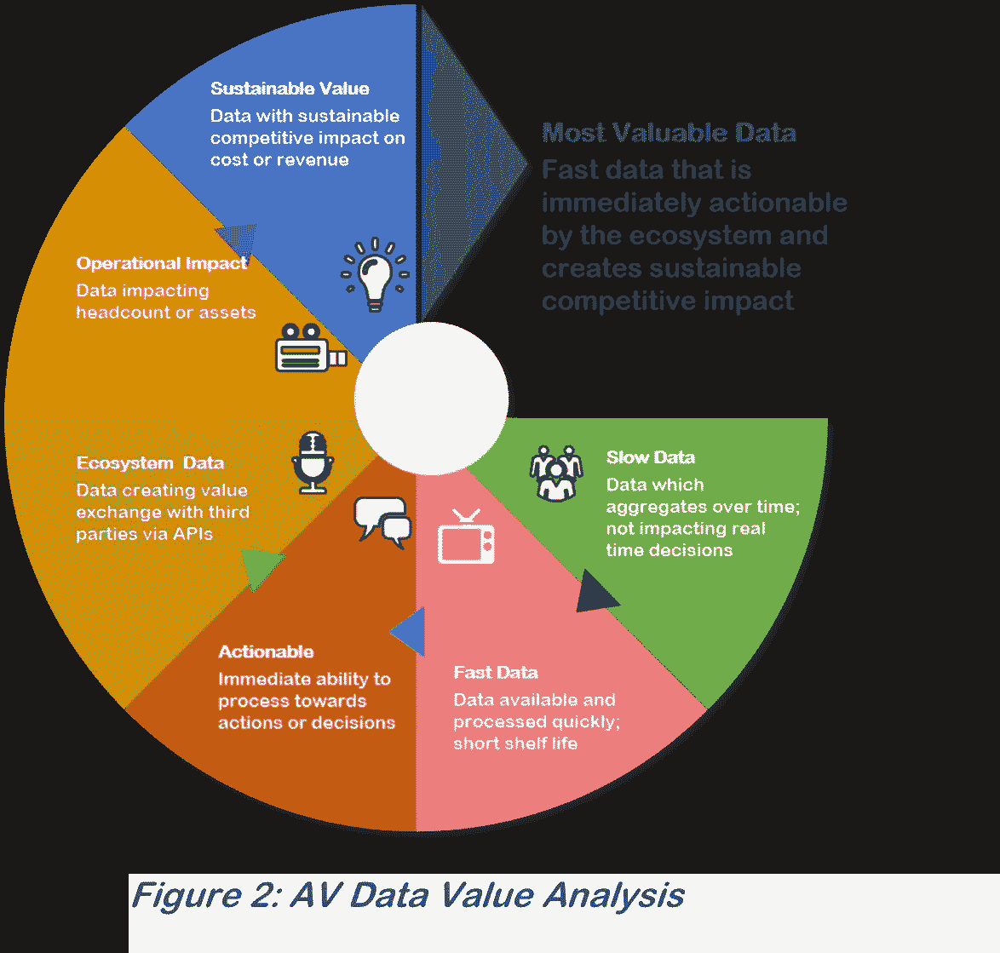
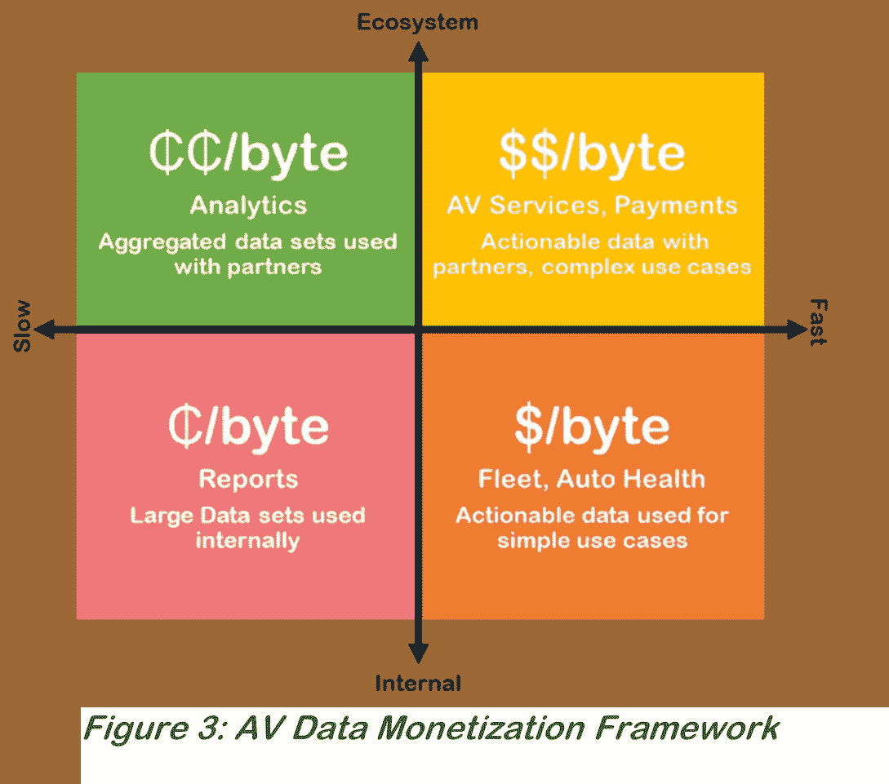

# 自动驾驶:为什么大数据价值是一个神话

> 原文：<https://medium.datadriveninvestor.com/autonomous-driving-why-big-data-value-is-a-myth-584427b50f05?source=collection_archive---------6----------------------->

Image created by author(s) using Pixabay

了解大数据在自动驾驶生态系统中的价值

# 介绍

如今，人们、设备和许多事物都会产生大量数据，例如天气、位置、人口统计、购买模式等。此外，我们正在从用户生成数据/内容的时代转向机器生成数据/内容的时代，数据/内容的数量呈指数级增长。

> **从自动驾驶价值链中释放价值不是拥有更多数据，而是在正确的时间为正确的生态系统参与者提供正确的数据**

这些大型数据集的大部分被认为是有价值的，因为它们可以打包出售给其他人。然而，普遍的误解是，收集许多事物的大量数据会创造价值。了解数据的正确标准和属性以有效地产生价值是很重要的。例如，谷歌收集了大量数据，但只有当这些数据通过应用程序、API 或服务进行有意义的处理，为客户创造价值时，价值才会增加。

自动驾驶汽车也是如此。人们对希望从现代汽车产生的大量数据中受益的公司持乐观态度。我们认为，如果没有对汽车和自主数据价值链以及可行的移动业务模式的深刻理解，就无法实现数据的真正价值。

# AV 数据价值链

自动驾驶汽车从多种来源和格式收集各种数据，例如传感器、地图、交通、车辆健康、运营——这些数据的使用也分布在广泛的用例中。在我们了解这种自动驾驶汽车数据的价值之前，让我们通过两个镜头来更好地理解数据，即它的使用寿命(快与慢)和它的使用情况(内部与生态系统)。图 1 中的示例为我们提供了一个非详尽的数据源列表和自动驾驶汽车的使用情况。

# 有效期

有用寿命可以描述为初次捕获后数据的使用速度以及它的有用时间。快速数据是新创建的数据，也是可以快速处理的数据。请注意，所有数据都是快速生成的—久而久之，当它变成慢速数据时，其值通常会降低。

# 数据使用

使用情况与自主移动生态系统内的数据利用有关，即，无论是作为数据直接使用、传输、聚合，还是由应用和服务以编程方式访问和使用，无论是在车辆边缘本地还是在云中外部。使用属性定义了数据的可操作性——可操作的数据是所有数据中最有用的。

Figure 1: AV Data Value Concept

上述属性还决定了数据的存储位置、访问数据的难易程度(智能手机与专用传感器)、数据的修改/处理程度等。

在自主车辆内的有价值的数据之间也存在固有的内聚性和线性。例如，来自建筑和交通的数据被利用到地图中，并且地图直接实时通知车辆的导航。数据的内聚性和相互依赖性越强，生态系统的多个组件就需要越快地获得数据，因此数据就变得越有价值。在某些情况下，传感器被部署用于冗余，并且来自这些传感器的数据被用作确认性的，并且提高机器提取的智能。数据也在设备或边缘利用机器推理进行处理，而慢速数据通常存储在云中，并通知深度学习。

# 影音数据链:关键价值驱动因素

在所有条件相同的情况下，快速数据每字节创造更多价值，因为它可用于即时行动。随着数据变老，尽管仍然有用，但每字节的价值已经降低。价值来自于分析、报告、计划等的集成、组合。图 2 通过数据在价值链各点的特征说明了数据的线性和指数价值。

在快慢数据之外，决定进一步价值创造的下一个层面是数据的可操作性。如果数据对即时决策和行动至关重要，这将增加其价值。此外，如果行动不仅限于生成数据的公司，而且数据可以通过 API 提供给生态系统合作伙伴，让他们采取行动，这有可能极大地增加价值。

价值链中的下一级是数据创造的价值类型，即它们是否通过简化运营提供了运营优势，或者从竞争的角度来看，数据能否提供持续的价值。最有价值的数据具有快速、可被生态系统操作并提供持续竞争影响的特征。

# AV 数据:一个货币化框架

正如我们刚刚看到的，数据的使用寿命、可操作性和生态系统影响决定了它的价值，任何创造持续价值的数据显然都有巨大的货币化潜力。

货币化价值可以通过数据使用寿命和数据使用范围的框架来简化，即数据是在公司内部用于简单的用例，还是通过 API 以编程方式提供给生态系统用于更复杂的用例。

这意味着，如果通过 API 将数据作为生态系统的服务来消费，货币化潜力将会增强，即数据的价值会增加，因为它现在对于 AV 移动生态系统是可用的和可操作的。因此，这些数据现在增加了生态系统的价值，反之亦然，从而为控制和管理移动生态系统的反病毒供应商创造了可持续的竞争优势。

以下框架可以帮助设计移动性和自动驾驶的数据驱动业务模型。如图 3 所示，快速生态系统数据最有价值，而直接慢速数据通常最无价值。每种方式的货币化都需要组织内不同的方法和能力，以下是 AV 移动组织如何利用可用数据创造价值的一些使用案例和示例。

 [## 蓝色起源能摧毁 SpaceX 的垄断吗？数据驱动的投资者

### 争夺太空主导权的战争即将升级吗？距离第一枚 SpaceX 猎鹰 9 号火箭升空已经过去 7 年了…

www.datadriveninvestor.com](https://www.datadriveninvestor.com/2020/11/26/could-blue-origin-demolish-the-spacex-monopoly/) 

# 慢速内部

用例:一个自动驾驶汽车车队提供商使用内部车辆数据、乘客接送数据来协商更好的保险费率或维护合同。在这种情况下，车队公司可以证明，当车内没有乘客时，保险费率应该更低。该数据可以在一段时间内跨车辆类型、地理位置收集。虽然这类数据中的一些在创建时可能是可操作的，但从成本或收入角度来看，大部分价值只能在以后的汇总中实现。

# 慢速生态系统

用例:收集、汇总汽车或 AV 数据，并提供给第三方及其应用程序进行分析。想象一下，由上述 AV 车队提供商收集的相同数据现在可编程地用于其生态系统，例如电池充电合作伙伴、维护网络或服务于特定大学城的大学生的另一个专业子车队。通过 API 获得的历史或季节性需求和乘客数据可以让电池充电公司提供动态定价，学生子车队可以在整个城镇更好地定位其车辆，以实现最大利用率和乘客量。

# 快速内部

用例:关于汽车健康的内部数据、从第三方收到的关于临时道路建设的外部数据都是例子。虽然汽车健康数据不是实时敏感的，但它具有即时性，可能会影响健康和成本或收入机会。施工数据在向内流动时被捕获，并被烘焙到地图中以供即时导航。如果继续施工，使用寿命就会持续。交通堵塞、天气和拥堵等数据的有用寿命要短得多，而且是暂时的。

还可以包括由传感器收集的数据，以使车辆能够在这一类别中自主驾驶。数据被直接作用，以由本地 AV 栈做出决定。然而，将这种内部数据货币化为安全运动的能力仅限于 AV 栈所有者。

# 快速生态系统

用例:当数据的即时性和可操作性增加重要价值时。想象一下，一家公司提供自动驾驶汽车服务，接送幼儿上下学。汽车将依赖制造商的 AV 栈来导航，而该公司则在栈提供的数据基础上开发其移动服务。当汽车到达学校时，需要回答的关键安全问题是“谁被允许打开车门？”打开车门的人的照片可以实时获得，并且来自可从 AV 平台 API 访问的实时相机数据。移动公司的应用程序既运行在本地汽车上，也运行在云中，可以确认试图开门的人的身份。如果验证成功，公司应用程序将通过 AV stack API 发出安全请求来打开车门，汽车将执行打开车门的物理动作和安全关键命令。

在这个用例中，虽然一张照片的“字节大小”很小，但从每字节数据的角度来看，这种交互的价值非常高。这是生态系统可以立即采取行动的 fast 数据的高价值的一个例子。

# 更广泛的适用性:

虽然我们已经讨论了 AV 环境中的数据价值，但该数据框架的价值广泛适用于其他行业和许多物联网用例。例子包括金融行业的股票价格、农业部门农民的西红柿现货价格、旅游票价、电子商务网站的流量和需求、天气数据等。

# 结论

更多的数据不一定有价值——数据是新的石油是一个神话，因为所有数据的价值并不相同，并且每字节数据的价值存在很大的差异。数据的价值取决于其对成本、资产效率、员工生产率或收入的直接影响。在大多数行业中，通过可编程访问为生态系统提供的快速且立即可操作的数据是最有价值的。总之，这些框架也适用于自动驾驶汽车之外的大数据价值的广泛用例。

# 其他相关条款:

1.[自动驾驶技术栈](https://medium.com/predict/the-autonomous-driving-technology-stack-f0b53ab08f99)

2.[自动驾驶:为什么大数据价值是一个神话](https://medium.com/datadriveninvestor/autonomous-driving-why-big-data-value-is-a-myth-584427b50f05)

3.[自动驾驶面临七大数据挑战](https://medium.com/datadriveninvestor/7-data-challenges-in-autonomous-driving-e21d05dacc3a)

4.[七大自动驾驶商业模式](https://medium.com/datadriveninvestor/7-autonomous-driving-business-models-930cd4de6b86)

5.[支持自动驾驶商业模式的 12 项技术](https://medium.com/datadriveninvestor/12-technologies-enabling-autonomous-driving-business-models-33088ba89474)

6.[采用自动驾驶基础设施的途径](https://medium.com/the-innovation/pathways-to-adoption-for-autonomous-driving-infrastructure-676438a7aaa3)

# 关于作者:

## 尼廷·库马尔

尼廷·库马尔在高科技行业有 20 年的经验。他目前是 Appnomic 的首席执行官，但也担任过各种管理职务，包括首席执行官、首席增长官、首席转型官、M&A 整合/分离负责人、BU 主管和管理咨询合伙人(公司和 PE 投资组合公司)。Nitin Kumar 是福布斯技术委员会的成员，定期在论坛上分享他的想法和想法。作为前管理咨询合伙人，Nitin 参与了软件、硬件、半导体和自动技术领域的多项战略和 M&A 项目，获得了对价值链、技术和商业模式的宝贵见解。他还是经过认证的自动驾驶专业人士。

## 马努·南布迪里

Manu Namboodiri 在自动驾驶汽车、安全、物联网、软件等行业工作了 20 年，在战略、产品、营销和生态系统开发方面拥有丰富的经验。他居住在旧金山湾区，为处于不同市场采纳阶段的公司提供建议。

## 获得专家观点— [订阅 DDI 英特尔](https://datadriveninvestor.com/ddi-intel)