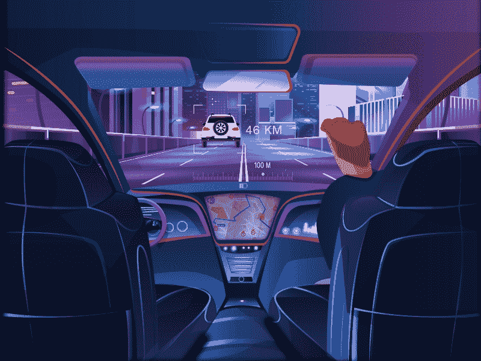
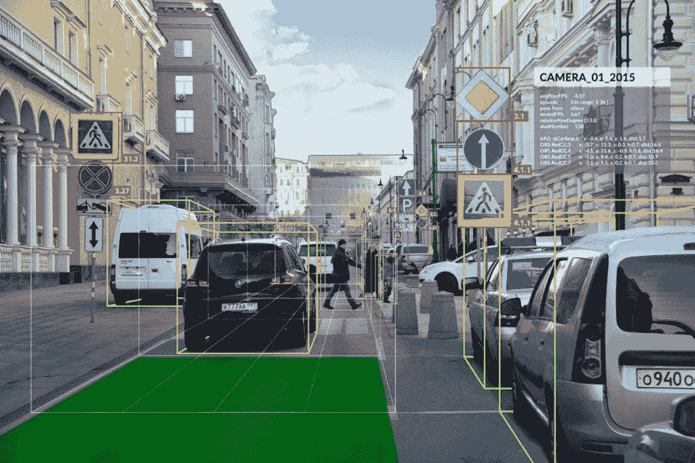
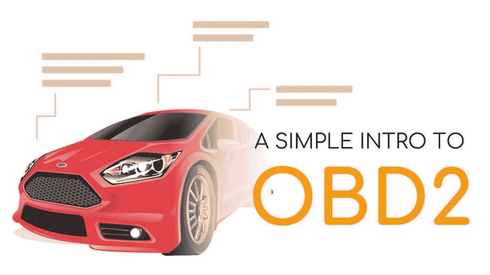
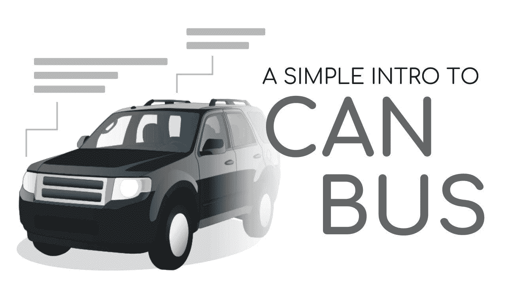
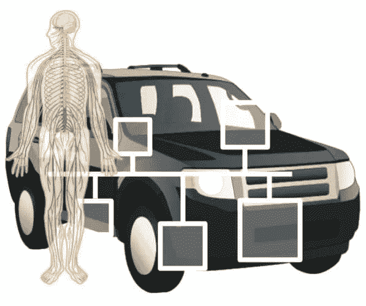

# 自动驾驶汽车技术讲解

> 原文：<https://medium.datadriveninvestor.com/autonomous-vehicle-technology-explained-42bd71badd90?source=collection_archive---------6----------------------->

在湖岸漫步、酿酒厂的圣诞市场和图书馆特色咖啡的世界知名拿铁艺术家之间，我开始真正爱上多伦多。但是，当下午 5 点钟敲响时，所有的爱都失去了，我们被困在另一个加德纳高速公路的交通堵塞中，没有什么*可以治愈这种沮丧。没有德雷克的歌。没有知识项目播客。甚至早上的正念冥想也不行。**无事**。*

不幸的现实是，人们就是讨厌开车。相信我——你每天都能在路上听到、看到和感受到这种仇恨。

你能责怪他们吗？平均上班时间花 34 分钟去上班，交通拥堵在高峰时间达到 63%,大多伦多地区的每户家庭每年为此付出 125 美元。最重要的是，这些令人沮丧的通勤剥夺了人们的宝贵时间，研究表明，较长的通勤时间与焦虑和抑郁等健康问题之间存在相关性。

 [## 认知计算——一套被广泛认为是……

### 作为它的用户，我们已经习惯了科技。这些天几乎没有什么是司空见惯的…

www.datadriveninvestor.com](https://www.datadriveninvestor.com/2020/02/19/cognitive-computing-a-skill-set-widely-considered-to-be-the-most-vital-manifestation-of-artificial-intelligence/) 

我从来没有真正理解——为什么人们害怕开车；相反，它应该成为人们享受和期待的体验。特斯拉、Waymo 和优步的一些工程师分享了这一愿景，并决定开始制造真正自动驾驶的汽车。

这有可能将 VTTS 降低 31%，使非住院的残疾人也能开车，并且每年能为经济贡献 8000 亿美元。最重要的是，人们可以享受他们的驾驶体验，而不用担心不合理的司机行为或那些典型的交通堵塞。

# **收集环境数据**

无人驾驶汽车具有如此突出的潜力，因为它们由机器学习算法驱动，这些算法以前所未有的速度和准确性做出理性决策——它们不断从环境中收集数据，执行一些复杂的计算来传播最佳路径，然后采取行动减少碰撞的可能性。

## 光探测和测距(激光雷达)

他们能够通过多种途径解释和合成来自他们环境的信息——第一种是使用远程传感器提供 360 度 T2 分析的激光雷达。激光雷达基本上每秒发送数千个激光脉冲，这些脉冲与周围的物体碰撞并反射回来；计算机记录下每一个反射点，并迅速将点云更新为环境的三维动画。

测量返回的光子往返于物体的距离非常简单。

> ***距离=(光速不变×飞行时间)/ 2。***

这样，我们就可以理解激光雷达传输和解释点云的过程。

1.  **聚类** -叠加多个点云，赋予物体可识别的形状
2.  **分类** —被扫描的物体被识别
3.  **建模** -每个单独的扫描对象都被分配了预测上下文，以映射其可能的运动。激光雷达单元将理解车辆对于向前/向后移动具有高加速能力，行人可以向所有方向移动，而无生命的物体不会移动

## 激光雷达=注定

激光雷达很精确，也很酷，但用伊隆·马斯克在推特上的名言来说…

> “激光雷达是蹩脚的……任何依赖激光雷达的人都在劫难逃。注定的！[它们]是不必要的昂贵传感器”。~埃隆·马斯克

尽管激光雷达有着非凡的能力，康奈尔大学的研究人员发现，你可以使用放置在挡风玻璃两侧的廉价相机来完成类似的事情，这些相机依靠两个视角来确定深度。

## 计算机视觉=并非注定

这些相机利用**计算机视觉**进行图像分类和识别，并由**卷积神经网络**提供动力，当从正面呈现时，这些网络会扭曲 3D 信息——研究人员发现，从正面视角到鸟瞰视角的转换使精确度提高了三倍。

你可以看看我以前写的这篇文章，它解释了计算机视觉在这里是如何工作的。

 [## 卷积神经网络解释

### 再说说 CNN 的

medium.com](https://medium.com/datadriveninvestor/convolutional-neural-networks-explained-7fafea4de9c9) 

## V2X 协议

自动驾驶汽车也开始看到 **V2X 协议**的实施，在该协议中，车辆可以与它们环境的组成部分进行通信，以收集更多信息。特别是随着更多的市场采用 5G 技术，V2X 协议可能会变得非常强大。

1.  **V2V** (车对车)协议涉及共享当前位置、预测路线、前方道路危险等。这使得我们的技术能够预测其他车辆的当前和未来运动，从而大大降低事故发生的几率
2.  **V2I** (车辆到基础设施)将与交通灯甚至停车场进行通信——想象你的汽车将你送到目的地，然后自己停了下来。每个多伦多人的梦想都实现了
3.  **V2P** (车辆对行人)正在开发追踪人们移动设备 GPS 信号的能力，以确定汽车周围人们的确切位置。

# **解锁自驾能力**

虽然自动驾驶的一个基本前提是了解我们的环境，但访问和控制组成我们车辆功能的各个节点也同样重要。大部分数据来自 **LKAS** 和 **OBD-II 端口**。

## OBD-II 车辆端口

每辆车都有一个 **OBD-II** 端口，用于跟踪**车辆信息**，如每分钟转数、每加仑英里数、转弯重力等。这作为汽车的*内置自诊断系统*；机械师通常通过 16 针 OBD-II 连接器访问方向盘下方的通用接口，以读取和分析有关汽车的数据。

## 控制器局域网

该端口对于提供对**控制器区域网络(CAN)总线**的访问至关重要，这些总线充当每辆车的*集中控制系统*。CAN 总线负责将汽车的模块连接在一起，并连接各个节点，使它们能够相互通信。

## 发动机控制单元

这些节点是**发动机控制单元(ECU)**，其控制内燃机的致动器。每辆车大约有 70 个执行器，每个节点监控一个功能。

有了它，你可以想象人脑或中枢神经系统以及每一个 ECU，一个执行特定功能的器官；CAN 允许 ECU 相互通信，以维持稳定的功能。

例如，**气体电位器**连接到一个 ECU 节点，该节点决定最终的油门和发动机扭矩；发送这个信息将控制我们的气体和加速度。

略有不同的两个功能是**方向盘**和**刹车**。方向盘由施加在车轮上的*扭矩*控制。为了命令车轮到达特定位置，您需要闭合回路的控制装置，所需的角度、当前角度和扭矩命令被应用到可通过软件访问的 **PI 回路**中。

对于刹车，大多数 2012+车型都有**电子稳定控制**(当汽车检测到失去牵引力时应用刹车)，也可以访问。

然后基本上从汽车雷达*解析*信息，其中**与**视觉系统**进行初步融合**以输出两种状态——汽车的**当前位置**和**期望位置**。由此，驾驶神经网络输出最*最优路径*，并将位置融合在一起，以决定哪条路径最大化效率并减轻交通拥堵或碰撞。

让我们将自动驾驶总结为 3 个简单的步骤。

1.  汽车通过激光雷达、计算机视觉和 V2X 协议从我们的环境中收集信息
2.  该信息被发送到神经网络软件，该软件输出最佳运动以最大化运动并减少碰撞
3.  该信息被传输到相应的 ECU，该 ECU 控制我们车辆的每个动作和功能。他们将计算转化为实际的运动。

我相信，在不久的将来，自动驾驶汽车将被市场广泛采用，这将带来无与伦比的经济、环境和社会影响。这可能会彻底改变这个行业，让这种体验更安全、更快捷、更容易获得。

# 最后一件事

> *希望你能够更好地了解自动驾驶汽车及其无穷的能力！如果你能做以下事情来支持我，那对我来说就意味着一切。*

1.  注意👏图标？给我的文章发一些掌声
2.  **通过 [Twitter](https://twitter.com/surajbansal2003) 、 [LinkedIn](https://www.linkedin.com/in/suraj-bansal/) 和 [Github](https://github.com/Suraj-Bansal) 与我联系**
3.  **查看**我的[个人网站](https://surajbansal.ca/)了解我的最新作品