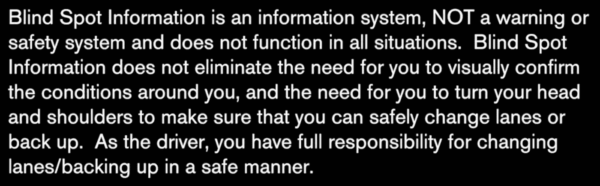
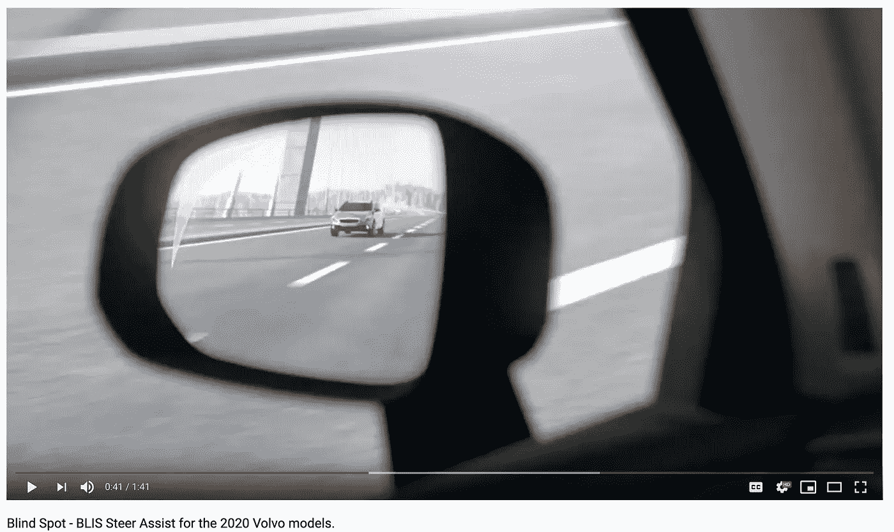
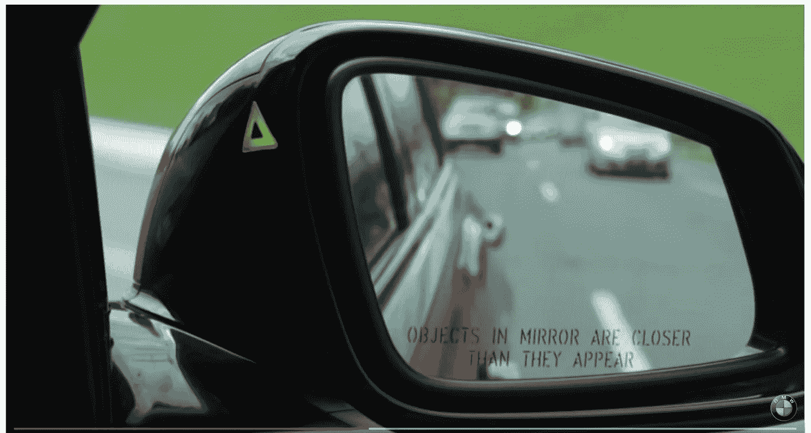
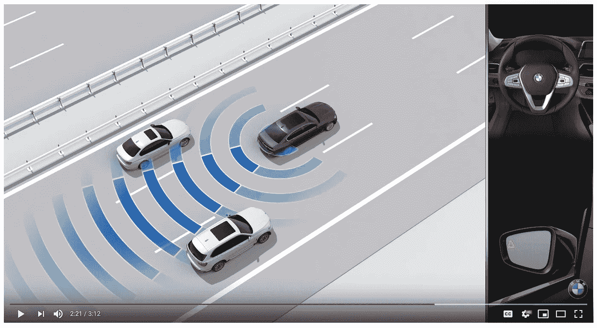
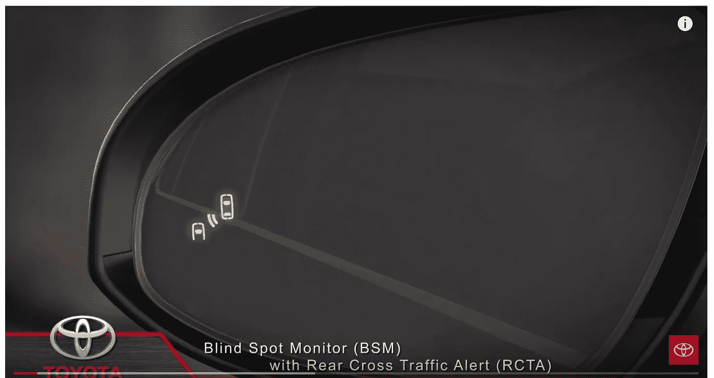
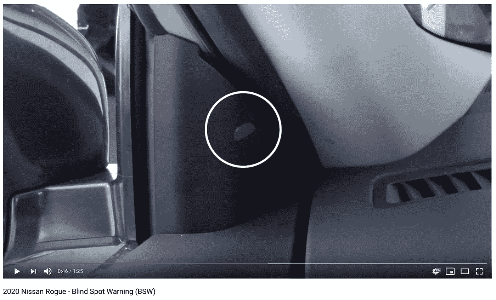
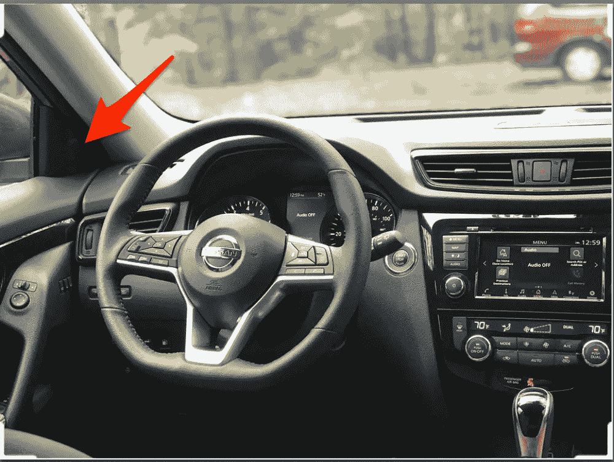
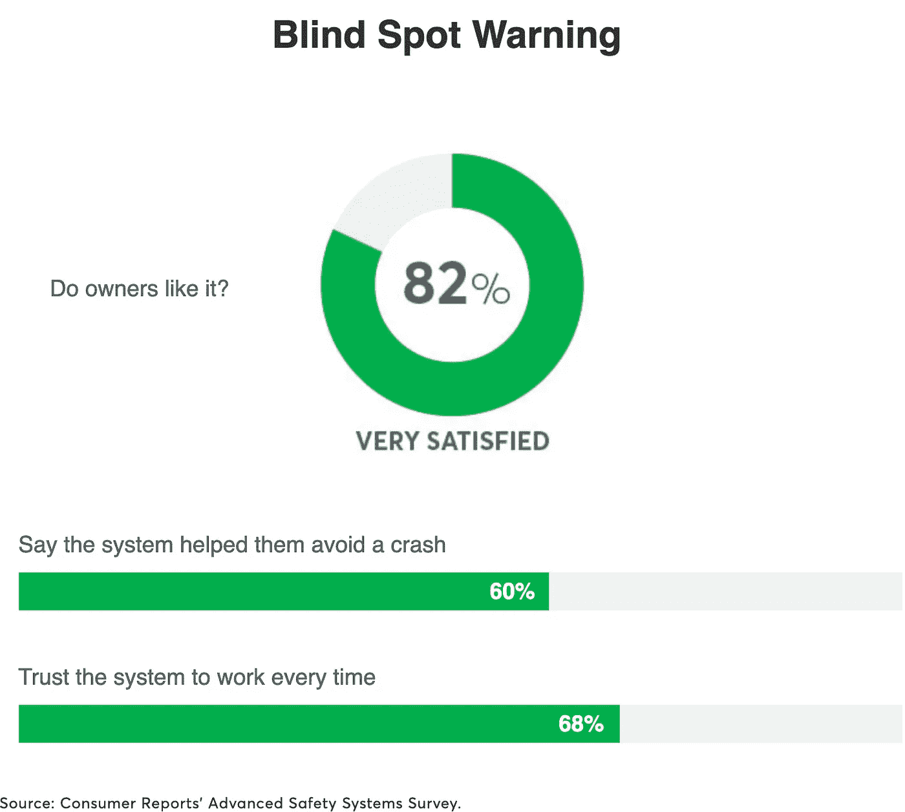

# 避免用户体验设计的盲点

> 原文：<https://medium.datadriveninvestor.com/avoid-blind-spots-in-user-experience-design-56b8cf08ffa7?source=collection_archive---------7----------------------->

## 了解可能阻碍人们使用你的产品的常见陷阱

让我们以盲点检测系统为例，讨论如何在设计中避免盲点以获得更好的用户体验。

是的，使用“盲点”示例来避免“盲点”/\双关

> 继续之前，请阅读警告！

*免责声明:*

*多年来，简单的盲点检测已经变得越来越复杂，包括自动转向(方向盘)、自动刹车，以及……自动驾驶。在某些情况下，盲点警告灯与声音(蜂鸣声)或仪表板灯等附加警报机制相结合。但是，出于讨论的目的，我们将简单地使用基本的盲点检测技术，更重要的是，从用户的角度来看这项技术的经验。*

一个简单的设计问题是这次讨论的关键— **你把警示灯放在哪里？**警示灯指示盲点中有物体。

那么不同汽车厂商如何定位盲点系统？

下面所有的截图都来自 Youtube.com。如果您仔细观察，您将能够看到警示灯的位置。

1.  让我们从被认为是美国最安全的汽车品牌开始，沃尔沃——一个相对全新的车型

2.受人尊敬的德国汽车制造商宝马——几年前的一款车型

3.宝马的新款——请查看右下角的灯光位置

4.久负盛名的日本汽车制造商丰田

5.日产 Rogue —警示灯位于车身内部，而非后视镜上/附近

比较图片 1 至 5，您可以评估每个品牌和型号对盲点警告灯的定位有何不同。你可能会更经常地看到警示灯浮雕在侧视镜上，而不是日产如何定位它。这就引出了这个话题的重点——警示灯的目的仅仅是一个警示灯，还是决定是否移动车道的主要输入？

正如这篇文章开头的警告信息所证实的，警示灯的目的(尽管我一直这样称呼它，而警告信息说这是一个不是“警告”或“安全系统”的系统的一部分)仅仅是一个线索，也就是补充信息。如果是这样的话，那么为什么要在日产 Rogue 上做这样的定位，让司机很难看到？当然，一旦你习惯了，这是没问题的，但有一个陡峭的学习曲线，教育你的头看你平时看不到的角度，而看侧视镜。

我不是汽车行业或汽车设计专家，但作为一名司机，与其他具有这一功能的汽车相比，我很难适应日产的系统。再看一眼-

图片 2；宝马版本看起来很有趣…看起来宝马努力让光线进入司机的视角，但光线并没有完全到达镜子(玻璃)本身。我不知道，但也许在早期版本中很难做到这一点——玻璃上的压花可能很昂贵或很难完美，因此在早期要花更多的钱。显然，宝马像其他汽车制造商一样，已经转向将灯光系统转移到后视镜上。后视镜玻璃上的警示灯本身似乎是现在的标配。

因此，设计一个系统不仅仅是添加功能元素，还要迎合和引导用户学会使用系统。

在这种问题空间中，用户研究非常有帮助——第一次用户体验是什么样的？用户第二次感受如何等等？他们是先用镜子再用光，还是反过来？顺便问一下，预期的程序是什么，光的放置是否引导/实现了预期的结果？还是针对不良驾驶习惯的训练？最后，盲点系统的布置是否达到了提高道路安全性和减少事故的关键效果？

另外，这里有一份关于消费者如何看待整个盲点系统的报告:

日产 Rogue 似乎继续将其轻型放置在车身内部，即使在其最新型号中也是如此。我能想到的唯一的**流氓**原因是**流氓**的侧视镜可能很容易被打碎，因此司机没有留下任何线索；)

## 各位，安全驾驶，快乐设计！

如果你喜欢这篇文章，请慷慨鼓掌。

如果你有其他设计技巧/诀窍，请通过评论分享你的帖子或其他文章的链接。谢谢大家！