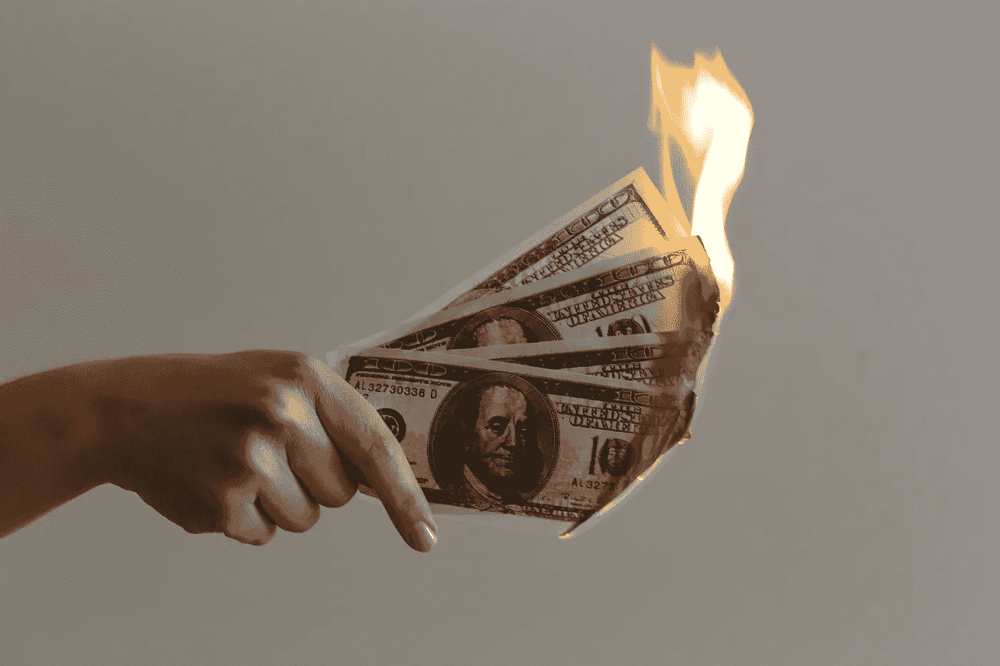
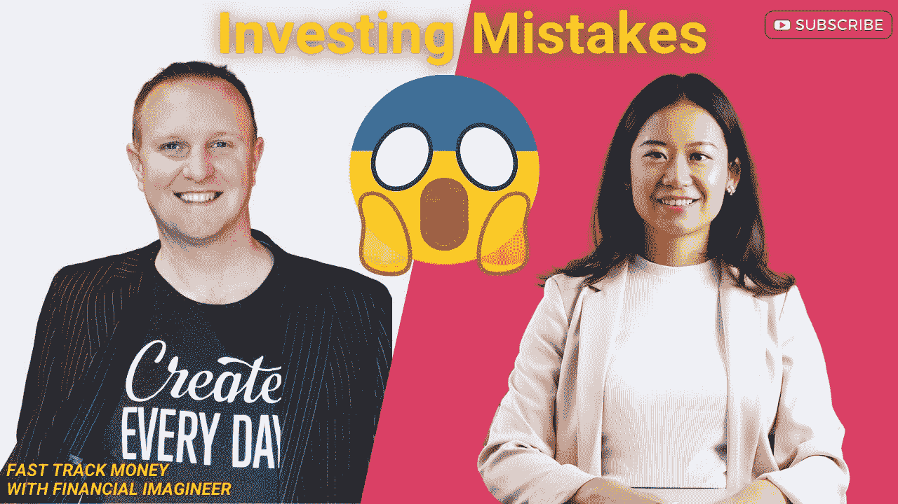

# 开始投资时，避免 3 个最常见的错误

> 原文：<https://medium.datadriveninvestor.com/avoid-the-3-most-common-mistakes-when-you-get-started-with-investing-bcbd1cc0f192?source=collection_archive---------37----------------------->

## 当我在每周一次的 [YouTube 直播会议](https://www.youtube.com/channel/UCBsP7Wru_gVXXSAuAgtt8dQ)上与[金融幻想家](https://www.financial-imagineer.com/)交谈时，我们讨论了投资中常见的错误。然而，它们听起来像是常识，但是每天都有成千上万的人一遍又一遍地犯同样的错误。

Photo by [Jp Valery](https://unsplash.com/@jpvalery?utm_source=unsplash&utm_medium=referral&utm_content=creditCopyText) on [Unsplash](https://unsplash.com/s/photos/money?utm_source=unsplash&utm_medium=referral&utm_content=creditCopyText)

你可能会通读这篇文章，并同意其中的观点，但当涉及到现实生活中的亲身投资时，许多人都无法避免。让我们一个接一个地看看，你现在正在犯那些错误吗？或者你过去犯过那些错误吗？

**Link to video:** [**https://youtu.be/Plt2a7VWRNg**](https://youtu.be/Plt2a7VWRNg)

# 错误 **1:没有计划**

问问自己为什么投资？你的目标是什么？你的投资策略是什么？你的投资范围是什么？你投资是为了好玩还是为了财富增值？

如果你没有一个清晰的计划，很可能你会有不同的投资策略，尽管你并没有意识到这一点。很多人都是从选股开始的。这是最常见的错误，因为我们都知道 90%的基金经理的表现并不比 et 指数好。如果你不是专业交易者或金融专业人士，你怎么能战胜市场？也许你很幸运，但幸运并不意味着你很聪明，下次你也会做得很好。

在开始投资和投入所有资金之前，想想你的投资目标是什么。你想什么时候实现你的投资目标？你的风险偏好是什么？你能容忍多大的波动？你已经有应急基金了吗？你知道你每个月打算投资多少吗？你的投资策略是什么？

一旦你回答了以上问题，那么你就知道什么样的投资产品适合你，你的投资策略是什么，那么你就可以建立投资组合了。对大多数人来说，使用[美元成本平均法](https://www.fasttrack.life/blog/how-can-dollar-cost-averaging-help-you-build-wealth-in-volatile-money-market)长期投资多样化的 ETF 是最好的选择。尽管有些人可能会在投资组合中增加一些行业或市场特定的 ETF 或优先股。

# 错误 2:没有很好地管理流动性

它的意思是，当你把所有的钱都投入到一项投资中时，你就限制了自己获得其他机会，并使自己面临高风险。如果你把所有的钱都投在一项投资或资产上，当这项投资表现不佳时，你可能会遭受财务损失。

一个例子是你所有的钱都买了同行业的股票。当行业经历重组阶段时，股票表现不佳。当你需要钱来支付医疗费或修理费等意想不到的事情时，那么你就不得不低价卖出你的股票。

总会有一些意想不到的事情发生，我们需要钱来应对，为这些意外做好准备，管理好你的流动性，这样你就不必在这些情况下出售投资。事实上，拥有应急基金是开始投资前的第一步。

# 错误三:买“太多的房子”

“买太多房子”是什么意思？这意味着当一个人购买一处房产时，他或她购买了他或她所能承受的最大价值，从银行获得了他或她所能获得的最大贷款。接下来会发生什么。所有的储蓄都用于抵押贷款，只有很少一部分或根本没有剩下来用于其他投资。

正如马蒂亚斯在视频中提到的，人们通常会去银行问“我能借多少钱？”总的来说，我们想在房子上花很多钱，我们愿意尽我们所能买一个漂亮的大房子。但是我们不需要。我们可以在预算之内买一栋房子，但仍然可以住得很好，然后将储蓄中的多余现金投入到其他投资中。它不仅使资产持有多样化，还能产生更多的回报。

例如，如果你能买得起 50 万美元的房子。但是你可以用你所有的存款付首付，然后每个月你都要用你的存款来偿还抵押贷款。到最后，你就没有别的东西可以投资了。而你所有的风险都集中在房产上。当房地产市场下跌时，你的房子的价值会下降，但你仍然要支付同样的抵押贷款。

或者，你可以买一个 35 万美元或 40 万美元的房子，如果它仍然符合你的最低标准。你可以用额外的现金投资股票市场，从长远来看，这可以产生良好的回报。在过去的 10 年里，S&P500 交易所交易基金的平均回报率为 13.6%。一个物业会产生这样的转折吗？可能在很多市场都没有。

# 2 种学习方式

学习有两种方法

1.  通过自己犯错，或者
2.  通过从别人的错误中学习

你决定你想走哪条路。而说到投资，犯错的后果只有一个——血汗钱打水漂。

所以我们希望你喜欢这个快速赚钱的课程，并避免视频中提到的所有错误。[订阅 YouTube 频道](https://www.youtube.com/channel/UCBsP7Wru_gVXXSAuAgtt8dQ)获取更多视频或关注我们

金融幻想家:[https://www.financial-imagineer.com/](https://www.financial-imagineer.com/)

快速通道:【https://www.fasttrack.life/ 

**相关文章:**

[**美元成本平均法如何帮助你在动荡的货币市场中积累财富**](https://www.fasttrack.life/blog/how-can-dollar-cost-averaging-help-you-build-wealth-in-volatile-money-market)

[**逐步指导决定在瑞士买还是租**](https://www.fasttrack.life/blog/step-by-step-guide-to-decide-buy-or-rent-in-switzerland)

[**5 本最好的书帮助我理解投资并建立投资组合**](https://www.fasttrack.life/blog/vc4n1cqp2re810u1knjfw12ll2eoww)