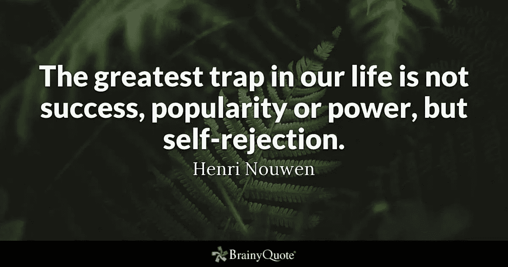
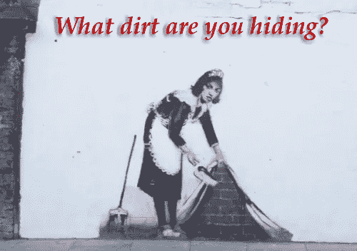

# 避免困难的对话意味着自我拒绝:不要结束自己！

> 原文：<https://medium.datadriveninvestor.com/avoiding-difficult-conversations-means-self-rejection-dont-end-yourself-3609ddf46bd7?source=collection_archive---------16----------------------->

如果你的沉默让你们的关系运转良好，你很可能生活在谎言中。

看看你的人际关系(家庭、生意)并观察它们。

有多少次**没有**传达**对你来说很重要**的事情，仅仅是因为你**害怕**你可能会惹恼别人？

有多少次你**仅仅因为害怕**冲突**而让**退出**艰难的对话**？

问问你自己。你可能数不了一百万次！

这样做你可能会感觉更好，并且因为你们的谈话没有以打碎玻璃、窗户或挥舞拳头而结束而感到宽慰，但是过了一会儿，一些事情开始让你感到困扰，对吗？

这个**内心智慧**你**应该对**说些什么或者**应该有不同的反应**。

起初，它可能不那么明显，但慢慢地，你肯定会认识到一个模式:

## **拒绝自己而不是拒绝别人的模式！**

我们害怕拒绝他人，因为这可能会带来后果。但是避免这样做意味着一件简单而可怕的事情:

拒绝自己！

这些情况很常见:

1.  那个**自恋的伴侣**一直**虐待**你，但你还是原谅了他。
2.  那个**同事**谁在**占你的便宜**，而你仍然对此只字不提。
3.  你的**商业伙伴**，他**从不询问**你的意见，一切都是他自己决定，而你仍然跟着他。
4.  你永远不会**成为**的父母**足够好和成功**，但你仍然**寻求认可和确认**。****

** [## 良好的生活是习惯的形成|数据驱动的投资者

### 过度思考是过度紧张。仅仅几个简单的习惯就会在一天中产生巨大的影响。那是…

www.datadriveninvestor.com](https://www.datadriveninvestor.com/2020/01/17/a-good-life-is-habit-forming/)** 

**我们避免与我们交往最多的人进行艰难的对话，因为我们…**

*   **害怕我们自己的想法和感受**
*   **不希望任何人**自我感觉不好。****
*   **恐惧**拒绝和冲突****
*   **被吓到**失去某人****
*   **害怕失去特权(尤其是和父母在一起)**
*   **不想被**心虚****
*   **害怕受到批评**

**我们有如此多的关系，但我们有没有问自己这些关系有多**真实、真实、诚实、真实和深刻**？**

**在人际交往中，与你所爱的人、与你一起工作的人或一起做生意的人在话题上有分歧是很正常的。有问题、议题或事情需要讨论是正常的，但有些事情一点也不正常:**

# **这个想法是，我们不谈论的问题，是我们没有的问题；事实正好相反！**

**我们**愚弄**自己！**

***“眼不见，心不烦”在这里并不适用。***

****

**Aspire Business Development**

**这就像**清扫地毯下的灰尘**并让自己相信你打扫了房子。真相是:是**还脏，**你**就是没看见(或者不想看见)。****

**这同样适用于*‘肮脏的’*关系。**不谈**问题不是解决方案，它实际上是问题的**原因。****

## **沉默不会让问题消失，只会加深问题。**

**沉默问题死亡在短期内可能看起来更容易，但从长远来看，它肯定会给每段关系带来死亡之吻。**

## **如何进行艰难的对话？**

**当我面对困难的对话时，我会问自己两个问题:**

1.  **我是不是很喜欢/爱这个人，她(他)应该得到真相？**
2.  **我还想让这个人成为我生活的一部分吗？**

**如果我说*‘是’*，*，*我就**全在**；带着我所有的想法、感觉、焦虑、恐惧等等。**

**如果我说*‘不’*，我**忘了**！**

**一旦你决定对自己和你与某人的关系直言不讳，说出你心里想的和心里想的。其他的都是不诚实的，什么都不会有。**

**避免指责、责备、羞辱、批评或忽视。**

**原因在于**思想和感情是主观的**。你永远不知道是什么触发了某人，为什么他们会感到不安；但无论如何，这不应该让你退出一场艰难的对话。**

**艰难的对话**不应该**是关于寻找*‘罪犯’*；这是关于寻找共同点、联系和同理心。**

**这是在一段关系中成长的机会。**

**尽管我非常喜欢进行艰难的对话，但有些人**不值得你愿意去联系**。如果我觉得自己已经 ***【过度解释】*** 了，而什么都没有改变，那就顺其自然吧。**

## **如果你不敢进行艰难的对话会怎么样？**

*   **你总是会对一些无法说出名字的事情感到“困扰”。**
*   **你会开始撒谎。**
*   **你会嫉妒和沮丧**
*   **你会感到内疚，为自己难过，被拒绝，陷入困境**

**最终，随着时间的推移，你积累了消极和遗憾的想法和感觉，这转化成了悲惨的生活！**

## ****最终想法:****

**请注意，如果有人因为你的**主观真相**而感到不安、不舒服或受到攻击，这个人**就不应该再出现在你的生活**中了！**

**如果你对你的需求、欲望或要求的主观解释立即引发了一场争论，你应该质疑这段关系，而不仅仅是你自己。通过提问，我的意思是:**创造界限**！**

# **自我排斥就是自杀！不要让别人轻易找到‘gui̇lty'！**

**感谢阅读:)**

## **访问专家视图— [订阅 DDI 英特尔](https://datadriveninvestor.com/ddi-intel)**