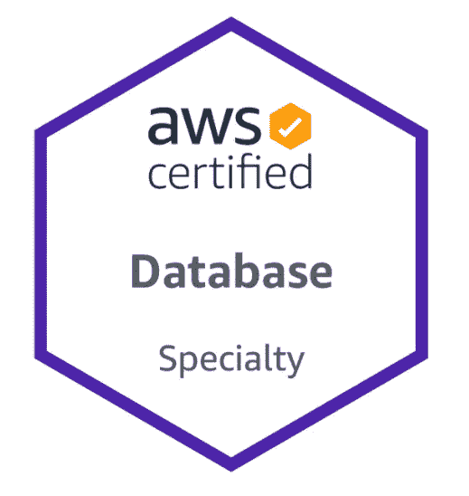

# AWS 认证数据库专业(DBS-C01)考试

> 原文：<https://medium.datadriveninvestor.com/aws-certified-database-specialty-exam-6e81096048f4?source=collection_archive---------1----------------------->

*我破解 AWS 认证数据库—专业(DBS-C01)考试的进度计划。我计划在 3 天内学习 15 个小时。(我将在 2020 年 9 月参加考试)*

更新于 2020 年 9 月 16 日:

我成功地参加了 DB 专业考试。

这是我收集的 AWS 认证数据库专业考试的学习资料。我已经从其他作者那里收集了这些，也补充了一些以备不时之需。

# 别人是怎么发现考试的？

> 考题**主要集中在** **RDS 和 RDS 极光**。 **DynamoDB 和 AWS 数据库迁移服务是试题来源的次要主题**。有几个关于红移和海王星的问题。有些问题提供了 AWS ElasticSearch 和 AWS ElastiCache 作为可选答案，但没有详细讨论这些主题。在数据库产品之上，重点放在 AWS CloudFormation 和 AWS KMS 上。

# 我是如何准备的——我学习 15 个小时的计划

1.  官方考试指南— [下载](https://d1.awsstatic.com/training-and-certification/docs-database-specialty/AWS-Certified-Database-Specialty_Exam-Guide.pdf)
2.  测试官方数据库样题[此处](https://d1.awsstatic.com/training-and-certification/docs-database-specialty/AWS-Certified-Database-Specialty_Sample-Questions.pdf)
3.  AWS 数据库产品—持续 5 小时，免费[此处](https://www.aws.training/Details/Curriculum?id=38111)
4.  官方考试准备指南— 3.5 小时— [此处](https://www.aws.training/Details/eLearning?id=47245)
5.  [数据库迁移简介](https://www.aws.training/Details/eLearning?id=43988) — 45 分钟
6.  [PostgreSQL 基础知识](https://www.aws.training/Details/eLearning?id=32439) — 20 分钟
7.  PostgreSQL 基础:架构 — 60 分钟
8.  [PostgreSQL 基础:SQL 命令行](https://www.aws.training/Details/eLearning?id=43293) — 15 分钟
9.  [PostgreSQL 基础:SQL 解释](https://www.aws.training/Details/eLearning?id=43291) — 30 分钟
10.  YouTube 播放列表我看了几个视频——分组会议([播放列表此处](https://www.youtube.com/playlist?list=PLAFY3hrExHFF41lebKtdosE46j0tGvTAL))
11.  **白皮书** —在少于 120 分钟的时间里，快速浏览 5-10 分钟

[将运行关系数据库的应用程序迁移到 AWS](https://d1.awsstatic.com/whitepapers/Migration/migrating-applications-to-aws.pdf?did=wp_card&trk=wp_card) || [现代化亚马逊数据库基础设施](https://d1.awsstatic.com/whitepapers/modernizing-amazon-database-infrastructure.pdf?did=wp_card&trk=wp_card) || [将 Oracle 数据库迁移到 AWS 的策略](https://d1.awsstatic.com/whitepapers/strategies-for-migrating-oracle-database-to-aws.pdf?did=wp_card&trk=wp_card) || [AWS 数据库迁移服务最佳实践](https://d1.awsstatic.com/whitepapers/RDS/AWS_Database_Migration_Service_Best_Practices.pdf?did=wp_card&trk=wp_card)|[关系数据库迁移策略](https://docs.aws.amazon.com/prescriptive-guidance/latest/database-migration-strategy/welcome.html) |

12.**常见问题解答**

[**亚马逊极光**](https://aws.amazon.com/rds/aurora/faqs/)**| |**|[**亚马逊 DynamoDB**](https://aws.amazon.com/dynamodb/faqs/)**|**|[亚马逊 elastic cache](https://aws.amazon.com/elasticache/faqs/)|[亚马逊关系数据库服务(RDS)](https://aws.amazon.com/rds/faqs/)|[亚马逊红移](https://aws.amazon.com/redshift/faqs/) | **|** [**亚马逊数据库迁移服务**](https://aws.amazon.com/dms/faqs/)

13.文档的几个链接——我还没有机会浏览(摘自网络博客上的一个随机帖子)

1.1 **为特定类型的数据和工作负载选择合适的数据库服务**。https://pages.awscloud.com/purpose-built-databases-ebook
T3T5[https://www.youtube.com/watch?v=HaEPXoXVf2k&t = 1s](https://www.youtube.com/watch?v=HaEPXoXVf2k&t=1s)

1.2 确定灾难恢复和高可用性的**策略**
[https://AWS . Amazon . com/blogs/database/implementing-a-disaster-recovery-strategy-with-Amazon-rds/](https://aws.amazon.com/blogs/database/implementing-a-disaster-recovery-strategy-with-amazon-rds/)
[https://AWS . Amazon . com/blogs/database/how-to-use-Amazon-dynamo db-global-tables-to-power-multi region-architectures/](https://aws.amazon.com/blogs/database/how-to-use-amazon-dynamodb-global-tables-to-power-multiregion-architectures/) [https://aws.amazon.com/dynamodb/global-tables/](https://aws.amazon.com/dynamodb/global-tables/)

1.3 **针对性能、合规性和可扩展性设计数据库解决方案**。

**性能:**
[https://AWS . Amazon . com/blogs/database/best-storage-practices-for-running-production-workloads-on-hosted-databases-with-Amazon-rds-or-Amazon-ec2/](https://aws.amazon.com/blogs/database/best-storage-practices-for-running-production-workloads-on-hosted-databases-with-amazon-rds-or-amazon-ec2/)
[https://AWS . Amazon . com/blogs/database/boosting-application-Performance-and-redis/](https://aws.amazon.com/blogs/database/boosting-application-performance-and-reducing-costs-with-amazon-elasticache-for-redis/)
[https://AWS . Amazon . com/https](https://aws.amazon.com/blogs/database/caching-for-performance-with-amazon-documentdb-and-amazon-elasticache/)

 [## 面向企业转型的 AWS:顶级云架构师的秘密|数据驱动型投资者

### “您使用云实现企业转型的方法是什么？”是人们一直问我的问题，自从我…

www.datadriveninvestor.comm](https://www.datadriveninvestor.com/2020/07/15/aws-for-enterprise-transformation-secrets-of-top-cloud-architects/) 

**合规:**
[https://AWS . Amazon . com/blogs/database/applying-best-practices-for-securing-sensitive-data-in-Amazon-rds/](https://aws.amazon.com/blogs/database/applying-best-practices-for-securing-sensitive-data-in-amazon-rds/)
[https://AWS . Amazon . com/blogs/database/best-practices-for-securing-sensitive-data-in-AWS-data-stores/](https://aws.amazon.com/blogs/database/best-practices-for-securing-sensitive-data-in-aws-data-stores/)
[https://AWS . Amazon . com/blogs/database/securing-data-in-Amazon-rds-using-using](https://aws.amazon.com/blogs/database/securing-data-in-amazon-rds-using-aws-kms-encryption/)

**可扩展性:**
[https://AWS . Amazon . com/blogs/database/Autodesk-builds-on-Amazon-aurora/](https://aws.amazon.com/blogs/database/autodesk-builds-on-amazon-aurora/)
[https://AWS . Amazon . com/blogs/database/sharding-with-Amazon-relational-database-service/](https://aws.amazon.com/blogs/database/sharding-with-amazon-relational-database-service/)
[https://AWS . Amazon . com/blogs/database/scaling-your-Amazon-rds-instance-vertically-and-horizontally/](https://aws.amazon.com/blogs/database/scaling-your-amazon-rds-instance-vertically-and-horizontally/)【T25

**费用:**
[https://AWS . Amazon . com/blogs/database/reduce-database-cost-and-improve-avail ability-when-you-migrate-to-the-AWS-cloud/](https://aws.amazon.com/blogs/database/reduce-database-cost-and-improve-availability-when-you-migrate-to-the-aws-cloud/)
[https://AWS . Amazon . com/blogs/database/reducing-aurora-PostgreSQL-storage-I-o-Costs/](https://aws.amazon.com/blogs/database/reducing-aurora-postgresql-storage-i-o-costs/)
[https://AWS . Amazon . com/blogs/database/using-cost-management](https://aws.amazon.com/blogs/database/using-aws-cost-management-products-to-help-save-costs-on-amazon-rds-reserved-instances/)

2.1 **自动化数据库解决方案部署**。
[https://AWS . Amazon . com/blogs/database/part-1-role-of-the-DBA-when-moveing-to-Amazon-rds-respons/](https://aws.amazon.com/blogs/database/part-1-role-of-the-dba-when-moving-to-amazon-rds-responsibilities/)
[https://AWS . Amazon . com/blogs/database/automating-table-mappings-creation-in-AWS-DMS/](https://aws.amazon.com/blogs/database/automating-table-mappings-creation-in-aws-dms/)
[https://AWS . Amazon . com/blogs/database/create-AWS-cloud formation-templates-for-AWS](https://aws.amazon.com/blogs/database/create-aws-cloudformation-templates-for-aws-dms-tasks-using-microsoft-excel/)

2.2 **确定数据准备和迁移策略**。

2.3 **执行并验证数据迁移**。
[https://aws.amazon.com/dms/resources/?nc=sn&loc = 5](https://aws.amazon.com/dms/resources/?nc=sn&loc=5)
[https://docs . AWS . Amazon . com/DMS/latest/user guide/welcome . html](https://docs.aws.amazon.com/dms/latest/userguide/Welcome.html)
[https://AWS . Amazon . com/blogs/database/validating-database-objects-after-migration-using-AWS-SCT-and-AWS-DMS/](https://aws.amazon.com/blogs/database/validating-database-objects-after-migration-using-aws-sct-and-aws-dms/)

3.1 确定维修任务和流程。
[https://AWS . Amazon . com/premium support/knowledge-center/rds-common-DBA-tasks/](https://aws.amazon.com/premiumsupport/knowledge-center/rds-common-dba-tasks/)

3.2 确定备份和恢复策略。
[https://docs . AWS . Amazon . com/Amazon rds/latest/USER guide/USER _ working with automatedbackups . html #概述。BackupDeviceRestrictions](https://docs.aws.amazon.com/AmazonRDS/latest/UserGuide/USER_WorkingWithAutomatedBackups.html#Overview.BackupDeviceRestrictions)
[https://docs . AWS . Amazon . com/Amazon rds/latest/user guide/CHAP _ common tasks。BackupRestore.html](https://docs.aws.amazon.com/AmazonRDS/latest/UserGuide/CHAP_CommonTasks.BackupRestore.html)
[https://docs . AWS . Amazon . com/Amazon dynamodb/latest/developer guide/backup restore . html](https://docs.aws.amazon.com/amazondynamodb/latest/developerguide/BackupRestore.html)
[https://docs . AWS . Amazon . com/Amazon dynamodb/latest/developer guide/pointintimerecovery . html](https://docs.aws.amazon.com/amazondynamodb/latest/developerguide/PointInTimeRecovery.html)

4.1 确定监控和警报策略。
[https://docs . AWS . Amazon . com/en _ PV/Amazon rds/latest/USER guide/CHAP _ Monitoring . html](https://docs.aws.amazon.com/en_pv/AmazonRDS/latest/UserGuide/CHAP_Monitoring.html)
[https://docs . AWS . Amazon . com/Amazon rds/latest/USER guide/USER _ Monitoring。OS.html](https://docs.aws.amazon.com/AmazonRDS/latest/UserGuide/USER_Monitoring.OS.html)
[https://docs . AWS . Amazon . com/Amazon rds/latest/USER guide/USER _ events . html](https://docs.aws.amazon.com/AmazonRDS/latest/UserGuide/USER_Events.html)
https://docs . AWS . Amazon . com/Amazon rds/latest/USER guide/USER _ log access . html

4.2 排查和解决常见的数据库问题。
[https://docs . AWS . Amazon . com/en _ PV/Amazon rds/latest/user guide/CHAP _ trouble shooting . html](https://docs.aws.amazon.com/en_pv/AmazonRDS/latest/UserGuide/CHAP_Troubleshooting.html)
[https://docs . AWS . Amazon . com/redshift/latest/DG/queries-trouble shooting . html](https://docs.aws.amazon.com/redshift/latest/dg/queries-troubleshooting.html) [https://docs . AWS . Amazon . com/redshift/latest/mgmt/trouble shooting-connections . html](https://docs.aws.amazon.com/redshift/latest/mgmt/troubleshooting-connections.html)
[https://docs . AWS . Amazon . comErrors.html](https://docs.aws.amazon.com/redshift/latest/dg/t_Troubleshooting_load_errors.html)
[https://docs . AWS . Amazon . com/dynamo db-encryption-client/latest/dev guide/trouble shooting . html](https://docs.aws.amazon.com/dynamodb-encryption-client/latest/devguide/troubleshooting.html)
[https://docs . AWS . Amazon . com/elastic search-service/latest/developer guide/AES-handling-errors . html](https://docs.aws.amazon.com/elasticsearch-service/latest/developerguide/aes-handling-errors.html)

4.3 优化数据库性能。
[https://AWS . Amazon . com/blogs/database/best-storage-practices-for-running-production-workloads-on-hosted-databases-with-Amazon-rds-or-Amazon-ec2/](https://aws.amazon.com/blogs/database/best-storage-practices-for-running-production-workloads-on-hosted-databases-with-amazon-rds-or-amazon-ec2/)
[https://AWS . Amazon . com/blogs/database/boosting-application-performance-and-redis-with-Amazon-elastic cache-for-redis/](https://aws.amazon.com/blogs/database/boosting-application-performance-and-reducing-costs-with-amazon-elasticache-for-redis/)
[https://AWS . Amazon . com/blogs](https://aws.amazon.com/blogs/database/caching-for-performance-with-amazon-documentdb-and-amazon-elasticache/) [https://AWS . Amazon . com/blogs/database/securing-data-in-Amazon-rds-using-AWS-kms-encryption/](https://aws.amazon.com/blogs/database/securing-data-in-amazon-rds-using-aws-kms-encryption/)
[https://docs . AWS . Amazon . com/en _ PV/Amazon rds/latest/USER guide/USER _ share snapshot . html](https://docs.aws.amazon.com/en_pv/AmazonRDS/latest/UserGuide/USER_ShareSnapshot.html)

5.2 评估审计解决方案。
[https://AWS . Amazon . com/blogs/database/how-to-automate-the-audit-of-operational-best-practices-for-your-AWS-account/](https://aws.amazon.com/blogs/database/how-to-automate-the-audit-of-operational-best-practices-for-your-aws-account/)
[https://AWS . Amazon . com/blogs/database/audit-Amazon-aurora-database-logs-for-connections-query-patterns-and-more-using-Amazon-Athena-and-quick sight/](https://aws.amazon.com/blogs/database/audit-amazon-aurora-database-logs-for-connections-query-patterns-and-more-using-amazon-athena-and-amazon-quicksight/)
[https://AWS . Amazon . com/blogs/database/database/database](https://aws.amazon.com/blogs/database/auditing-an-amazon-aurora-cluster/)

5.3 确定访问控制和认证机制。
[https://docs . AWS . Amazon . com/Amazon rds/latest/user guide/UsingWithRDS。IAMDBAuth.html](https://docs.aws.amazon.com/AmazonRDS/latest/UserGuide/UsingWithRDS.IAMDBAuth.html)

> Satyen Kumar 分享

 [## Satyen Kumar - KU 比利时鲁汶布鲁塞尔-布鲁塞尔地区，比利时布鲁塞尔地区| LinkedIn

### ✓ 𝙍𝙚𝙫𝙤𝙡𝙪𝙩𝙞𝙤𝙣𝙞𝙯𝙚 𝙩𝙝𝙚 𝙁𝙪𝙩𝙪𝙧𝙚 𝙊𝙥𝙚𝙧𝙖𝙩𝙞𝙣𝙜 𝙈𝙤𝙙𝙚𝙡 𝙤𝙣 ☁ ● 𝗞𝗲𝘆 𝗰𝗼𝗺𝗽𝗲𝘁𝗲𝗻𝗰𝗶𝗲𝘀…

www.linkedin.com/in/sayten](https://www.linkedin.com/in/sayten/) 

我祝愿你的职业生涯和成功的 AWS 之旅。

[你可以在这个链接上找到我的认证清单](https://medium.com/@satyenkumar/it-cloud-certification-is-greed-the-1-of-the-7-deadly-sins-f50366643138?source=friends_link&sk=6a6816734ca57831b9119e5254885ec5)

 [## 我的云认证日记:贪婪是七宗罪之首吗？

### 我花了 25 年时间来制作这个页面的内容。这是为了得到统治世界的 C.L.O.U.D。共享…

medium.com](https://medium.com/@satyenkumar/it-cloud-certification-is-greed-the-1-of-the-7-deadly-sins-f50366643138) 

# 不要忘记给予👏

**访问专家视图—** [**订阅 DDI 英特尔**](https://datadriveninvestor.com/ddi-intel)