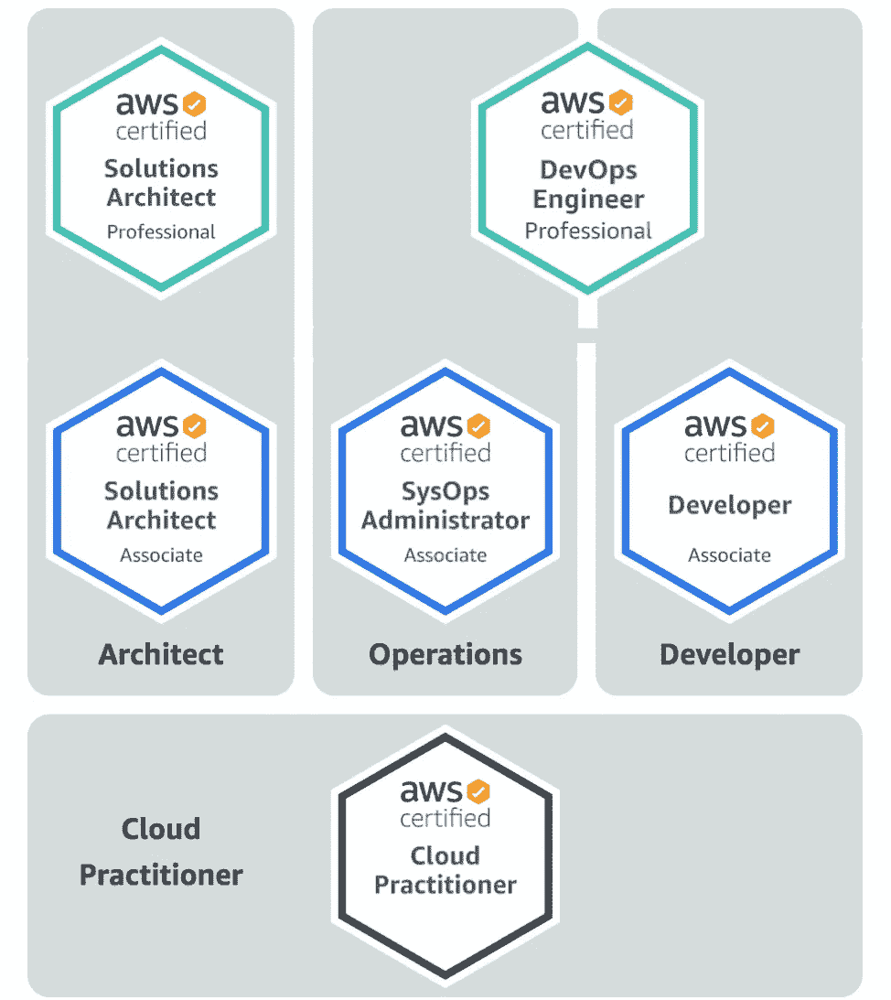
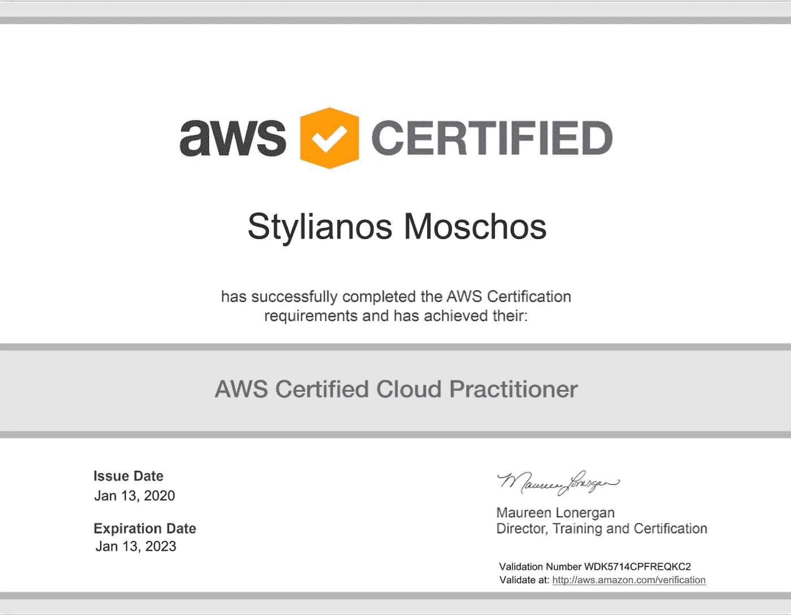

# AWS 云实践者已完成—下一步是什么？

> 原文：<https://medium.datadriveninvestor.com/aws-cloud-practitioner-completed-whats-next-80f6f452f586?source=collection_archive---------1----------------------->

在这篇文章中，我谈论了我对 AWS 云从业者证书考试的准备以及迈向 AWS DevOps 专业证书的下一步措施。

我的云之旅始于 2016 年 9 月，当时我加入了一家媒体公司，担任后端开发人员。这是我第一次接触云，更确切地说是第一次接触 AWS。我很快对基础设施是如何创建、配置和维护的魔法产生了兴趣。不再需要关注服务器机房、可能的电源波动以及升级内存和 CPU 的需求——手动升级，需要前往服务器机架并进行必要的硬件更换。

Photo by [Science in HD](https://unsplash.com/@scienceinhd?utm_source=medium&utm_medium=referral) on [Unsplash](https://unsplash.com?utm_source=medium&utm_medium=referral)

三年后，如果我在 AWS 服务方面的知识和经验达到合格水平，我决定获得认证。通过这种方式，我希望能够向未来的雇主证明我的技能，并为成为一名广泛掌握该主题的 DevOps 工程师奠定基础。因此，我要做的第一件事就是注册一个 cloud.guru，在那里我开始为 AWS 的第一次考试—**AWS 云从业者学习。**

The AWS Cloud Practitioner is the first level of AWS certificates

> AWS 认证云从业者考试面向具备有效展示对 AWS 云的整体理解所需的知识和技能的个人，独立于其他 AWS 认证所涉及的特定技术角色。考试可以在考试中心进行，也可以在舒适方便的家里或办公室进行，作为在线监考。—[https://AWS . Amazon . com/certification/certified-cloud-practitor/](https://aws.amazon.com/certification/certified-cloud-practitioner/)

在找工作期间，学习过程变得困难，因为它产生了压力。结果是考试准备被“搁置”,直到求职结束。

2019 年 11 月加入 Reply，担任高级顾问。虽然适应新的工作是主要的焦点，但我设法找到一些时间，重新开始准备。

2019 年 12 月，我预定了 1 月 10 日的 **AWS 云从业者**考试。在预订期间，我感到非常兴奋，并在第一次考试后的两周内另外预订了[**AWS 解决方案架构师助理**](https://aws.amazon.com/certification/certified-solutions-architect-associate/) 考试，你可以称之为“冲动购买”，或兴奋购买:)

2020 年 1 月，考试前一周，我想推迟考试，因此我把考试时间改到了 1 月 13 日。主要原因是 prep 测试的糟糕结果，以及 AWS 在 11 月早些时候的 AWS re:Invent 会议上发布的服务。我有一种感觉，我会被要求提供这些新服务，从我后来看到的情况来看，我是对的。

下一个？我在英国的克劳利参加了考试…

Photo by [krakenimages](https://unsplash.com/@krakenimages?utm_source=medium&utm_medium=referral) on [Unsplash](https://unsplash.com?utm_source=medium&utm_medium=referral)

**我通过了！—你可以在我的 LinkedIn 帖子中看到这种兴奋。**

 [## 领英上的 stelios Moschos:AWS 认证云从业者

### 很高兴分享我参加并通过了 AWS 认证云从业者考试，这是今年的良好开端，也是一个良好的…

www.linkedin.com](https://www.linkedin.com/feed/update/urn:li:activity:6622869895401078784/) 

现在让我们变得更现实一点。788/1000 的分数——仅比极限值高 88 分，表明需要更多的准备，更具体地说，需要更有组织的方法。

我想为下一个证书(即 AWS 解决方案架构师考试)更改什么。

*   **有组织的准备**——研究相关视频，详细记录内容。第二次和第三次审查应能更好地把握和填补可能的空白。
*   **阅读他人的经历**——首先，从激励的角度来看，看到其他人走在同一条路上会有所帮助。其次，其他考生会解释他们是如何准备的，还会给你指出一些窍门，除非你参加考试。
*   同事的进一步激励 —同事、朋友和关注者社交媒体，如 Twitter、LinkedIn，非常有用，尤其是当他们喜欢、评论、鼓掌、祝贺和讨论你的尝试时。
*   集中精力准备考试——休息一两天也很有用。最后两天加速会让引擎变暖，让考试变得轻松。
*   **记住 goa**l——通常目标与“只是获得证书”不同。提高技能、吸引潜在雇主、要求晋升、成为 AWS 云工程师是更有意义的一些可能的高层次目标。我个人的目标是成为一名拥有公认 AWS 技能的 DevOps 工程师，以扩展我的知识并教授其他人。

**接下来是什么？**我目前正在准备 AWS 解决方案架构师助理考试，因为我没有机会在“第一次考试两周后”参加考试(我最初是这么说的)。新的日期是 29/11/20，将会在网上公布。目前我正在学习身份和访问管理(I am)的基础和高级课题。有大量的工作要做，但是在这个位置上写这些东西给了我一直在寻找的动力。通往 AWS DevOps 专业考试的道路是漫长的，但我很高兴我一年前就开始了。

Photo by [30daysreplay Marketingberatung](https://unsplash.com/@30daysreplay?utm_source=medium&utm_medium=referral) on [Unsplash](https://unsplash.com?utm_source=medium&utm_medium=referral)

如果你喜欢读这篇文章，并希望我写任何其他相关的话题，请在评论中告诉我，或者直接给我发电子邮件。**还有，别忘了鼓掌:)**

我是[网回复](https://www.reply.com/net-reply-uk/en/HomePage)未来网络团队的高级顾问。我们的团队由专注于电信和技术概念(如软件定义网络(SDN)和网络功能虚拟化(NFV))的顾问、软件开发人员和技术爱好者组成。我们的使命是利用软件艺术和最新技术趋势构建下一代网络。如果你想了解更多关于这些的信息，请通过 s.moschos@reply.com[联系我。](mailto:s.moschos@reply.com)或者，您可以在 [LinkedIn](https://www.linkedin.com/company/net-reply-uk/) 和 [Twitter](https://twitter.com/NetReplyUK) 上了解我们的更多信息。