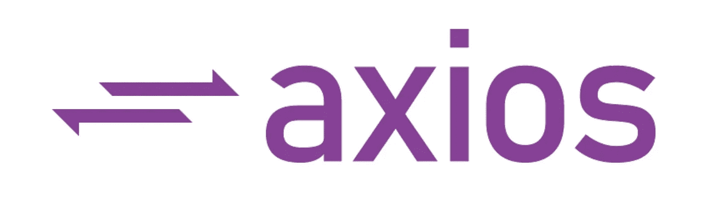
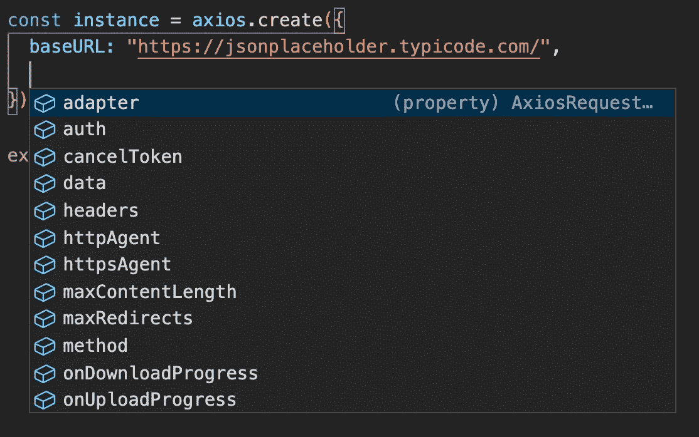
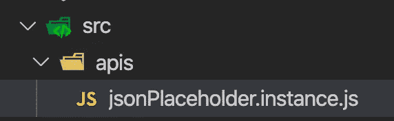
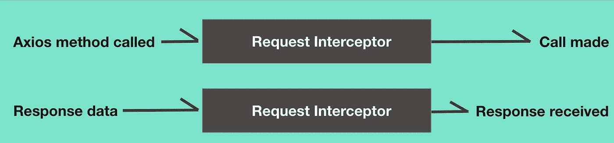

# Axios 实例和拦截器

> 原文：<https://medium.datadriveninvestor.com/axios-instance-interceptors-682868f0de2d?source=collection_archive---------0----------------------->



Api 调用从未如此简单

我有机会重构我团队的旧代码。当我浏览它时，我发现 api 调用部分没有模块化。他们使用过 Axios，但没有充分利用它的功能。

我必须重构的主要需求是:

*   为多个端点创建实例，我们使用了。
*   为需要授权的实例设置令牌。
*   在进行 http 调用之前，对报头进行多重验证。

> ***那么什么是 AXIOS***

Axios 基本上是一个外部库，用于进行基于 promise 的 HTTP 调用(使获取变得容易，并为我们提供结构化的响应)。它是推荐的库之一，与 ReactJs 一起使用。人们没有真正意识到的是，它不仅仅是发出一个 get/post 请求。

```
npm i --s axios
```

让我们来看一个基本实现:

```
import axios from 'axios';axios.get('[https://jsonplaceholder.typicode.com/todos](https://jsonplaceholder.typicode.com/todos)').then(func)
```

* *注意:我将为我的虚拟 api 调用使用****jsonplaceholder****。*

> *创建实例*

如果我们对同一个端点进行多次 api 调用会怎么样呢？必须添加完整的 url 似乎不太合适，而且如果后来端点被更改，这些更改看起来需要太多的手工修改。

[](https://www.datadriveninvestor.com/2020/02/19/five-data-science-and-machine-learning-trends-that-will-define-job-prospects-in-2020/) [## 将定义 2020 年就业前景的五大数据科学和机器学习趋势|数据驱动…

### 数据科学和 ML 是 2019 年最受关注的趋势之一，毫无疑问，它们将继续发展…

www.datadriveninvestor.com](https://www.datadriveninvestor.com/2020/02/19/five-data-science-and-machine-learning-trends-that-will-define-job-prospects-in-2020/) 

让我们通过使用 **create** 方法来创建我们的实例，这是您在上面做的 axios 导入的一部分。

```
const instance = axios.create()
```

让我们将端点设置为上述实例的 baseurl。

```
const instance = axios.create({baseURL:"[https://jsonplaceholder.typicode.com/](https://jsonplaceholder.typicode.com/todos)"})
```

*对于给定的 axios 实例，可以设置更多的选项，baseURL 和 headers 是最常见的，试着在评论中分享你的配置*



企业应用程序通常有多个端点，创建多个实例来为每个端点创建单个源更容易。

*对于命名约定，我使用 endpointName.instatnce.js。这是我个人使用的，自从我开始使用 React 以来。*



这样，第一个要求就完成了。

> 在标头中设置身份验证令牌

所以这比看起来要简单一点，我们只需要更新上面的实例来设置这个令牌一次。

```
export const setAuthToken = token => {
 if (token) {
 //applying token
 instance.defaults.headers.common['Authorization'] = token;
 } else {
 //deleting the token from header
 delete instance.defaults.headers.common['Authorization'];
 }
}
```

因此，当我们得到令牌时，我们只需调用方法，令牌就会添加到头部。对于我们使用实例对端点进行的每个调用，都会添加 auth 令牌。

但是如果我们仍然想在调用之前验证它，那么拦截器就派上用场了。

> Axios 拦截器

那么什么是拦截器，为什么我们应该使用它们？

拦截器是在 main 方法之前被触发的方法。拦截器有两种类型:

*   **请求拦截器**:这是在实际调用端点之前调用的。
*   **响应拦截器**:在承诺完成，数据被 then 回调接收之前调用。

可以把拦截器看作是请求/响应和实际承诺之间的隧道。



Interceptor tunnel

所以这是第三个要求的一部分。我们将更新上面的例子，然后检查最终的输出。

```
instance.interceptors.request.use(req => {
  if (axios.defaults.headers.common["Authorization"]) return req;
  throw ({message:"the token is not available"});
 },error=>{
  return Promise.reject(error);
 }
);
```

让我们添加一个响应拦截器，看看如何使用它:

```
//on successful response
instance.interceptors.response.use(response=>response,
error=>{
  const fallbackValue = [
    {userId: "Not authorized",id: "aerw15311sq",
     title: "Please try     again",completed: false}];
   return Promise.reject(fallbackValue);}
);
```

如果使用得当，拦截器会非常有用，因为它允许我们甚至在执行 main 方法之前进行检查甚至修改。

*我个人更喜欢使用响应拦截器，而不是请求拦截器。*

我希望这有助于你理解 Axios 的强大，使用它，如果有任何问题，请告诉我。