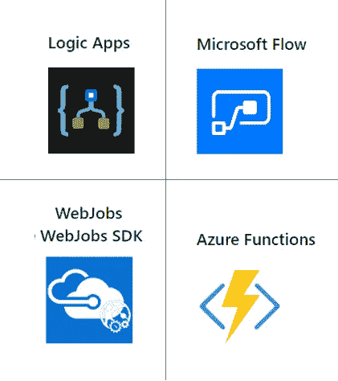
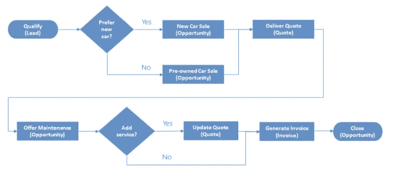

# Azure 技术来构建和实现工作流

> 原文：<https://medium.datadriveninvestor.com/azure-technologies-to-build-and-implement-workflows-1cacf3d104eb?source=collection_archive---------9----------------------->

无服务器应用程序

Azure 平台成为云计算术语的一部分已经超过 10 年了。它支持许多不同的编程语言，并通过微软管理的数据中心提供构建、测试、部署和管理应用程序和服务的服务。

在这篇文章中，我将简要描述 Azure 的四种不同技术，您可以使用它们来构建和实现集成多个系统的工作流(软件中建模的业务流程)。

我们可以将这些技术归类为:

*   **设计优先的方法:** *逻辑应用，微软流程*

在设计优先的方法中，您可以可视化工作流，因此很容易理解业务流程。由于该图不是一个单独的文档，因此当流程改变时，该图不可能不更新。

An example of a workflow diagram for Car Sales Process

*   **代码优先的方法:** *WebJobs，Azure Functions*

在代码优先的方法中，当团队中的开发人员想要将不同的业务应用程序编排和集成到单个工作流中时，他们将编写代码。在这种方法中，您可以更好地控制工作流的性能，并且能够编写自定义代码。

**以上技术的共同点是；他们都**

*   *接受输入*
*   *运行动作*
*   *包含条件*
*   *产生输出*

我们来深挖细节吧！

# **逻辑应用**

Logic Apps 是 Azure 中的一项服务，您可以使用它来自动化、编排和集成分布式应用程序的不同组件。

 [## 幸福的算法？数据驱动的投资者

### 从一开始，我们就认为技术正在使我们的生活变得更好、更快、更容易和更实用。社交媒体…

www.datadriveninvestor.com](https://www.datadriveninvestor.com/2019/03/08/an-algorithm-for-happiness/) 

通过在 Logic Apps 中使用**设计优先的方法**，您可以使用以下方法绘制出模拟复杂业务流程的复杂工作流:

*   **逻辑应用程序设计器用户界面**
*   **Visual Studio 设计师**

> **JSON 符号:**如果您喜欢使用代码，您可以使用代码视图创建或编辑 JSON 符号中的工作流。

## 为什么要使用逻辑应用程序？

*   对于高级集成项目，因为 Logic Apps 非常擅长与 200 多个连接器集成。

> **连接器**是一个逻辑应用程序组件，它提供了一个到外部服务的接口。例如，Twitter 连接器允许您发送和检索推文，而 Office 365 Outlook 连接器允许您管理电子邮件、日历和联系人。

*   对于需要开发技能的任务，可以在 Logic 应用程序中编辑代码。

> 当您需要创建自定义连接器(例如通过 REST API 建立连接)，同时您希望可视化工作流，您应该选择 Logic Apps。这是开发人员的任务！

# **微软流程**

Microsoft Flow 是一项不需要开发或 IT 专业经验的服务。由于它是基于逻辑应用程序构建的，Microsoft Flow 支持与逻辑应用程序相同范围的连接器和操作。

您可以使用**网站**或 **Microsoft Flow 移动应用程序创建工作流程。(仅限 GUI)**

您可以创建四种不同类型的流:

*   **自动化**:由某个事件的触发器启动的流程。
*   **按钮**:单击一次运行重复任务的按钮流。
*   **定期**:定期执行的流程。
*   **业务流程**:对业务流程建模的流程。

如果场景中建议非开发人员应该能够修改业务流程，那么您可以选择 Microsoft Flows。

# WebJobs 和 WebJobs SDK

WebJobs 允许您自动运行程序或脚本。WebJobs 可以连续循环运行(检查共享文件夹中的新照片),也可以在触发时运行。

你可以用几种不同的语言编写代码:PHP、Python、Node.js、Java、C#或 VB.NET。(C#和 Nuget 是 WebJobs SDK 中语言和包的唯一选项)

## 为什么要使用 WebJobs？

> 您有一个现有的 Azure App Service 应用程序，并且想要在应用程序中建模工作流
> 
> 您需要密切控制侦听触发代码的事件的对象。
> 
> 您想要对 Azure 功能不支持的`JobHost`进行特定定制。在 WebJobs 中，您可以更加灵活地修改其行为
> 
> WebJobs 是唯一允许开发者控制重试策略的技术。例如，在 WebJob 中，您可以为外部系统的调用创建一个定制的**重试策略**。这种策略不能在 Azure 函数中配置。

**乔布斯的 CONS:**

> 对于 Web 作业，您需要为托管作业的整个虚拟机或应用服务计划付费。

# Azure 函数

Azure 函数是一种在云中运行小段代码的简单方式，无需担心托管代码所需的基础设施。

你可以用 C#，Java，JavaScript，PowerShell，Python 写函数…

你可以使用 Nuget 和 NPM 软件包。

## 为什么要用 Azure 函数？

> 简单的管理和更灵活的编码模型
> 
> Webjobs 不具备的自动扩展的无服务器应用模型
> 
> 更广泛的触发事件和支持的语言()
> 
> 在浏览器中开发/测试代码的能力
> 
> 按使用付费的价格模式:Azure 函数可以在一个消费计划上运行，所以你只在函数运行时付费(例如。仅当借出的物品被归还时才开始的过程)
> 
> 逻辑应用程序和功能之间的集成更加紧密(尽管可以从逻辑应用程序调用 WebJob)

我试图分享我收集的关于 Azure 技术的知识来构建和实现工作流。我希望这篇文章有助于澄清你心中关于这个话题的疑问。