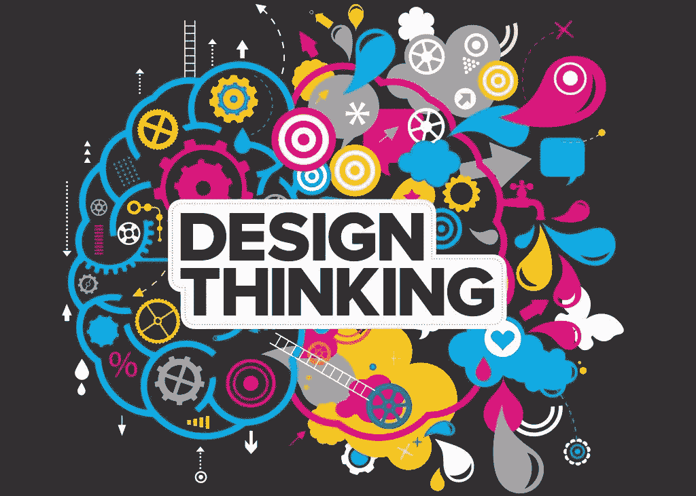

# 返璞归真:什么是设计思维？

> 原文：<https://medium.datadriveninvestor.com/back-to-basics-what-is-design-thinking-ac9c7d9bc433?source=collection_archive---------23----------------------->

上周，我发布了一个目标非常简单的帖子——[定义创新](https://www.milezero.io/2020/05/27/back-to-basics-what-is-innovation/)，这样我们就可以停止争论它意味着什么，并开始行动。

反响很惊人。所以，我想这个星期我会解决另一个流行词——设计思维。

我们都听说过，可能都说过，但是，就像“创新”一样，我们可能都有不同的定义。事实上，仅在过去的几个月里，我就听说它被用作头脑风暴、客户访谈和边谈边画的同义词。这些都是设计思维的*部分*，但它们不是设计思维的全部。

**我对客户说的话**

当客户问我们是否在“做设计思维”时，我会这样回答；

> *“是的，因为设计思维是一种解决问题的方式，它将客户和利益相关者(而不是您的组织)置于过程的中心，并寻求产生为您的客户、利益相关者和您的公司创造、获取和交付价值的解决方案。”*

## **基础知识**

**什么**:人们可以认为设计思维的官方定义来自 IDEO 的执行负责人 [Tim Brown](https://designthinking.ideo.com/) ，他说“设计思维是一种以人为中心的创新方法，从设计师的工具包中提取，以整合人们的需求、技术的可能性和商业成功的要求”

**为什么**:在解决“[棘手问题](https://urbanpolicy.net/wp-content/uploads/2012/11/Rittel+Webber_1973_PolicySciences4-2.pdf)”时有用，这些问题定义不清或很棘手，对于这些问题，现有的规则和领域知识很有限或没有帮助(或可能有害)

**如何:**

*   灵感:通过与利益相关者建立共鸣来理解问题(深入理解他们要做的功能、情感和社会工作),并在概述目标(理想的最终状态)、界限(要避免的元素)和衡量进展的基准的摘要中记录这种理解
*   构思:通过头脑风暴产生想法，形成大量的想法(发散思维)，然后集中在最符合概要的合意性、可行性和生存能力的交叉点上的想法(聚合思维)
*   实现:原型想法，以便它们可以在与客户和利益相关者的合作中被测试、评估、迭代和改进，确保人仍然是过程的中心。

**何时**:任何研发或开发过程的开始

可以在任何地方进行，但是因为这是一种以人为中心的方法，所以在整个过程中必须有多人参与

**谁**:任何愿意接受“初学者心态”的人，一种对新的可能性开放的态度，对问题和有问题的人的好奇心，以及对惊讶甚至错误的谦逊态度

## **重要观点&有趣的事实**

设计思维是一种以人为中心的设计方法。这意味着它试图通过在流程的每一步中融入人的视角来开发问题的解决方案

设计思维并不等同于[以用户为中心的设计](https://www.w3.org/WAI/redesign/ucd)，尽管以用户为中心的设计*可以被认为是*设计思维的子集，因为它关注可用性目标和用户体验

设计思维不是 IDEO 发明的，但我认为他们比其他任何人或公司都做得更多，以推广它并将其纳入主流，尤其是纳入商业管理实践。

设计思维是 50 多年的学术和实践研究和应用的产物。这里有一些有趣的事实:

*   1935 年:设计思维的实践首先被约翰·杜威确立为美学和工程学原理的融合
*   1959 年:“设计思维”这个术语是约翰·e·阿诺德在他的《创造性工程》一书中提出的
*   1991 年:第一届设计思维研讨会在荷兰代尔夫特大学举行
*   21 世纪:由于理查德·弗罗里达(2002 年)、T2、丹尼尔·平克(2006 年)、T4、罗杰·马丁(2007 年)、蒂姆·布朗(2009 年)、托马斯·洛克伍德(2010 年)的书，设计思维作为一种创新方法被广泛采用
*   2005 年:斯坦福大学的 d.school 开始教授设计思维作为创新的一般方法

设计思维不仅仅是为了激进/突破/颠覆性创新

设计思维对于所有类型的创新(创造价值的不同事物)都是有用的，这些创新都是由棘手的问题产生的。事实上，早在 1959 年，约翰·e·阿诺德就确定了四种创新类型，它们可以从设计思维方法中获益:

1.  新功能，即满足新需求的解决方案或以全新方式满足旧需求的解决方案
2.  解决方案的更高性能水平
3.  降低生产成本
4.  增加的销路

## **如果您想了解更多…**

如上所述，对于那些对设计思维非常好奇的人来说，有很多资源可以利用。我推荐从蒂姆·布朗 2008 年的 HBR 文章 [*设计思维*](https://hbr.org/2008/06/design-thinking) 开始，然后一头扎进 IDEO 极其有用且设计精美的[网站](https://designthinking.ideo.com/)完全致力于设计思维。

**这是我想学的…**

*   这有助于澄清什么是设计思维吗？
*   有什么让你吃惊的吗？
*   你还想知道什么？

请在评论中留下你的想法，或者发邮件给我

*原载于 2020 年 6 月 3 日*[*https://www . mile zero . io*](https://www.milezero.io/2020/06/03/back-to-basics-what-is-design-thinking/)*。*