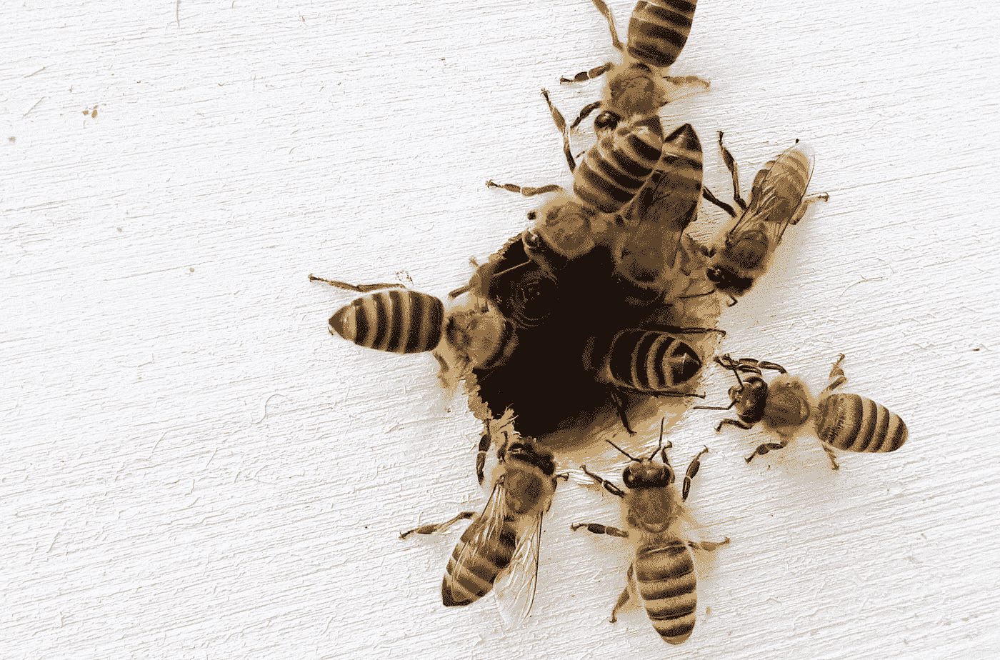

# 回到(流行语)基础:增长、创新和转型

> 原文：<https://medium.datadriveninvestor.com/back-to-buzzword-basics-growth-innovation-and-transformation-ab09347700c8?source=collection_archive---------40----------------------->

Photo by [Boba Jaglicic](https://unsplash.com/@bobajaglicic?utm_source=medium&utm_medium=referral) on [Unsplash](https://unsplash.com?utm_source=medium&utm_medium=referral)

“当人们听到‘创新’时，他们会想到闪亮的新东西。所以，我们不再用这个词了。现在我们谈论增长。”

我的朋友是一家大型媒体和娱乐公司的增长副总裁，他用这句话很好地总结了“创新”的状态。

“创新”已经成为一个毫无意义的时髦词，在经历了几十年失败的投资和计划后，企业高管已经厌倦了它的夸张表演和空洞承诺。

我一点也不怪他们。

但是，仅仅因为一个单词的负担更轻，就把它换成另一个单词，这不是答案。

这就像给一辆起亚装上劳斯莱斯的引擎盖饰件，然后试图以 8 万美元的价格卖出去。就是不行。

## **让我们回到(流行语)基础。**

这是对增长、创新和最新加入流行词汇“转型”的分解。

**成长**

*   **流行语**:🙄
*   **它是什么**:提高企业成功的一些指标，通常是通过增加顶线(收入)或底线(利润)
*   **为什么它很重要**:增长是你在商业中生存的方式，尤其是在竞争激烈的市场中
*   **何时做**:永远

**创新**

*   **流行语**:🙄 🙄 🙄
*   **什么是**:创造价值的与众不同的东西，增长的关键驱动力
*   **为什么重要**:创新就是如何保持竞争力，要么通过模仿竞争对手，要么通过改进内部流程(“不同”是相对于你公司的现状而言)，要么通过创造或做一些新的东西。
*   **何时去做**:在你面对一个燃烧的平台之前，总是最好的，因为这是成功创新所需的资源(时间、金钱、人力和耐心)最短缺的时候。

**转换**

*   时髦用语:🙄 🙄
*   什么是:深刻或彻底的改变，显著地重新定位一个组织的目的、过程、结构和实践。
*   *常与*混淆
*   *转变:积极和持续地逆转不利条件，同时保持或仅逐步改变组织的目的、流程、结构和实践*
*   *数字转换:使用数字技术解决通常需要将非数字或手工流程转换为数字流程的问题*
*   **为什么它很重要**:变革是指组织如何长期保持活力(例如几十年或几个世纪)
*   **何时实施**:当组织的当前业务模式(即，它如何创造、获取和交付价值)由于市场、技术、客户偏好和行为以及/或者竞争力量的根本变化而最终不再产生价值时，就需要进行转型

## **基本底线**

***成长*** 是组织保持活力所必需的。实现增长有多种方式，包括但不限于向新客户销售现有产品、向现有客户销售新产品以及降低成本。

***创新*** 是组织成长的方式之一，当它被战略性地、持续地使用时是最有效的。

***转型*** 当长期增长的可能性减少，并且保持一个可行实体的唯一方法是从根本上彻底改变组织的性质时，就需要转型。

现在，我们已经在正确的汽车(单词)上获得了正确的发动机罩装饰(定义)，我希望我的朋友可以继续致力于创新，避免运营效率方面的努力。毕竟，作为一名增长副总裁，这两者都可以合理地归入她的职权范围。

**流行语-商务量表:**

🙄(1 翻白眼):与一个重要话题相关，但可能被过度使用和/或以如此模糊的方式使用，以至于引发叹息、会意的眼神或翻白眼。

🙄 🙄(2 眼翻):在商业媒体和顾问演示中出现的频率更高；许多高级管理人员和顾问使用这个术语，但是没有人能快速或简明地定义它或解释它为什么重要。

🙄 🙄 🙄(3 翻白眼):不可避免且毫无意义，但已经用了这么久，我们已经被它困住了；很多人使用这个术语，每个人都有自己的定义，大多数人能解释为什么它很重要，但很少有人能成功做到。

*Robyn M. Bolton 是*[*mile zero*](http://www.milezero.io/)*的创始人&首席导航员，她与大型组织的高管合作，超越创新理论和戏剧，释放组织的潜力，创造真正的变化，并获得真正的结果。你可以在*[*www . mile zero . io*](http://www.milezero.io/)了解更多关于她的信息和她的作品