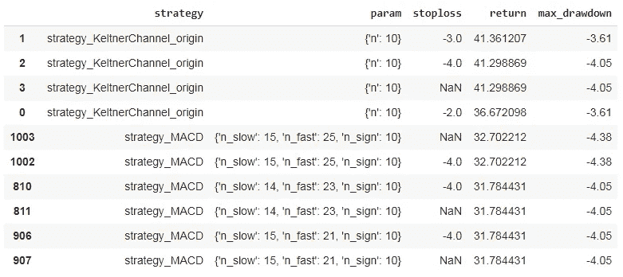

# 用技术指标#4 对交易策略进行回溯测试

> 原文：<https://medium.datadriveninvestor.com/backtesting-of-trading-strategy-with-technical-indicator-4-88967b48a3a5?source=collection_archive---------0----------------------->

有很多技术指标我们可以交易。问题是对于给定的资产，什么是最好的？我们将通过改进上节课的回溯测试来回答这个问题。

在上一节课中，我们已经了解了如何通过策略 Keltner 渠道找到止损水平和参数的最佳组合。在本节中，我们将探索并在回溯测试中添加其他策略。

如果您还没有阅读之前的会议，这里有链接。

 [## 用技术指标#3 对交易策略进行回溯测试

### 通过调用前面的 Python 脚本，找到凯特纳通道的止损水平和参数的最佳组合…

medium.com](https://medium.com/analytics-vidhya/backtesting-of-trading-strategy-with-technical-indicator-3-86ce4e75713e)  [## 止损对技术指标交易有帮助吗？

### Python:用技术指标#2 对交易策略进行回溯测试

medium.com](https://medium.com/analytics-vidhya/will-stop-loss-help-trading-with-technical-indicators-30c5fd936c26)  [## 用技术指标#1 对交易策略进行回溯测试

### 想交易吗？最好先对想法进行回溯测试。通过这个系列，我想将 Python 金融系列扩展到…

medium.com](https://medium.com/analytics-vidhya/backtesting-of-trading-strategy-with-technical-indicator-1-f782b252d873) 

## 快速重新加盖

让我们快速回顾一下到目前为止的逻辑。

我们总共有五个步骤来测试单个策略的可能输入，现在的问题是**如何扩展到多个策略**。

我们会想到的一个自然的方法是再增加一层循环，也就是说，我们可以定义一个策略列表，对于每个策略，我们运行与上面类似的逻辑。**然而，有一个挑战**。

> **每一个策略都会有不同数量的参数，参数以不同的名称被调用。**

**怎么才能概括呢？**在我们进入解决方案之前，让我们看一些可能有帮助的例子。

## 输入的唯一组合

假设我们有三个参数需要放入策略中，每个参数都有一个可能值的列表。**我们如何获得输入的唯一组合列表？**

幸运的是，我们有来自" **itertools** "的 python 函数" **product** "来帮忙。这里我们有三个列表，“a”、“b”和“c”(想象它们是我们策略的三个参数的可能输入)。函数“product”将获得三个列表的唯一组合列表。

**还有一件事要考虑。**在我们的案例中，我们策略的参数数量可能会改变，那么使用“产品”功能的最佳方式是什么？

我们可以将所有的参数放在一个列表中，并使用 ***** 来传递列表中的参数。

上面的代码相当于分别传递“a”、“b”和“c”。在这种情况下，我们不需要担心每个策略的参数数量。

## 更多关于*

现在我们知道我们可以生成一个唯一组合的列表，但是对于每个策略，参数名称都是不同的。例如，RSI 采用“n”，但 MACD 可能采用“n_fast”、“n_slow”和“n_sign”。那么我们如何更一般地传入参数呢？看看下面的例子。

我们有一个函数“test_func ”,它可以接受许多键值参数，这也是我们在策略函数中使用的。我们可以调用 a=1，b=2，c=3 的函数，它应该得到如下输出。

有趣的是，我们也可以通过传入字典得到相同的结果，tick 使用了 ****** 。它应该给我们同样的结果。

## 把这个列表变成一本字典

到目前为止，我们知道可以使用函数“ **product** 来获得一个唯一组合的列表，并且可以使用 ****** 和一个字典来将参数传递给我们的策略函数。然而，如何将唯一组合列表变成字典呢？这里有一个很好的例子。

我们使用" **zip** "来组合两个列表，并使用" **dict** "来初始化一个字典。第一个列表是**键**，第二个是**值**。

 [## 为什么大多数人在日内交易中亏损(以及如何不成为他们中的一员)|数据驱动的投资者

### 日内交易很难，大多数人都赔钱。我确实有。事实上，我曾经在一个单一的损失更多的钱…

www.datadriveninvestor.com](https://www.datadriveninvestor.com/2020/09/23/why-most-people-lose-money-day-trading-and-how-to-not-be-one-of-them/) 

让我们看看如何把我们见过的所有技巧放在一起。

## 定义更多策略

现在回到我们的任务，用多种策略进行回溯测试。我们需要制定更多的策略。在我们的例子中，我将使用以下常见的技术指标。

*   凯尔特纳渠道(我们在过去的三次会议中实施)
*   布林线
*   简单移动平均线
*   指数移动平均线
*   MACD
*   RSI
*   威廉姆斯%R
*   随机快速
*   随机慢速
*   市目

移动平均线策略的一个快速注释。为了节省几行代码，我们对简单移动平均和指数移动平均都做了通用函数，这是由参数“ma_type”决定的。

代码结构与我们在前三节中所做的相同，最终我们需要返回四列数据作为交易信号: **LONG** 、 **EXIT_LONG** 、 **SHORT** 和 **EXIT_SHOT** 。您可以遵循该模式并定义任何策略，它将与我们的回溯测试函数一起工作，只要我们返回这四个信号列。

## 把战略放在一个好的结构中

现在我们已经定义了所有的策略，我们需要把它们放到一个好的数据结构中，这样我们就可以用可能的输入组合对它们进行回测。当我们考虑一个好的数据结构时，我们指的是一种通用的方式。

首先，它应该是一个列表，因为我们有一个可以循环的策略列表。其次，我们需要用参数名定义所有可能的输入，所以这听起来像一本字典。最后，当我们遍历策略时，我们需要有一个通用名称来获取策略函数和可能的参数，所以列表中的每个元素也应该在一个字典中。最终，它将是一个字典列表。

我们定义了一个变量“策略”，它是一个列表。在这个列表中，我们有定义我们需要测试的内容的字典。按键“ **func** ”将为我们提供策略功能，按键“ **param** ”将为我们提供所有参数名称的字典，可能的输入为列表。

让我们看看如何循环策略并生成独特的组合。

所以我们要做常规的 for 循环。对于每个循环，我们将获得带有键“func”的策略和带有键“param”的参数字典。因为我们不知道我们将有多少个参数，所以我们有另一个循环来获取参数名及其可能的输入作为一个列表。然后，我们将参数名和可能的输入放入列表“param_name”和“param_list”。最后，我们使用在本节课开始时看到的技巧，将唯一组合列表转换为词典列表。

如果我们运行代码，我们会看到有多少独特的组合，我们需要测试。

策略采用的参数越多，组合就越多。在我们的例子中，我们有 855 个模拟要运行。考虑到我们也有从-1%到-5%的止损，包括没有止损，即 6 种可能性，我们最终将运行 5130 次模拟。这是相当多的，回溯测试很容易变得疯狂。最终，我们甚至可能需要并行计算能力。

## 运行回溯测试

最后一步，我们将集成回溯测试代码并运行模拟。

让我们从准备数据和初始化结果保存器开始。

这和我们以前做的非常相似。我们使用函数“get_stock_backtest_data”来获取历史棒线。然后我们定义我们需要的所有可能的止损水平，包括没有止损。最后，定义“result_dict”来保存每个回溯测试的结果。在这种情况下，我们需要存储策略名称以及经过测试的参数输入。

上面的代码和符号应该可以解释这个想法。只需快速突出显示一下，函数" **clear_output** 来自 **IPython.display** ，我们需要在顶部导入它。该函数将清除打印，因此在这种情况下，当我们运行模拟时，我们将始终打印一行进度文本。

这将需要一段时间来运行和以上是最终结果。我们可以看到，在这种情况下，凯尔特纳渠道仍然是最好的，但我们可以看到，MACD 是第二好的策略。因为回溯测试只告诉过去，采取前两个策略肯定会帮助我们的交易。

## 然后

有许多方法可以使用回溯测试结果。人们可以用很长的历史进行回溯测试，看看哪种策略可以持续产生最佳性能，我们的代码已经可以做到这一点。然而，单一的策略不可能永远有效，所以我们可能会想，如果我们基于以前的回溯测试结果动态地决定策略，看看它是如何工作的，即基于回溯测试的回溯测试！

## 项目 Git 链接

 [## bbk-pij-2012-29/trading _ with _ ta _ 回溯测试

### permalink dissolve GitHub 是超过 5000 万开发人员的家园，他们一起工作来托管和审查代码，管理…

github.com](https://github.com/bbk-pij-2012-29/trading_with_ta_backtesting/blob/main/ta_trading_study.ipynb) 

## 访问专家视图— [订阅 DDI 英特尔](https://datadriveninvestor.com/ddi-intel)