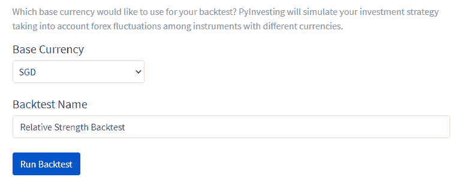
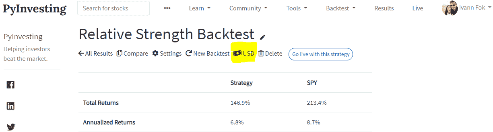
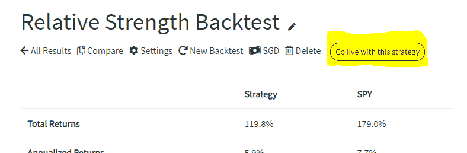
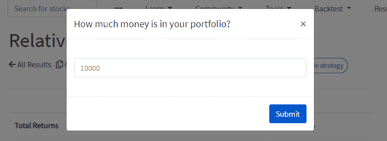

# 用不同货币对股票进行回溯测试

> 原文：<https://medium.datadriveninvestor.com/backtesting-stocks-with-different-currencies-1a1885b37915?source=collection_archive---------18----------------------->

unsplash.com

一位朋友最近向我强调，当他在 PyInvesting 上对美国和香港股票进行回溯测试时，回溯测试者没有考虑汇率差异。因此，模拟投资组合的表现是不正确的，因为它没有处理美国和香港股票之间的外汇波动。

我已经推迟了这个修复一段时间，因为它不容易实现，需要处理许多细节。然而，我决定在本周实现这一功能，因为这是我的许多用户所要求的，并且随着我将其他国家的股票引入我的数据库，这将是有用的。

 [## 这么说一家大型风投基金正在投资你的初创公司？4 实际考虑|数据驱动的投资者

### 首先，恭喜你。融资总是需要努力的，一个大的风险投资基金当然是一个大的…

www.datadriveninvestor.com](https://www.datadriveninvestor.com/2020/08/09/so-a-big-vc-fund-is-investing-in-your-startup-4-practical-considerations/) 

# 更新回溯测试价格馈送

能够处理不同货币的股票之间的外汇波动意味着我需要将每只股票的价格转换成一种货币，然后再将价格输入回测器。例如，如果使用美国和香港的股票进行回溯测试，我会使用 HKD/美元历史外汇时间序列将 HKD 所有香港股票的历史价格转换为美元。这将使不同国家的股票可以相互比较，并说明货币差异。

这一变化的结果是，回溯测试的投资组合的净资产值(NAV)现在将采用美元，我们可以用美元来观察我们投资策略的表现。然而，如果一个新加坡用户想知道他的投资策略在新加坡元方面的表现，会发生什么呢？

# 引入基础货币

pyinvesting.com

下一步是将回溯测试策略的历史表现从美元转换为用户的首选货币，也称为基础货币。为此，我在每个回溯测试表单页面上添加了一个下拉菜单，用户必须在这里选择回溯测试的基础货币。接下来，PyInvesting 会将业绩数字从美元转换为用户选择的基础货币。

pyinvesting.com

用户还可以通过点击上面截图中显示的货币来更改结果页面上的基础货币。这将使他们能够从不同货币的角度观察其投资策略的表现如何变化。例如，由于过去 15 年新加坡元对美元升值，以新加坡元计算的投资策略的表现将不如以美元计算的投资策略。

# 活投资组合价值的货币

pyinvesting.com

此功能更新的最终影响是，用户选择的基础货币也将应用于用户在投资策略上线时输入的投资组合价值。当用户点击上面截图中所示的“使用该策略”时，PyInvesting 将每天使用实时价格运行他们的策略，并向用户发送实时订单，以便他们可以从他们的投资策略中获利。为了计算用户需要在个人账户上买卖的手数，PyInvesting 会提示用户输入他们投资组合的规模。该投资组合价值将基于用户选择的货币。例如，如果用户选择新币，下面屏幕截图中显示的投资组合价值将为$10k 新币，用于确定用户个人投资组合中每只股票的买入或卖出手数。

pyinvesting.com

# 结论

我很高兴这个功能终于推出了。这不是一个容易实现的，我希望这将有助于通过自动处理外汇波动来投资不同货币股票的用户。我很想听听你对这个新功能的想法。一定要去看看，并在 PyInvesting 论坛([https://pyinvesting.com/forum/](https://pyinvesting.com/forum/))上告诉我你的想法。

祝你投资愉快，并祝你好运。

*如果你想制定一个有效的投资策略，学习如何利用回溯测试的结果可能是你做过的最好的决定之一，因为回溯测试可以帮助你在你的钱被押上之前识别出一个不正确或正确的投资。*[*py investing*](https://pyinvesting.com/)*是一个回溯测试平台，帮助投资者在云上创建自己的机器人顾问，而无需编写一行代码。*

## 访问专家视图— [订阅 DDI 英特尔](https://datadriveninvestor.com/ddi-intel)