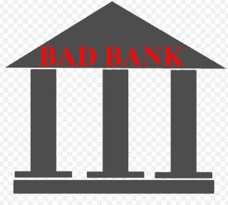

# “坏银行”为什么印度不应该创建它。

> 原文：<https://medium.datadriveninvestor.com/bad-banks-why-india-should-not-create-it-69a894afe2dd?source=collection_archive---------11----------------------->

银行业是任何经济活动的核心。银行大多围绕货币旋转，货币在经济中充当血液。健康的银行体系可以促进经济发展，反之亦然。因此，拥有一个组织良好的银行体系成为一种需要，全球许多国家都在采取额外的预防措施，以保持银行体系的健康。但是我们知道，没有什么是完美的。这个系统有许多缺陷和漏洞，从长远来看会损害经济。

银行业最大的问题之一是坏账，也就是通常所说的不良资产。这些是任何金融机构(有许多机构，但在这种情况下，我们将只考虑银行)给个人或公司的贷款，无法偿还。这些不良资产对银行系统是有害的。在一个特定的机构中，坏账应该少于 4%到 5%(这个数字可以变化),高于它认为危险的限度。不良资产会限制对经济的货币供应，因为人们不偿还贷款，经济慢慢陷入流动性紧缩的局面。政府提供了许多规则和指导方针。但在实施指导方针后，坏账的数量也在上升。因此，印度政府考虑了一个新概念，即坏账银行。

让我们来理解一个坏银行

坏账银行是一个法人团体，帮助银行或金融机构隔离流动性和这些机构的高风险资产。简而言之，它通过将持有的不良资产和坏账转移给不良银行，帮助银行和其它金融机构克服过度持有的不良资产和坏账。在这个体系中，一个国家将创建一家新公司，并将其命名为坏账银行，而每家银行和金融机构都将把自己的不良资产出售给这家银行。1988 年，美国梅隆银行首次使用坏账银行，此后许多国家开始采用这种策略，尤其是在 2008 年危机之后。那时，金融业非常受人尊敬。坏账银行的产出仍有疑问。经济学家社区对此有两极分化的意见。

 [## 如果资本主义失败了，那么还有什么选择呢？数据驱动的投资者

### 在当前政治领域的修辞之旅中，我们都可以面对面地接触到流行词汇，如…

www.datadriveninvestor.com](https://www.datadriveninvestor.com/2020/03/16/if-capitalism-is-a-failure-then-what-is-the-alternative/) 

新冠肺炎危机中我们为什么需要坏账银行？

在冠状病毒危机中，世界经济深受其害。印度也开始感受到它的影响。在 1 月至 3 月的季度中，印度的国内生产总值已触及 11 年来的最低水平。因此，印度经济需要强大的推动力才能回到正轨，但投资者正有意识地投资于银行，在某些情况下，他们正从银行撤出资金。这极有可能引发恶性循环，银行很快就会感受到流动性紧缩的局面。当前的问题因 NBFC 危机和一些银行的倒闭而被放大。就在新冠肺炎危机之前，印度经济正面临银行业危机。像 IL&FS 这样的顶级公司。不良资产的规模震惊了整个国家和投资者。事实上，一些私人和公共银行也很快发现自己处于风暴之中。所有这些危机都在当前的危机中被发扬光大，很可能会让新德里花费一大笔钱来恢复。

在这种情况下，该国的经济学家提出了创建坏账银行的计划。当你分析当前形势时，坏账银行不可能是那么糟糕的解决方案，因为目前，印度需要巨额刺激计划，如果没有有组织和无组织部门的帮助，新德里可能无法成功执行该计划。正如我上面所说的，由于不良资产的高水平，投资者和人们正在远离银行，在这种情况下，坏账银行可以改变游戏规则。因为坏账银行以低于面值的价格(通常是总价值的 50%)从这些机构购买不良资产。在这种情况下，银行和金融机构的账户将变得清晰，这将吸引投资者等。另一方面，坏银行以低得多的价格获得资产。

如果坏账银行有那么好，那我为什么说印度不应该创建它？

我们必须记住的第一件事是，仅仅将不良资产从一家机构转移到另一家机构并不能解决问题，因为不良资产仍将是坏账银行的不良资产。事实上，坏银行必须努力恢复他们的资金，但他们可能会讨价还价，可能无法从这些不良资产中获得全额资金，但在这种情况下，坏银行也将获利，因为他们以低得多的成本购买了资产，但剩余金额将是亏损的。

我们用一个例子来理解一下——

想象一下，一家银行创造了 400 亿卢比的不良资产.1 Cr。(142857 美元我拿了 1 美元= 70 卢比)。银行以面值的 50%卖给了坏账银行，即卢比。500 万卢比(71428 美元)。经过努力，坏账银行可以收回资金，但只能收回面值的 75%，即卢比。750 万卢比(107142 美元)。当你计算坏账时，银行已经成功收回投资的资金，并获得少量利润，即卢比。25 万卢比(35，714 美元)，但我们忘记了 25%的扩孔费，即卢比。250 万美元就这样凭空消失了。这是一种损失。我只是拿了一个很小的数字，只是想象十万卢比，然后损失数字可能是巨大的。坏账银行收回资金也极有可能少于这一数字可能飙升的水平，反之亦然。

通过创建坏账银行，政府正在保护银行，但我们不能忘记，这些机构是这些不良资产的创造者，按照目前的决定，新德里将只能控制产出，而不是投入。政府封锁后。将试图通过提供廉价贷款来推动经济，这将鼓励银行和金融机构向不符合条件的人提供贷款，这将在未来产生更多问题。

银行和金融机构现在将无所畏惧，因为由于坏银行，他们将有信心，因为无论情况如何，至少 50%的资金将会回流。这只会把问题放大。因此，我觉得印度不应该创建坏账银行。

结论-

印度的银行系统正面临这个问题，但从长远来看，新德里的决定可能会损害经济。政府不应该只关注短期，还应该考虑长期。依我看，当前的问题需要在最初的层面解决，而不是最终的层面。在我即将发表的名为“印度跨国公司给商业和经济带来的问题”的研究论文中，我试图解决这个问题。一旦出版，我会及时通知你们。在这篇文章中，我给出了我对印度如何解决这个问题的看法。

*最初发表于*[*【https://onkarjadhavv.blogspot.com】*](https://onkarjadhavv.blogspot.com/2020/05/bad-banks-why-india-should-not-create-it.html)*。*