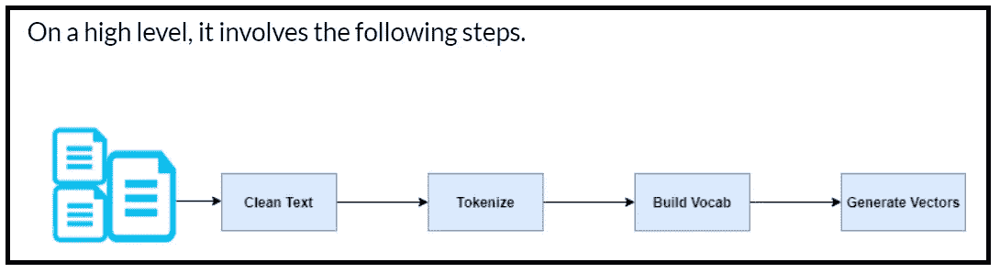
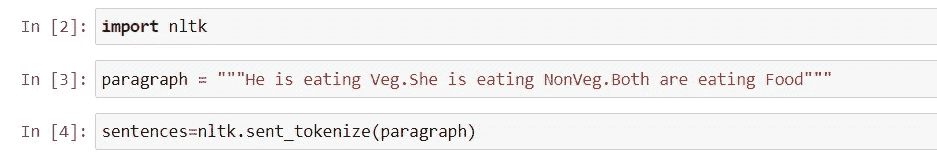
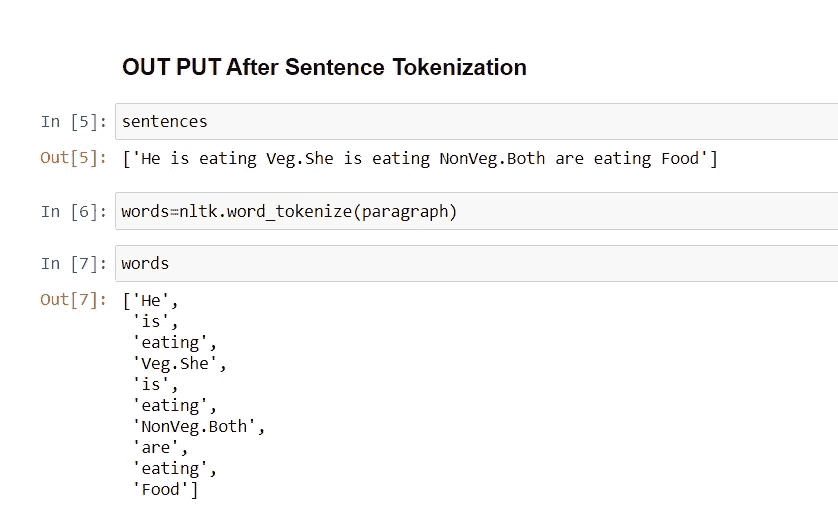
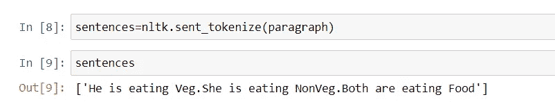
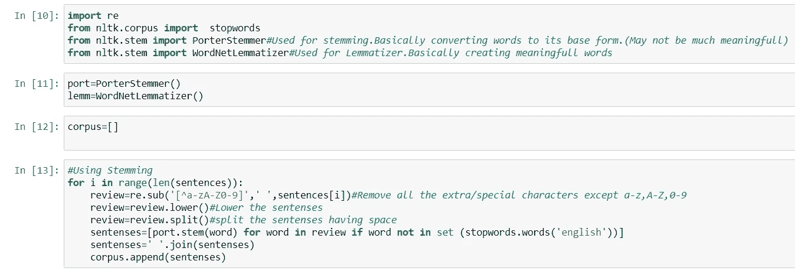
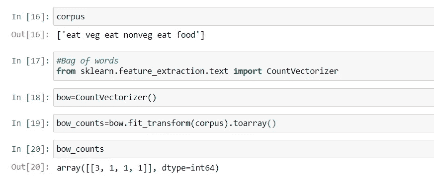
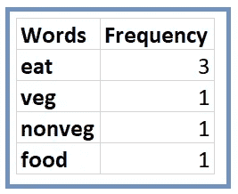

# 自然语言处理中的词汇袋

> 原文：<https://medium.datadriveninvestor.com/bag-of-words-in-natural-language-processing-fe996f9ae9d2?source=collection_archive---------3----------------------->

image:macmillandictionaryblog

## **概述**

在处理语料库时，我们会遇到在自然语言处理(NLP)应用中使用的多个单词，以获得有意义的见解。为此，我们需要将这些单词转换成模型能够理解的东西。我们在这里要讨论一些被称为****的包话。****

****简单地说****

****“单词包”也称为 BOW，是将单词表示成数字 0(零)和 1(一)的向量。这些单词可以来自不同的句子和段落。****

**** [## 将定义 2020 年就业前景的五大数据科学和机器学习趋势|数据驱动…

### 数据科学和 ML 是 2019 年最受关注的趋势之一，毫无疑问，它们将继续发展…

www.datadriveninvestor.com](https://www.datadriveninvestor.com/2020/02/19/five-data-science-and-machine-learning-trends-that-will-define-job-prospects-in-2020/) 

**详细了解单词袋**

我们从文字袋或弓中获得的两件主要事情是

1.  语料库中的词频
2.  数字 0 和 1 的向量表示

让我们用一个例子来理解

假设我们有如下的句子

1.他正在吃蔬菜

2.她正在吃水果

3.两个人都在吃食物

**让我们执行以下步骤来生成单词包**

第一步:把句子拆分成单词。

**我们也可以用这种方式**

第二步:放低句子。

第三步:应用停用词来删除不需要的词，如他、她、是、是等。

第四步:找到每个单词的频率。

步骤 5:执行词干化和 lami 化。

步骤 2，3，4，5 在下面的代码中执行

第六步:找出每个单词的词频和向量表示

**词频**

**每个单词的矢量表示**

所有的单词都被表示为向量，但是单词包的主要问题是，不能发现哪个单词更重要，哪个更不重要，因为所有单词都被赋予了相同的权重。

这个问题的解决方案是 TF-IDF，这是我的下一个主题。

**结论**:单词包是自然语言处理中的基本技术，用于将单词转换成向量，并在一些 NLP 应用中使用。还有其他高级技术，如 TF-IDF 和 Word2Vec，我将在下一篇文章中介绍。

请写下您的疑问和意见，并分享您的反馈。

希望你喜欢我的文章。请鼓掌👏(50 次)激励我继续写下去。

想要连接:

联系方式:[https://www.linkedin.com/in/anjani-kumar-9b969a39/](https://www.linkedin.com/in/anjani-kumar-9b969a39/)

如果你喜欢我在 Medium 上的帖子，并希望我继续做这项工作，请考虑在 [**patreon**](https://www.patreon.com/anjanikumar) 上支持我

**进入专家视角—** [**订阅 DDI 英特尔**](https://datadriveninvestor.com/ddi-intel)****