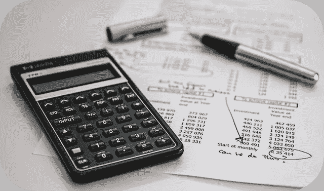

# 平衡关键投资因素

> 原文：<https://medium.datadriveninvestor.com/balancing-key-investing-factors-b056804b604b?source=collection_archive---------18----------------------->

Investing is a careful balance between many factors, but 4 key components can make or break deals.

想象一下，一个走钢丝的人自信地驾驭着各种元素，在数百英尺的空中漫步穿过一个微小的零件或电线。这位表演者必须平衡恐惧、重力、肾上腺素和无数其他因素，才能成功完成这项危险的任务。

这就是我如何看待我所做的每一项投资。我会考虑许多重要因素，并在每笔交易中权衡它们的重要性。当谈到投资房地产，四个主要因素将决定是否投资于一个属性。通过充分了解这些因素，你将能够正确评估投资机会，并决定你的行动方针。

## 了解你的现金流

简单地说，现金流是所有费用都被覆盖后的资金。这包括支付税款，抵押财产和其他各种费用。重要的是，只寻找有正现金流的房产，因为这些资产能让你安心。通过有一个积极的收入流，不必担心支付费用，你可以放心知道这些财产将带来被动收入。

 [## 算法交易的机器学习|数据驱动的投资者

### 当你的一个朋友在脸书上传你的新海滩照，平台建议给你的脸加上标签，这是…

www.datadriveninvestor.com](https://www.datadriveninvestor.com/2019/01/30/machine-learning-for-stock-market-investing/) 

重要的是要考虑到费用会随着时间的推移而增加，这将直接影响现金流。时刻关注你的现金流，确保认识到你的财产现金流的未来潜力。

## 了解你的风险

拥有任何财产都有一定程度的风险。一般来说，高风险的房产有可能带来更高的收益。在考虑一块房地产时，你可以决定自己愿意承担多大的风险。需要考虑的一些重要风险因素包括:

*   费用成本
*   维护成本
*   资产成本
*   财产所在地
*   流动性风险

这些只是在购买房产之前需要评估的众多风险因素中的一小部分。通过了解你愿意承受多大的风险，你可以正确评估你对潜在投资的立场。

## 了解你的升值潜力

过几年，你的财产会增值。这种财务增长被称为增值，在购买之前，你必须考虑你的资产随着时间的推移会增加多少。带着低买高卖的目标，升值会让你的财产保持价值，并在你决定出售资产时带来丰厚的回报。

此外，你很快就可以根据你目前房产的价值借钱进行额外的投资。升值会让你的财产变得更有价值，让你借更多的钱用于未来的投资。

## 了解你的努力程度

管理一项房地产资产所需的工作量可能会因物业而异。从完全被动的投资，到收拾残局和向租房者讨债，你要自己决定愿意付出多少努力。

你可以随时雇人管理你的财产，但那会减少你的总体利润。在你购买一处房产之前，确定你愿意花多少时间和精力来获得最大收益。

这些只是我用来评估房产的众多指标中的四个。要了解更多关于投资房地产行业的信息，[访问我的网站](http://andrewcartwright.com/)并安排一次免费咨询。我期待着与您交谈，并帮助您发现房地产投资的新职业。