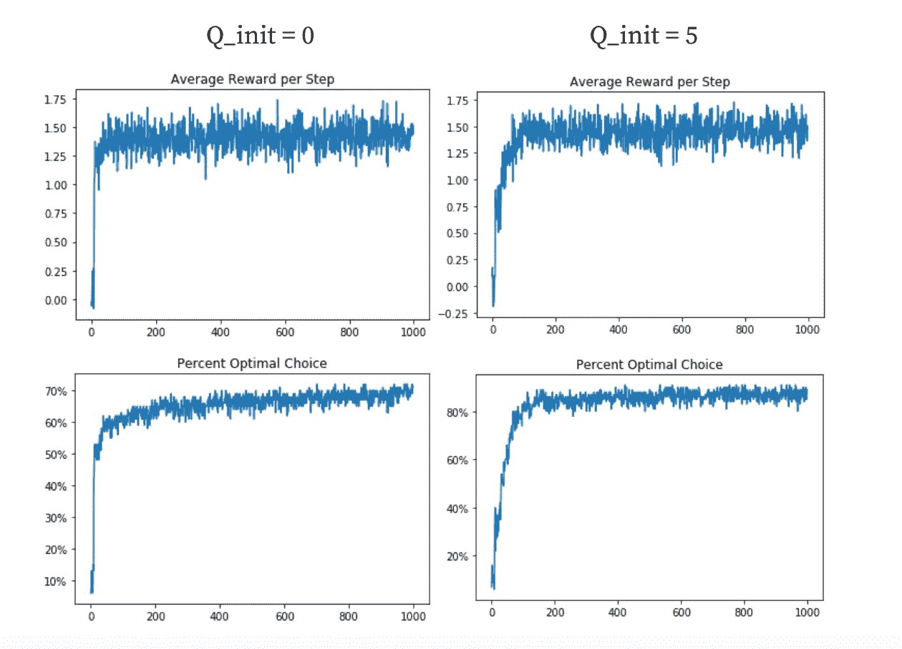

# BANDIT 算法—从头开始实施

> 原文：<https://medium.datadriveninvestor.com/bandit-algorithm-implemented-from-scratch-38542cedafb3?source=collection_archive---------3----------------------->

## 窃取最多的奖励👀🏆使用强化学习


在这篇文章中，我回顾了强化学习和 BANDIT 算法的基础知识，并解释了代码实现。如果您想直接跳到代码实现，请跳过第一部分。

# 背景

想象一下，你在赌场玩游戏，你有多台老虎机，你可以对冲你的赌注，比如说 10 台机器。

你如何知道从哪些机器开始？如果你的目标是回报最大化，你怎么知道选择哪台机器呢？

这就是强化学习中常说的多臂土匪问题。

强化学习本身通常是关于拥有一个**代理**，与它的**环境**互动。通过与环境互动，它接收反馈，然后可以在下一个时间步骤中使用这些反馈来更好地做出决策。

在 BANDIT 问题中，每台吃角子老虎机都有一个具有特定方差(标准偏差)的平均奖励，因此每次奖励都不会相同，但算法应该知道哪些机器平均比其他机器好，它可以使用这个平均值作为从特定吃角子老虎机获得的未来奖励的指标。

[](https://www.datadriveninvestor.com/2020/01/22/whats-the-difference-between-ai-and-machine-learning/) [## AI 和机器学习有什么区别？数据驱动的投资者

### 这两个主题背后有很多令人兴奋的东西，所以这是一个快速指南，介绍了它们是什么以及它们有什么…

www.datadriveninvestor.com](https://www.datadriveninvestor.com/2020/01/22/whats-the-difference-between-ai-and-machine-learning/) 

然而，另一个问题出现了——假设强盗一次又一次地坚持同一个老虎机，只是因为它知道老虎机在迄今为止探索的所有老虎机中给出了最高的价值。如果有另一个吃角子老虎机实际上给出了更高的奖励，但算法没有研究它，因为它认为坚持使用它已经熟悉的吃角子老虎机会产生更高的奖励？

这就是所谓的**探索与利用**问题——换句话说，是坚持熟悉的行为好，还是抱着更高回报的希望去探索新的行为好？

使用土匪采取的行动的数值以及估计的回报和参数来管理探索和开发之间的权衡，我们实际上可以在代码中模拟土匪问题。

# 代码实现

让我们介绍一些术语、数学符号和代码，使所有这些更具体一些。

*Qt(a)* 表示在时间步长 *t* 给定行动的预测奖励，而 q*(a)表示行动 a 的实际平均奖励。Rt 表示在时间步长 t 的奖励

我们的目标是获得精确测量 Qt(a)的最佳方法。这是通过采取行动时获得的所有先前奖励的平均值来完成的。为了优化内存，我们实际上是通过对时间步长 t-1 中的动作进行估计来计算时间步长 t 的平均值，然后将估计值和实际奖励之间的差值相加，再除以已经通过的试验次数，这与计算平均值基本相同。

值 epsilon 决定了模型探索的时间比例(它追求随机动作)和它利用的时间量(它选择具有最高估计回报的动作)。

让我们用代码来看看这个。

下面是我为一个强盗从头开始构建的一些代码。请在这里随意查看我的[公共 github 库](https://github.com/MukundhMurthy/BartoSutton-RL-Resources)，其中包含一个 Jupiter 笔记本，您可以在其中试验不同的参数并可视化时间步长——奖励图。

请随意浏览这段代码，并尝试应用我们到目前为止在本文中讨论的内容——但是如果一切都没有意义，也不要担心。我会一次过几行。

```
def bandit(stationary, num_steps, num_runs, k=10, epsilon=0.05, Q_init_value=0, std_dev = 0.01, act_val_method = 'Sample-average', alpha = 0.1, UCB = False, c = 2):
    reward_runs_list = []
    optimal_runs_list = []
    for j in range(num_runs):
        Q_a = empty_tensor.new_full([k], Q_init_value)
        rewards = torch.normal(torch.zeros(k), torch.ones(k))
        N_a = torch.zeros(k)
        reward_val = []
        opt_val = []
        max_action_val = torch.argmax(rewards).item()
        assert act_val_method in ['Sample-average', 'Constant-step-size', None]
        print ("Run: {0} Reward List: {1}".format(j, rewards))
        for i in range(num_steps):
            if not stationary:
                rewards += torch.normal(torch.zeros(k), empty_tensor.new_full([k], std_dev))
            if UCB:
                quotient = torch.sqrt(torch.from_numpy(np.array((np.log(j+1))/((N_a+1).numpy()))))
                max_action = torch.argmax(Q_a + (c * quotient))
                non_changed = (Q_a==Q_init_value).nonzero()
                if len(non_changed)>1:
                    max_action = np.random.choice((Q_a==Q_init_value).nonzero().squeeze().numpy())
            elif decision(epsilon)==False:
                max_action = torch.argmax(Q_a).item()
                non_changed = (Q_a==Q_init_value).nonzero()
                if len(non_changed)>1:
                    max_action = np.random.choice((Q_a==Q_init_value).nonzero().squeeze().numpy())
            else:
                max_action = np.random.randint(0, k)
            reward = torch.normal(rewards[max_action], 1)
            times_seen = N_a[max_action] 
            estimate = Q_a[max_action]
            N_a[max_action] += 1
            if (act_val_method == 'Constant-step-size'):
                step_param = alpha
            else:
                step_param = (1/(times_seen+1))
            Q_a[max_action] += (reward - estimate)*(step_param)
            reward_val.append(reward.item())
            opt_val.append(max_action == max_action_val)
            print ("Step {0}: Action chosen:{1}   Reward:{2:.2f}    Estimate: {3:.2f}".format(i, max_action, reward.item(), estimate))
        reward_runs_list.append(reward_val)
        optimal_runs_list.append(opt_val)
    reward_runs_array = np.array(reward_runs_list)
    avg_reward_per_step = np.mean(reward_runs_array, axis=0)
    opt_arr = np.array(optimal_runs_list, dtype="bool")
    percent_opt_arr = np.sum(opt_arr, axis=0)/num_runs
    return (avg_reward_per_step, percent_opt_arr)
```

首先，让我们看一下函数头，对所有涉及的参数有一个清楚的了解。

```
def bandit(stationary, num_steps, num_runs, k=10, epsilon=0.05, Q_init_value=0, std_dev = 0.01, act_val_method = 'Sample-average', alpha = 0.1, UCB = False, c = 2):
```

涉及的参数有

*   *固定* —这个参数是一个布尔值，它决定了奖励是不变的，还是在强盗搜索时会改变。你可能会想象不稳定的值会使强盗更难优化奖励。
*   *k —* 匪徒拥有的武器数量(本质上是可能行动的数量)
*   *num_steps* —强盗选择一个动作的次数
*   *num_runs* —初始化并运行了 *num_steps* 的不同 k-armed 土匪的数量
*   *epsilon* —决定强盗探索的小部分时间的参数
*   *Q_init_value* —每个动作的奖励的初始化估计值。将初始值设置得更高将导致更多的探索。在第一次对每个点进行采样后，估计值会急剧下降——你可以认为这是强盗失望了。它会在选择几个点之前，对几乎所有的点进行采样。

如果回报是不稳定的

*   *std_dev* —奖励在时间步长之间变化的数量

Act-val 方法—这些方法在收到给定行为的奖励后提供评估更新。有两种主要方法——一种是样本平均法，另一种涉及恒定步长α。

*   样本平均值——将奖励相加，然后除以强盗看到它们的次数(用 N_a 表示)
*   恒定步长——不是除以 N_a，而是将*(估计-回报)*值乘以恒定步长α。这允许较早的奖励比最近的奖励少计算(在不稳定的环境中特别有用)

# 一个示例实验

这里有一个示例实验，您可以使用 BANDIT 函数来进行——您可以看到初始 Q 值对最终奖励可视化的影响。



在这里，我测试了两个不同 Q 值的平均回报图和最优选择图之间的差异。正如您所看到的，Q=0 的曲线变得更快，但达到了更低的最佳选择百分比最大值(Q=0 时为 70%，Q=5 时为 90%)。

从概念上讲，这是因为较大的 Q 允许更多的探索。

请随意用这个工具做自己的实验，获得强化学习基础的直觉！

*嘿！我是 Mukundh Murthy，16 岁，对机器学习和药物发现的交叉领域充满热情。感谢阅读这篇文章！希望你觉得有帮助:)*

*随时查看我在 Medium 上的* [*其他文章*](https://medium.com/@mukundh.murthy) *和我在*[*LinkedIn*](https://www.linkedin.com/in/mukundhmurthy/)*上联系！*

如果你想讨论以上任何话题，我很乐意与你联系！实际上，我目前正在尝试优化 ML 模型，以预测冠状病毒蛋白质靶点(N 蛋白)的高效适体药物。(在 mukundh.murthy@icloud.com 给我发邮件或者在[*LinkedIn*](https://www.linkedin.com/in/mukundhmurthy/)*上给我发信息)另外，请随时查看我的网站，网址是*[*【mukundhmurthy.com*](http://mukundhmurthy.com/)*。*

*如果你有兴趣关注我的进展，请在这里* *注册我的每月简讯*[](http://eepurl.com/gImYNX)

***访问专家视图—** [**订阅 DDI 英特尔**](https://datadriveninvestor.com/ddi-intel)*