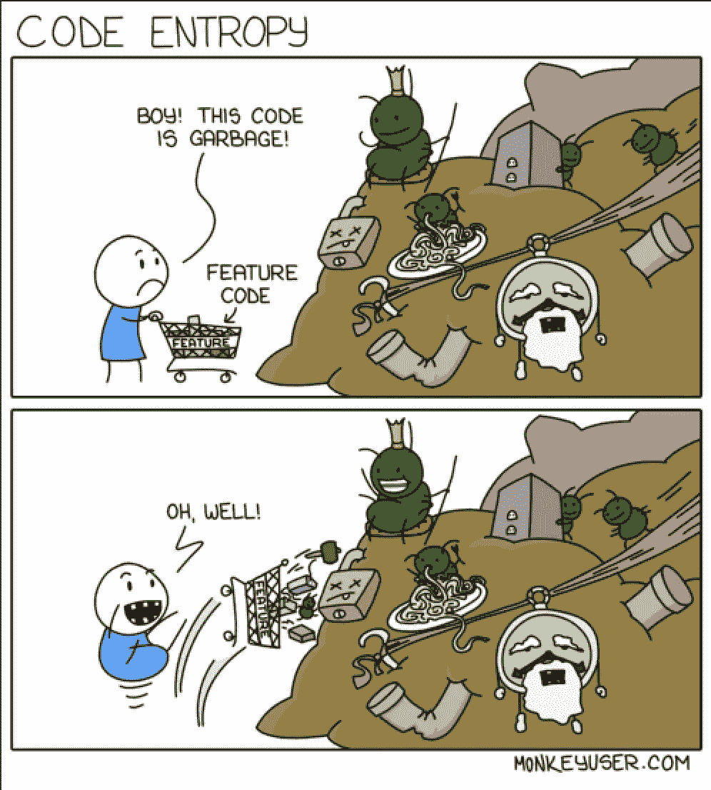

# 成为一名务实的程序员的基本要素

> 原文：<https://medium.datadriveninvestor.com/bare-essentials-to-become-a-pragmatic-programmer-5077bbd5b965?source=collection_archive---------6----------------------->

Pragmatic Programmer

如果你曾经遇到过实用主义这个术语，你可能会知道这本书*由安德鲁·亨特和戴维·托马斯写的《实用主义程序员**。*

*虽然它看起来是技术性的，但内容非常有哲理性，适用于任何想要坚持务实心态的人。在这里，我将试着解释实用主义这个术语以及我从这本书中学到的东西。*

# *不要住在破窗户里*

*如果一栋建筑的窗户被打破并且长时间无人维修，它会给人一种被遗弃的感觉。人们开始乱扔垃圾，乱涂乱画，很快，严重的破坏就会发生。*

*同样的事情也适用于软件。*糟糕的代码会吸引更多的糟糕代码。如果我们遇到这样糟糕的设计、错误的决策和糟糕的代码，我们应该采取正确的行动，以防止进一步的损害。**

* [## 在不稳定的数字时代生存|数据驱动的投资者

### 如果你是一名计算机科学家，你可能已经注意到新的框架不断出现。编程…

www.datadriveninvestor.com](https://www.datadriveninvestor.com/2020/02/26/surviving-in-a-digital-age-of-instability/) 

作为一名软件工程师，我们一生都在开发和维护软件。我们将对我们的产品负责，并对我们编写的代码负责。

**提供选项，不要找蹩脚的借口** 我们都会犯错误，如果发现任何问题，要提供选项，而不是找借口和指责他人。

# 石头汤和水煮青蛙

让我们来了解一下编程领域的一个有趣的哲学，名为“石头汤和煮青蛙”

[https://www.youtube.com/watch?v=9KejHBhTuPM](https://www.youtube.com/watch?v=9KejHBhTuPM)* 

# *知识组合*

*如今技术在不断变化。如果我们不更新我们的知识，它可能会随着时间而过时，所以作为一种习惯定期投资于它。如果你对一门新的语言或技术感到满意，那就继续学习另一门。不同的风格以不同的方式解决相同的问题，通过学习几种不同的方法，你可以帮助拓宽你对问题的思考并避免它们。搜索令人兴奋的在线课程、本地和全球聚会/会议。互联网上有很多在线资源，好好利用吧！试着看看你公司的外部，了解人们在做什么。*

## *沟通*

*交流需要有伟大的想法浮动。如果我们不与周围的人交流，那么有伟大的想法也没有意义。知道我们想说什么，然后计划好。也要了解你的观众以及他们想要什么。让你的听众参与进来:通过提问鼓励人们说话来获得他们的反馈。*

## *[干](https://en.wikipedia.org/wiki/Don%27t_repeat_yourself)*

**

*我们不应该复制我们的代码，就这么简单。重复的代码导致糟糕的重构和维护。但是让我们明白为什么我们要复制东西。*

*   *我们因懒惰而复制代码*
*   *对我们来说似乎更舒服*
*   *我们在如此大的团队中工作，以至于在缺乏知识的情况下重复一些东西*
*   *由于缺乏架构知识，开发人员觉得复制东西是他们唯一的选择。*

## *正交性*

*根据几何定义，如果两个向量垂直，称为**正交**，即成直角。*

*如果我们以这样一种方式设计一个系统，即两个系统只在一个点上连接。这将提高生产率，降低风险。这样的系统更容易测试。*

***为变化做好准备。** 没有最终的决定或板上钉钉的事。好的设计比坏的设计更容易改变。*

## *曳光弹*

*新的项目需求可能是模糊的。新算法、技术、语言或未知库的使用将会到来，环境也会随着时间而改变。*

*曳光弹显示我们击中了什么。它不会总是达到目标，但是我们会相应地调整它以达到目标。*

*优势:*

*   *用户很早就能看到工作的东西。*
*   *开发人员构建一个工作结构。*
*   *你有东西要展示。*

# *工具*

*任何优秀的工匠都知道，一旦我们有了计划，我们不会很快开始工作。首先，我们需要准备好我们的环境和工具。就像一个使用钝锯的伐木工人，需要更多的时间来完成同样的工作，但是如果我们先磨利工具，那么我们就可以更早更有效地完成同样的工作。*

*编码也不例外。准备好我们的工具和环境将会提高生产力。我们需要对单个编辑器、终端和纯文本有良好的体验。与 git 一样，源代码控制是使协作、回滚和共享变得容易的必备工具。*

# *排除故障*

> **解决问题，而不是责备**

*不要浪费任何精力去证明它不可能发生，因为它已经发生了。试着了解问题的根源。这些调试策略会有所帮助*

*   *使其可复制*
*   *可视化您的数据*
*   *追踪它以了解前后发生了什么。*
*   *向某人解释 bug*
*   *如果可疑代码通过了单元测试，测试是否足够完整？*

*没有人能写出完美的软件。务实的程序员也不信任自己。*

## *断言编程*

*断言的使用有助于我们及早发现错误。所有的错误都给了我们信息，如果有任何错误，就意味着某些东西已经坏了，需要及早处理。使用断言来防止我们假设它不会发生。*

## *巧合编程*

*留意我们正在做什么，以避免巧合。始终按照计划进行，并记录我们的假设。不要只是测试我们的代码，还要测试我们的假设。*

*务实的程序员使用大 O 符号来估计算法使用的资源——时间、处理器、内存等等。在选择合适的算法时要务实——最快的算法并不总是最好的，但需要考虑用例。*

## *重构我们的代码*

*我们的需求随着时间不断变化，因此需要重构我们的代码来修复它。我们需要移动功能来提高系统的性能。如果我们遇到代码重复或者违反了 DRY 原则，那么这是重构它的好时机。耦合是重构我们代码的另一个重要因素，或者是否有机会使它更松散地耦合。*

> *尽早重构，经常重构*

## *单元测试*

*我们都是写代码的，但是怎么能对它有信心呢。单元测试是首先检测错误的更好方法。我们甚至可以实践测试驱动开发(TDD ),也就是说——在实现代码之前构建测试，让测试驱动开发。*

> *测试你的软件，否则你的用户会*

# *要求*

*不要收集需求——挖掘它们，这是务实的程序员所做的，并制作用例的文档。当用户和开发人员用不同的名称引用同一个东西或者用相同的名称引用不同的东西时，这就变得很困难了。将文档发布到内部网站，便于所有合作伙伴访问。*

# *务实的团队*

**

*适用于个人的实用技术也适用于团队。团队不应该容忍破碎的功能，所有那些小故障，它只能通过个人的贡献来改善。质量永远是团队的问题。人们认为有人在寻找解决这个问题的方法，或者有人被指派去解决这个问题。打破这种想法，确保每个人都积极监控环境的变化、问题和崩溃。尽我们所能实现自动化。它避免了重复，提高了团队的效率。此外，自动化有助于保持整个团队的一致性。*

## *测试*

*务实的程序员有动力及早发现 bug，这样我们就不用以后面对 bug 了。作为惯例，测试应该在我们完成任何特性之前运行。直到所有测试都成功通过，编码才算完成。*

> *早点测试。经常测试。自动测试。*

## *签署我们的作品*

*古代的工匠以在作品上签名为荣。作为务实的程序员，我们也应该把注释放在代码中，把我们的名字放在文件的开头。它赋予了我所写文章的真实性，而且质量会更高。注释应该证明其目的。请记住，我们会多次阅读代码，但只编写几次。*

# *从这里去哪里*

*我希望你喜欢这本书，并且你可能想读更多关于这本书的内容。我强烈建议阅读[《实用程序员:你的精通之旅，20 周年纪念版](https://www.amazon.in/Pragmatic-Programmer-journey-mastery-Anniversary/dp/0135957052)。*