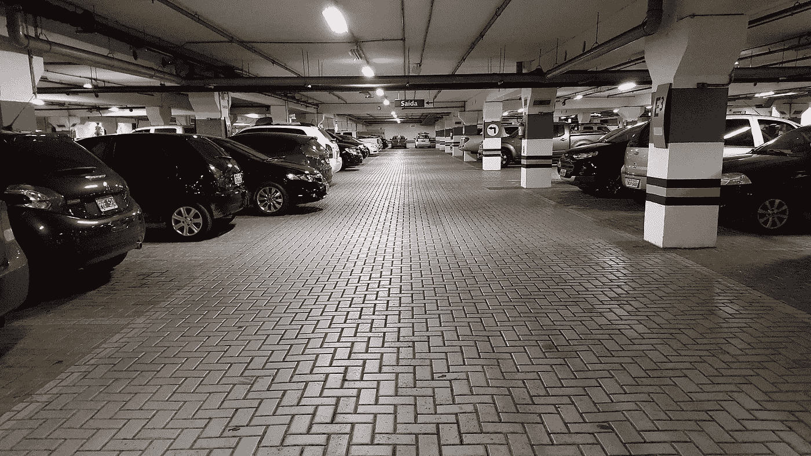

# 收养障碍和停车场

> 原文：<https://medium.datadriveninvestor.com/barriers-to-adoption-and-the-parking-lot-dc780500e378?source=collection_archive---------19----------------------->

Photo by Rachmaninoff / CC BY-SA ([https://creativecommons.org/licenses/by-sa/4.0](https://creativecommons.org/licenses/by-sa/4.0))

考虑让支付停车费变得更容易，有助于暴露技术采用的障碍。这些至少可以分为三个方面:技术、社会/市场和成本。对于每一个，增量改进都需要积累，直到它们足以克服现状。

假设我们想把车停在收费停车场。最理想的情况是什么？你开车到停车场，停好车，然后走开。与此相反的是，你找到很多，必须找到确切的变化，以支付服务员，哦，你必须离开他们的钥匙。你最好在下午 5 点之前回来，否则你会被堵在里面，等着其他人离开或者把他们的车开走。

 [## 新的健康技术如何让我们活过 100 岁？数据驱动的投资者

### 不久前，我们都在看一台黑色电视，不得不带着天线跑遍整个公寓，以确保…

www.datadriveninvestor.com](https://www.datadriveninvestor.com/2020/08/12/how-new-health-technology-makes-us-live-past-100-years/) 

在这种应用中，技术可能是最低的障碍。创建一个停车应用程序所需的大部分艰苦工作已经过去了。一种每个人都携带的设备已经存在，它可以输入文本、照片，并将位置精确到几厘米。推广、分发和更新应用程序的服务已经到位。实施安全的支付方式很容易。

不，真正的障碍是社交。市场是分散的。每个物主都使用自己的应用程序，并需要推广其应用。有市政拥有的地段有他们的应用程序，有私人拥有的使用他们的，使用频率会影响某人是否认为值得下载一个应用程序。人们使用应用程序很普遍吗？人们信任应用吗？这些都是其他社会因素。

这给我们带来了成本——金钱、时间和努力。对于我来说，找到应用程序，下载应用程序，验证应用程序，添加支付方式，注册我的汽车等是否值得？此外，这样做是否能节省我的钱，还是我必须添加一个可能最终会过期的余额？除非一个月不止一次使用停车场，否则可能不值得。

技术和一些社会努力可能有助于完全跨越障碍。如果基于摄像头的服务自动收费会怎样？没有停车罚单，只有按分钟付费的方式，你甚至可以将罚款重新标记为使用费或“调整费率”。付款可能与你的车牌有关。

仅仅克服一个技术障碍不足以被采用。还需要成本和社会接受度。

## 访问专家视图— [订阅 DDI 英特尔](https://datadriveninvestor.com/ddi-intel)