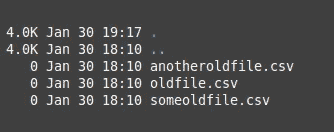
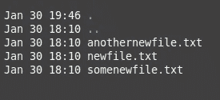
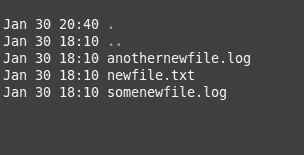

# Bash 系列:Linux 中的批量重命名

> 原文：<https://medium.datadriveninvestor.com/bash-series-bulk-renaming-in-linux-9cad3da34d1c?source=collection_archive---------17----------------------->

在现代发行版中，有几个工具可以帮助你重命名文件，但是这个脚本不需要任何额外的库/工具。


Photo by [Artem Sapegin](https://unsplash.com/@sapegin?utm_source=unsplash&utm_medium=referral&utm_content=creditCopyText) on [Unsplash](https://unsplash.com/s/photos/bash-script?utm_source=unsplash&utm_medium=referral&utm_content=creditCopyText)



List of files

如何将文件的“旧”部分重命名为“新”

**批量重命名 Bash 中的文件部分**

```
for file in *.csv; do 
    mv "$file" "$(echo "$file" | sed s/old/new/)";
done
```


List of files after renaming

**Bash 中的批量重命名扩展**

**方法一**

```
for file in *.csv; do 
    mv "$file" "$(echo "$file" | sed s/.csv/.txt/)";
done
```



List of files with new extension

**方法二**

这是为了演示条件重命名是否必须基于文件名或其他什么来完成。

在开始这个例子之前，让我们快速看一下一些文件处理的基础知识

```
file="/home/hello.txt"echo "given filename : ${file}"pathOnly=$(dirname "${file}")echo "displaying path only : ${pathOnly}"fileName=$(basename "${file}")echo "displaying filename ${fileName}"fileNameOnly=${fileName%.*}echo "displaying filename without extension ${fileNameOnly}"fileNameLength=${#fileNameOnly}echo "length: ${fileNameLength}"
```

如果文件名长度大于或等于 10，则重命名，否则保持不变。

```
for file in *.txt; do 

    pathOnly=$(dirname "${file}")

    fileName=$(basename "${file}")

    fileNameOnly=${fileName%.*}

    fileNameLength=${#fileNameOnly}

    echo ${pathOnly}, ${filenameOnly}, ${fileLength}

    if [ ${fileNameLength} -ge 10 ]; then
        mv "$file" "${pathOnly}/${fileNameOnly}.log"
    fi
done
```



Conditional rename