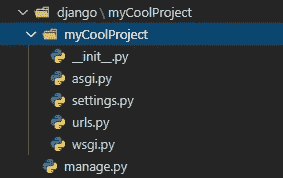
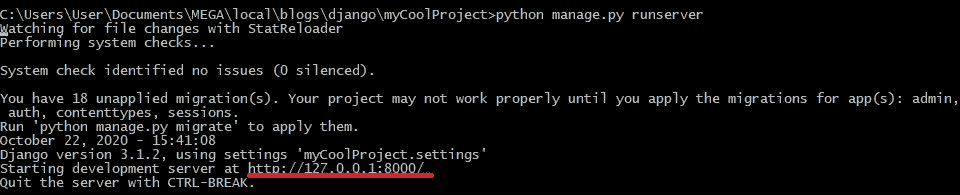
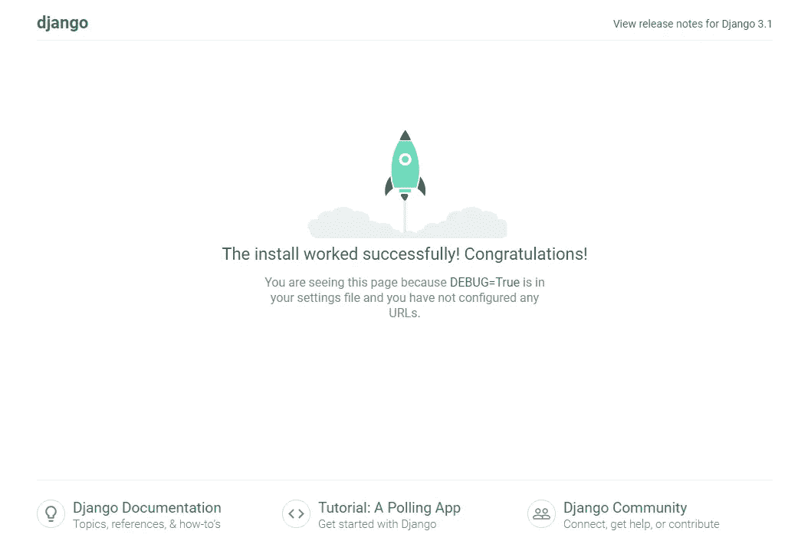
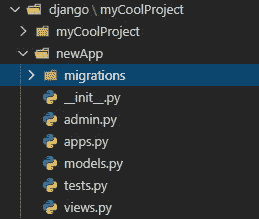
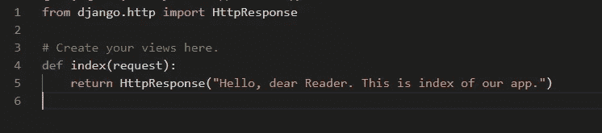
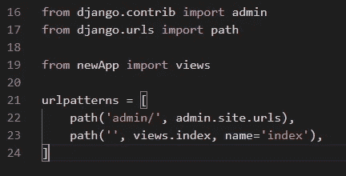
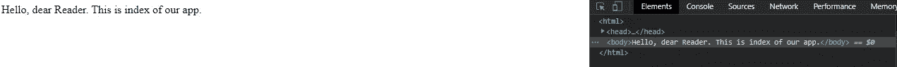
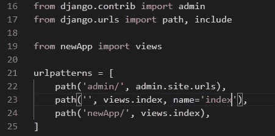

# Django 的基本应用

> 原文：<https://medium.datadriveninvestor.com/basic-application-with-django-3afab115bb9a?source=collection_archive---------12----------------------->

最后，我们来到了令人敬畏的 python 框架 Django，它允许您使用 Python 开发 web 应用程序。


Source: [https://pixabay.com/vectors/django-logo-django-project-339744/](https://pixabay.com/vectors/django-logo-django-project-339744/)

**先决条件**

首先确保您已经安装了 python 和 pip。然后让我们安装 Django:

```
*python -m pip install Django*
```

并检查它是否已安装并可以使用:

```
*python -m django — version*
```

如果你能看到 Django 库的一个版本，那么你已经准备好了。

**项目设置**

现在，让我们创建新的 Django 项目:

```
*django-admin startproject myCoolProject*
```

该命令将在您最近定位的目录中创建一个 ***myCoolProject*** 目录。它将在内部创建以下文件:



接下来我们可以 **cd** 进入***my coolproject****目录并启动服务器:*

```
*python manage.py runserver*
```

如果一切正常，您应该会在控制台中看到如下内容:



如果您在网络浏览器中打开 [http://127.0.0.1:8000](http://127.0.0.1:8000/) ,您应该会看到:



**新应用**

现在我们知道 Django 和项目环境已经准备好了，我们可以开发自己的应用程序了。首先，让我们创建一个:

```
*python manage.py startapp newApp*
```

这是新应用程序的文件结构:



**服务内容**

现在让我们创建视图来呈现 DOM 上的一些内容。查看它的描述，当用户点击我们的应用程序中的特定路线时，将提供给他们什么。视图可以在 app 目录下的 **views.py** 文件中找到。

[](https://www.datadriveninvestor.com/2020/10/23/fourier-transform-for-image-processing-in-python-from-scratch/) [## Python 中用于图像处理的傅里叶变换从零开始|数据驱动投资者

### 首先，处理数学问题真的很有趣。对吗？我知道答案可以是是也可以不是…

www.datadriveninvestor.com](https://www.datadriveninvestor.com/2020/10/23/fourier-transform-for-image-processing-in-python-from-scratch/) 

这是一个非常简单的视图，但是我们需要从简单的事情开始，然后增加复杂性和功能性:



我们从 Django 库中导入了 **HttpResponse** 方法。它将创建一个 **< body >** html 元素，并将我们提供的字符串作为参数放入其中。

接下来，我们需要打开项目(而不是应用程序)目录中的 urls.py，导入新创建的视图，并指定应该在哪个路径上呈现该视图:



现在，您可以刷新我们应用程序的索引页面，我们可以看到:



如果您想要修改路线，您可以指定您想要为哪条路线渲染哪个视图:



**结论**

万岁，我们的第一个应用程序已经和 Django 一起运行了！使用 python 进行 web 开发酷吗？我知道你同意我的观点！

下一次我们将创建一个 RESTful API，并学习 Django 如何处理模型和数据库。

不断学习，不断成长！

我们上 [LinkedIn](https://www.linkedin.com/in/pavel-ilin) 连线吧！

## 访问专家视图— [订阅 DDI 英特尔](https://datadriveninvestor.com/ddi-intel)