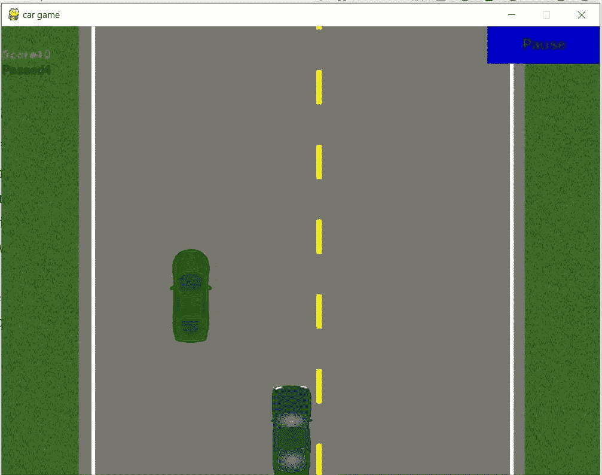

# 使用 Python 的基本汽车游戏(第 1 部分)

> 原文：<https://medium.datadriveninvestor.com/basic-car-game-using-python-part-1-afe2356d58da?source=collection_archive---------2----------------------->

让我们在这段隔离时间里学点新东西。我在这个疫情时间学会了这个小游戏，我想与你们分享。让我们开始编码…
为了更好地理解，我将把这次学习分成不同的部分。现在的问题是，我们到底在创造什么？
我们正在制作一款小型赛车游戏，这是我们在 90 年代玩过的游戏。是的，这是一款非常经典的赛车游戏，我们必须躲避屏幕上出现的所有其他汽车。

Classic Car-Game

*怀旧？*
让我们开始创造这个游戏，这样我们都可以珍惜它。
现在我假设你们都知道 python 的基础知识，因为我将使用 python 来创建这个游戏。制作这个游戏的第一个要求是在你的系统中安装 pygame。
**> > > pip 安装 pygame**
我们可以通过导入来检查这个模块是否已经安装在我们的系统中。通过这样做，我们将从 pygame 社区获得一些消息。

import pygame

如果你收到了上面的信息，我们可以开始了。如果没有，请随意分享您遇到的错误。

现在我们已经安装了这个模块，让我们开始编写代码。
首先通过**'**[**init()**](https://www.pygame.org/docs/ref/pygame.html#pygame.init)**'**方法初始化所有导入的 pygame 模块。
**> > >导入 py game
>>>py game . init()**
然后我们需要画一个屏幕/窗口，游戏将在上面进行。
**>>>screen =**[**py game . display . set _ mode((800，600))**](https://www.pygame.org/docs/ref/display.html#pygame.display.set_mode)
这个函数会创建一个显示面并接受元组中的自变量。这里， *800* 是宽度， *600* 是屏幕的高度。保存代码并运行，我们的系统会出现黑屏。

 [## 数据驱动的投资者|微软比 Chrome 有“优势”

### 简史我从来不是浏览器的粉丝，确切地说，我只是一个浏览器的粉丝，Chrome。这是我的…

www.datadriveninvestor.com](https://www.datadriveninvestor.com/2020/03/29/microsoft-having-an-edge-over-chrome/) 

如果你能坚持到现在，那就太棒了。如果你有任何关于上述代码的问题，请告诉我。我很快就会写这个游戏的第二部分。
到那时，继续编码继续学习！！！；)

如果你想看上面代码的视频，请点击 [*这里*](https://www.youtube.com/watch?v=ul-XHW-sTRo&lc=UgwPwFeVWfemjfSFYBt4AaABAg.98L2YreBBqB98L4A10sR2_&feature=em-comments) 。

我也写过一些关于其他游戏的文章，如果你对通过游戏学习编码感兴趣，请访问我的页面。请点击 [***这里***](https://medium.com/@asishraz) 告诉我，你觉得怎么样？