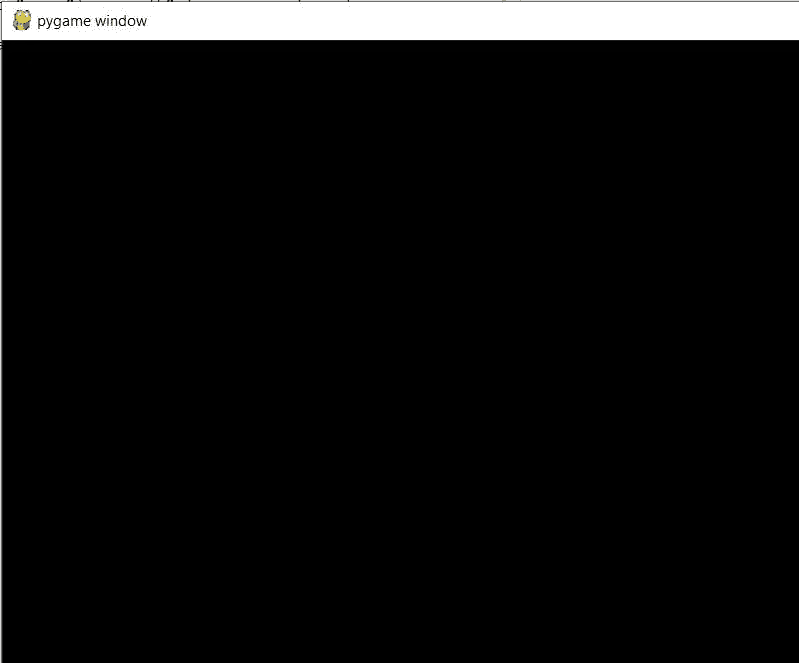
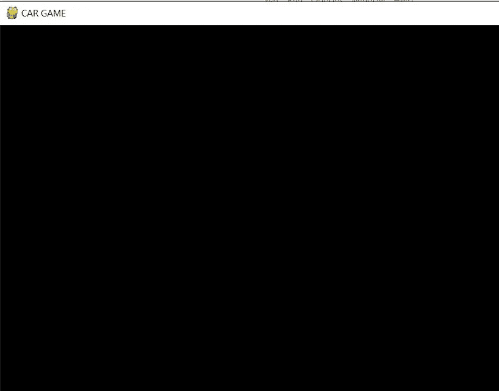
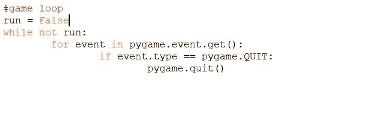

# 使用 Python 的基本汽车游戏(第 2 部分)

> 原文：<https://medium.datadriveninvestor.com/basic-car-game-using-python-part-2-24bdeb3506c1?source=collection_archive---------4----------------------->

我们已经创建了游戏屏幕，现在我们可以进行进一步的实现了。如果你错过了第一部分，请点击 [*这里*](https://medium.com/datadriveninvestor/basic-car-game-using-python-part-1-afe2356d58da) 。
起初，我们需要学习，如何更改控制台名称。正如我们所看到的，我们有默认的名字' **pygame window** '，这是可以改变的。

pygame window

[**py game . display**](https://www.pygame.org/docs/ref/display.html)模块中有一个方法叫做'[***set _ caption()***](https://www.pygame.org/docs/ref/display.html#pygame.display.set_caption)'。
>>>**py GAME . display . set _ caption("汽车游戏")**
保存代码并运行。我们可以看到，游戏控制台的名称改为“汽车游戏”。

CAR GAME caption

现在，我们将为窗口添加背景色。为此，我们必须填充屏幕/窗口表面以上的颜色。
>>>**【screen . fill((120，120，120))** [***【fill()***](https://www.pygame.org/docs/ref/surface.html#pygame.Surface.fill)方法负责用纯色填充表面。它接受元组中的参数。
这里的颜色格式是 [RGB](https://www.w3schools.com/colors/colors_rgb.asp) 。我们正在将背景颜色从黑色改为灰色。
写完这一行，我们需要通过[***update()***](https://www.pygame.org/docs/ref/display.html#pygame.display.update)的方法更新屏幕。否则，背景颜色将不会改变。这个**[***fill()***](https://www.pygame.org/docs/ref/surface.html#pygame.Surface.fill)是[***py game . display***](https://www.pygame.org/docs/ref/display.html)模块下的一个函数。
>>>**py game . display . update()****

****

**bg color of the console**

**在进一步之前，我们应该做一个游戏循环，在这里我们将添加游戏的所有功能。首先，取一个接受布尔值的变量。我们可以用这个变量来运行游戏循环。
>>>**run = False**
现在，每当条件为真时，游戏循环就会运行，一直运行下去，直到条件出错。
然后我们必须创建一个退出操作的逻辑，目前，我们无法关闭游戏窗口。让我们创建一个事件处理逻辑。
每当鼠标点击 ***十字(X)* 图标**时，窗口/屏幕应关闭。这可以通过事件处理来完成。**

** [## 数据驱动的投资者|微软比 Chrome 有“优势”

### 简史我从来不是浏览器的粉丝，确切地说，我只是一个浏览器的粉丝，Chrome。这是我的…

www.datadriveninvestor.com](https://www.datadriveninvestor.com/2020/03/29/microsoft-having-an-edge-over-chrome/) 

首先我们需要使用[***pygame . event***](https://www.pygame.org/docs/ref/event.html)模块，该模块负责与 py game 中的事件和队列进行交互。为了捕获事件，我们需要使用这个模块里面叫做*的方法。我们必须迭代这个方法并捕获事件类型，一旦事件类型为 [*pygame。退出*](https://www.programcreek.com/python/example/2557/pygame.QUIT) ，窗口关闭。
[***pygame . quit()***](https://www.pygame.org/docs/ref/pygame.html#pygame.quit)*方法，该方法未初始化所有 py game 模块。**

****

**保存代码并运行它，现在你可以看到当你点击关闭图标时，游戏窗口会消失或关闭。**

***太好了！！！* 这一节我们已经学完了，我希望你们都能理解这篇文章，并且能够执行我们在这一部分学到的所有逻辑。
如果您有任何问题，或者您不理解文章的任何部分，请随时提及或突出显示这些部分。我会帮助你们所有人。我会尽快发布下一篇文章。
万一，你想看上面代码的视频，请点击 [*这里*](https://www.youtube.com/watch?v=P_WDsCPhJZc&t=6s) 。我也写了一些关于其他游戏的文章，如果你有兴趣通过游戏学习编码，请访问我的页面。请点击 [***这里***](https://medium.com/@asishraz)*告诉我，你觉得怎么样？***

***在那之前，继续编码，继续学习！！！
-Gareeb 编码器*****