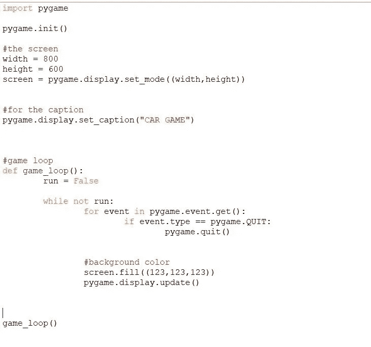
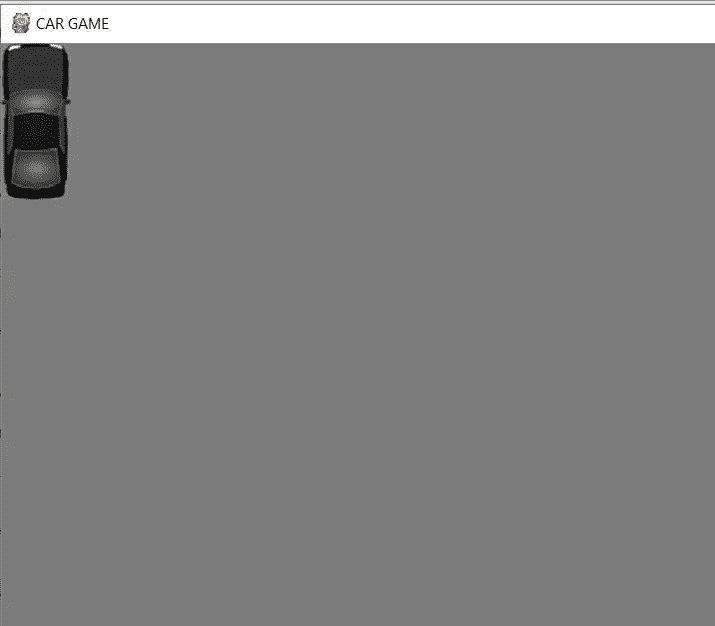
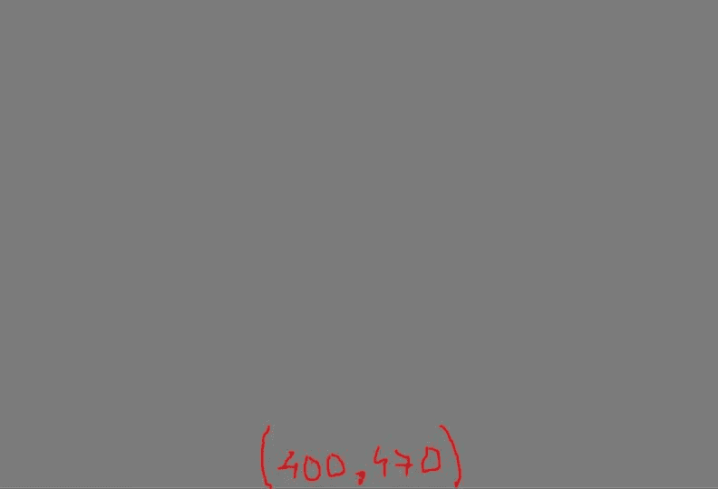
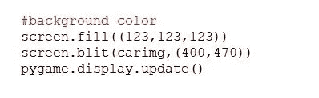
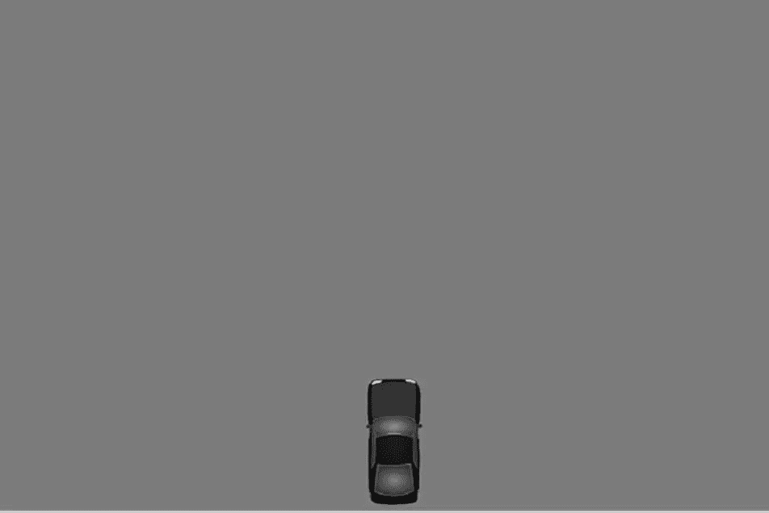
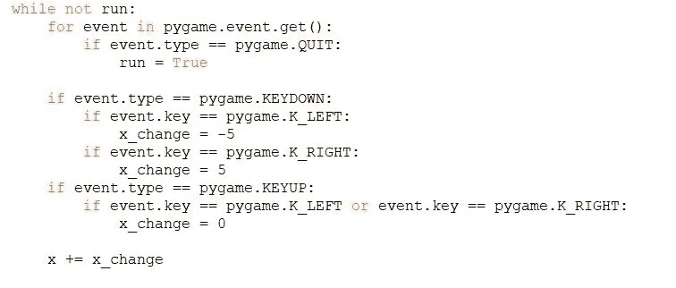
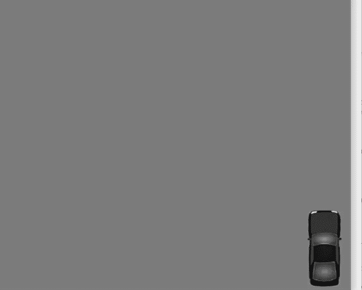
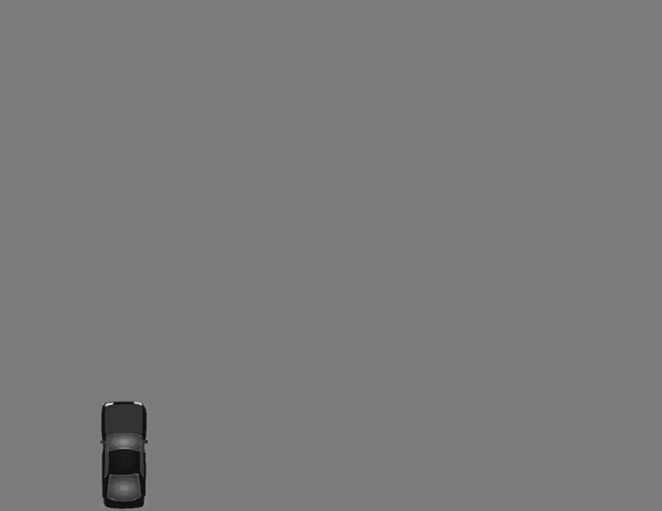

# 使用 python 的基本汽车游戏(第 3 部分)

> 原文：<https://medium.datadriveninvestor.com/basic-car-game-using-python-part-3-c35338ca7a50?source=collection_archive---------5----------------------->

在之前的[文章](https://medium.com/datadriveninvestor/basic-car-game-using-python-part-2-24bdeb3506c1)中，我们已经添加了关闭按钮的事件处理。在这篇文章中，我们将学习如何在屏幕上添加图像，以及每当我们按下箭头键时如何向左和向右移动图像。
= = = = = = = = = = = = = = = = = = = = = = = = = = = = = = = = = = =
*在继续之前，我只想展示一下我的代码，因为我已经对前面的代码进行了重组，并将建议做同样的事情，以便有更好的清晰度。
没什么复杂的，我刚刚添加了:
*几个变量为定值和
*创建了一个游戏循环函数。
= = = = = = = = = = = = = = = = = = = = = = = = = = = = = = = = = = = = =*

code restructure

现在，对于图像，我们应该首先学习如何在屏幕上加载图像。为此，我们在 pygame 中有一个名为' [**pygame.image**](https://www.pygame.org/docs/ref/image.html) '的模块。看一下文档网站， [*这里*](https://www.pygame.org/docs/) 。
对于加载图片，我们必须使用名为“[**pygame . image . load()**](https://www.pygame.org/docs/ref/image.html#pygame.image.load)”的方法。这个方法将从文件中加载一个新的图像。它接受一个参数，要么是文件名，要么是类似 python 文件的对象。
我们将使用上述方法添加汽车的图像。
>>>**carimg = py game . image . load(" car 1 . jpg ")**

所有的图片你都可以在线下载，或者我会在这里提供我的 GitHub 链接*，里面有所有相关的文件。
一定要把它下载到你上面代码所在的目录下，否则就要给出文件路径。*

* [## 数据驱动的投资者|微软比 Chrome 有“优势”

### 简史我从来不是浏览器的粉丝，确切地说，我只是一个浏览器的粉丝，Chrome。这是我的…

www.datadriveninvestor.com](https://www.datadriveninvestor.com/2020/03/29/microsoft-having-an-edge-over-chrome/) 

加载图像后，我们必须将该图像添加到屏幕上。在'[**pygame . surface**](https://www.pygame.org/docs/ref/surface.html)'模块中有一个叫做 [*blit()*](https://www.pygame.org/docs/ref/surface.html#pygame.Surface.blit) 的方法。
这里，*面*就是屏幕，我们要在这里添加图像。

> > > **screen.blit(carimg，(0，0))**

这里的 ***blit*** 方法接受两个参数。第一个是源，这是图像，我们必须在表面/屏幕上绘制。第二个是目的地，也就是我们必须在屏幕上绘制图像的确切位置。让我们用(0，0)坐标试试，看看汽车图像是从哪里加载的。保存并运行代码，如果一切正常，我们将看到如下内容:

car image

现在，我们希望将汽车图像添加到底部中间。坐标是，比如说 *(400，470)* 宽度是 800，高度是 600。

x,y cordinates

> > > **screen.blit(carimg，(400，470))**
该行必须添加在背景行之后，因为我们是在颜色更新之后添加该图像的。

car final cordinates

保存这段代码并运行它。我们现在将能够看到汽车如下:

现在，我们已经在屏幕上添加了汽车图像，让我们开始添加当我们点击箭头键时开始在两个方向上移动汽车的逻辑。
= = = = = = = = = = = = = = = = = = = = = = = = = = = = = = = = = = =
*我在这里给大家推荐创建一个在屏幕上添加汽车图像的功能。我个人的建议是在程序中创建越来越多的功能，让它看起来更好，更有条理。此外，我们可以通过在一个地方进行更改来修改功能。* = = = = = = = = = = = = = = = = = = = = = = = = = = = = = = = = =

> > > **def car(x，y):**
>>>**screen . blit(carimg，(x，y))**
这个 *x，y* 坐标，我们要在 *game_loop* 函数中定义。
> > > **x，y = 400，470**
最后，我们可以替换行:
>>>**screen . blit(carimg，(400，470))**
to:
>>>**car(x，y)**
保存它并运行代码。*恭喜你！你已经完成了本文的第一部分。现在，让我们进入第二部分。*

为了让汽车在两个方向上移动，我们必须处理事件处理，因为我们必须与事件和队列进行交互。再次， [**pygame.event**](https://www.pygame.org/docs/ref/event.html) 模块进入画面。
首先，我们必须看到事件类型，也就是说，我们要按下一些键吗？
如果是，那么我们将继续前进。
如果我们正在按键，那么我们必须处理 **KEYDOWN** 事件。
>>>**if event . type = = py game。KEYDOWN:**
这里面，我们要看按下的键是不是左箭头键:
>>>**if event . key = = pygame。K_LEFT:**
然后，我们必须将汽车移动到左侧，为此，我们必须定义一个变量来管理汽车的 x 坐标。首先，创建一个变量，给它赋一个零值，并把它保存在游戏循环函数中。
>>>**x _ change = 0**

现在每当我们按下左箭头键时，这个 *x_change* 值应该减少 **5px** (比方说)，每当我们按下右箭头键时，这个 *x_change* 值应该增加 **5px** 。整个代码应该是这样的:
**>>>if event . type = = pygame。KEYDOWN:
>>>if event . key = = pygame。k _ LEFT:
>>>x _ change =-5
>>>if event . key = = py game。k _ RIGHT:
>>>x _ change = 5**

如果我们保存上面的代码并运行它，我们可以看到，当我们按下任何箭头键时，汽车将不断地向那个方向移动，不会停在任何地方。
因为我们增加了按下按键不释放按键的逻辑。我们应该添加释放关键事件的逻辑*。完成上述代码后，我们必须编写释放按键的逻辑。
为了处理按键释放事件，pygame 中有一个模块叫做 [pygame。KEYUP](https://www.pygame.org/docs/ref/key.html)
**>>>if event . type = = pygame。KEYUP:** K_LEFT 或 event.key== pygame。k _ RIGHT:
>>>x _ change = 0
整个代码会是这样的:*

event handling logic

在最后一行，我们正在更新 x 坐标，否则，移动不会发生。尝试保存上面的代码并运行它。
如果你运行上面的代码，你会看到汽车的快速运动。

rapid movement

rapid movement

要控制这个动作，我们需要学习一个叫做' [**pygame.time** '](https://www.pygame.org/docs/ref/time.html) 的模块，负责监控时间。在这里，我们将控制帧速率。简单来说，汽车的这种运动完全是关于帧和帧速率的。为此，我们将创建一个对象来帮助跟踪时间或帧速率。
>>>clock = py game . time . clock()
在这里，[**py game . time . clock()**](https://www.pygame.org/docs/ref/time.html#pygame.time.Clock)会创建一个对象，来跟踪时间/帧。[**’。clock()**](https://www.pygame.org/docs/ref/time.html#pygame.time.Clock)' py game . time 模块负责那个方法。
现在我们要处理帧速率，为此有一个方法叫做“[***【tick()***](https://www.pygame.org/docs/ref/time.html#pygame.time.Clock.tick)”。

上面的方法接受一个参数，并且以毫秒为单位。在这样做之后，我们必须减慢汽车的速度。而在 pygame 中，如果我们想让某个东西的功能变慢，我们就用这个方法。在游戏循环中写下面这段代码，在我们调用汽车函数之后，然后更新屏幕。
**>>>【x，y】
>>>clock . tick(100)
>>>py game . display . update()**

*宾果*！！！如果你成功了，直到这一部分。如果没有，请在评论区分享这个问题。在接下来的部分，我们将学习一个非常基本的东西，添加所有的图像，使游戏更加真实和生动。我希望你喜欢这篇文章，如果你不让我知道我可以改进的地方。
而万一，你想看上面代码的视频，请点击 [*这里*](https://www.youtube.com/watch?v=naMhr44mUZM) 。我也写了一些关于其他游戏的文章，如果你有兴趣通过游戏学习编码，请访问我的页面。请点击 [***这里***](https://medium.com/@asishraz)*并告诉我，你觉得怎么样？*

*谢谢你。
继续编码，继续学习！！！
-Gareeb 编码器**