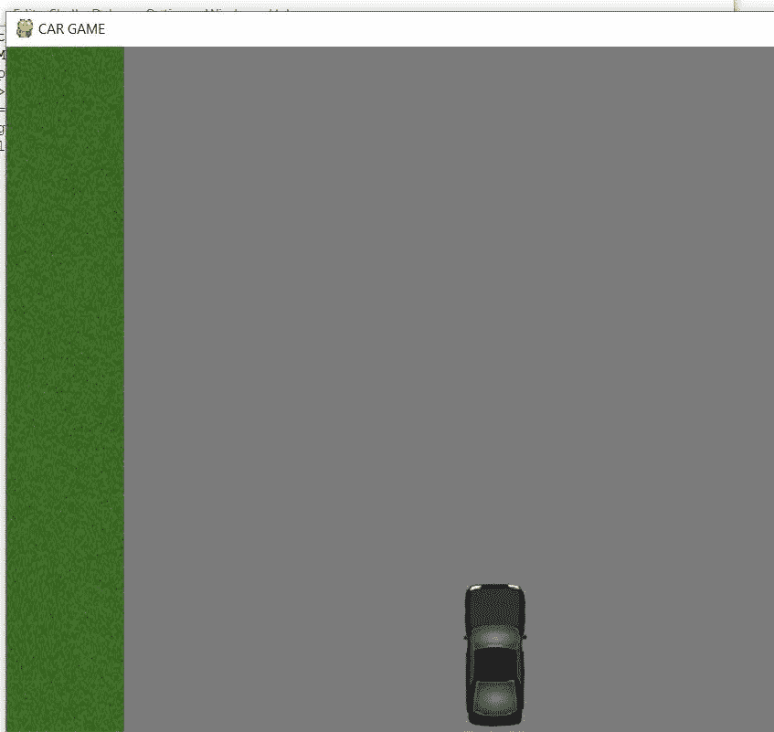
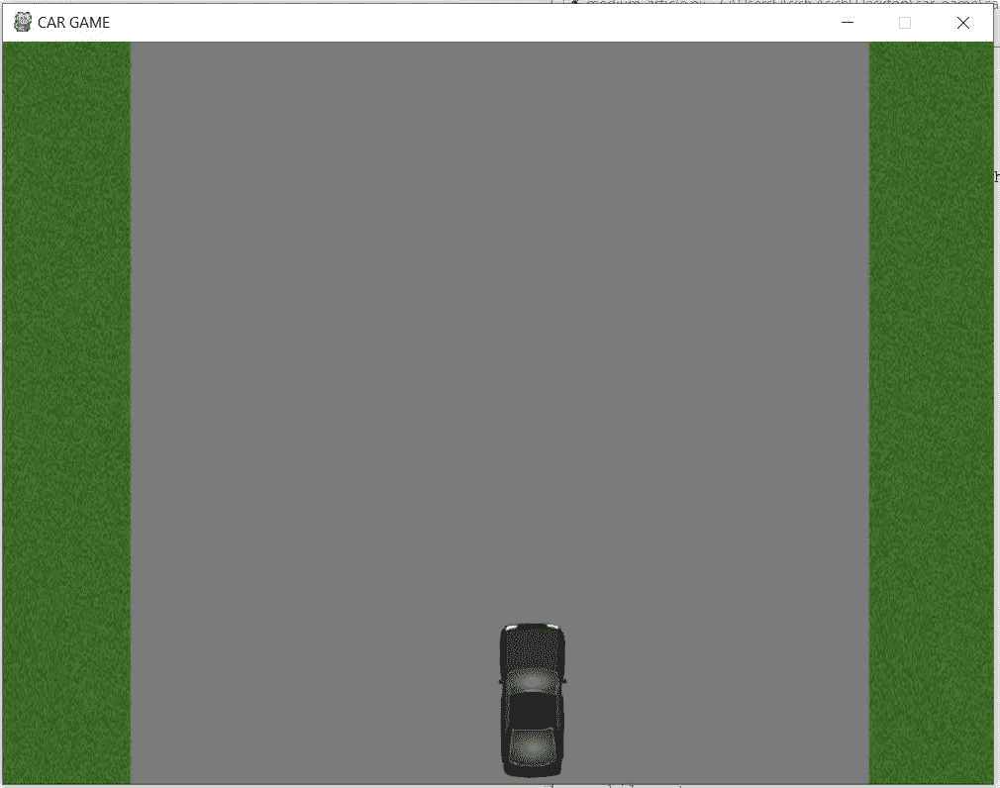
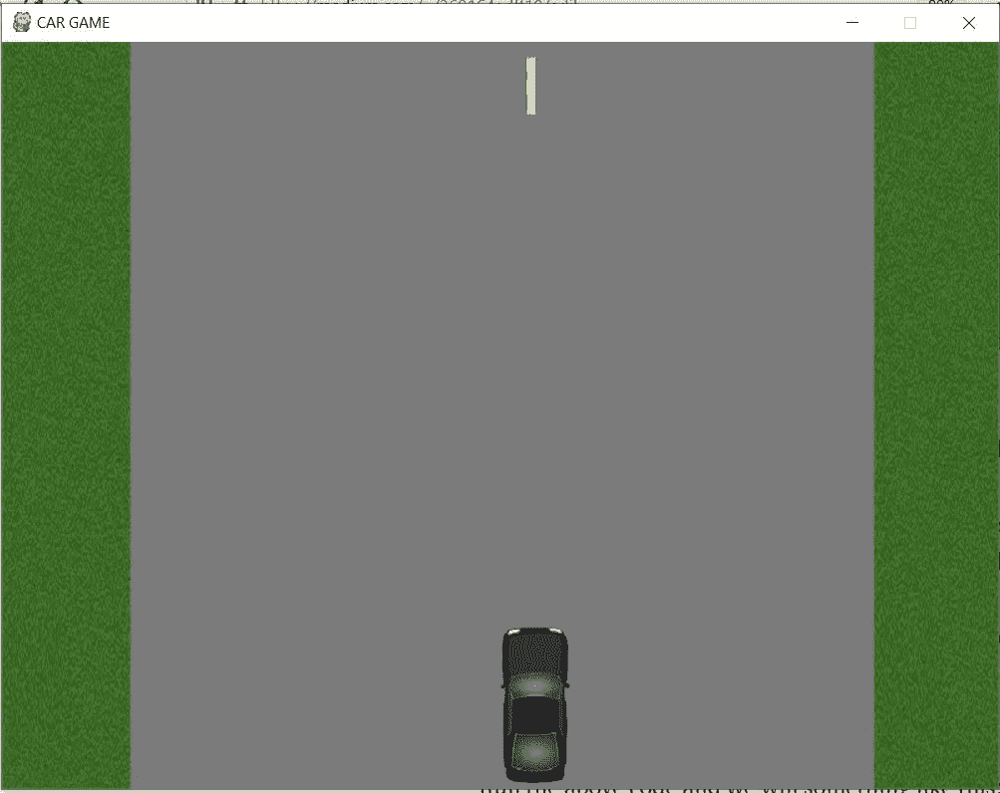
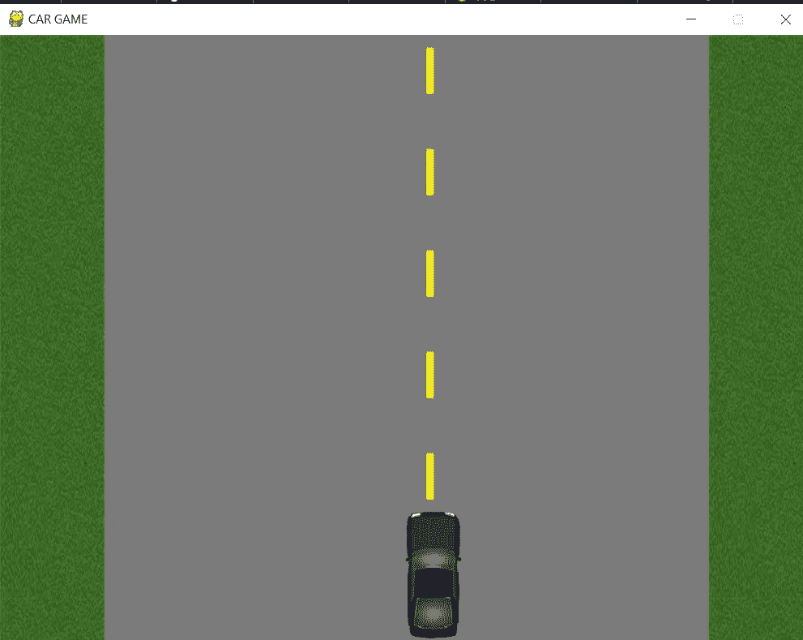

# 使用 python 的基本汽车游戏(第 4 部分)

> 原文：<https://medium.datadriveninvestor.com/basic-car-game-using-python-part-4-260164adff19?source=collection_archive---------6----------------------->

在上一篇文章中，我们已经学习了如何在屏幕上添加汽车图像，并在我们按下左右箭头键时向左右方向移动它，以防您想阅读，请点击 [*这里*](https://medium.com/datadriveninvestor/basic-car-game-using-python-part-3-c35338ca7a50) 。
在这篇文章中，我们将添加所有的图像，使游戏更加生动和游戏化。首先从我的 GitHub 链接 [*这里*](https://github.com/asishraz) 下载所有的文件/图片，保存在同一个目录下，你要保存代码的地方。

首先，添加游戏上的所有图片:
**>>>grass = py game . image . load(" grass . jpg ")
>>>yellow _ strip = py game . image . load(" yellow _ strip . jpg ")
>>>strip = py game . image . load(" strip . jpg ")**

我们将创建一个在屏幕上添加所有这些图像的函数，以便将来如果我们想修改任何东西，我们可以直接在函数中完成。
**>>>def background():
>>>screen . blit(grass，(0，0))**

首先通过调用这个函数检查图像是否出现在屏幕上。我们应该在背景色更新后调用这个函数。
**>>>screen . fill((123，123，123))
>>>background()**
保存代码并运行它，您将会看到这个图像。

grass image on left side

现在我们将在右边添加草的图像。
**>>>screen . blit(grass，(700，0))**
由于屏幕的宽度为 800，我们将 x 坐标设为 700。保存并运行代码，我们会看到类似这样的内容。

grass image both side

现在屏幕看起来更好了，我们将添加一些图像来完成它。让我们在屏幕或道路的中心添加黄色条。我们已经在游戏中加载了图像，我们只需要在某个点上 *blit* 它。
由于屏幕的宽度是 800，我们想在屏幕的中心添加这个黄色条，我们必须给出 400 作为 x 坐标位置。让我们将这段代码添加到后台函数中。
**>>>screen . blit(yellow _ strip，(400，0))**
运行上面的代码我们会看到这样的东西:

yellow strip

现在，我们必须在 x 轴上添加相同的黄色条带，但具有不同的 y 坐标，以便在同一行上对齐。

**>>>screen . blit(yellow _ strip，(400，100))
>>>screen . blit(yellow _ strip，(400，200))
>>>screen . blit(yellow _ strip，(400，300))
>>screen . blit(yellow _ strip，(400，**

运行代码。

yellow strip

现在，是时候添加道路边界了，即道路两侧的白色细线。
如果看到草图像的尺寸，草的宽度是 **100px** 。因此，如果我们想从左侧添加紧靠草地图像的细白线/道路边界，我们需要将 *x 坐标*指定为 **120** 。
**>>>screen . blit(strip，(120，0))**
从右边开始，我们要从屏幕的 *total-width* 中减去草地的宽度 **(800 -100)** 为了显示道路边界，减去 100，同样的，我们为左边的边界增加了 100px。
**>>>screen . blit(strip，(680，0))**

保存代码后，您将看到如下屏幕:

road border

***完美！！！*** 我们能够将相关的画面添加到屏幕上，让游戏更加真实生动。这是一篇小文章，我们只是添加了图片，仅此而已。下一部分，我们将学习如何给汽车添加限制，当汽车越过边界线时，游戏应该停止。我希望你喜欢这篇文章，以防万一你不让我知道我可以改进什么。

 [## 数据驱动的投资者|微软比 Chrome 有“优势”

### 简史我从来不是浏览器的粉丝，确切地说，我只是一个浏览器的粉丝，Chrome。这是我的…

www.datadriveninvestor.com](https://www.datadriveninvestor.com/2020/03/29/microsoft-having-an-edge-over-chrome/) 

而且万一你想看上面代码的视频，请点击 [*这里*](https://www.youtube.com/watch?v=lztW5fdLMMc) 。我也写了一些关于其他游戏的文章，如果你对通过游戏学习编码感兴趣，请访问我的页面。请点击 [***这里***](https://medium.com/@asishraz)*告诉我，你觉得怎么样？*

*谢谢你。
继续编码，继续学习！！！
-Gareeb 编码器*