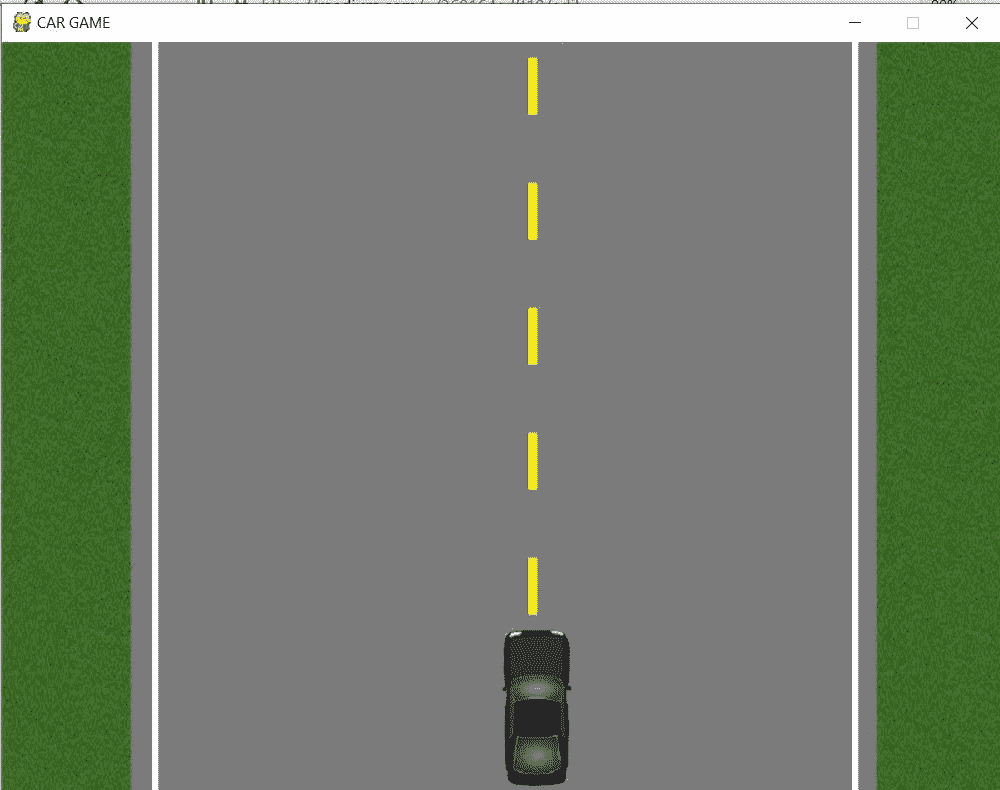

# 使用 python 的基本汽车游戏(第 5 部分)

> 原文：<https://medium.datadriveninvestor.com/basic-car-game-using-python-part-5-cec218211e05?source=collection_archive---------6----------------------->

在上一篇文章中，我们已经添加了屏幕上的所有图像，使其更加真实和生动。如果你错过了，请点击 [*这里*](https://medium.com/datadriveninvestor/basic-car-game-using-python-part-4-260164adff19) 。
在这篇文章中，我们将学习如何给汽车添加限制，这样如果汽车触及道路边界，游戏将结束或者窗户将关闭。让我们开始编码吧！！！

如果你看到这里，我们必须观察汽车的 x 坐标，只要它越过极限，游戏窗口就会关闭。变量**‘x’**负责 x 坐标移动，我们只需将逻辑应用于该变量。我们可以通过固定的数字来设置范围，或者我们可以使用一些变量来使代码看起来更好。

game screen

道路边界左侧从 *120 x 坐标*开始，右侧从 *680 x 坐标*开始，因此我们将在此范围内设置范围。

用更简单的话来说，我们可以这样说:
> > >如果 x < 120 或者 x > 680，
> > >那么关闭窗口。
如果我们编写上面的代码并运行它，我们会看到，即使汽车触及道路边界，游戏窗口也不会关闭，但当汽车越过一些边际距离时，它会靠近，尤其是在右侧。

 [## 数据驱动的投资者|微软比 Chrome 有“优势”

### 简史我从来不是浏览器的粉丝，确切地说，我只是一个浏览器的粉丝，Chrome。这是我的…

www.datadriveninvestor.com](https://www.datadriveninvestor.com/2020/03/29/microsoft-having-an-edge-over-chrome/) 

这是一个有趣的观察部分。
在左侧，当汽车触及道路边界时，屏幕会关闭，但在右侧不会发生同样的情况。由于我们称这辆车出现在坐标上为 **(400，470)** ，这辆车将出现在屏幕的左侧，我们必须看到这辆车也有一定的宽度，这一点我们不能忽略，我们必须提到这个宽度，以便对这辆车进行限制。
我们可以在汽车图像的属性中找到汽车宽度，并定义一个包含该宽度的变量。
**> > >车宽= 56**

现在，我们已经编写的上述条件可以修改如下:
**> > >如果 x < 120 或 x>680-car _ width:
>>>run = True** 这段特定的代码将在 car 函数之后编写，因为我们正在对 car 运动应用逻辑。
保存代码，我们将会看到，当汽车触及道路两边的边界时，游戏窗口将会关闭。
*就是这样。*这篇文章很短，也很容易理解其功能。正如我之前说过的，我更喜欢一点一点地写，而不是大文章。小文章不会花太多时间，可以有效学习。

我们学习了如何添加限制。我希望你喜欢这篇文章，如果你不让我知道我可以改进的地方。

而如果你想看上面代码的视频，请点击 [*这里*](https://www.youtube.com/watch?v=cgyY24fPSSk) 。

我也写了一些关于其他游戏的文章，如果你对通过游戏学习编码感兴趣，请访问我的页面。请点击 [***这里***](https://medium.com/@asishraz)*并告诉我，你觉得怎么样？*

*谢谢你。
继续编码，继续学习！！！
-Gareeb 编码器*