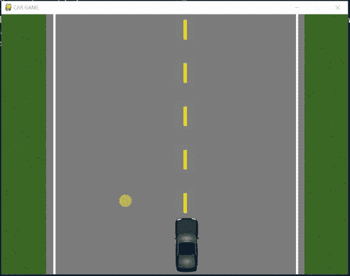
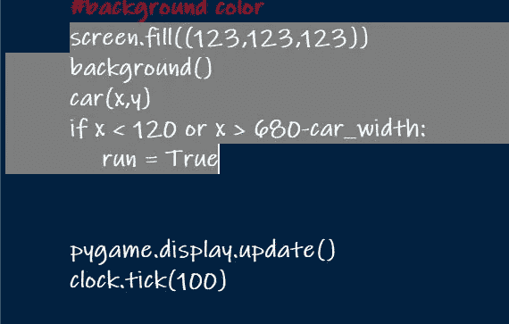
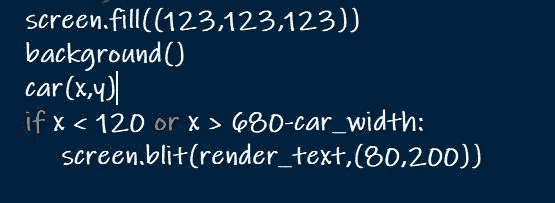
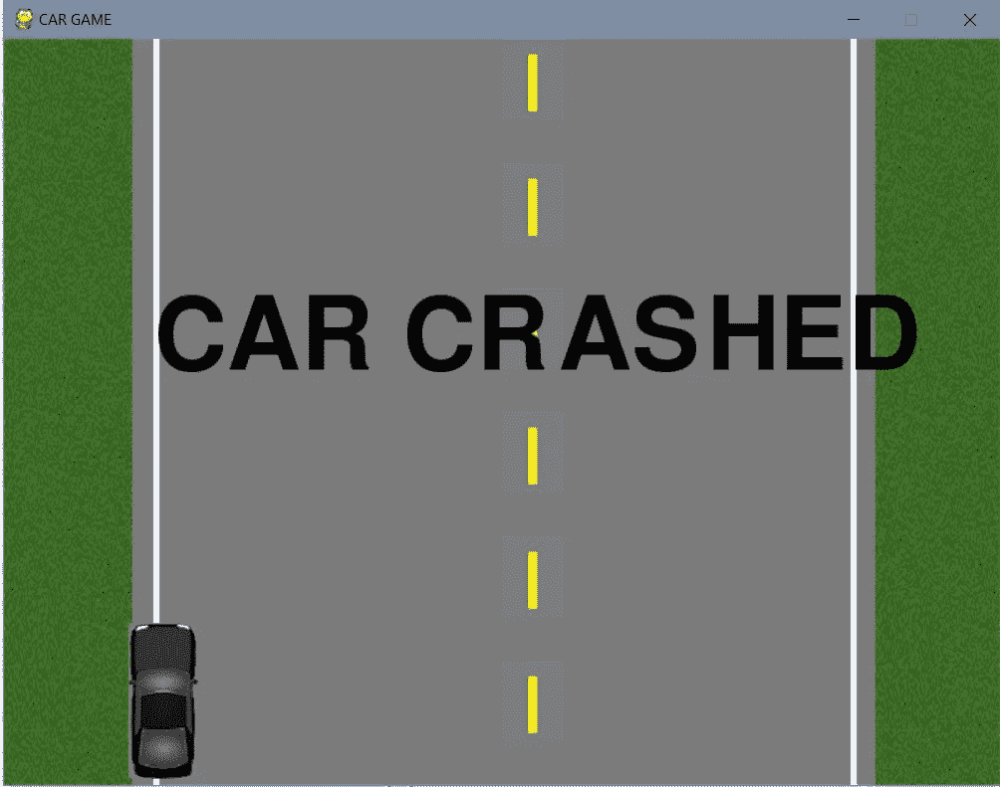
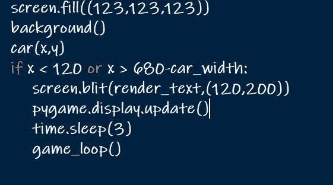

# 使用 python 的基本汽车游戏(第 6 部分)

> 原文：<https://medium.datadriveninvestor.com/basic-car-game-using-python-part-6-85a02fb2612d?source=collection_archive---------11----------------------->

在前面的 [*部分*](https://medium.com/datadriveninvestor/basic-car-game-using-python-part-5-cec218211e05) 中，我们学习了如何给汽车添加限制。现在，我们将向前迈出一步，在汽车触及道路边界时显示文本。

car_crash message

在游戏屏幕上显示文本有几种方法:
>>>[**【py game . Font . Font()**](https://www.pygame.org/docs/ref/font.html#pygame.font.Font])-从文件创建一个新的字体对象
>>>[**py game . Font . sys Font()**](https://www.pygame.org/docs/ref/font.html#pygame.font.SysFont)-从系统字体创建一个字体对象

在本文中，我们将讨论[***sys font()***](https://www.pygame.org/docs/ref/font.html#pygame.font.SysFont)。

SysFont()接受 4 个参数，其中 2 个是可选的。
*pygame . font . sys font(font name，size，bold = False {可选}，italic = Flase {可选})*

**>>>py game . font . sys font(None，' 100')** :
*这里的 **None** "是指默认的字体名称，在
方法中设置，大小为 **100** ( *说*)

> > >**my font = py game . font . sys font(" None "，100)**
我们已经为字体创建了对象。

*(注意:- Pygame 不提供直接在表面绘制文字的方式。)* 我们要使用 ***渲染*** 方法在这个字体方法里面绘制文本表面。这个渲染方法将创建文本的图像。我们在屏幕上添加图像的方式，和我们在屏幕上添加文本的方式一样。
Render()接受 4 个参数，其中 1 个是可选的。
*【pygame . font . render(text，antialias，color，background=None)*

> > >**render _ text = my font . render(" CAR-CRASHED "，1，(255，255，255))**
*这里，" **CAR-CRASHED** "是我们将在屏幕上显示的消息
***1**"是反锯齿值，当值为真时，它为文本提供*平滑边缘*，否则，如果值为假或'**，边缘会有点模糊
* **(255，255，255)** 将以 RGB 格式显示文本的颜色。**

现在，我们必须使用 **blit** 方法在屏幕上绘制这个文本对象。我在之前的文章中已经使用过 blit 方法，你也可以在这里 查看 blit 方法 [*的官方文档。*](https://www.pygame.org/docs/ref/surface.html#pygame.Surface.blit)

***注意*** *:-我们要在 road-border 逻辑的情况下写 blit 语句。*

car_crash logic

从上面的代码中删除“ **run=True** ”行，并编写:

> > > **screen.blit(render_text，(80，200))**

此后，代码将如下所示:

car_crash logic

运行代码，我假设我们会看到下面的输出:

CAR CRASHED

现在你可以根据自己的方便改变字体大小和颜色。
**>>>****my font = py game . font . sys font(" None "，120)
>>>render _ text = my font . render(" CAR CRASHED "，1，(0，0，0))
>>>screen . blit(render _ text，(120，200))**

我们可以看到这样的输出:

car crashed

最后一件事，当撞车的消息显示出来时，我们应该过一会儿重新开始游戏。我们不应该每次都重新运行代码，但我们应该写一个逻辑，这样几秒钟后，游戏应该重新启动。

 [## 用 Python |数据驱动投资者进行股票价格时间序列预测简介

### 在这个简单的教程中，我们将看看如何将时间序列模型应用于股票价格。更具体地说，一个…

www.datadriveninvestor.com](https://www.datadriveninvestor.com/2020/07/07/introduction-to-time-series-forecasting-of-stock-prices-with-python/) 

导入做以上事情的时间模块:
> > > **导入时间**

然后在 road_crash 逻辑中，显示完文本后，我们需要将计时器设置为 *3 秒*(比方说)然后，我们需要调用 **game_loop** 函数。

timer after crash

别忘了更新屏幕。

game restart

就这样…
我们学习了如何在游戏屏幕上添加文本。简短明了。我希望你喜欢这篇文章，如果你对上面的代码有任何疑问，请在评论区告诉我。
*乐意帮忙……*

而且万一你想看上面代码的视频，请点击 [*这里*](https://www.youtube.com/watch?v=rdWJDK-2Zv0) 。我也写了一些关于其他游戏的文章，如果你有兴趣通过游戏学习编码，请访问我的页面。请点击 [***这里***](https://medium.com/@asishraz)*并告诉我，你觉得怎么样？*

*谢谢大家！！！永远不要安定，永远不要匆忙！！！
☺
-加雷博编码器*

*(谢谢你的时间，请鼓掌鼓励我写更多。)*

***进入专家视角—** [**订阅 DDI 英特尔**](https://datadriveninvestor.com/ddi-intel)*