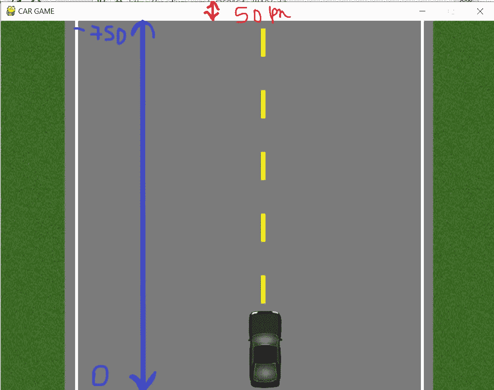

# 使用 Python 的基本汽车游戏(第 7 部分)

> 原文：<https://medium.datadriveninvestor.com/basic-car-game-using-python-part-7-6b1b58aeab2c?source=collection_archive---------7----------------------->

在前一部分中，我们学习了如何在汽车触及边界的那一刻在屏幕上显示文本。在这一部分我们将学习如何添加*敌人(汽车)*。简单来说，我们将学习如何使图像(汽车)从游戏屏幕的顶部落到底部屏幕。

enemy appearing

*在这篇文章和接下来的文章中，我将把汽车称为敌人或障碍。所以，不要迷茫。*

首先，我们需要画出障碍物(汽车)的速度。

**> > >障碍物 _ 速度= 10**
现在，让我们计数把障碍物计数取为零，然后我们会动态地增加它。
**> > > obs = 0**

由于障碍物会从屏幕顶部落到底部，我们需要一个变量来表示 y 坐标。

car coming from top to bottom

现在，我们的车正在改变 x 坐标上的位置，而敌人将改变他们在 y 坐标上的位置。因此，
**>>>y _ change = 0**

我们必须定义敌人在屏幕上出现的界限。我的意思是，敌人应该在公路边界的范围内，而不是在那之外。

enemy within this range

**>>>OBS _ x = random . rand range(200，650)**

然后，它也应该出现在 y 坐标的特定范围内。

> **>>>OBS _ y =-750**
> 下面的疑问就出现在这里:
> *问:为什么是 750 而不是其他值？
> 问:为什么是-750 而不是 750？
> 问:为什么不是 0？*

汽车应该从上到下出现，而不是从下到上，因此使用了*负号*，如果您看到上面的图片，则**‘0’**坐标将从屏幕底部开始，在顶部，屏幕标题区域有 50px，因此我们必须给出- **750** 作为起点。

 [## 用 Python |数据驱动投资者进行股票价格时间序列预测简介

### 在这个简单的教程中，我们将看看如何将时间序列模型应用于股票价格。更具体地说，一个…

www.datadriveninvestor.com](https://www.datadriveninvestor.com/2020/07/07/introduction-to-time-series-forecasting-of-stock-prices-with-python/) 

太好了…现在是时候对付敌人了，但是不知道敌人的大小，我们永远不应该公开战斗。让我们为我们的敌人定义维度。因为赛车和我们的赛车一样，所以尺寸保持不变。
**> > >敌人 _ 宽度= 56
> > >敌人 _ 高度= 125**

完成了声明部分。现在在窗口出现后快速更新障碍物速度。调用后台方法后，我们可以更新敌人的 y 坐标。
**>>>OBS _ y-=(障碍物 _ 速度/4)**

障碍物的 y 坐标正在更新。基本上，我的意思是:

Enemy appearing from top of the screen

现在，是时候为障碍创建一个函数了。
*(注:——我这里用到的所有图片都在我的 github repo 里，请在这里* *找到* [***)。)***](https://github.com/asishraz/game_learning)

obstacle function

首先，障碍函数将接受 *3 个参数*、 **x** 和 **y** 敌人的坐标，然后是 **obs** (敌人数量)
现在，根据敌人的数量，汽车的图像将被加载，在最后一行，借助于 blit 方法，汽车或敌人将出现在屏幕上。
现在，我们需要在更新敌人的 y 坐标后调用这个函数。
(注意:在调用障碍功能后，确保再次更新敌人的 y 坐标。)

为什么我们需要再次更新敌人的 y 坐标？当敌人从顶部走到底部时，它应该会从屏幕顶部再次出现。

updating the y-coordinate

就是这样。运行代码，您应该会看到类似如下的内容:

Enemy Appearing

我们已经学会了如何让敌人从屏幕的顶部掉到底部。我希望你喜欢这篇文章，如果你对上面的代码有任何疑问，请在评论区告诉我。
*乐于助人……*

而且万一你想看上面代码的视频，请点击 [*这里*](https://www.youtube.com/watch?v=AbA4nyiZYSA&t=29s) 。
我也写过几篇关于其他游戏的文章，请访问我的 [***页面***](https://medium.com/@asishraz) 如果你有兴趣通过游戏学习编码，请告诉我，你觉得怎么样？

谢谢大家！！！永远不要安定，永远不要匆忙！！！
☺
-加雷博编码器

> (谢谢你的时间，请鼓掌鼓励我写更多。)

**访问专家视图—** [**订阅 DDI 英特尔**](https://datadriveninvestor.com/ddi-intel)