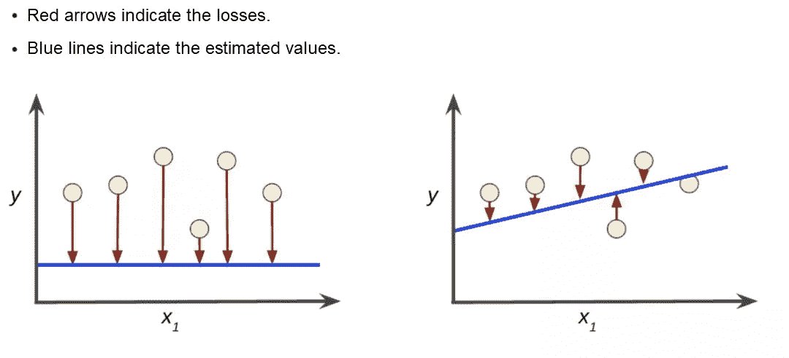
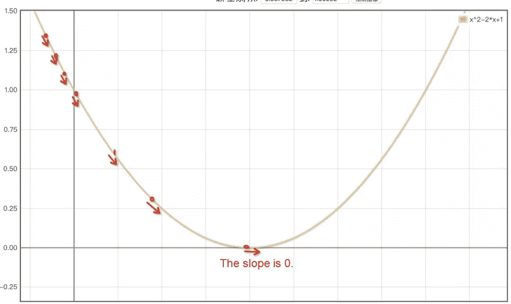
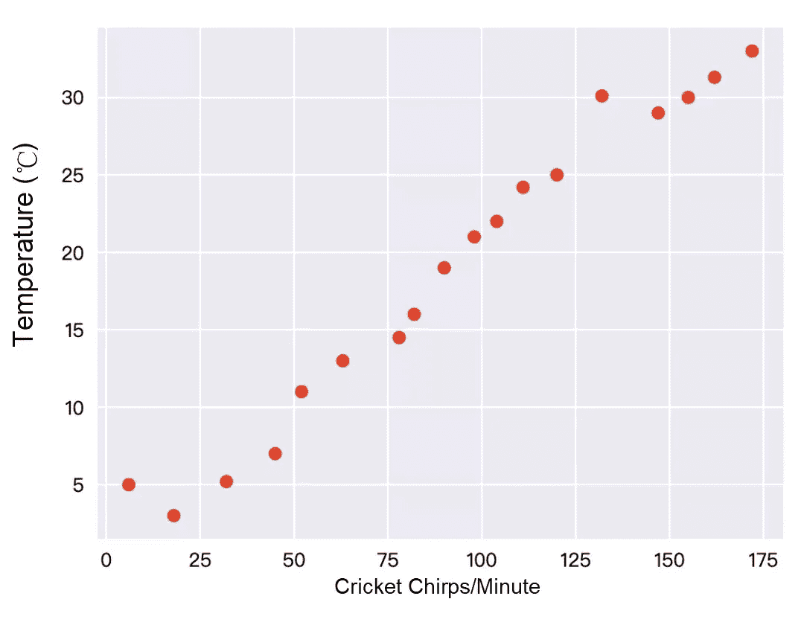
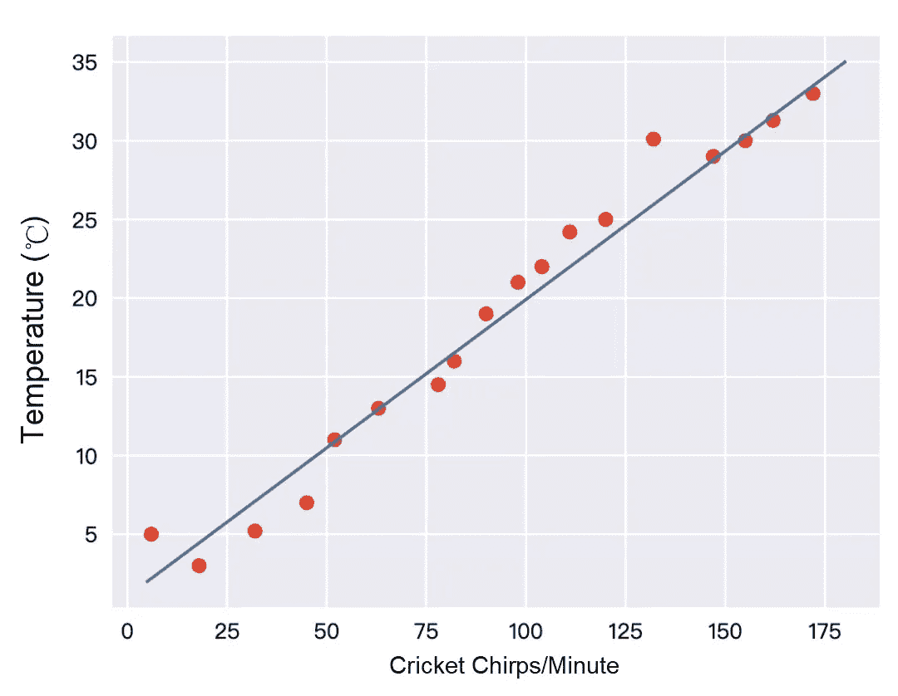
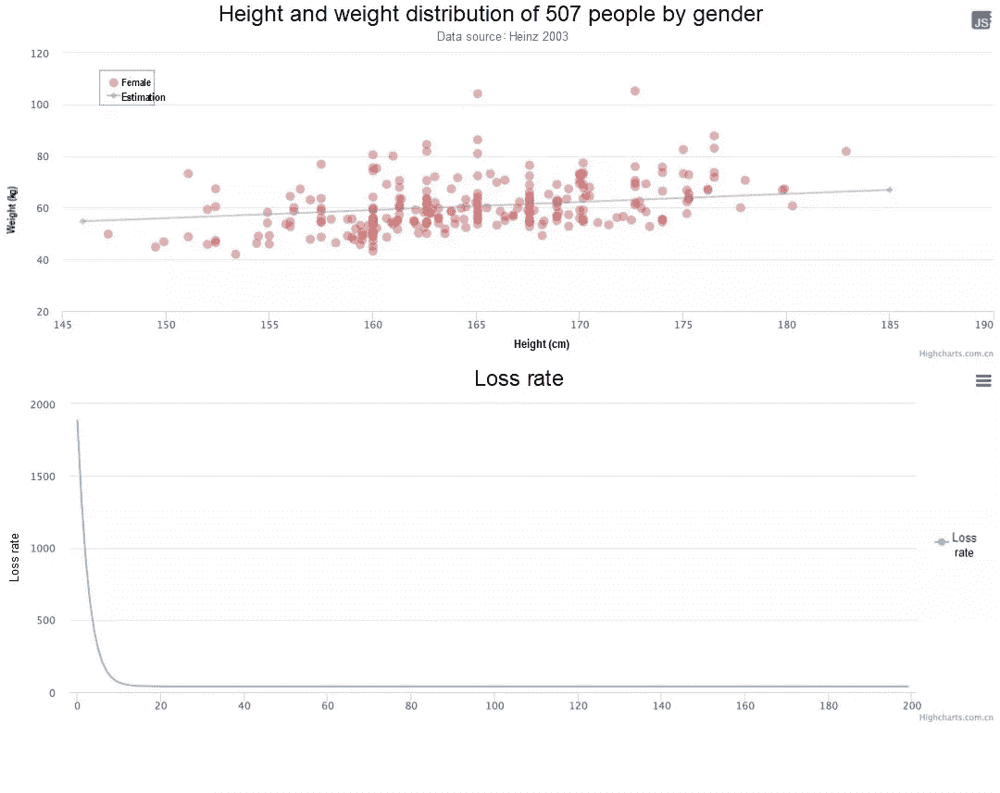

# 基础机器学习:如何识别一只猫

> 原文：<https://medium.datadriveninvestor.com/basic-machine-learning-how-to-recognize-a-cat-806b1049b71a?source=collection_archive---------22----------------------->


*由西夏*

# 1)什么是机器学习，我们为什么需要它？

什么是[机器学习](https://www.alibabacloud.com/product/machine-learning)？首先，我们来看两个例子。

## 我们如何学会认出一种动物是「猫」？

想象一下没见过猫的人，比如小婴儿。他们的词汇中甚至没有“猫”这个词。

有一天，他们看到了这样一只毛茸茸的动物:


他们不知道那是什么，你告诉他们那是一只“猫”。这时，他们可能会想起那是一只猫。

过了一段时间，他们看到了另一种这样的动物:


你告诉他们它也是一只猫。他们记得它也是一只猫。

后来，他们看到了另一种动物:


这时候他们直接告诉你，他们看到一只“猫”。

前面的方法是我们用来理解世界的基本方法，也就是模式识别:我们根据大量的经验得出结论，这是一只猫。

在这个过程中，我们通过接触样本了解了猫的特征，样本是各种各样的猫。我们通过阅读来学习，观察它们如何喵喵叫，以及它们长着两只耳朵、四条腿、一条尾巴和胡须的样子，从而得出结论。然后，我们知道了什么是猫。

## 我们如何将 npm 包识别为测试 npm 包？

下面是我的一个同事写的一段代码:

```
SELECT * FROM
  tianma.module_xx
WHERE
  pt = TO_CHAR(DATEADD(GETDATE(), - 1, 'dd'), 'yyyymmdd')
  AND name NOT LIKE '%test%'
  AND name NOT LIKE '%demo%'
  AND name NOT LIKE '%测试%'
  AND keywords NOT LIKE '%test%'
  AND keywords NOT LIKE '%测试%'
  AND keywords NOT LIKE '%demo%'
```

显然，我们的标准是模块名和关键字是否包含字符:test 或 demo。如果这是真的，我们认为这是一个测试模块。我们告诉数据库我们的规则，数据库帮助我们过滤掉非测试模块。

猫的识别本质上与测试模块的识别相同。两者都意味着寻找特征:

*   猫的特征:喵喵叫，两只耳朵，四条腿，一条尾巴和胡须
*   测试模块的特征:测试还是演示

这些特性可以进一步编程如下:

*   猫的特征:喵喵叫:真，耳朵:2，腿:4，尾巴:1，胡须:10
*   测试模块的特征:测试:计数> 0 或演示:计数> 0

有了这些特征，人和机器都可以识别一只猫或一个测试模块。

简单来说，机器学习就是利用特征及其权重来实现数据分类。这种简化的陈述是为了便于你理解。有关更多信息，请参见 ail learning/1。GitHub 的 master `apachecn/AiLearning`的 Basic Machine Learning.md。

## 我们为什么需要机器学习？

原因是当分类任务涉及大量特征时，很难使用“if-else”进行简单分类。以我们常见的商品推荐算法为例。为了识别某个产品是否应该推荐给某人，算法可能会涉及数百个特征。

# 2)如何训练机器，获取模型？

## 准备数据

数据准备可能占整个机器学习任务所消耗时间的 75%以上。所以是最重要也是最难的部分。主要步骤如下:

1)收集基础数据。2)去除异常值。
3)选择可能的特性:特性工程。
4)标记数据。

## 准备一个算法

用一个函数拟合您的数据:y = f(x)

例如，使用一个线性函数:y = ax + b

## 评估算法

使用一个评估函数来确定你是否找到了正确的“a”和“b”值。

评估函数描述了通过训练获得的参数和实际值之间的差异。这种差异也称为损失价值。下图显示了一个示例:



右边的蓝线更接近实际数据点。

最常见的损失评估函数是均方误差。该函数测量估计值和实际值之间的均方差，以判断估计值的质量。

如上图所示，示例中黄色小圆圈的坐标如下:

```
[
[x1, y1],
[x2, y2],
[x3, y3],
[x4, y4],
[x5, y5],
[x6, y6]
]
```

蓝线上的估计坐标如下:

```
[
[x1, y'1],
[x2, y'2],
[x3, y'3],
[x4, y'4],
[x5, y'5],
[x6, y'6]
]
```

因此，损失值为:

```
const cost = ((y'1-y1)^2 + (y'2-y2)^2 + (y'3-y3)^2 + (y'4-y4)^2 + (y'5-y5)^2 + (y'6-y6)^2 )/6
```

## 训练算法

**根据抛物线的最低点求 a 和 b 的适当值**

以前面的线性函数为例。训练一个算法，其实就是寻找‘a’和‘b’的合适值。如果我们在浩瀚的数字海洋中进行随机搜索，我们将永远找不到‘a’和‘b’的正确值。在这种情况下，我们需要使用梯度下降算法来找到‘a’和‘b’的适当值。

为了阐明目标，用 y = ax + b 替换前面计算损失值的公式

```
// Function 2
const cost = (((a*x1+b)-y1)^2 + ((a*x2+b)-y2)^2 + ((a*x3+b)-y3)^2 + ((a*x4+b)-y4)^2 + ((a*x5+b)-y5)^2 + ((a*x6+b)-y6)^2 )/ 6
```

我们的目标是找到使成本最小化的“a”和“b”值。有了这个目标，我们可能会直接去寻找解决方案。

你还记得中学时学过的二次函数吗，是二次方程:y = ax + bx + c？

虽然前面的代价函数看起来很长，但它也是一个二次函数。其图形大概如下:



只要能找到最低点的‘a’和‘b’值，就能达到目的。

**根据斜率确定抛物线的最低点，最低点为零**

假设我们随机初始化‘a’的值为 1，那么这个点在抛物线的左上部分，它仍然远离成本最小的最低点。

如上图所示，我们只需要增加“a”的值来接近最低点。然而，机器无法理解图形。在这种情况下，我们把目光投向本文中最复杂的数学知识:导数。此时切线的斜率就是这条抛物线的导数，比如上图中的最低点(斜率为 0)。

我们可以通过这个导数计算这里切线(斜红线)的斜率。如果这条斜线的斜率为负，说明 a 的值太小，需要增大才能更接近底部。相反，如果斜率为正，则意味着‘a’的值已经过了最低点，需要降低才能更接近底部。

如何才能找到一个成本函数的导数？

让我们看看下面的代码。要理解代码，先复习一下数学知识:偏导数以及如何求复合函数的导数。

```
// Function 3
// Partial derivative of a
const costDaoA = (((a*x1+b)-y1)*2*x1 + ((a*x2+b)-y2)*2*x1 + ((a*x3+b)-y3)*2*x1 + ((a*x4+b)-y4)*2*x1 + ((a*x5+b)-y5)*2*x1 + ((a*x6+b)-y6)*2*x1 )/ 6// Partial derivative of b
const costDaoB = (((a*x1+b)-y1)*2 + ((a*x2+b)-y2)*2 + ((a*x3+b)-y3)*2 + ((a*x4+b)-y4)*2 + ((a*x5+b)-y5)*2 + ((a*x6+b)-y6)*2 )/ 6
```

如果我们将“a”和“b”值带入 costDaoA 函数，我们会得到一个斜率，该斜率决定了如何调整参数“a”以更接近底部。

类似地，costDaoB 确定如何调整参数‘b’以更接近底部。

**运行 500 个周期**

如果你以这种方式运行 500 个周期，你可以非常接近底部并获得正确的‘a’和‘b’值。

## 获得模型

获得一个像 y = ax + b 这样的模型，我们可以用它来进行估计。

[](https://www.datadriveninvestor.com/2020/11/19/how-machine-learning-and-artificial-intelligence-changing-the-face-of-ecommerce/) [## 机器学习和人工智能如何改变电子商务的面貌？|数据驱动…

### 电子商务开发公司，现在，整合先进的客户体验到一个新的水平…

www.datadriveninvestor.com](https://www.datadriveninvestor.com/2020/11/19/how-machine-learning-and-artificial-intelligence-changing-the-face-of-ecommerce/) 

# 3)从一个简单的实践开始:线性回归

## 什么是线性回归？

众所周知，蟋蟀在炎热的天气里比在寒冷的天气里更频繁地鸣叫。我们已经在表格中记录了温度和每分钟蟋蟀的鸣叫，并在 Excel 中绘制了如下表格(案例来自 Google TF 的官方教程):



很明显，这些红点几乎在一条直线上:



所以我们把数据分布看成是线性的，画这条直线的过程叫做线性回归。有了这条直线，我们就可以精确地估算出任何情况下每分钟蟋蟀的鸣叫声。

## 使用浏览器演示线性回归

地址:测试梯度下降

【https://jshare.com.cn/feeqi/CtGy0a/share? SPM = ATA . 13261165 . 0 . 0 . 6 D8 C3 ebfiohvaq



我们使用 [highcharts](https://www.highcharts.com.cn/demo/highcharts/scatter) 进行数据可视化，直接使用 highcharts 的默认数据点，节省 75%的时间消耗。

训练完成后，图表上会覆盖一条蓝线，并添加每个训练周期的“a”和“b”值的损失率曲线。

## 代码描述

```
/*** Cost function and calculation of the mean squared error*/function cost(a, b) { let sum = data.reduce((pre, current) = >{ return pre + ((a + current[0] * b) - current[1]) * ((a + current[0] * b) - current[1]); },
    0); return sum / 2 / data.length;}/*** Calculate the gradient* @param a* @param b*/function gradientA(a, b) { let sum = data.reduce((pre, current) = >{ return pre + ((a + current[0] * b) - current[1]) * (a + current[0] * b); },
    0); return sum / data.length;}function gradientB(a, b) { let sum = data.reduce((pre, current) = >{ return pre + ((a + current[0] * b) - current[1]); },
    0); return sum / data.length;}// Number of training cycles
let batch = 200;// This is the speed at which the result value gets closer to the bottom in each cycle. It is also the learning speed. If it is too high, the result value will bounce around the lowest point. If the speed is too low, the learning efficiency will become lower.
let alpha = 0.001;let args = [0, 0]; // Initialized a and b values
function step() { let costNumber = (cost(args[0], args[1])); console.log('cost', costNumber); chartLoss.series[0].addPoint(costNumber, true, false, false); args[0] -= alpha * gradientA(args[0], args[1]); args[1] -= alpha * gradientB(args[0], args[1]); if ((—batch > 0)) { window.requestAnimationFrame(() = >{
            step()
        }); } else { drawLine(args[0], args[1]); }}step();
```

# 4)下一步是什么

当有更多的特征时，我们需要进行更多的计算，投入更多的时间进行训练，以获得一个训练模型。

在你看了前面的简单描述之后，机器学习现在对你来说肯定不再神秘了。参考比较专业的入门文章。

如果你有兴趣在阿里云上开始你的 AI/ML 之旅，请访问[人工智能机器学习平台(PAI)](https://www.alibabacloud.com/product/machine-learning) 页面了解更多信息。

**参考文献**

1)GitHub—Apache cn/AiLearning:AiLearning:机器学习— MachineLearning — ML，深度学习— DeepLearning — DL，自然语言处理—NLP
2)[https://developers . Google . com/Machine-Learning/crash-course/descending-into-ML/video-lecture？hl=zh-cn](https://developers.google.com/machine-learning/crash-course/descending-into-ml/video-lecture?hl=zh-cn)
3)从零开始学习机器学习:用 Python 实现梯度下降的分步指南

*本文观点仅供参考，不一定代表阿里云官方观点。*

# 原始来源:

[](https://www.alibabacloud.com/blog/basic-machine-learning-how-to-recognize-a-cat_596777) [## 基础机器学习:如何识别一只猫

### 阿里巴巴 Clouder 年 10 月 21 日 198 什么是机器学习？首先，我们来看两个例子。想象人们…

www.alibabacloud.com](https://www.alibabacloud.com/blog/basic-machine-learning-how-to-recognize-a-cat_596777) 

## 访问专家视图— [订阅 DDI 英特尔](https://datadriveninvestor.com/ddi-intel)