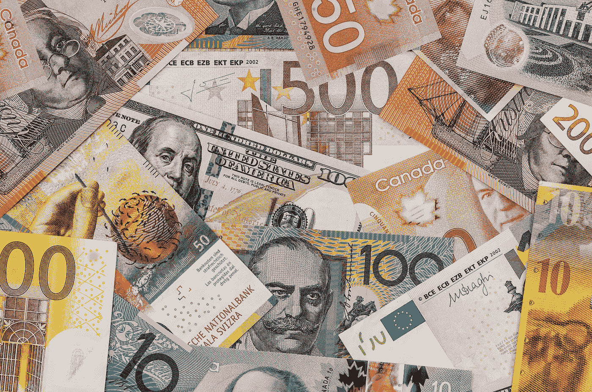
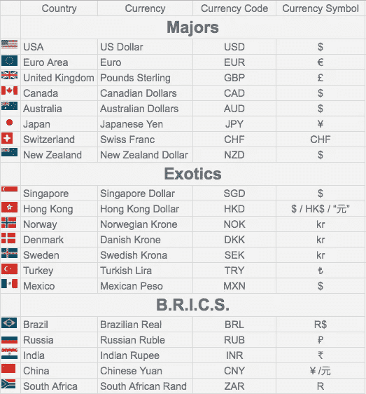
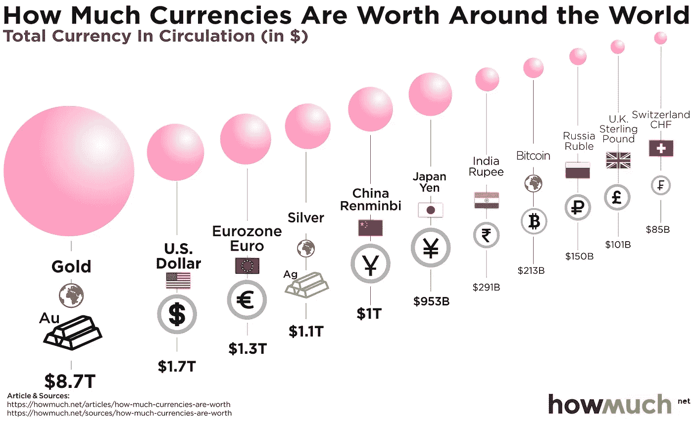
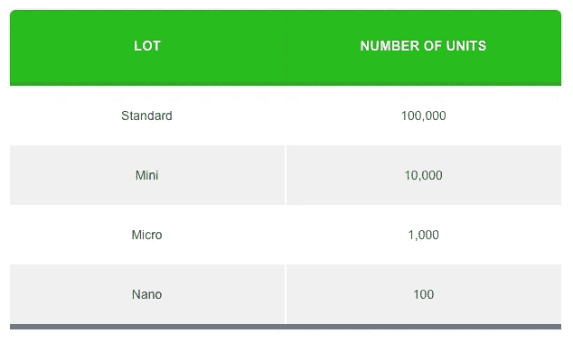
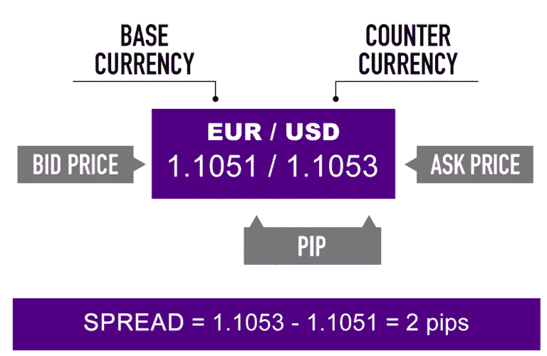

# 外汇交易的基本术语和鸟瞰图。

> 原文：<https://medium.datadriveninvestor.com/basic-terminology-and-a-birds-view-on-forex-trading-9e157ecf83c7?source=collection_archive---------8----------------------->

外汇是世界上最大的市场，每天的交易量超过 5 万亿，这是对这个市场的介绍，以及散户如何利用这些机会。

外汇市场(简称为 forex 或 FX)是所有货币相互转换的地方。

交易者从中获利的方法很简单。想象一下，我们已经旅行到了一个外国。我们离开了我们的祖国，比如说美国，去了法国。在我们真正去那里旅行之前，我们需要把美元兑换成欧元，这是法国的货币。我们将 1080 美元兑换成 1000 欧元，因为这是当前的汇率。假设我们在旅途中什么也没花，我们回到美国，我们想把我们的 1000 欧元换成美元。我们收回了 1090 美元，因为与此同时，欧元变得更强，因此价值更高。所以，我们的旅行给了我们 10 美元的利润。没有一个外汇交易者真正旅行。相反，他们通过自己的软件在线买卖这些货币。

# 世界货币

当今世界上 195 个国家中的大多数都有自己的单一货币。加拿大有加元，美国有美元，法国、德国和意大利都有欧元，等等。每种货币都有一个“货币代码”，一个“货币符号”，当然还有一个昵称。美元占全球外汇储备的 64%。外汇储备最多的国家依次是中国、日本、瑞士、俄罗斯、阿拉伯、印度、台湾、香港等。

# 外汇市场

外汇市场是一个场外交易市场，这意味着它不像纽约证券交易所那样位于一个单一的建筑中，而是分散在所有参与者中。外汇市场也是每周 5 天，每天 24 小时开放。查看我的"[交易时段、交易日和交易时间。](https://medium.com/@DimitriosOnline/trading-sessions-trading-days-and-trading-hours-2fc7862a145c?source=your_stories_page---------------------------)”了解更多有关该主题的详细信息。

这个市场最大的参与者是每个国家的中央银行。

## 主要中央银行

*   美国美联储系统—美联储
*   欧洲中央银行
*   英格兰银行
*   日本银行
*   SNB 瑞士国家银行
*   加拿大银行-中国银行
*   澳大利亚储备银行
*   新西兰储备银行

# 货币对

货币总是成对交易。我们把一种货币换成另一种。换句话说，我们卖一个去买另一个。

货币对中的第一种货币称为“基础货币”，第二种货币称为“报价”或“期限”货币。基础货币总是指一种货币，即一种货币对多种报价货币。这种比较回答了有多少报价货币在价值上等于一种基础货币的问题。在撰写本文时(2020 年 3 月 24 日)，1 瑞士法郎等于 0.95 欧元(或 95 美分)。当我们做多时，我们总是买入基础货币，卖出报价。反之亦然。

 [## 如何在不牺牲孩子或财务的情况下安全理智地离婚|数据驱动…

### 在美国，七月是以孩子为中心的离婚月。作为 cdfaⓡ的专业人士，我可以向你保证，从长远来看…

www.datadriveninvestor.com](https://www.datadriveninvestor.com/2020/07/28/how-to-divorce-safely-and-sanely-without-sacrificing-your-children-or-your-finances/) 

## 主要货币

大约 85%的外汇市场交易是由以下所谓的主要货币完成的。这些组合被认为比其他组合更可靠，流动性更强。

1.  美元
2.  欧洲的
3.  日元
4.  英镑
5.  瑞士法郎
6.  加拿大元
7.  澳元
8.  新西兰元

## 主要配对

一种主要货币对美元的货币对被称为主要货币对(或简称为主要货币)

1.  欧元/美元
2.  美元/日元
3.  英镑/美元
4.  澳元/美元
5.  美元/瑞士法郎
6.  新西兰元/美元
7.  美元/加元

## 次要配对

两种主要货币之间的货币对称为次要货币对(或简称为次要货币)。下面是其中的一些。

1.  欧元/加元
2.  欧元/澳元
3.  欧元/日元
4.  欧元/瑞士法郎
5.  欧元/英镑
6.  澳元/加元
7.  澳元/新西兰元
8.  英镑/加元
9.  英镑/瑞士法郎
10.  英镑/日元
11.  瑞士法郎/日元
12.  澳元/日元
13.  澳元/新西兰元
14.  新西兰元/日元

## 外来植物

任何其他两种货币之间的货币对被称为外来货币对(或简称为外来货币)。这些货币对由更有经验的市场参与者进行交易。在许多情况下，它们缺乏流动性，而且经常出现波动性峰值，这将会消灭任何新手的账户。

1.  日元/挪威克朗
2.  英镑/ZAR
3.  澳元/MXN 元
4.  欧元/尝试
5.  欧元/新加坡元
6.  欧洲/HKD
7.  美元/尝试
8.  美元/HKD
9.  美元/SEK
10.  美元/挪威克朗
11.  美元/DKK
12.  美元/ZAR
13.  美元/新加坡元
14.  美元/MXN
15.  新西兰元/新加坡元

# **大小和点数**

外汇市场的报价有四位小数。例如，欧元/美元目前为 1，0813，这意味着 1 欧元等于 1.0813 美元。如果汇率从 1，0813 上升到 1，1000，这意味着美元已经走弱，因为我们可以用 1 欧元买到更多的美元。另一方面，如果该指数升至 10000 点，则意味着美元兑欧元走强。

与所有其他货币不同的是，日元的交易价格是小数点后第二位。美元兑日元汇率为 111.29。

这第四个小数位，即 10813 中的“3”，被称为 pip。Pip 是一种货币可以移动的最小数量。Pip 代表“价格兴趣点”。在现代，许多经纪人在货币汇率中增加了第五位小数。这第五个小数位称为“移液管”。

如果欧元/美元汇率从 1，0813 移动到 1，0673，那么我们可以说该货币对移动了 140 个基点。(1,0813–1,0673 = 0.0140).这是我们计算一种货币波动幅度的方法。

外汇交易中计算头寸规模的标准称为“手”。一手等于基础货币的 100.000 货币单位。如果我们建立了 1 手欧元/美元多头头寸，这意味着我们想卖出 100.000 欧元，买入 108.130 美元。除了“标准批次”之外，还有一些较小的变化。Tere 是“迷你手(=10.00 单位的基础货币)”、“微手(=1.000 单位的基础货币)”和“纳手(=100 单位的基础货币)。

Screenshot from [https://www.babypips.com/learn/forex/lots-leverage-and-profit-and-loss](https://www.babypips.com/learn/forex/lots-leverage-and-profit-and-loss)

综上所述，我们可以说，当货币对 ABC/XYZ 的汇率为 1，0813 时，我们可以计算出 1 点等于 0，00009 (0，0001/1，0813=0，00009)。继续，如果我的仓位大小是 1 纳米手，那么我会赚或亏 0.009 单位(0.00009 * 100 = 0.009)。如果我的头寸规模是 1 手，那么我的利润或亏损(P/L)将是 9 (0，00009*100.000=9)。

# 杠杆和保证金

对于世界上大多数散户交易者来说，在一次交易中投入哪怕一个纳米量都是一个巨大的风险。为了让散户交易者更容易获得外汇，他们可以在自己舒适的家中用自己的钱进行交易，经纪商创造了杠杆。这个术语可以分析成四个简单的词“用更少的钱做更多的事”，或者用交易者的话来说，用更少的钱控制更大的仓位。当你准备开立一个模拟账户时，你可能已经看到了 20:1 或 100:1 的杠杆选择，或者任何其他数字选择。这仅仅意味着你用 1 控制 20 个货币单位的效果。例如，当您想以 100:1 的杠杆比率交易 1 个标准手时，经纪人会要求您投入 1.000 个货币单位，其余的由他们处理。这个要求的金额被称为“保证金”。

杠杆可以对我们有利，也可以毁掉我们的账户。我们可以用更少的交易赢得更多，但同样的金额也可能从我们的账户中损失。

当我们将账户设置为 100:1 杠杆时，我们可以通过投入 1000 美元交易 1 个标准手(100:1 然后 100.000 美元:1000 = >手数/杠杆=> 100.000/100 = 1000)。

# 出价、询问和传播

每个货币对都有一个汇率。事实上，当我们登录我们的平台时，有两个号码。“出价”和“要价”价格。

“要价”是交易者希望购买的价格。长期来看，“要价”、出价和购买基础货币是同等条件。

**“出价”是交易者出价卖出的价格。做空、“买入价”和卖出基础货币是同等条件。**

买价和卖价之间的差额被称为“差价”，这是经纪人获得的一种佣金形式。利差通常是变动的，并且取决于市场波动。如果我们对一个国家感到“害怕”,因此我们预计该货币会大幅上涨或下跌，那么利差通常会更高。

Image is taken from [https://www.babypips.com/learn/forex/make-money-trading-forex](https://www.babypips.com/learn/forex/make-money-trading-forex)

# 外汇衍生品

交易者可以像交易其他工具一样交易期货外汇期权。还有外汇交易所交易基金，其中包括一篮子货币。

# 外汇交易须知

新加坡企业家、作家、培训师、股票和外汇交易员 Adam Khoo 提到，由于外汇不具有任何内在价值(例如，与股票不同)，因此最好用于日内交易，而不是投资。

# 有趣的事实:货币和货币对的昵称。

## 单一货币

*   美元——美钞还是美元
*   欧元——单一货币还是光纤
*   英镑——英镑
*   瑞士法郎-瑞士法郎
*   加拿大元——加元
*   澳元——澳大利亚元还是澳大利亚元
*   新西兰元——Kiwi

## 货币对

*   英镑/美元对—电缆
*   美元/英镑对—巴尼
*   欧洲/俄罗斯废墟—贝蒂
*   英镑/日元对——孔雀鱼还是地鼠
*   欧元/日元对—欧元
*   美元/日元对—忍者
*   欧元/英镑对——英吉利海峡

*来源*

1.  https://www.babypips.com/learn
2.  [https://en . Wikipedia . org/wiki/List _ of _ countries _ by _ foreign-exchange _ reserves](https://en.wikipedia.org/wiki/List_of_countries_by_foreign-exchange_reserves)
3.  马里奥·辛格的 17 种成熟的货币交易策略

免责声明:

为了投资这些市场，你必须意识到风险并愿意接受它们。不要用你输不起的钱去交易。本文包含的信息仅用于教育目的，不作为任何特定投资的建议。在任何市场交易都有很高的风险，可能不适合所有的投资者。

**访问专家视图—** [**订阅 DDI 英特尔**](https://datadriveninvestor.com/ddi-intel)