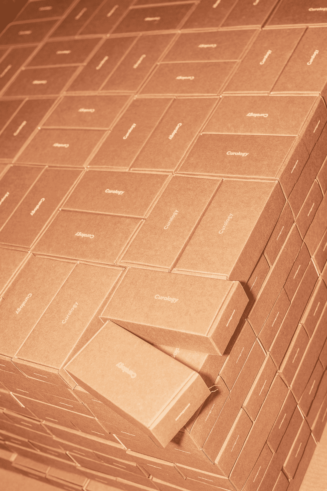
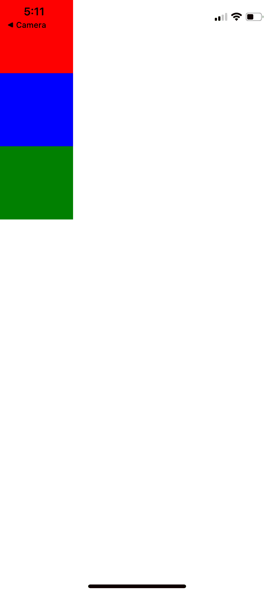
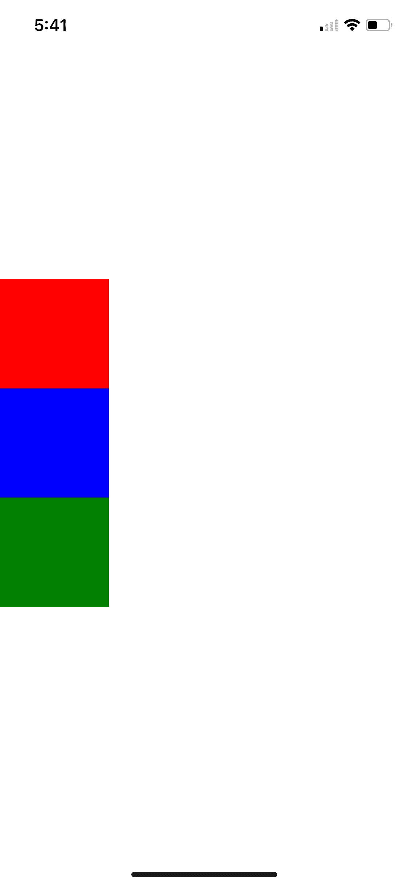
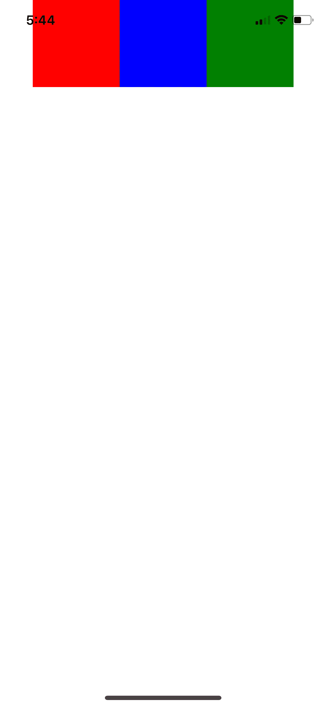
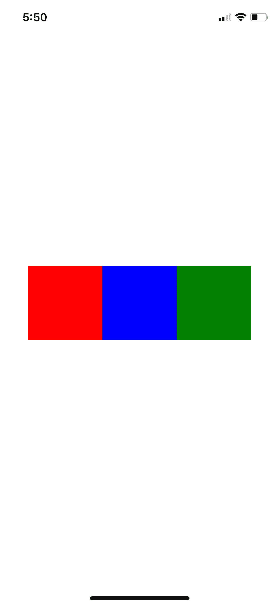

# 对具有 React Native 的 Flexbox 有基本的了解

> 原文：<https://medium.datadriveninvestor.com/basic-understanding-of-flexbox-with-react-native-5828f856b05a?source=collection_archive---------4----------------------->



Photo by [Curology](https://unsplash.com/@curology?utm_source=medium&utm_medium=referral) on [Unsplash](https://unsplash.com?utm_source=medium&utm_medium=referral)

# 什么是 Flexbox？

Flexbox 是一个 CSS3 web 布局模型。flex 布局允许容器内的响应元素根据屏幕大小(或设备)自动排列。

flex 布局最具定义性的特征之一是它能够根据其查看环境**调整**的形状。这就是为什么 flexbox 对 **React Native** 来说很棒。开发移动应用程序需要对布局进行详细的控制，因为设备类型差异很大。flex 容器中的单个项目也可以自动重新排序和重新排列，以适应可用的布局空间。

# 那么…我们如何在 React Native 中使用它呢？

除了一些例外，Flexbox 在 React Native 中的工作方式与在 web 上的 CSS 中的工作方式相同。默认是不同的， **flexDirection** 默认为**列**而不是行，flex 参数只支持单个数字。([https://react native . dev/docs/Flexbox #:~:text = Flexbox % 20 works % 20 the % 20 same % 20 way，only % 20 supporting % 20a % 20 single % 20 number。](https://reactnative.dev/docs/flexbox#:~:text=Flexbox%20works%20the%20same%20way,only%20supporting%20a%20single%20number.))

# 例子

```
import React, {Component} from 'react';
import {View} from 'react-native';export default class FlexBasics extends Component {
   render() {
     return ( <View style={{flex: 1}}>
         <View style={{width: 100, height: 100, backgroundColor: 'red'}}/>
         <View style={{width: 100, height: 100, backgroundColor: 'blue'}}/>
         <View style={{width: 100, height: 100, backgroundColor: 'green'}}/> <View />
     ) }}
```

使用上面的代码，它在一列中创建了三个不同颜色的框，因为除了 **flex: 1** 之外，我们没有指定 flexDirection 和任何其他属性。



这里，顶层组件中的 **flex: 1** 占据了整个空间。因为我们没有兄弟组件，所以 flex 的值完全是任意的。调用 flex: 8762895 会做和 flex: 1 一样的事情。

当我们有一些兄弟组件时，flex 值更重要。例如，如果一个组件是 *flex: 2* 而另一个是 *flex: 3* ，那么第一个占据屏幕的 2/5，第二个占据屏幕的 3/5。

现在，当我们包含另一个名为“ **justifyContent** ”的属性作为中心时，所有的框都将垂直移动，因为默认方向是在一列中。

```
import React, {Component} from 'react';
import {View} from 'react-native';export default class FlexBasics extends Component {
   render() {
     return (<View style={{flex: 1, **justifyContent: 'center'**}}>
         <View style={{width: 100, height: 100, backgroundColor: 'red'}}/>
         <View style={{width: 100, height: 100, backgroundColor: 'blue'}}/>
         <View style={{width: 100, height: 100, backgroundColor: 'green'}}/><View />
     )}}
```



我们可以通过添加“**flex direction”**将方向改为行。现在它把盒子带到水平居中的位置。

```
import React, {Component} from 'react';
import {View} from 'react-native';export default class FlexBasics extends Component {
   render() {
     return (<View style={{flex: 1, justifyContent: 'center', **flexDirection: 'row'**}}>
         <View style={{width: 100, height: 100, backgroundColor: 'red'}}/>
         <View style={{width: 100, height: 100, backgroundColor: 'blue'}}/>
         <View style={{width: 100, height: 100, backgroundColor: 'green'}}/><View />
     )}}
```



如果你想同时使盒子垂直居中，使用“**对齐项目**”它确定子对象沿次轴的对齐方式。当主轴是行时，副轴是列，反之亦然。

```
import React, {Component} from 'react';
import {View} from 'react-native';export default class FlexBasics extends Component {
   render() {
     return (<View style={{flex: 1, justifyContent: 'center', flexDirection: 'row', **alignItems: 'center'**}}>
         <View style={{width: 100, height: 100, backgroundColor: 'red'}}/>
         <View style={{width: 100, height: 100, backgroundColor: 'blue'}}/>
         <View style={{width: 100, height: 100, backgroundColor: 'green'}}/><View />
     )}}
```



耶！我们现在有完全居中的盒子了！

第一次看 flexbox 似乎很困惑，但一旦你了解了 flexbox 如何工作的基本概念，它就会成为一个超级强大的工具，可以在很大程度上增强你的移动应用程序的流量。

希望我的短博客让你开始获得你的第一个移动应用程序的设置，并将在 React Native 上带来更多有趣的内容！