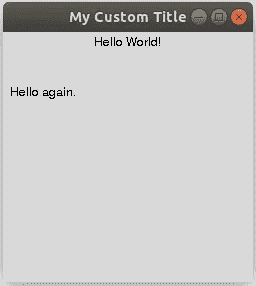
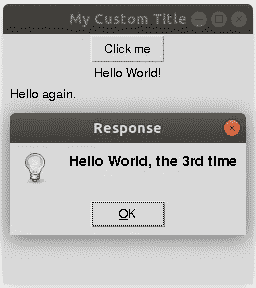
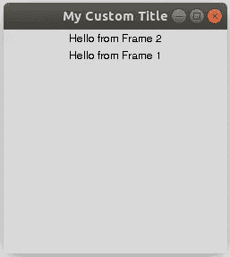

# Python 中 GUI 的基础知识

> 原文：<https://medium.datadriveninvestor.com/basics-of-gui-in-python-ebe098e613cd?source=collection_archive---------1----------------------->

## Tkinter 简介。


Photo by [Mimi Thian](https://unsplash.com/@mimithian?utm_source=unsplash&utm_medium=referral&utm_content=creditCopyText) on [Unsplash](https://unsplash.com/s/photos/laptop-work-from-home?utm_source=unsplash&utm_medium=referral&utm_content=creditCopyText)

# 介绍

Python 是我最喜欢的编程语言。它易于携带，功能多样，但功能强大。对于初学者和专家来说，Python 都是一个很好的选择。使用 Python 有很多原因。在我看来，主要原因之一是大量的开源 Python 库、包和框架。

有很多文章描述了 Python 的优势。例如，正如 [Mindfire Solutions](https://medium.com/u/7e34ea2384d4?source=post_page-----ebe098e613cd--------------------------------) 在 *7 篇你应该使用 Python 的重要原因* [文章](https://medium.com/@mindfiresolutions.usa/python-7-important-reasons-why-you-should-use-python-5801a98a0d0b)中提到的:“你可以使用 Python 开发复杂的科学和数字应用。Python 的设计具有便于数据分析和可视化的特性。”

我在研究中经常使用 Python。一些应用是科学计算、统计和高级可视化。但是在我的空闲时间，由于各种原因，我喜欢创建迷你应用程序。他们中的一些解决了一个特殊的问题，其他的只是为了好玩。例如，最近我用 Python 写了一个迷你应用程序来[追踪我的体重。想象一下，从一个用户友好的界面使用这个程序，而不是从终端运行它，那该有多酷！](https://medium.com/swlh/track-your-weight-with-python-4bf0cae42ef3)

类似地，您可以通过添加图形界面将您的程序升级到另一个级别。无论是简单还是复杂的应用程序，您都可以通过创建一个漂亮的界面来改进它。幸运的是，可以通过使用各种小部件(标签、按钮、框架等)来实现。).在这里，我们将讨论任何人如何使用 Python 创建图形用户界面(GUI)。

> 我想鼓励大家在日常生活中使用 Python。

因此，让我们把通过用用户友好的图形界面包装来改进程序的想法作为本文的座右铭。我写这篇文章是为了让你准备一个使用 GUI 的真实项目。所以，敬请关注。

# 让我们开始

## 什么是图形用户界面？

GUI 代表**图形用户界面**。它是一个界面，允许用户通过图形图标、按钮、滑块等与应用程序或设备进行交互。

## Python 中的 GUI

为了用 Python 创建一个图形用户界面，我们将使用一个 GUI 包，名为 ***Tkinter*** 。当然还有备选的 GUI 模块，比如 *PyGUI* 、 *PyGTK* 、 *wxPython、*和 *PyQT* 。

听说前一个包的 widgets 数量比上一个少。我无法判断哪个 GUI 包更好。我选择 Tkinter 是因为它是标准 Python 库的一部分。

> **注意:** *Tkinter 预装 Windows 和 macOS。* ***Linux*** *用户(包括我)需要运行以下命令来安装包:*
> 
> 对于 Python 3 *sudo apt-get 安装 python3-tk*
> 
> 对于 Python 2.7 *sudo apt-get 安装 python-tk*

## Tkinter 简介

对于 Python 2.7 和 Python 3，Tkinter 的用法有些不同。一般来说，两种选择都显示会更好。

我们知道，Python 2 自 2020 年 1 月 1 日起退役。现在，是 Python 3 大放异彩的时候了。所以，没有必要展示如何为两个版本的 python 使用 Tkinter。然而，如果您仍然处于从版本 2 到版本 3 的过渡阶段，了解这两种方式是很有用的。我还是会向你展示我的一些技巧。

# 来自 GUI 的 Hello World

## 导入包

首先，我们将导入系统模块`sys`来检查我们的 Python 版本。根据版本，我们将导入 Tkinter 包:

```
import sysif (sys.version_info.major == 3):
    print("Python 3")
    import tkinter as tk# for Python 3
else:
    print("Python 2")
    import Tkinter as tk# for Python 2.7
```

现在，我们可以使用 Tkinter `as tk`，甚至不用考虑我们拥有哪个版本的 python。导入这样一个包的另一种方式(对于懒人来说)是使用一个 *try-catch* 块并尝试导入两个版本。如果一个不工作，我们知道另一个将被正确导入:

```
try:
    import tkinter as tk# for Python 3
except:
    import Tkinter as tk# for Python 2.7
```

如果你想了解更多，我在这里解释了试抓块[的基本原理。](https://medium.com/swlh/track-your-weight-with-python-4bf0cae42ef3)

[](https://www.datadriveninvestor.com/2020/07/07/introduction-to-time-series-forecasting-of-stock-prices-with-python/) [## 用 Python |数据驱动投资者进行股票价格时间序列预测简介

### 在这个简单的教程中，我们将看看如何将时间序列模型应用于股票价格。更具体地说，一个…

www.datadriveninvestor.com](https://www.datadriveninvestor.com/2020/07/07/introduction-to-time-series-forecasting-of-stock-prices-with-python/) 

## 我们的第一扇窗户

现在，我们需要创建一个 ***窗口*** ，它是根/基元素。所有其他部件(标签、按钮等。)留在根窗口内。窗口类似于一个容器。让我们创建一个名为`root`的空窗口。

> **注意:** *记住，如果我们调用事件循环* `*mainloop()*` *，窗口会在一瞬间消失。*

```
root = tk.Tk()#Call the event loop
root.mainloop()
```

结果，我们应该在屏幕上的某个地方得到一个空的小窗口。我们可以用一个`geometry()`方法手动设置根窗口的大小。放在`mainloop()`函数之前就行了。让我们也用一个`title()`功能为这个窗口设置一个标题:

```
root.geometry("250x250")
root.title("My Custom Title")
```

这导致了类似这样的结果:


Made by Author

## 添加标签

现在，我们可以开始添加标签和按钮了！每一个初学者的程序都是从对世界的问候开始的，所以让我们也说“你好，世界！”使用我们的 GUI 程序:

> **注意:** *要在窗口/框架上放置一个小部件，我们需要使用默认的* `*.pack()*` *或* `*.place(x=x, y=y)*` *方法*显式地告诉 tkinter 去做

第二种方法需要坐标(x，y)来放置小部件。点 **(x=0，y=0)** 是窗口/框架的**左上角**。让我们看看，如何使用这两种方法:

```
# Adding the labels inside a root window
label_1 = tk.Label(root, text="Hello World!")
label_1.pack()label_2 = tk.Label(root, text="Hello again.").place(x=5, y=50)
```

> **注意:** *我们可以直接在对应的 widget 后应用* `*.pack()*` *或* `*.place()*` *方法来保存这一行代码。在上面的例子中，我为第二个标签* `*label_2*` *做了这个。*

结果，我们得到这样的东西:



Made by Author

## 添加按钮

到目前为止，我们还没有与我们的应用程序进行交互。现在，是时候添加一些交互性了！让我们创建一个按钮并添加一些功能。例如，我们可以创建一个带有“Hello World，第三次”字样的消息框。要使用一个`messagebox`，我们需要如下导入它:

```
from tkinter import messagebox # for Python 3
import tkMessageBox # for Python 2.7
```

要添加一个按钮部件功能，我们需要定义一个函数并在参数`command`中传递它。我们将调用函数`do_something`:

```
def Do_Something_Button():
    '''
    the following line of code show messagebox
    '''
    messagebox.showinfo(title = 'Response', message = "Hello World, the 3rd time")
    #tkMessageBox.showinfo(title = 'Response', message = "Hello World, the 3rd time") # for Python 2.7button = tk.Button(root, text = "Click me", command = Do_Something_Button).pack()
```

单击该按钮后，我们会看到一条弹出消息，如下所示:



Made by Author

## 创建框架

在我们结束本教程之前，最后一点信息是**框架**小部件。框架就像其他小部件的容器。框架和窗口的区别在于*一个窗口可以有多个框架*。

使用框架并在框架上放置小部件的美妙之处在于小部件的组织。我们可以通过只移动它们被分配到的框架来一起移动所有相关的小部件。而不是单独定位每个小部件。

此外，我们可以保持同一个窗口打开，只在框架之间切换。例如，我们可以破坏当前的框架并在上面创建新的框架。让我们简单描述一下框架的一般用法。

我们分配框架的方式与分配任何其他小部件的方式相同，例如，使用`.pack()`方法分配它并将其放置在窗口上。为了给一个特定的框架分配一个小部件，我们使用这个小部件的`master`参数。记得将这段代码放在`root`窗口和`mainloop()`窗口之间:

```
frame = tk.Frame()
label = tk.Label(master=frame, text="Hello from Frame").pack()
frame.pack()
```

在使用这些小部件开始一个真正的项目之前，让我们再运行一个例子吧！让我们创建两个带有两个标签的框架。看看将一个框架放在另一个框架上如何影响分配给它们的标签:

```
frame_1 = tk.Frame()
label_f1 = tk.Label(master=frame_1, text="Hello from Frame 1").pack()frame_2 = tk.Frame()
label_f2 = tk.Label(master=frame_2, text="Hello from Frame 2").pack()frame_2.pack()
frame_1.pack()
```

结果应该显示在`label_1`之上的`label_2`，因为我们已经在第一个`frame_1`之前初始化了第二个`frame_2`(`.pack()`):



Made by Author

当然，在 GUI 和 Tkinter 包的框架中还有很多小部件和特性可以讨论。但我认为这是额外的信息。因为，在下一篇文章中，我们将讨论如何使用这里讨论的小部件[创建一个生产力应用程序](https://medium.com/@ruslan.brilenkov/create-productivity-app-in-python-from-scratch-part-1-d715d1f393db)。所以，敬请期待！

我希望你喜欢阅读这篇文章，并学到一些新的东西。如果你对在个人生活中使用 Python 感兴趣，比如如何使用 Python 追踪体重，可以看看我之前的[文章](https://medium.com/swlh/track-your-weight-with-python-4bf0cae42ef3)。同样，如果你对应用 Python 知识研究科学医学论文中的冠状病毒感兴趣，这里有[另一篇文章](https://medium.com/swlh/analyzing-covid-19-papers-with-python-part-1-22706eb92270)。

# 接触

在 [LinkedIn](https://www.linkedin.com/in/ruslan-brilenkov/) 上与我联系。

看看我的 [GitHub](https://github.com/RuslanBrilenkov) 。

*附:如果你喜欢在这个美丽的平台上不间断的阅读体验，Medium.com，考虑通过注册成为会员来支持这个社区的作家，* [*这里*](https://ruslan-brilenkov.medium.com/membership) *。它每月只需 5 美元，支持所有的作家。*

## 访问专家视图— [订阅 DDI 英特尔](https://datadriveninvestor.com/ddi-intel)