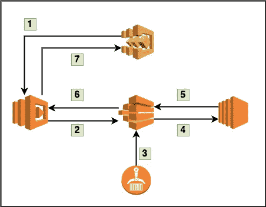
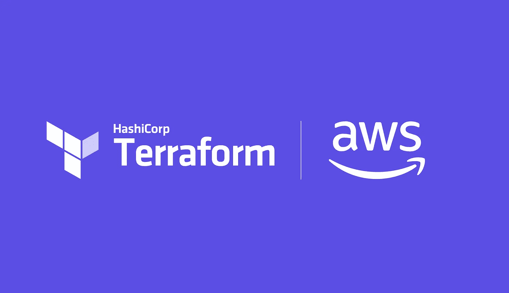

# 在 AWS 中进行批处理，并使用 Terraform 配置其基础设施

> 原文：<https://medium.datadriveninvestor.com/batch-process-in-aws-and-configure-its-infrastructure-with-terraform-d4a2de3c783c?source=collection_archive---------2----------------------->

当我们开发 API 时，即使它是私有的或公共的，我们也应该知道 API 是如何工作的:请求负载的最大大小是什么，响应负载的最大大小是什么，以及它的 API 响应超时。

当我谈到 API 的时候，你首先想到的 API 应该是 RESTful，但是除了 REST 之外还有其他类型的 API。据我所知，这些是 SOAP、XML-RPC 和 JSON-RPC。好了，我们来看看 API 叫什么，它的用法。

> API(应用程序编程接口)是一组允许应用程序访问数据并与外部软件组件、操作系统或微服务交互的功能。(参考:[链接](https://www.bigcommerce.com/blog/what-is-an-api/#what-is-an-api))

当我用容器内的 NodeJS 开发 Restful API 时，我认为每个 API 进程都可以通过相互通信完美地工作和无缝地运行。但是当我们使用模拟的生产数据进行负载测试时，由于 Restful API 模式的有限负载和处理超时问题，一些繁重的流程 API 失败了。这时候，我们需要通过使用 AWS Batch 的方式，将这种繁重的流程 API 解耦为单独的服务。

> AWS Batch 是一组批处理管理功能，使开发人员、科学家和工程师能够在 AWS 上轻松高效地运行成千上万的批处理计算作业。AWS Batch 根据提交的批处理作业的数量和特定资源要求，动态调配最佳数量和类型的计算资源(例如，CPU 或内存优化实例)。

使用批处理，如果您是贵组织的解决方案架构，我们将了解成本优化和流程优化，当应用程序准备好开始启动时，这两种优化也可以让您安全。在批处理计算环境中，有两种**实例类型**，称为**最优**和“特定实例类型”。

作为**最佳**，Batch 将根据 CPU 和内存单元选择与您定义的作业队列需求相匹配的实例类型(从 C、M 和 R 实例系列中)。

[](https://www.datadriveninvestor.com/2020/03/11/cloud-made-simple-for-undecided-career-change-planners-the-fundamentals/) [## 云让犹豫不决的职业生涯规划者变得简单:基础|数据驱动的投资者

### 尽管 IT 在当今的商业中扮演着重要的角色，但许多 IT 求职者都不愿意从事云计算职业…

www.datadriveninvestor.com](https://www.datadriveninvestor.com/2020/03/11/cloud-made-simple-for-undecided-career-change-planners-the-fundamentals/) 

但是如果您只在实例类型列表中定义为 **["c4.large "，" c4.xlarge"]** ，Batch 将根据您的作业队列的需求或您根据 CPU 和内存单元定义的需求选择合适的实例。



sample AWS Batch architecture

上图是 AWS 批处理如何工作的示例工作流，这就是我应该创建 Terraform 来建立架构的原因。

1.  首先，我们将创建一个 Step 函数来触发 Lambda 检查批处理及其作业流程的状态，无论它是处于可运行阶段、开始阶段、运行阶段还是结束阶段。
2.  Lambda 将启动批处理，并根据触发它的步骤函数来观察它的状态。
3.  当它准备好开始运行时，Batch 将从 ECR 中提取 Docker 图像，并在 EC2 实例中运行。
4.  作业成功完成后，Lambda 会将其作业状态发送给 Step 函数，您的作业可以在应用程序中标记为完成状态。



[https://www.hashicorp.com/resources/create-change-and-orchestrate-aws-infrastructure-wi](https://www.hashicorp.com/resources/create-change-and-orchestrate-aws-infrastructure-wi)

好了，让我们创建一个平台来建立批处理的架构。由于这是一个如何用 Terraform 设置批处理资源的简单项目，我不会不创建其批处理的完整 Terraform 项目。

1.  aws _ 批处理 _ 计算 _ 环境

```
resource "aws_batch_compute_environment" "my-heavy-function" {
  compute_environment_name = "my-heavy-function"
  compute_resources {
    instance_role = "${aws_iam_instance_profile.ec2-profile.arn}"
    **instance_type** = [
      "c4.xlarge",
      "c4.large"
    ]
    **max_vcpus**     = 256
    **min_vcpus**     = 0
    desired_vcpus = 1
    security_group_ids = [
      "${aws_security_group.processor-batch.id}"
    ]
    subnets = "${data.aws_subnet_ids.my_subnet_ids.ids}"
    type    = "EC2"
  }
  service_role = "${aws_iam_role.batch-service-role.arn}"
  type         = "MANAGED"
  depends_on   = ["aws_iam_role_policy_attachment.batch-service-role"]
}
```

**instance_type** 批处理将在创建作业时创建两种类型的实例类型。默认是 **c4.large** 。

**max _ vcpu**一个环境可以达到的 Amazon EC2 vCPUs 的最大数量。

**min _ vcpu**一个环境应该维护的 Amazon EC2 vCPUs 的最小数量。因为这是一个开发环境，需要进行成本优化，所以应该为零。当它被定义为零时，当作业不可用时，批处理将不创建备用实例，当作业准备好进行处理时，批处理将根据其作业配置创建实例。但是根据实例类型创建实例需要一些时间。

2.aws _ 批处理 _ 作业 _ 队列

```
resource "aws_batch_job_queue" "my-heavy-function-queue" {
  name     = "my-heavy-function-queue"
  state    = "ENABLED"
  priority = 1
  **compute_environments** = [
    "${aws_batch_compute_environment.my-heavy-function.arn}"
  ]
}
```

**compute_environments** 它是批处理环境和作业队列之间的链接。

3.aws _ 批处理 _ 作业 _ 定义

```
resource "aws_batch_job_definition" "my-heavy-function-job" {
  name = "my-heavy-function-job"
  type = "container"
  depends_on = [
    "aws_ecr_repository.my-heavy-function-job-repo"
  ]
  container_properties = <<CONTAINER_PROPERTIES
{
  **"image": "${aws_ecr_repository.my-heavy-function-job-repo.repository_url}:latest",**
  "jobRoleArn": "${aws_iam_role.job-role.arn}",
  "**vcpus**": 1,
  "**memory**": 1024,
  "**command**": [
    "node",
    "index.js",
    "Ref::processId",
  ]
}
CONTAINER_PROPERTIES
}
```

由于您熟悉创建 AWS ECS 环境，因此对您来说并不陌生，因为它与 ECS 定义文件以及批处理作业定义文件相同。它是获取哪些资源以及使用哪个命令来运行批处理作业的命令器。

**image** 它是要在 ECR repo 中存储的创建 Docker 映像时对流程的所有重要功能执行的源代码。

**vcpu**将根据您的工艺需求定义。

**记忆**也会一样。

**命令**将对您的 Docker 图像执行。您可以根据您的流程需求定义各种命令。

是时候用 Lambda 执行批处理了。

```
exports.handler = async (event) => {
  let params = event['body'];
  let response = {}, result = {};
  let jobInfo = {
    **jobDefinition**: process.env.JOB_DEFINITION,
    **jobName**: `job-${UUID()}`,
    **jobQueue**: process.env.JOB_QUEUE,
    **parameters**: {
      **processId: params.processId**
    },
    **containerOverrides: {
      vcpus: 2,
      memory: 2000
    }**
  };
  result = await client.submitJob(jobInfo).promise();
  response = {
    statusCode: 200,
    body: {
      jobId: `${result.jobId}`
    }
  }
  return response;
}
```

**jobDefinition** 是之前创建的批处理作业定义 ARN。

**jobQueue** 是之前创建的批处理作业队列 ARN。

**作业名**是一个批处理作业名。要重要，应该是独一无二的。

**参数**与**命令**属性在批处理作业定义中的配置相同。

**containerOverrides** 这就是我喜欢的 AWS，它使我们能够灵活地根据我们的工作流程创建所需的内容。配置 **aws_batch_job_definition** 时，已经定义默认其配置为**1 vcpu**和 **1024 内存**。但是当需要获得比之前配置的更多的资源时， **containerOverrides** 属性可以用来覆盖默认配置。

好了，现在运行 Terraform 在 AWS 中设置批处理资源，只需执行以下简单命令:

```
terraform planterraform apply
```

快乐的云计算和基础设施代码。当这个博客能帮助你或多或少地了解 AWS Batch 和 Terraform 时，请不要忘记鼓掌，谢谢。