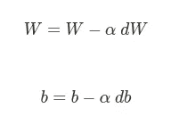
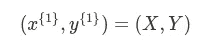
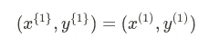
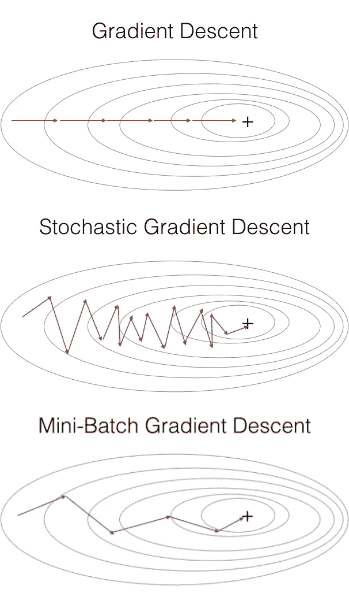

# 批量与小批量与随机梯度下降的比较及代码示例

> 原文：<https://medium.datadriveninvestor.com/batch-vs-mini-batch-vs-stochastic-gradient-descent-with-code-examples-cd8232174e14?source=collection_archive---------1----------------------->

在研究机器学习和深度学习时出现的一个主要问题是梯度下降的几种类型。我应该使用批量梯度下降吗？小批量梯度下降还是随机梯度下降？在这篇文章中，我们将理解这些概念之间的区别，并从梯度下降的角度来看代码实现，以阐明这些方法。

***编辑:*** *更新版* [*此处*](https://edgeaiguru.com/Batch-vs-Mini-batch-vs-Stochastic-Gradient-Descent) *。*

此时，我们知道我们的权重矩阵 **W** 和我们的偏差向量 **b** 是我们的神经网络(NN)的核心值(查看深度学习基础篇)。我们可以将这些概念与神经网络存储模式的存储器进行类比，通过调整这些参数，我们可以教授神经网络。调整的动作是通过优化算法来完成的，这一惊人的特性使神经网络能够学习。在训练网络一段时间后，这些模式被学习，我们有一组权重和偏差，有希望正确分类输入。

# 梯度下降

帮助神经网络达到正确的权重和偏差值的最常见算法之一。梯度下降(GD)是在每一步中最小化成本函数 J(W，b)的算法。它迭代地更新权重和偏差，试图达到成本函数中的全局最小值。


Minimizing the Cost Function, a Gradient Descent Illustration. Source: [Stanford’s Andrew Ng’s MOOC Machine Learning Course](https://www.coursera.org/learn/machine-learning)

快速回顾一下，在我们计算 GD 之前，首先获取输入并通过神经网络的所有节点，计算输入、权重和偏差的加权和。第一次通过是计算梯度下降的主要步骤之一，称为**正向传播**。一旦我们有了一个输出，我们将这个输出与预期输出进行比较，并计算两者之间的距离，即误差。有了这个误差，我们现在可以将它向后传播，更新每个权重和偏差，并尝试最小化这个误差。正如你所料，这部分被称为**反向传播**。使用导数计算反向传播步长，并返回“梯度”，这些值告诉我们应该沿着哪个方向最小化成本函数。

我们现在准备更新权重矩阵 W 和偏置向量 b。梯度下降规则如下:



换句话说，新的权重/偏移值将是最后一个减去梯度的值，使其接近成本函数的全局最小值。我们还将这个梯度乘以学习率α，学习率α控制步长的大小。对于更深入的方法向前和向后传播，计算损失，梯度下降，检查这个职位。

这种经典的梯度下降也称为批量梯度下降。在这种方法中，每个历元贯穿所有训练数据集，然后计算损失并更新 W 和 b 值。尽管它提供了稳定的收敛和稳定的误差，但是该方法使用了整个训练集；因此，对于大数据集来说，速度非常慢。

# 小批量梯度下降

想象一下，把你的数据集分成几块，或者几批。因此，不是等到算法运行整个数据集之后才更新权重和偏差，而是在每个所谓的小批量结束时更新。这允许我们快速移动到成本函数中的全局最小值，并且现在每个时期多次更新权重和偏差。最常见的小批量是 16、32、64、128、256 和 512。大多数项目使用小批量 GD，因为它在较大的数据集中速度更快。

*   **小批量梯度下降**:

```
X = data_input
Y = labels
parameters = initialize_parameters(layers_dims)for i in range(0, num_iterations):

	minibatches = random_mini_batches(X, Y, mini_batch_size) for minibatch in minibatches: # Select a minibatch
	    (minibatch_X, minibatch_Y) = minibatch
	    # Forward propagation
	    a, caches = forward_propagation(X, parameters)
	    # Compute cost.
	    cost += compute_cost(a, Y)
	    # Backward propagation.
	    grads = backward_propagation(a, caches, parameters)
	    # Update parameters.
	    parameters = update_parameters(parameters, grads)
```

为了准备小批量，大多数应用一些预处理步骤:随机化数据集以随机分割数据集，然后将其划分为正确数量的块。但是，如果我们选择将批次数设置为 1 或等于训练样本数，会发生什么情况呢？

# 批量梯度下降

如前所述，在这种梯度下降中，每个批次等于整个数据集。那就是:



其中{1}表示小型批次中的第一批。缺点是每次迭代花费的时间太长。该方法可用于训练少于 2000 个训练样本的数据集。

*   **(批次)梯度下降**:

```
X = data_input
Y = labels
parameters = initialize_parameters(layers_dims)for i in range(0, num_iterations): # Forward propagation
    a, caches = forward_propagation(X, parameters)
    # Compute cost.
    cost += compute_cost(a, Y)
    # Backward propagation.
    grads = backward_propagation(a, caches, parameters)
    # Update parameters.
    parameters = update_parameters(parameters, grads)
```

# 随机梯度下降

另一方面，在这种方法中，每一批等于训练集中的一个示例。在此示例中，第一个小批量等于第一个训练示例:



其中(1)表示第一个训练示例。这里的缺点是，它失去了矢量化带来的优势，振荡更多，但收敛更快。

*   **随机梯度下降**:

```
X = data_input
Y = labels
parameters = initialize_parameters(layers_dims)for i in range(0, num_iterations): for j in range(0, m): # Forward propagation
        a, caches = forward_propagation(X[:,j], parameters)
        # Compute cost
        cost += compute_cost(a, Y[:,j])
        # Backward propagation
        grads = backward_propagation(a, caches, parameters)
        # Update parameters.
        parameters = update_parameters(parameters, grads)
```

# 摘要

理解这些优化算法之间的差异是很重要的，因为它们构成了神经网络的关键功能。综上所述，虽然批量 GD 比随机 GD 精度高，但后者速度更快。这两种方法的中间点，也是最常用的小批量 GD，结合了两者的优点，可提供良好的精度和性能。



Batch vs Stochastic vs Mini-batch Gradient Descent. Source: [Stanford’s Andrew Ng’s MOOC Deep Learning Course](https://www.coursera.org/learn/deep-neural-network/)

可以只使用小批量梯度下降代码来实现所有版本的梯度下降，您只需要将 mini_batch_size 设置为随机 GD 等于 1，或者将训练样本数设置为批量 GD。因此，批量、小批量和随机梯度下降之间的主要区别是每个时期使用的样本数量以及达到成本函数的全局最小值所需的时间和精力。

*参考:这篇博文基于 Coursera 的*[*Deep learning . ai*](http://deeplearning.ai)*[*改进深度神经网络:超参数调优、正则化和优化课程*](https://www.coursera.org/learn/deep-neural-network) *。**