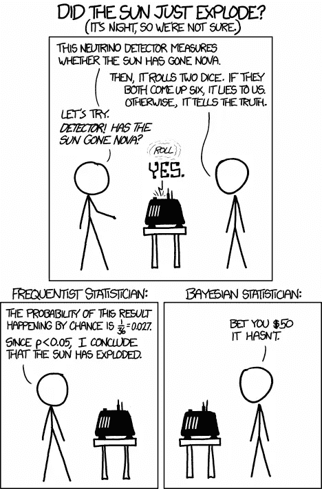
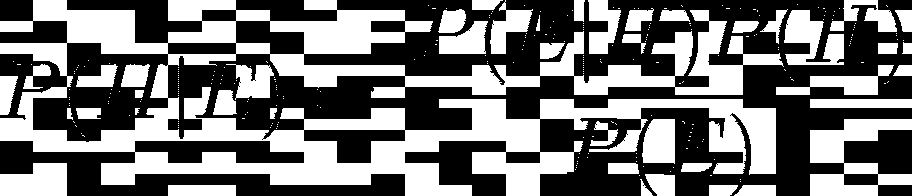
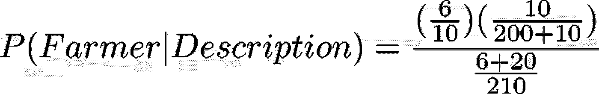
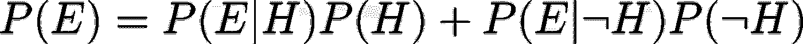
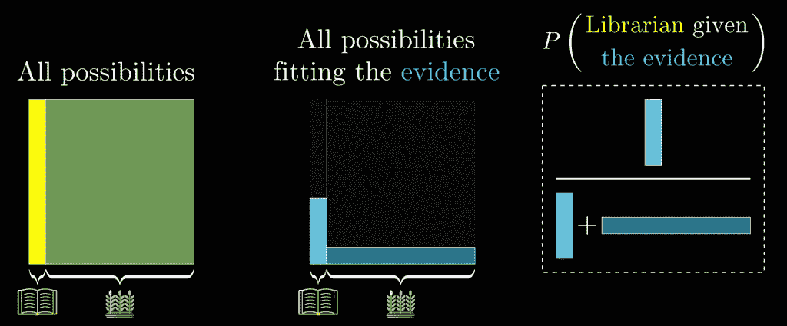

# 贝叶斯定理及其在行为经济学中的应用

> 原文：<https://medium.datadriveninvestor.com/bayes-theorem-and-its-implications-in-behavioural-economics-eb7129afef77?source=collection_archive---------0----------------------->

## 理解概率中最重要的定理之一

Credit: XKCD

一位朋友这样描述一个人:“史蒂夫非常害羞、孤僻，总是乐于助人，但对人或现实世界不感兴趣。他是一个温顺整洁的人，需要秩序和结构，热爱细节。”史蒂夫更有可能成为图书管理员还是农民？

1974 年，丹尼尔·卡内曼和阿莫斯·特沃斯基对我们如何看待 T2 如何看待 T3 提供了令人难以置信的见解。他们向我们展示了人类的理性是多么错误，我们的直觉是多么有缺陷。他们研究了人类的判断，更尖锐的是，当这些判断非理性地对比了概率平衡的暗示时。

基于史蒂夫被描述为温顺整洁的事实，大多数人会从他们的联想记忆中得出史蒂夫是一名图书管理员的结论。但是几乎没有人会考虑农民和图书馆员的比例:在美国，农民比图书馆员多 20 倍。有人知道与否并不重要——但他们考虑过它的重要性吗？正如格兰特·桑德森所说，“理性不是了解事实；而是要认识到哪些事实是相关的”。

 [## 如果资本主义失败了，那么还有什么选择呢？数据驱动的投资者

### 在当前政治领域的修辞之旅中，我们都可以面对面地接触到流行词汇，如…

www.datadriveninvestor.com](https://www.datadriveninvestor.com/2020/03/16/if-capitalism-is-a-failure-then-what-is-the-alternative/) 

假设我们正在查看一个由 10 名图书管理员和 200 名农民组成的样本(遵守上述比例)，您估计 60%的图书管理员和只有 10%的农民符合史蒂夫的描述。在我们的示例中，这意味着 6 名图书管理员符合描述。相比之下，20 个农民。即使你认为图书管理员符合描述的*概率*是农民的 6 倍，实际符合描述的图书管理员数量比农民数量少 70%。给定描述，史蒂夫是图书管理员*的真实概率是 6/26，即 23.01%。其结果是，当对照概率来看时，我们的直觉往往是非理性的；**贝叶斯定理**允许计算一个事件的概率(在这种情况下，史蒂夫是一个农民)，同时考虑到已知的证据(史蒂夫是一个温顺整洁的灵魂)。*

新的证据不能决定你的假设；相反，它应该用于*更新*它。这就是贝叶斯定理背后的核心思想。这个定理是条件概率的基础，允许根据已知的先验条件描述事件发生的概率。看到证据限制了可能性的范围。

在概率的贝叶斯解释中，概率被视为一种“信任度”；这个定理联系了假设在证明之前和之后的可信度。例如，在掷硬币之前，人们相信正面的机会是反面的两倍，这种信念有 50%的把握。经过无数次试验后，相信程度可能会增加、减少或保持不变，这取决于结果。

每当你有一个假设或信念，你已经观察到一些证据，你想知道假设成立的概率*，假设证据为真*，你就可以应用贝叶斯定理。数学上，这被表示为 **P(H|E)** 。贝叶斯定理陈述了允许我们确定这种概率的等式:

让我们根据史蒂夫的情况来分析这个公式。根据描述，P(H|E) 是史蒂夫成为图书管理员的概率。 **P(H)** 是史蒂夫是农民的概率(4.76%)，这个概率来自我们最初的比例 20:1。这被称为**先验**，因为这是我们的假设先于任何证据的概率。P(E|H) 是假设 Steve 是图书管理员，他符合描述的概率，即符合描述的图书管理员的比例*(本例中为 60%)。这个值被称为**可能性**。 **P(E)** 是史蒂夫符合描述的概率(12.38%)。就是看到证据的*总概率*。这表现为:*

**

*解这个方程，我们得到 P(Farmer|Description) 是 0.231，或者是我们之前建立的 23.1%。这个概率被称为**后验**。准确地说，这是符合描述的总人数中，符合描述的图书管理员的概率。证据存在的概率可能并不总是很清楚，因此可以进一步细分为*

**

*The ¬ symbol signifies **not**. Here ¬ simply means that we account for the probabilities with respect to the farmer (instead of the librarian).*

*我们对贝叶斯定理的解释是**频率主义者解释**，其中概率代表总结果的一部分。我们可以看到，在每一步，我们都在限制我们的视野，只看整个样本的一部分。其实概率本身就是源于比例的数学。贝叶斯定理可以被认为是假设为真的情况的数量与证据为真的情况的数量的比例。*

**

*An excerpt from 3blue1brown’s phenomenal video on Bayes’ Theorem. This provides a great visual representation of the core of the theorem.*

*结论是贝叶斯定理允许我们用数学方法量化和计算改变假设(信念)的概念。贝叶斯定理有无数的应用，从人工智能到医学到寻宝。最著名的用例之一是测试假阳性和假阴性。然而，也许最重要的是，它提供了一种媒介来重构你对思想本身的看法。*

*卡尼曼和特沃斯基做了一个类似的实验，他们发现了所谓的**合取谬误**。合取谬误是一种逻辑谬误，当假设特定的条件比一个单一的一般条件更有可能发生时就会产生这种谬误。他们对这种谬误的推理是，我们的判断是由**启发式代表性**做出的。情况是这样的:*

> **琳达 31 岁，单身，直言不讳，非常聪明。她主修哲学。作为一名学生，她深切关注歧视和社会正义问题，还参加了反核示威。**

*琳达更有可能是银行出纳还是活跃在女权运动中的银行出纳？85%的参与者选择了后者，尽管这是第一个选项的子集。这是因为选项 2 似乎更能代表 Linda 的*，尽管它在数学上似乎不太合理。**

**贝叶斯定理是数学和常识的结合。它让我们看到假设正确的概率，只要提供一些证据。这也告诉我们，我们的直觉是多么不可靠。贝叶斯定理是概率中最重要的定理之一，允许我们的假设随着相关数据的发现而更新。**

**贝叶斯定理是一个公式，允许我们量化信念，为我们的理论提供合理性。证据不应该决定你的信念——相反，它应该更新你的信念。**