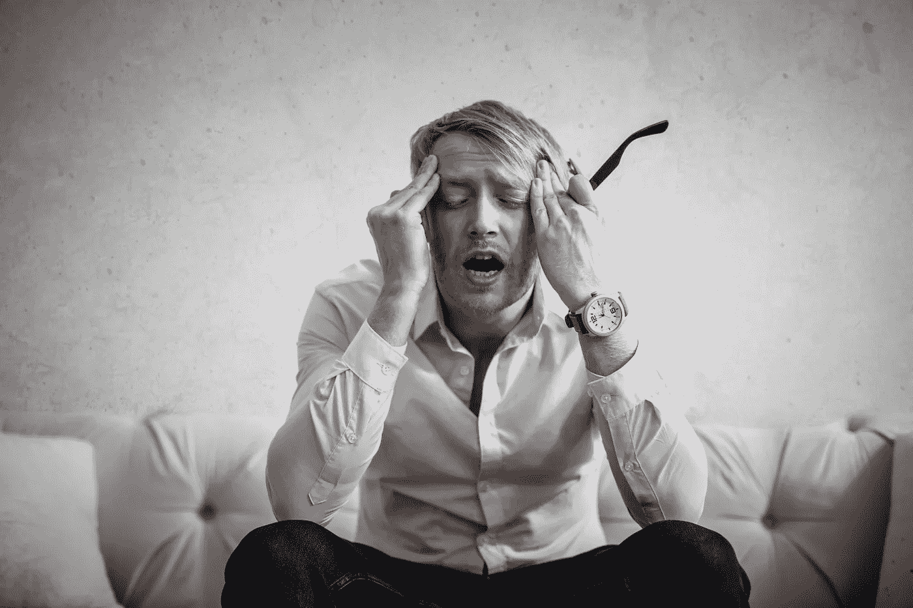

# 失败

> 原文：<https://medium.datadriveninvestor.com/be-a-failure-9aba73ab548?source=collection_archive---------20----------------------->

# 我失败了。

失败是必须的。成为一个失败者。大多数领导者都会告诉你第一句话。第二个是你父母坚持认为你不是的人。在过去的一年里，我从失败中学到了比我愿意承认的更多的东西。作为[佩恩集团](http://www.thepenn.group)的[总裁&首席执行官](https://www.linkedin.com/in/austin-harman-7040199a/)，我的每一次失败都会在我的组织中引起连锁反应。我的失败导致每个人都失败。难怪我们感到作为领导者的压力。也许如果我们能少失败一些，也许其他人都能赢。

在我的职业生涯中，你能想到的我都失败了。我已经在大人物面前说错话了。我在错误的时间出现在错误的地方。我错过了细节。我让人们对我感到愤怒、不安、受伤和失望。我是人，就像每个正在阅读这篇文章的人一样。在我每一次成功的外衣下，都隐藏着无数次的失败，这些失败试图削弱我仍然拥有的每一丝骄傲。不知何故，或者出于某种原因，我的团队仍然决定忠诚地为我的领导服务。我过分热心的概括意味着所有失败的后果都是一样的。也许他们是。那么，当我们失败时，为什么我们试图通过说我们不是“失败者”来远离我们的行为呢？

## **失败并不是均等创造的**

成为一个失败者。为了失败，你必须经历或理解成功。成功不仅仅是试图满足未被满足的期望的持续压力。失败是对某些事件的期望和现实之间的显性或隐性的距离。当我们达不到标准时，我们就失败了。

项目终止后，我最喜欢做的一件事就是召集团队，进行回顾。会议是有用的，因为它允许所有团队成员说出他们的想法，什么是错的，什么是对的。我建议让正在做这项工作的人来领导回顾会，而不是领导者。如果你的团队能够畅所欲言，那么通常会有无数的事情出错。换句话说，你失败了。酒吧是完美的，因为它通常是，你失败了。并非所有的失败都是一样的。失败通常由期望差距的影响来衡量。我喜欢用痛苦的影响来衡量失败。不仅仅是身体或情感上的痛苦，而是组织和团队的痛苦。痛苦是残酷的生活现实，但其中有一个重要的目的。痛苦越大，彼岸的智慧越大。你的失败越大，你从失败中学到的就越多。如果你选择这样做的话。

## **失败**

我喜欢失败；说从来没有人。失败很容易，也很痛苦。我们都有缺点；我们应该更高些。我们都搞砸了；我们应该是完美的。我们都有糟糕的日子；其他人都不知道。传统上，让你脱颖而出的是你如何处理失败。听起来像那种蹩脚的激励海报。这种心态让我们的行为远离了我们是谁。我们正试图减轻我们的缺点带来的痛苦和负罪感。如果相反，你渴望失败。如果你想成为一个失败者呢？

为什么你想成为一个失败者？成为一个失败者意味着你已经放下了你在知识之井底部的骄傲，那是痛苦。我们的骄傲常常限制我们在失败的时刻吸取最深刻的教训。失败意味着你可以真正自由地去冒你永远不会去冒的风险。失败意味着在真正的危机来临时，你将获得堆积如山的智慧，这需要你所有的领导能力。失败是必要的，令人疲惫、痛苦、尴尬、辛酸。为了失败，你必须先成功。成功为失败设立了标杆。

## 如果你没有失败呢？

在我职业生涯的某个阶段，我曾为一个极其有害的组织工作。在该组织内部，政治和糟糕的领导占主导地位。喊得最大声的人似乎最受关注。失败意味着失去我们的工作。我的任务是从零开始，毫无经验地开发一个信息系统，来处理和跟踪进出的产品。在一种让我注定失败的文化中，我成功了。我交付了一个功能性的产品，并满足了涉众的期望。当我们发布时，我开发的产品受到了用户的批评。它很难使用，又丑又慢。我已经达到了纸上的所有期望，但仍然没有达到。我还是失败了，而我本该赢的。正是在这样的环境下，我认识到了一个残酷的事实。尽管我试图变得完美而不失败，但我还是失败了。我尽了最大的努力，尽了最大的努力，但还是没有达到期望。如果我不那么担心成为一个失败者，而是接受无论如何我都会失败的事实，我的压力会减少多少。从文化的角度来看，我学到了重要的一课:

> 如果每个人都不能失败，那么没有人能够成功。

## **苹果失败**

在企业界，我最喜欢的案例研究之一是苹果在 90 年代末的故事。史蒂夫·乔布斯是我心目中的英雄之一。虽然不完全是道德的指南针，乔布斯意识到失败是他的朋友。在以“临时”CEO 的身份重新执掌苹果的过程中，他经历了一次又一次的失败。他的公司 [NeXT](https://en.wikipedia.org/wiki/NeXT) ，创造了漂亮而价格过高的产品，却以失败告终。他已经连续几年失败了。正是面对这些失败，他明白了在设计大众市场产品时必须做出妥协。回到苹果后，乔布斯在决策中精打细算，实现了公司历史上最伟大的转变之一。并不是对失败的恐惧驱使他做出决定。一切都太晚了。苹果离破产不到 90 天。没有自我或政治的空间。乔布斯已经成了一个失败者，他不害怕冒这个险。乔布斯知道，因为他之前失败的痛苦已经积累了一座可以依靠的智慧之山。在他之前所有的失败中，他成为了我们这一代最伟大的领袖之一。[苹果](http://www.apple.com)因为史蒂夫的失败而扭亏为盈。

## **失败**

我是个失败者。我失败的次数比我愿意承认的还要多。正是从我所有的失败中，我获得了成为领导者所需要的智慧。我意识到我确实会失败。我不是一贯正确的。我将不得不道歉。接受失败意味着我不会害怕承担我需要承担的风险。我一定会失败，而且我会继续失败下去。成为一个失败者让我可以去冒险，而这是我从来没有尝试过的。我来这里不是为了给人们留下深刻印象或者让他们认为我不是我。我是来领导我的网络安全公司的。我来这里是为了改变人们的生活。我是来成为一个失败者的。

 [## 你的公司能承受 20 万美元的损失吗？

### 你的公司能承受 20 万美元的损失吗？阅读如何保护自己免受新兴趋势的影响。

medium.com](https://medium.com/swlh/could-your-business-withstand-a-200-000-loss-eb7d473df550) 

*奥斯汀·哈曼是美国宾州集团***的总裁&首席执行官。他目前拥有梦寐以求的 CISSP 认证，以及分别来自 ISC2 和 CompTIA 的 CCSP、CAP 和 Security+认证。他住在俄亥俄州的哥伦布市。**