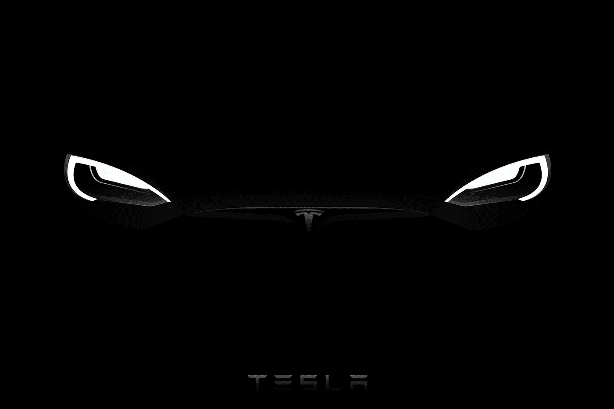

# 要意识到特斯拉和比特币之间的这些相关性——它们会让你获得巨额利润

> 原文：<https://medium.datadriveninvestor.com/be-aware-of-these-correlations-between-tesla-and-bitcoin-they-will-make-you-huge-profits-ba870997580d?source=collection_archive---------14----------------------->

科技投资的指数回报并不罕见。你必须学会预料不到的事情。

我从来不缺新的投资点子。我知道我会找到它们，因为我寻找看似不相关的概念之间的联系。我尽量先了解投资，不在乎主流的叙事。

结果，我发现了别人看不到的机会。

我寻找指数回报。它们中的大多数都有相似的图案，很容易被发现。为了说明这一点，我选择了一些例子，将十年来表现最好的两个公司**比特币和特斯拉联系起来。**

所以让我来给你分析一下。

# 1.群体优势模式:依靠群体的智慧

**现在，散户投资者和机构投资者一样了解世界。有大量研究证明了大众的智慧。一般来说，大众比任何个人或公司都聪明。**几乎从第一天起，特斯拉和比特币就获得了社区的大力支持。简而言之，要不是他们的支持，他们俩早就死了。

# 2.颠覆模式:改造传统产业

特斯拉和比特币都在颠覆百年产业。他们寻求颠覆两个最腐败、最像卡特尔的市场——能源和金融。毫无疑问，特斯拉代表了清洁能源的精髓，比特币是货币和价值储存的新形式。对汽车公司或金融机构期望的定义现在已经永远改变了。换句话说，每次你购买汽车或投资产品时，你都会奇怪为什么它们没有特斯拉或比特币那样的功能。

# 3.统治模式:削弱竞争

**特斯拉不仅是一家汽车公司，还生产软件和电池组。**因此，该公司允许任何人成为能源公司。但是，让我们假设特斯拉是一家纯电动汽车制造商，并以 Model S 为例。他们在 2012 年推出了它，没有一个竞争对手接近它。八年后！

当你考虑购买电动汽车时，特斯拉是你脑海中浮现的名字。比特币几乎占据了整个加密货币市场的 70%。它事实上已经成为加密货币市场的储备货币。尽管竞争日益激烈，特斯拉的市场份额目前为 26%,并且每年都在增长。几年前，媒体和企业嘲笑他们。他们现在当然不会笑了。

# 4.波动模式:这是游戏的一部分

颠覆性创新总是以争议和波动为特征。特斯拉和比特币都经历了巨大的波动。*猜猜比特币历史上崩溃过多少次？试试 13。* **创新总是带来波动；这是游戏的一部分。但是，如果你有稳定的资金来源和至少 5 年的投资期限，你就没什么好害怕的。**

# 5.领养模式:在华尔街寻找爱情

特斯拉最近**加入了标准普尔 500 指数**，其市值远远超过了之前的任何参与者。因此，机构投资者不得不购买价值约 800 亿美元的特斯拉股票，以重新平衡其指数基金。随着华尔街采用比特币，现金之墙最近也猛烈抨击比特币。几十家大型金融机构购买了价值数十亿美元的比特币，而其他机构，如 PayPal 或 Square，则允许其用户在其平台上购买比特币。

# 6.高估值模式:打破传统估值模式

特斯拉和比特币获得了高估值的回报。去年特斯拉提价 10 倍，比特币暴涨 300%以上。传统分析师会弄错中断。他们仍然很难理解这两种资产的估值，有些人甚至称之为泡沫。然而，投资者的定价是对他们传统市场的掏空。特斯拉将获得与所有其他公司不成比例的市场份额。在无休止的印钞过程中，比特币也将成为价值储存背后的主要驱动力。它们都具有破坏性。**当然，很多人会生气，他们不会理解，他们会试图破坏它们。但是他们会一次又一次地被证明是错误的。**

# 7.天才创始人模式:内向者创造差异

埃隆·马斯克是一个无视常识的天才。他成功地制造了可重复使用的火箭、吸引人的电动汽车，并设想了在真空管中的高速旅行。但当他旅行并填写海关表格时，他不会写“首席执行官”他写道，“工程师。”同样，创造了有史以来第一种数字货币比特币的天才数学家中本聪仍然默默无闻。特斯拉和比特币是现代天才的无风险选择。

# 最终想法

一般来说，一项增值 10 倍的投资就像大海捞针。

*但也不尽然。*

如你所见，特斯拉和比特币就在你眼前。你们大多数人都错过了。不是因为他们从你这里被偷了，只是你当时没有看到大局。

那现在怎么办？

当我最终购买了正确的投资时，我会保留它。我为什么要卖有用的东西？另外，如果我卖了它，我还得大海捞针。

最重要的是，根据许多预测，比特币今年可能达到 5 万美元，10 年后可能达到 100 万美元。

根据 Cathie Wood 和她的方舟，特斯拉可以在 3 年内将其价格翻一番，并可能在 10 年内达到 15，000 美元。

科技投资的指数回报并不罕见。你必须学会预料不到的事情。

特斯拉和比特币之间的正相关性是不可否认的。因此，埃隆的推特更新为一个词，比特币。

