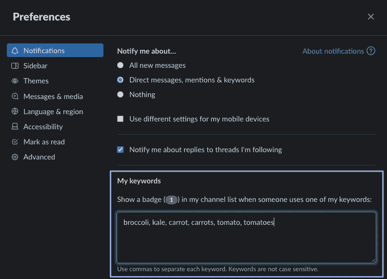

# 通过改进时差通知，提高工作效率

> 原文：<https://medium.datadriveninvestor.com/be-more-productive-by-cutting-your-slack-notification-diet-491c83067ac6?source=collection_archive---------18----------------------->

Author illustration; original photo by [Jason Strull](https://unsplash.com/@jasonstrull?utm_source=unsplash&utm_medium=referral&utm_content=creditCopyText) on [Unsplash](https://unsplash.com/s/photos/thinking?utm_source=unsplash&utm_medium=referral&utm_content=creditCopyText)

Slack 是一个很棒的沟通工具；它时尚、现代、高效，并具有大量集成，使团队合作更加容易。

尽管如此，Slack 几乎是其自身成功的受害者，因为它很容易陷入过度检查的例行公事，即使每条消息并不完全和/或立即与你相关。

加粗的频道文本只是让我们的大脑想要点击它。无论是想玩打地鼠游戏，让所有的格式统一，因为这让我们很烦，还是潜意识里害怕错过任何重要的信息，往好了说肯定是分散注意力，往坏了说肯定是浪费时间。

可以说，更具破坏性的是桌面推送通知，它会针对你所在的每个频道中的每条消息弹出。很快，你会发现你最终还是错过了信息，因为它迷失在与你无关的信息海洋中。

# 限制你的通知饮食

Photo by [Brenda Godinez](https://unsplash.com/@cravethebenefits?utm_source=unsplash&utm_medium=referral&utm_content=creditCopyText) on [Unsplash](https://unsplash.com/s/photos/diet?utm_source=unsplash&utm_medium=referral&utm_content=creditCopyText)

减少不需要的通知的第一步是在全球范围内解决这个问题。要做到这一点，你可以通过点击你的工作区名称，然后点击它，进入 Slack 中的**首选项**(或者，你可以使用 Mac 上的`⌘,`快捷方式和 Windows 上的`Ctrl,`)。

在**首选项**中，您可以为您实际想要接收的不同通知选择选项。`All new messages`正是我们在这里不想要的，而`Nothing`也有点过分，因为我们不想错过任何东西。中间选项，`Direct messages, mentions & keywords`正合适。

 [## 在家工作如何提高我的工作效率|数据驱动型投资者

### 在家工作确实激发了我最大的潜能，让我更有效率。因为在家工作给了我…

www.datadriveninvestor.com](https://www.datadriveninvestor.com/2020/07/29/how-working-from-home-increased-my-productivity/) 

## 不要错过你最喜欢的

这个功能很酷:你可以输入精确的关键词，以便在任何频道出现关键词时得到通知。例如，由于我们受到通知饮食的启发，想要进行实际的饮食，假设我们想知道何时有人提到我们最喜欢的健康食物:

现在，我们将永远不会错过重要的讨论，无论何时这些话被传达。

## 通过关闭`@channel`和@来指定每个通道的限值

这个通知限制策略中的一个主要因素是建议限制每个通道的通知，原因只有一个:`@channel`和`@here`标记算作“提及”,因此您会收到通知。

我知道你可能在想:难道我们不希望*为这些得到通知吗？*

我对此的回答是你没有错。当然，你想知道这些信息，但我发现在实践中，这些标签被广泛使用。例如，出于好奇而在某个团队渠道提及你，并不能保证是直接针对你本人——可能只是针对团队成员。

这个解决方案基本上使你不会收到推送通知，但你*将*能够看到一个小徽章图标在频道旁边弹出。在我看来，这就足够了，因为标签不会完全丢失，但也不会在你工作时打扰你。

事不宜迟，你可以通过点击给定频道中的`More`按钮来访问它——在这种情况下，我不想被`#chocolate`房间中的这些大标签通知，因为我正试图避免不健康的食物。从那里，点击`Change notifications`。

这里，我们想要取消选中的关键选项是`Also include @channel and @here`。Slack 提供了一个可配置的选项，这进一步证明了这些标签并不总是与你相关。

## 使模糊静音

Photo by [Charisse Kenion](https://unsplash.com/@charissek?utm_source=unsplash&utm_medium=referral&utm_content=creditCopyText) on [Unsplash](https://unsplash.com/s/photos/chocolate?utm_source=unsplash&utm_medium=referral&utm_content=creditCopyText)

有些情况下，您根本不想被通知，甚至无法忍受看到侧边栏中加粗的频道文本，但您仍然希望随时轻松访问该频道进行检查。

在这些情况下，您可能会想要单击某个频道中的`More`按钮，然后选择将该频道完全静音。

现在，我再也不会被`#chocolate`房间里极其有趣的对话所诱惑。

# 关键是不要烧坏

Photo by [Tim Gouw](https://unsplash.com/@punttim?utm_source=unsplash&utm_medium=referral&utm_content=creditCopyText) on [Unsplash](https://unsplash.com/s/photos/working?utm_source=unsplash&utm_medium=referral&utm_content=creditCopyText)

通知疲劳是绝对真实的，它不仅会对你的工作效率产生有害影响，也会影响你的心理健康。

关键是不要因为收到这么多无用的通知而变得厌倦，这里的目标不是停止交流或忽略别人在说什么。

这里的想法是实际上放大相关信息的重要性，并且随着时间的推移，通过更有效的方法，整体上更有能力将信息传递到需要的地方。现在我已经做好了一切，我觉得我应该吃一口巧克力。

## 访问专家视图— [订阅 DDI 英特尔](https://datadriveninvestor.com/ddi-intel)

 [## 通过我的推荐链接加入媒体

### 作为一个媒体会员，你的会员费的一部分会给你阅读的作家，你可以完全接触到每一个故事…

tremaineeto.medium.com](https://tremaineeto.medium.com/membership)