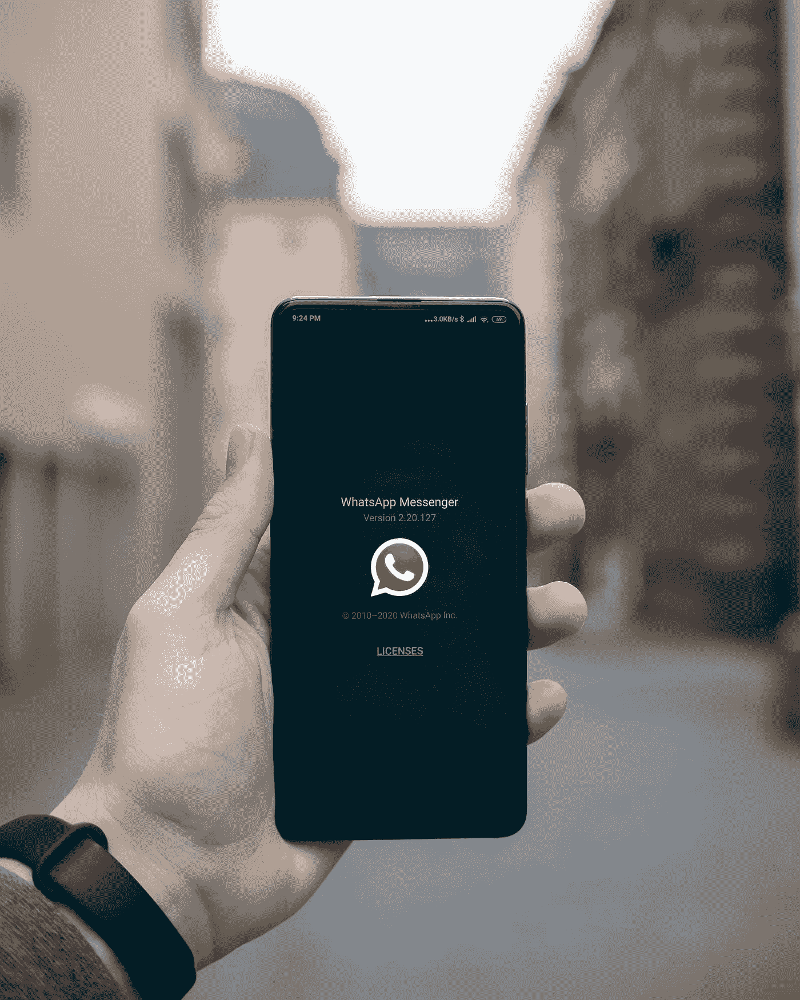
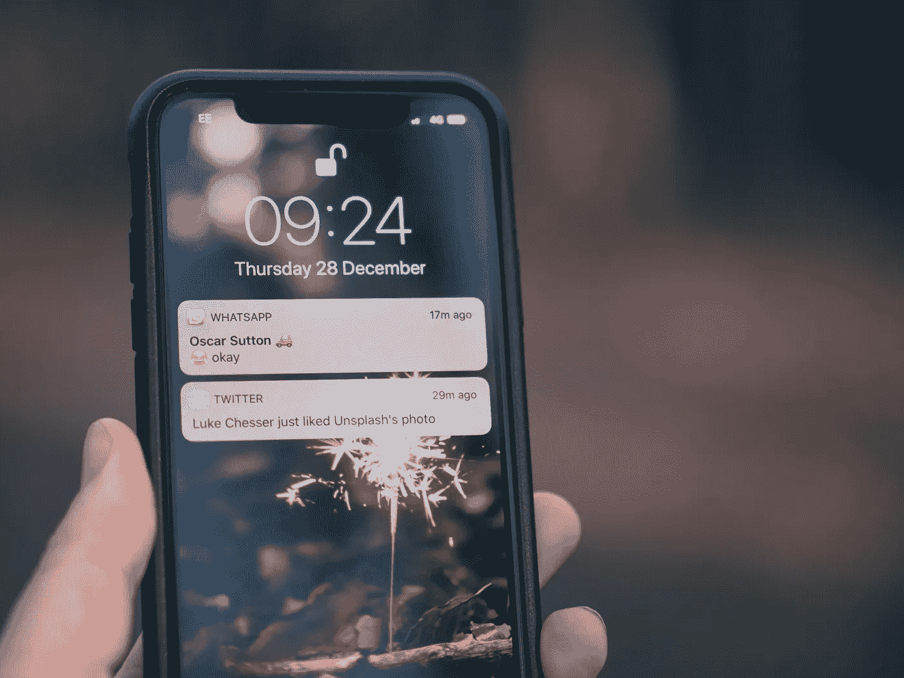

# 马上回来(BRB)——3 种排除干扰、让你重新投入游戏的方法

> 原文：<https://medium.datadriveninvestor.com/be-right-back-brb-bcff0dd0b53c?source=collection_archive---------35----------------------->

Photo by [Vladislav Klapin](https://unsplash.com/@lemonvlad?utm_source=unsplash&utm_medium=referral&utm_content=creditCopyText) on [Unsplash](https://unsplash.com/s/photos/hello?utm_source=unsplash&utm_medium=referral&utm_content=creditCopyText)

还记得我们以前用 MSN messenger 和 ICQ 的日子吗？如果你和我一样是恐龙，你会记得很清楚。这些程序(注意我没有说应用程序)是聊天平台。这是 Whatsapp 或脸书 messenger 的较慢版本，没有太多花哨的功能。你看，我们没有像今天这样全天候连接，当我们需要休息时，我们会键入 brb！

Photo by [Mika Baumeister](https://unsplash.com/@mbaumi?utm_source=unsplash&utm_medium=referral&utm_content=creditCopyText) on [Unsplash](https://unsplash.com/s/photos/icq-messenger?utm_source=unsplash&utm_medium=referral&utm_content=creditCopyText)

Brb 代表马上回来。那是一个信使相对较新的时代，我们没有智能手机。如果我不得不使用小男孩的房间，我使用 brb。吃点零食——BRB，打个盹——BRB。我不想和任何人说话——BRB。Brb 给了我们走开的自由。今天，这是一个完全不同的故事。离开我们的设备变得越来越有挑战性。我们的设备不断将我们拉向各个方向，这使得我们的注意力持续时间比金鱼还长。(不确定金鱼比人类有更好的注意力持续时间这个神话有多真实)

随着智能手机的出现，在一个不睡觉的世界里全天候连接的依赖性看起来很诱人，但与此同时，它也在影响着我们的身体和精神。从身体的角度来看，我们的睡眠模式和健康一样受到影响。我们看到肥胖症、糖尿病、高血压和其他自身免疫性疾病在增加。这一切都是因为我们无法关闭而造成的。这就是生活，时刻保持联系。对一些人来说，这是肾上腺素激增，最终会导致精疲力竭。

情感上我们是愤怒的。我们的头脑总是在工作，我们处于一种持续的警觉状态。这就好像我们回到了热带草原，保持警惕，等待掠食者或野兽将我们吞噬为午餐。

在生死攸关的情况下，这种级别的警戒是针对我们的。那是当时；这就是现在。我们唯一面临的危险是 Whatsapp 的提醒，或是对我们午餐照片收到多少 Instagram 赞的恐惧。成为一些食肉动物午餐和喜欢一幅画的人是截然不同的，但是恐惧和荷尔蒙的释放是一样的。我们一直处于紧张状态。我们每天每一秒都处于战斗或逃跑模式，这对我们的身体不好。没有关闭开关，因此，我们大多数人都面临焦虑。

我们已经忘记了如何活在当下。我们总是在展望未来或过去。唯一的解决办法是开始活在当下，活在“现在”除非你不活在当下，否则你无法控制任何事情。活在当下的唯一方法就是屏蔽各种干扰。一切都试图引起我们的注意。不幸的是，直到我们不关闭一切，它不会发生。此外，我们想在我们的生活中做这么多，只是觉得我们没有时间。

我们中有多少人相信我们是为了一个更大的目的而来到地球上的？

我们很多人想写书、画画、拍电影、雕塑等等。，我们一直抱怨我们没有时间。除非我们抽出时间去做，否则我们永远也找不到时间去做我们喜欢的事情。

所以今天，我们来看三种方法来提高你的注意力，这样你就可以把注意力放在你想做和喜欢做的事情上。

## **1。掌控你的早晨**:

这可能是我们应该做的最重要的事情，不幸的是我们没有。如果你看看世界上最成功的人，他们都遵循一个早晨的惯例。那么什么是早晨的例行公事呢？

Photo by [Emma Simpson](https://unsplash.com/@esdesignisms?utm_source=unsplash&utm_medium=referral&utm_content=creditCopyText) on [Unsplash](https://unsplash.com/s/photos/morning?utm_source=unsplash&utm_medium=referral&utm_content=creditCopyText)

晨间惯例是一套动作，如果每天早上练习，就会成为习惯。这些练习会让你控制你的一天，而不是让你的一天控制你。哈尔·埃尔罗德写了一本关于如何建立早晨习惯的最好的书。他的书《奇迹的早晨》集中讲述了一系列的实践，这些实践不仅能帮助你控制你的一天，还能为你将来的成功设定基准。为了容易记住早晨的例行公事，哈尔使用首字母缩写 S.A.V.E.R.S。

**1S 代表沉默:**哈尔书中的沉默是冥想。冥想并不意味着你必须像和尚一样。你不需要一次连续几个小时坐在一个莲花位置上，然后唱颂“嗡”

你只需要每天早上拿出 10 分钟的安静时间。你所需要做的就是在椅子上坐直，平静你的头脑，专注于你的呼吸。专注于吸气和呼气。继续这样做。

假设你想到了什么。注意它，不要被它吸引，承认它，然后回到专注于你的呼吸。冥想就是这样，让猴子的头脑平静下来，并从中重新获得控制。

**2。A 代表肯定:**什么是肯定？这是一种重新编程你大脑的方法。这是一种重新设定你想思考的方式，你想行动的方式，等等。如果你想获得自信，如果你想变得无所畏惧，就使用肯定。肯定是重新规划你思维的一种方式。

这是怎么做到的？你可以从写下 5 到 10 个你想成为什么样的人开始。一旦你列好了清单，每天早上至少连续大声朗读 15 分钟。在养成了早晨肯定的习惯后，你可以在晚上开始一个，最终也引入一个下午会议。一天多次治疗会让你的大脑更快地重新编程。

你应该一天做三次肯定。更好的是得到一个肯定应用程序。我用的是安卓和 iPhone 上都有的应用 ThinkUp。使用这个应用程序，你可以用你的声音记录你的肯定，并在一天中播放它们。当你在一天中循环听到你的肯定时，这是重新编程你思维的最快方法。你可以在开车去上班的时候，在健身房，在做不需要精神集中的事情的时候使用它。

**3。V 代表形象化**:你形象化了吗？你曾经写下你的梦想吗？我们中的一些人说我们想要一定数量的钱或者特定类型的车。但是你有没有写下来过？你知道你真正想要多少钱吗？或者你想开什么类型的车？

几天前，我和我的一个教练客户聊天。我问他:“你的梦想是什么？你想要什么?是豪车吗？”他说，“我希望有一天能拥有一辆法拉利。”

于是我问他:“哪一个？什么型号？什么颜色？汽车内部是什么样子的？”对此他一无所知。他只是想要一辆法拉利！

我向他指出，当他完全不知道他想要什么的时候，他怎么能得到他想要的东西。你看，我们大多数人都有特定的梦，但它们实际上并不是梦；它们都只是愿望。

但愿愿望成真！在我们生活的世界里，它们很难得到。只有知道自己想要什么(列一个梦想清单)，才能去想象。一旦你创建了你的梦想清单。在你的安乐椅上放松，坐好，想象你的每一个梦想的每一个细节。带着同样的激情和热情在你的脑海中播放那部电影，带着你已经收到它的意图，同时保持心中的感激。有这些情绪和感受是必须的。除非你不能在你的头脑中形象化它，否则你怎么能在现实中拥有它呢？

**4。E 代表运动:**这里不多解释了。制定一个快速的锻炼计划，尤其是如果你是那种讨厌锻炼或者早上没有时间锻炼的人。试试塔巴塔；这将是一个良好的开端。塔巴塔是一个 4 分钟的高强度间歇训练制度。它又短又甜，极其有效。它给你你需要的锻炼，给你足够的时间来完成所有的运动。

**5。R 代表阅读**:我们大多数人(至少不是那些中等社区的人)都已经不读书了。尤其是那些能增加我们的知识或帮助我们改进缺点的书。通过将阅读纳入你的晨间日程，即使一天只有十页，也会帮助你一个月读完一本书。也就是说，一年 12 本书，或者 5 年 75 本书，使你成为世界上最博学的人之一。不错吧？一天 10 页可能只需要你花大约 15 分钟去阅读。

**6。最后一个 S 代表划线**:划线就是直截了当的写。哈尔指出写日记是有好处的。我就是这么做的。我用这段时间做两件事。首先是:

1.  坚持写感恩日记:感恩是一种需要养成的强大而必要的习惯。感恩不仅让我们更快乐，还让我们对周围的世界持乐观态度。尤其是在 2021 年，随着去年发生的事情持续到今年，感恩是唯一能让我们保持理智的事情。感谢我们所拥有的，这给了我们看待生活的视角。
2.  我做的第二件事是计划我的一天。你可以列一个待办事项清单。使用一个应用程序，或者只是使用一个老式的笔记本。但是无论你做什么，确保你计划好你的一天。把事情也写进你的日历。计划是成功的关键。本杰明·富兰克林曾经说过:“如果你没有计划，你就是在计划失败。”所以计划好你的一天，这样你就能掌控一切。然而，这个建议应该有所保留。有的人只是做策划和分析，导致麻痹大意的分析。不仅仅是计划，还有行动。

几个月前，我遇到了一个很好的记日记的方法，那就是子弹日记法。我已经开始使用它了，我真的相信这是写日记的好方法。它不仅包括你的工作生活，也包括你的个人生活。

Photo by [Jamie Street](https://unsplash.com/@jamie452?utm_source=unsplash&utm_medium=referral&utm_content=creditCopyText) on [Unsplash](https://unsplash.com/s/photos/mobile-notifications?utm_source=unsplash&utm_medium=referral&utm_content=creditCopyText)

## 2.关闭通知

下一个就是这么简单；关闭手机、平板电脑、笔记本电脑等的所有通知。对于我们大多数人来说，我们害怕关闭手机通知。让我问你，如果你关掉手机短信一个小时，会对你有什么影响？这会给你周围的世界带来混乱吗？它会导致第三次世界大战吗，或者它真的会给你时间去做更重要的事情，甚至只是重新联系你的另一半，朋友，家人或孩子。

Photo by [Andrea Riezzo](https://unsplash.com/@andriezzo?utm_source=unsplash&utm_medium=referral&utm_content=creditCopyText) on [Unsplash](https://unsplash.com/s/photos/pomodoro?utm_source=unsplash&utm_medium=referral&utm_content=creditCopyText)

## 3.一路上都是番茄

在你的手机或笔记本电脑上安装一个番茄红素应用程序。这些应用大部分都是免费的。什么是番茄工作法？这是一次专注于一项任务的好方法。我非常有效地使用番茄工作法来完成我的工作。它的工作方式是你分配 25 分钟专注于一项任务。25 分钟过后，休息 3-5 分钟(取决于你)。你将做四个 25 分钟的番茄，然后休息 15 到 30 分钟。

你可以在 25 分钟内完成这么多事情。然而，时不时地，你的头脑会反对。它没有长时间静止不动的习惯。它会提醒你查看电话、电子邮件、未接来电或语音邮件(如果你还在使用语音邮件的话)。别听它的。相反，在你身边放一张纸。把你想到的任何事情都列一个清单(称之为“击中我的心灵”或者你想怎么称呼它都行),并承诺你会在 5 分钟或 30 分钟的休息时间检查它。这很有效，好处是你可以集中注意力。

这是三种非常有效的方法，帮助我排除杂念，专注于真正重要的事情。希望他们也能帮到你。还有很多方法，我将在以后的文章中介绍。让我知道你的想法，如果你有任何建议，你也想推荐。