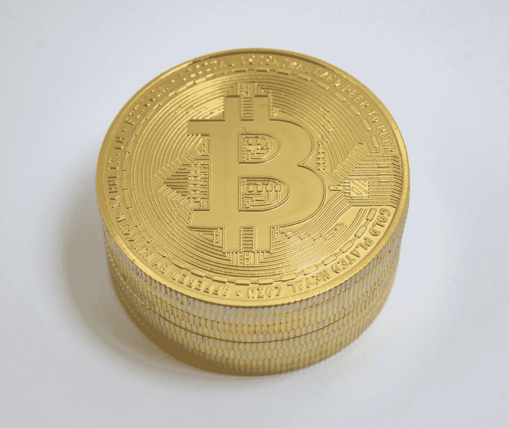
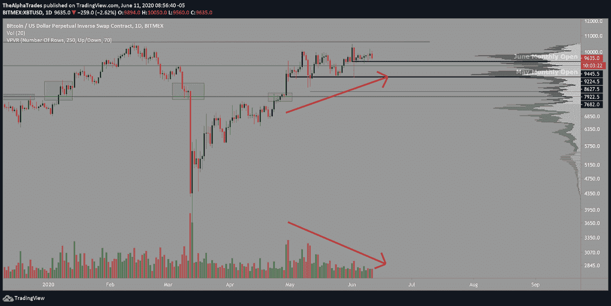
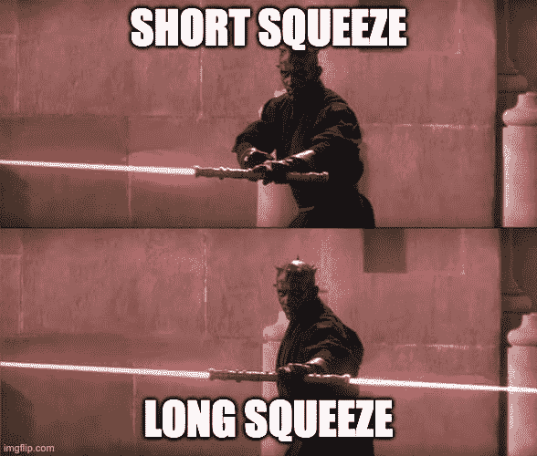
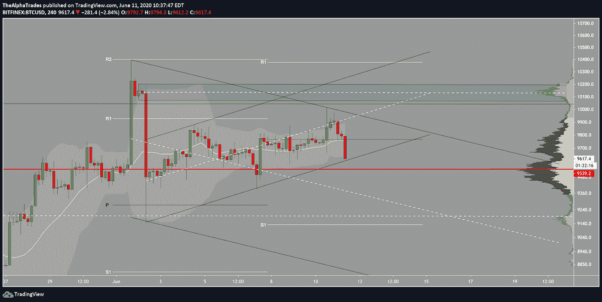
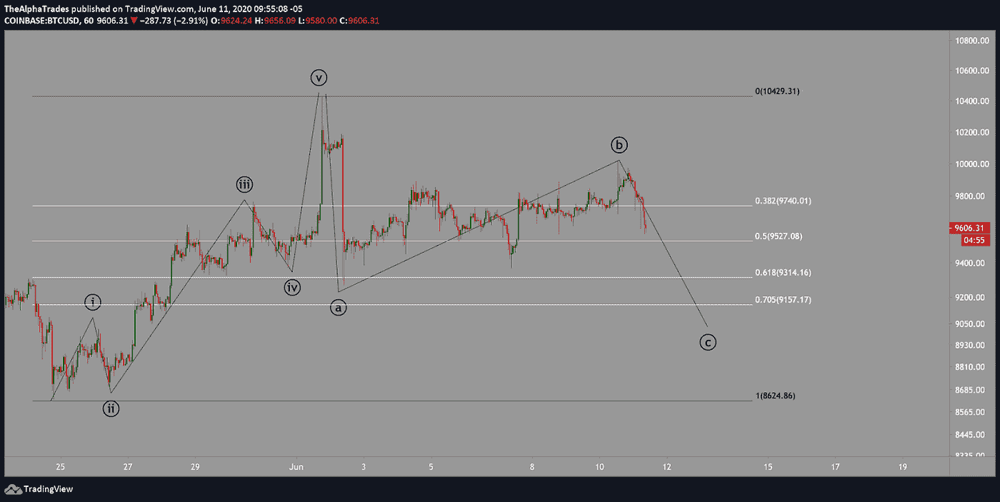
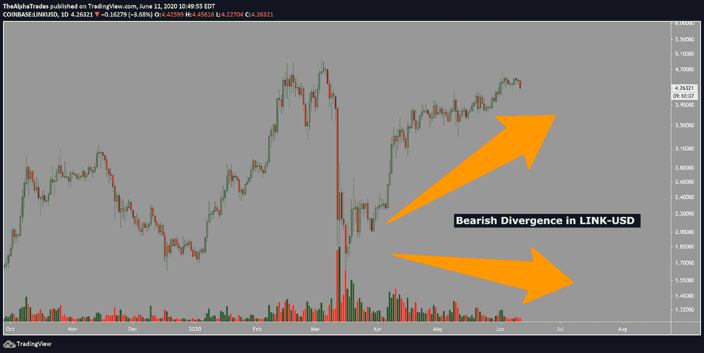
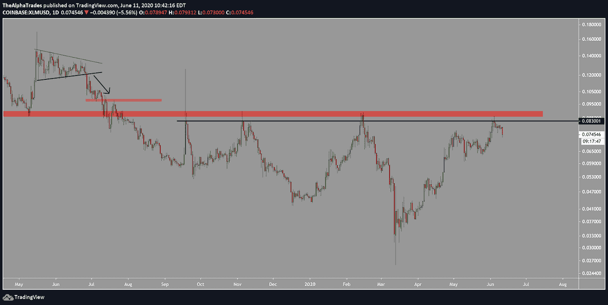

# 比特币的看跌成交量背离 Altcoins 是否已经见顶？

> 原文：<https://medium.datadriveninvestor.com/bearish-volume-divergence-in-bitcoin-have-altcoins-topped-25625512113b?source=collection_archive---------7----------------------->

## 我什么时候会做多比特币？短期内不会——交易水平，而不是炒作。

Bitcoin; Photo by Jürg Kradolfer on Unsplash

早上好，今天的分析将以比特币为中心，我可能会介绍几个替代币，然后我们可能会稍微看看股票市场。对了，昨天的文章你看了[吗？我们分享了一个强大的交易程序给那些被市场淹没的人，他们想在实践中形成更健康的习惯。](https://medium.com/datadriveninvestor/the-many-bearish-faces-of-bitcoin-df8615889a0d?source=friends_link&sk=ed6fee15affddd191728a937059ba4ce)

到本文结束时，你将在美国股市的背景下，对本周比特币和一些替代币的价格走势有所了解。

 [## 加密货币行业是死是活？数据驱动的投资者

### 九月初，我们在 X-Order 内部就代币市场的未来进行了一场辩论。有趣的是，我们的观点是…

www.datadriveninvestor.com](https://www.datadriveninvestor.com/2019/12/12/will-the-cryptocurrency-industry-be-dead-or-alive/) 

前几天 BTC 出现了短暂的资金紧张，正如我几周前说过的，除非突破几个关键水平，否则 BTC 的走向还没有决定。在日线时间框架中，我们看到第一个突破的关键水平在 10，600 附近。重要的是，价格一直在上涨，而交易量却在下降，形成了巨大的背离。

Bitcoin price volume bearish divergence; Source: Alpha Trades

通常，当你在更长的时间框架内出现这样的量价背离时，价格就会反转。如果我在反转前在市场上做多，那是因为我在逐层交易，而不是押注牛市突破。我预计比特币不会很快突破上行，但如果有任何迹象表明比特币的中期方向发生变化，我会提醒社区。

如果 BTC 跌破 2020 年 6 月月度开盘，这与图表上的 [VPVR 指标](https://medium.com/@joezabbs/volume-profile-visible-range-e099f22cd2d7)所示的高交易量节点汇合，将有足够的引力将 BTC 拉低至 8600(2020 年 5 月月度开盘)或 7600。

无论是在 Twitter 上，YouTube 上，甚至是我们的 Discord 社区频道上，人们都在喊着 BTC 永远不会再跌破“X”价，但如果说今年有什么令人大开眼界的话，市场总的来说可以愚弄所有人。这就是为什么我专注于技术，并遵循我的游戏计划。在交易中不要感情用事；逐级方法允许你承受必要的损失，但仍能获得正的胜率。*不是交易建议，做任何交易决定前一定要咨询专业人士——或者更好，通过尝试* [*我的技术分析课程*](https://bit.ly/cryptoAnalysisBasics) *学习如何像专业人士一样交易。*

正如你从图表中看到的，BTC 既受到一个高成交量节点的支撑，又徘徊在一个关键阻力位之下，因此处于两个支撑-阻力位(SR)之间。然而，从一个小时的时间框架来看，有趣的是，这是 BitMEX 交易所特有的，而不是发生在 BitFinex 这样的交易所，那里的价格只有 10，012。这可能是因为 BitMEX 有更多的过度杠杆头寸，这增加了短期和长期挤压的可能性和强度。

我们喜欢把这种双方都被摧毁的高杠杆头寸称为“达斯·摩尔”蜡烛。在达斯·摩尔事件中赚钱最多的是交易所，其他人都面临着砧板。

Darth Maul candles squeeze both shorts and longs; Source: Alpha Trades

通过 BitFinex 的 BTC 可以被映射到一个上升的并行通道中，该通道被一个更大的下降通道所包围。如果比特币基地或 BitFinex 在 10，035 点附近看到突破，那么 BTC 可能在 10，200 点附近上升到上升通道的顶部。

Bitfinex 上 9528 的高交易量节点距离 2020 年 6 月月开盘 9445 不远，形成了 50 至 75 美元的支撑范围，BTC 需要通过高交易量才能达到前面提到的下一个关键水平。

如果你看了今天早上的视频，BTC 在跌破四小时中枢之前一直在附近徘徊。请务必订阅我们的频道并按下通知铃，因为我们几乎每天都发布盘前技术分析。

BTC 还挑战了布林线的底部，我预计这是迟早会发生的事情，因为比特币不喜欢长时间保持在这样的紧缩范围内。你可以把这种价格上的收缩想象成一个弹簧，在朝着一个决定性的方向爆发之前，它正在卷紧。

Bitcoin confluence shows strong support levels; Source: Alpha Trades

# 观看今天的视频，了解比特币的艾略特波浪结构([时间戳:19:17](https://youtu.be/qb69rOzbmSo?t=1157) )。

Bitcoin Elliott Wave count structure; Source: Alpha Trades

# 美国股票市场概况及其与加密的关系

标准普尔 500 电子迷你期货股票(ES1！)刊登了一篇引人注目的抛售文章，但交易界或投资界的任何人都知道，在这种环境下预测顶部是危险的，甚至是不可能的。与比特币价格飙升巧合的是，股票市场也在[与美联储主席杰罗姆·鲍威尔](https://www.federalreserve.gov/newsevents/pressreleases/monetary20200610b.htm)的 FOMC 会议前后飙升。这份声明实际上是一堆相同的东西——他们会尽一切努力让经济恢复全速(并且完全忽略了这样一个事实:股票市场正处于前所未有的泡沫之中。

虽然许多末日论者有理由相信，传统货币体系可能会大规模转向加密货币，但不能保证它会很快、很快或根本不会发生。如果你想把 BTC 作为一种反向相关的资产来交易，要小心了。

# Altcoin 烟花

恒星流明(XLM)昨天遇到了几个月的阻力，我敦促人们要小心，希望能挽救你们中的一些人几乎 10%的损失。

链接(Link)为我们社区的许多人提供了一些出色的收益，但日线图显示了与 BTC 相同的熊市背离。我希望你们中没有人在交易这种资产时染上了看涨偏见热，因为没有什么东西会永远上涨。对我来说，这张图表是在打印一个清晰的双顶。

Link bearish divergence; Source: Alpha Trades

Stellar Lumens XLM facing multi-month resistance level; Source: Alpha Trades

作为交易者，你的工作是保护你的钱。如果交易量不足以支撑 BTC 或 LINK 等资产的价格上涨，谨慎是明智的。不要让偏见让你受伤！

更多来自今天的优势观察名单:制造商(MKR)，Iota(BTC)。详见本文末今日视频分解！)

# 优势会员获得更多

[订阅 Discord 服务器](https://bit.ly/2KJ1oor)学习技术分析以及如何投资获利。要求第一个月的高级会员享受 50%的折扣！(优惠将于 6 月 15 日结束)查看以下视频了解更多信息。

Bitcoin, Bearish Volume divergence; Source: Alpha Trades

不要错过，因为我们的**统治着我们通常免费提供的内容**，专注于为我们的优势群体提供更高质量的数据、新闻和分析。

# 放弃

Alpha Trades，LLC 提供的信息不用于制定任何财务决策，也不是购买、持有和/或销售特定产品、数字资产或 ICO 的请求或建议。

访问我们的完整服务条款:【https://bit.ly/3faVeeV 