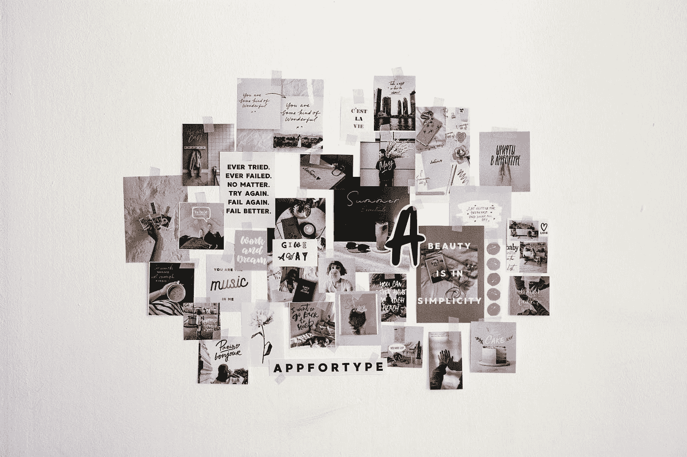

# 战胜拖延症 101——在你内心铸造无畏的泰坦。

> 原文：<https://medium.datadriveninvestor.com/beating-procrastination-101-cast-the-fearless-titan-within-you-22cc6e2bd382?source=collection_archive---------6----------------------->

知道你拖延的首要原因，知道如何战胜它，并以世界级的生产力执行。

21 世纪人类最大的敌人之一就是拖延症。我们周围所有的干扰都使得拖延一项任务变得更加容易，甚至拖延到最后一个小时，有时甚至完全放弃整个任务。蒂姆·厄本在他的 Ted 演讲中，[在拖延症大师的大脑中](https://www.ted.com/talks/tim_urban_inside_the_mind_of_a_master_procrastinator)给出了一个关于我们都有的猴子思维的最佳类比，这种思维会让我们从手头的重要任务中分心。

但是，这都是猴子的思维吗？我认为人们拖延任何他们知道应该做的任务的首要原因是他们害怕做。

> 恐惧是精神杀手——弗兰克·赫伯特

弗兰克·赫伯特说得对，恐惧是精神杀手。你拖延任务是因为你感到恐惧。你知道你应该做的任务会让你成为一个更好的人，它会带来好的改变，甚至会让你走出成长的舒适区。但是你害怕挑战自己的极限。你在拖延，因为这很安全。它在你的舒适区内。

在我们探讨战胜拖延症的方法之前，让我们先来谈谈*受害者*和*领导者*的心态。受害者生活在已知的安全港。他们生活在确定之中。他们生活在自己的舒适区，不期待任何增长。相反地，*领导者*始终如一地移动到他们极限的边缘，然后扩大它。*领导*做最不意外的任务。他们全心全意地执行每一项任务。

> 要获得很少人能获得的结果，你需要像很少人那样去思考、去行动、去生活。

# 战胜拖延症的 5 个步骤

# 1.一个宏伟的痴迷和一个梦想拼贴

今年我读的改变人生的一本书是拿破仑·希尔的《思考致富》。它强调了你的心态如何能让你实现生活中的一些辉煌。我推荐的另一本书是约瑟夫·墨菲博士的《你潜意识的力量》。潜意识占据了你生命的 95%。它替你做决定，而你甚至没有注意到。它驱使你去完成一项任务。嵌入你头脑中的东西可以驱使你去做非凡的事情。

行动步骤-

在一张纸上写下——“到*日期【2020 年 12 月 31 日】，*我将 _____”

例子:“*到 2020 年 12 月 31 日，我要减掉 20 磅*”。

早上的第一件事和睡觉前的最后一件事都要读它。呆在显眼的地方。让它突出。对这句话着迷，把它铭刻在你的意识和潜意识中。

你的潜意识通过图片运作。它看到有吸引力的东西，一旦它确定下来，你就努力去实现它。

制作一个梦想拼贴画——拍下你的梦想和理想生活的照片，把它们粘在你的日记里或你工作场所的前面。让它可见。想象一下。感受它并朝着它努力。

# 2.30 天拖延饮食

这可能对你来说有点艰难和不舒服，但是请记住，领导者会走到极限的边缘，并将极限推得更远。

拿一个日历，每天安排一件你一直拒绝做的事情。在日历上安排任何事情都会让你的大脑在时机成熟时重新投入其中。所以，我要你安排好任务和时间，到时候执行。

第一天——起床后——整理床铺。第二天–上午 8 点—锻炼…

当你做那些你已经抗拒了一段时间的事情时，你就从中收回了力量。你开始获得更多的意志力，并把它们用在日常任务中。你感到自信，你获得能量，你感到强壮。它会让你毫不畏惧地执行任何任务。

# 3.锻炼的力量

你一定听说过锻炼是帮助你在生活中融入其他好习惯的关键习惯之一。有太多的科学证据表明，锻炼 30 分钟就可以提高你的工作效率，并在锻炼后的 11 个多小时内保持最佳状态。当我们运动时，我们会释放刺激化学物质，如内啡肽、吗啡、血清素和多巴胺。

激励化学物质相互叠加，帮助我们在最佳状态下表现，更专注，更有学习力，记忆力更好。

如果你已经在一天开始的时候进行了锻炼，我建议你在晚上进行第二次锻炼。下班后再花 15-20 分钟蹦蹦跳跳或跑步，让你的表现达到巅峰，然后美美地睡一觉。

如果你不做任何锻炼，从小处着手，试着让它成为一种习惯。你会在生活中看到你喜欢的显著的好的变化。这是一个改变生活的生活帮。

Photo by [Boxed Water Is Better](https://unsplash.com/@boxedwater?utm_source=medium&utm_medium=referral) on [Unsplash](https://unsplash.com?utm_source=medium&utm_medium=referral)

# 4.创造一个不受干扰的环境

史蒂夫·乔布斯被踢出苹果公司。然后他创立了 NeXT，并把所有的墙壁、设备和家具都漆成白色。问他背后的原因，他回答说想想清楚。

当你的环境出现混乱或分心时，你就会拖延。你检查了一次你的通知，在你知道之前，30 分钟已经过去了。那些社交媒体应用程序是为了玩你的大脑而设计的。它给你快速注射多巴胺，让你使用它更长的时间。

混乱会产生压力。

创造一个极简的工作场所，没有干扰，在那里工作。关闭指定时间段的通知，并设置时间段。扔掉你的杂物。

# 5.释放你的自我破坏

什么是自毁？内心的声音在暗示你这个任务太难执行了，如果我失败了怎么办？别人取笑我怎么办？如果我不是做这个的料呢？自我破坏是我们拖延的头号原因。它在我们内心制造恐惧。它阻止我们走出舒适区。它阻止我们挑战自己的极限和表现。

> 千里之行始于足下——老子

如果你一直在拖延锻炼，那就迈出第一步。今天只做一个俯卧撑。如果你一直在拖延写博客，今天就写一句话。让我们考虑一下，它正在学习一种新的编码语言——只编写一行代码来输出一些东西。迈出第一步，释放你的自我破坏。

Photo by [Aleksandr Ledogorov](https://unsplash.com/@breakfast_on_jupiter?utm_source=medium&utm_medium=referral) on [Unsplash](https://unsplash.com?utm_source=medium&utm_medium=referral)

关键要点—

1.  人们拖延的首要原因是他们害怕任务。他们害怕改变。
2.  领导者接受挑战，他们走到并停留在极限的边缘，并扩展它。
3.  用你所有的梦想和理想生活做一个梦想拼贴画，并将其形象化。将它铭刻在你的潜意识中。
4.  面对你的恐惧，你不面对的恐惧会成为你生活的墙壁。
5.  锻炼身体。它有许多你无法想象的好处。无论是身体上还是精神上。
6.  创造一个不受干扰的环境，你不能在社交媒体上浪费时间。有限度地使用社交媒体。
7.  不要自毁前程。那个对你说*你做不到的声音？让它安静下来。*

看看我们的大脑是如何工作的，你如何能更快地学习任何技能—

 [## 数字思维——关键见解

### 唤醒你内心的数学家。

medium.com](https://medium.com/curious/a-mind-for-numbers-the-key-insights-c3c434b24be7) 

看看你是如何通过一次只专注于一件事来实现任何目标的——

 [## 实现这一目标的 10 个步骤。

### 你能做的一件事是什么，通过做这件事，其他事情会变得更容易或不必要？—加里·凯勒

medium.com](https://medium.com/datadriveninvestor/10-steps-to-achieve-that-one-thing-1835939615c5)