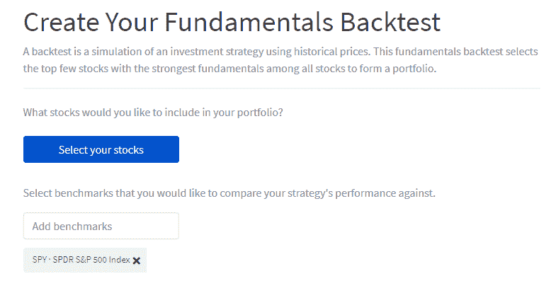
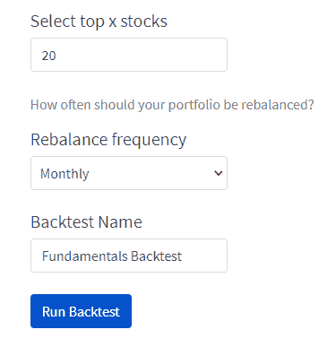
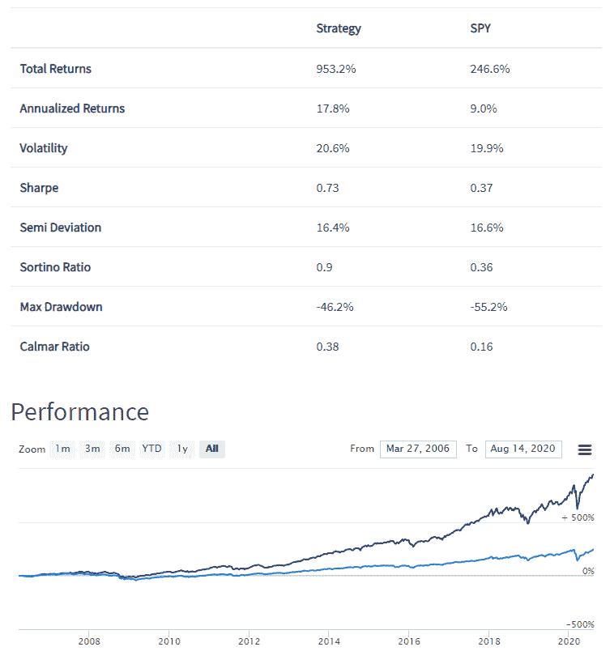
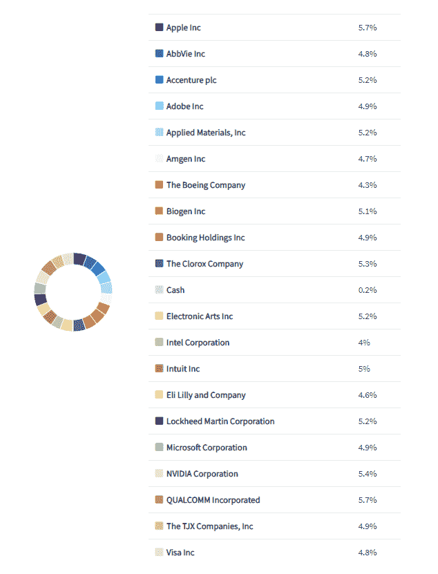

# 选择基本面强劲的美国股票，战胜标准普尔 500

> 原文：<https://medium.datadriveninvestor.com/beating-the-s-p-500-by-selecting-us-stocks-with-strong-fundamentals-c67e29cfa063?source=collection_archive---------5----------------------->

Comic: King Elon and Tesla Remain The Biggest Story On Wall Street from[investing.com](https://www.investing.com/news/stock-market-news/comic-king-elon-and-tesla-remain-the-biggest-story-on-wall-street-2077789)

大多数长期投资者依靠基本面数据来决定他们的投资组合中应该包括哪些股票。基本面数据可以从公司的资产负债表、损益表、现金流量表等财务报表中获得。这些报告为公司的财务健康、盈利能力和增长提供了宝贵的见解。这些是投资者应该留意的关键基本面因素，因为它们与股票表现高度相关。

然而，测量这些基本因素是一个繁琐的过程。投资者需要梳理数百份财务报告来寻找这些因素，然后将这些不同的因素结合在一起，对可用的股票进行排序。幸运的是，在技术的帮助下，这整个过程对我们来说已经简化了。以下是你如何上线并从美股基本面策略中获利的方法。

 [## 金融行业如何受益于机器学习发展和人工智能|数据驱动的投资者

### 在快速变化的金融世界中做出正确的决定并抓住机会可以让你的…

www.datadriveninvestor.com](https://www.datadriveninvestor.com/2020/07/28/how-finance-sector-can-benefit-by-machine-learning-development-and-ai/) 

# 介绍 PyInvesting.com

PyInvesting 是一个提供金融数据和回溯测试工具的网站，帮助你实现自己的投资策略。你可以把它想象成一个平台，在这个平台上，你可以建立自己的私人机器人顾问，帮助你梳理数百份财务报告，并告诉你应该买入或卖出哪些股票。我们将使用 PyInvesting 来创建我们的美股基本策略。我们走吧！

首先去[https://pyinvesting.com/backtest/fundamentals/](https://pyinvesting.com/backtest/fundamentals/)，在那里我们将创建一个基础回溯测试。回溯测试是使用历史数据模拟我们的投资策略。如果模拟结果很差，策略的表现远远低于其基准，这就证实了该策略不起作用。相比之下，如果该策略的表现远远超过其基准，它会让我们相信它很可能会继续表现良好。回溯测试还告诉我们应该在投资组合中持有哪些股票，这样我们就知道在实施我们的策略时应该买入或卖出哪些股票。

Stock selection from fundamentals backtest at [https://pyinvesting.com/backtest/fundamentals/](https://pyinvesting.com/backtest/fundamentals/)

点击“选择你的股票”按钮，这将打开一个窗口，为你的基本面回溯测试选择股票。在模板投资组合下，点击“标准普尔 500”从指数中选择股票。

# 财务健康

我们希望选择资产负债表健康、资产负债率低的公司，因为这些公司有很强的偿还债权人的能力。由于这些公司的杠杆率相对较低，这些公司通常具有相当的弹性，能够度过艰难时期而不破产。因此，持有这些股票的投资者往往在危机中损失较少，因为这些股票能够很好地抵御风暴。

# 收益性

接下来，我们要选择高利润、高股本回报率的公司。高股本回报率意味着公司管理层在利用投资融资发展业务方面效率很高，因此能够为投资者提供更好的回报。股本回报率低意味着公司管理不善，管理层投资于非生产性资产。股本回报率也是衡量公司利用资源效率的一个指标。高股本回报率可能意味着公司用相对较低的资本增加了利润。

# 增长

最后，我们希望选择收益增速远高于整体经济增速的成长型公司。这些公司利润增长很快，并倾向于将其收益再投资到盈利的业务领域。他们通常不支付股息，而是选择将利润进行再投资，以进一步发展业务。大多数成长型公司，如特斯拉、谷歌和亚马逊，都在技术领域，他们不断投资创新理念，并拓展新业务。成长型公司能够通过专注于收入增长和保持行业领先地位，为投资者提供巨额回报。

# 构建我们的投资组合策略

为了选择财务健康、盈利能力和成长性强的股票，我们将选择如下所示的 3 个因素。股本回报率最高、利润增长率最高、债务股本比最低的股票。这三个因素各占 33%的权重。表中所有其他因素的权重为 0%。该网站将自动结合这 3 个因素为您使用 z 评分方法，其中这些因素是标准化使用的平均和波动性。

Signal selection from fundamentals backtest at [https://pyinvesting.com/backtest/fundamentals/](https://pyinvesting.com/backtest/fundamentals/)

随后，我们需要决定在投资组合中持有多少股票。我决定在我的投资组合中持有 20 只权重相等的股票，以避免集中风险。每个月，标准普尔 500 的股票都会根据这 3 个基本因素进行排名，排名前 20 的股票会被挑选出来组成一个相等权重的投资组合。

Portfolio details from fundamentals backtest at [https://pyinvesting.com/backtest/fundamentals/](https://pyinvesting.com/backtest/fundamentals/)

# 表演

结果显示，自 2006 年以来，我们的美股基本面策略显著优于标准普尔 500 基准，年化回报率为 17.8%对 9.0%。该策略还具有 0.73 的较高夏普比率，而标准普尔 500 的夏普比率为 0.37，这意味着该策略具有较高的风险调整回报。虽然该策略的波动性高于标准普尔 500，但其半离差低于标准普尔 500。这意味着该策略具有较低的下行波动率和较高的上行波动率。该策略的最大提款权也明显低于标准普尔 500 和标准普尔 500，前者在 2008 年危机中损失了 46%，后者损失了 55.2%。

总的来说，这个回溯测试证实了美国股票的基本策略是有效的，如果我们选择股本回报率最高、利润增长率最高和债务股本比率最低的股票，我们可以预期每年跑赢标准普尔 500 8.8%。这种策略适合长期基本面投资者，他们能够承担一定的市场风险，以换取明显更高的回报。

Strategy performance results from [https://pyinvesting.com/invest/results/ab3d20df353143a7a41cdb5ab05e83c2](https://pyinvesting.com/invest/results/ab3d20df353143a7a41cdb5ab05e83c2)

Strategy positions from [https://pyinvesting.com/invest/results/ab3d20df353143a7a41cdb5ab05e83c2](https://pyinvesting.com/invest/results/ab3d20df353143a7a41cdb5ab05e83c2)

该网站还显示投资组合中的当前头寸，用户可以在自己的个人账户上进行交易。订户可以选择“上线”他们的投资组合，如果他们的策略决定进行交易，他们将每天收到电子邮件更新通知。

请考虑在 PyInvesting 注册一个免费账户，以便接收未来的更新。在我的下一篇文章中，我将解释如何使用相对强度回溯测试。敬请关注，我们下次再见！

**进入专家视角—** [**订阅 DDI 英特尔**](https://datadriveninvestor.com/ddi-intel)